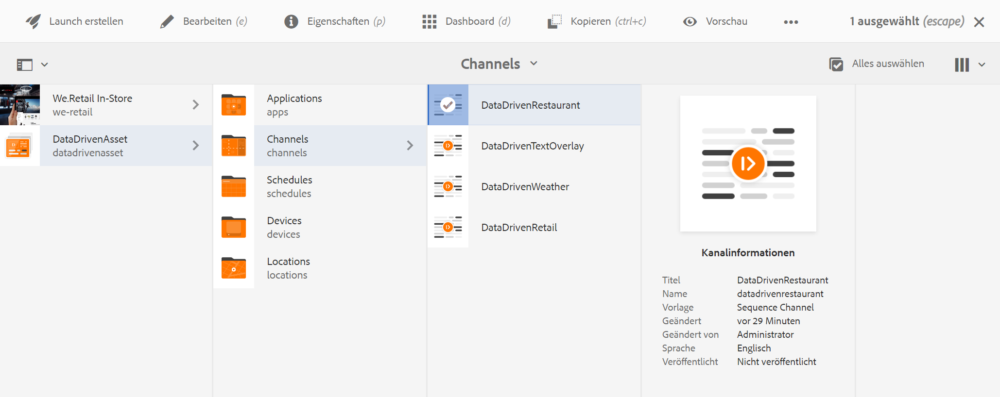

# Aktivierung der Gastgewerbereservierung {#hospitality-reservation-activation}

Das folgende Nutzungsszenario veranschaulicht die Verwendung der Aktivierung von Reservierungen im Gastgewerbe anhand der in Google Tabellen angegebenen Werten.

## Beschreibung {#description}

Für dieses Nutzungsszenario wird die Google Tabelle mit dem Reservierungsprozentsatz für zwei Restaurants **Restaurant1** und **Restaurant2** gefüllt. Eine Formel wird anhand der Werte von Restaurant1 und Restaurant2 angewendet und anhand der Formel wird der Spalte **AdTarget** der Wert „1“ oder „2“ zugewiesen.

Wenn der Wert von **Restaurant1** > **Restaurant2** ist, wird **AdTarget** der Wert **1** zugewiesen. Anderenfalls wird **AdTarget** der Wert **2** zugewiesen. Der Wert „1“ generiert die Option *Steak-Gerichte* und der Wert „2“ zeigt die Option *Thailändisches Essen* auf Ihrem Bildschirm an.

## Voraussetzungen {#preconditions}

Bevor Sie mit der Implementierung der Reservierungsaktivierung beginnen, müssen Sie lernen, wie Sie in einem AEM Screens-Projekt ***Datenspeicher*** und ***Zielgruppensegmentierung*** einrichten und ***Targeting für Kanäle aktivieren***.

Genaue Informationen dazu finden Sie unter [Konfigurieren von ContextHub in AEM Screens](configuring-context-hub.md).

## Grundlegender Ablauf {#basic-flow}

Gehen Sie wie folgt vor, um das Nutzungsszenario für die reservierungsgesteuerte Aktivierung im Gastgewerbe für Ihr AEM Screens-Projekt zu implementieren:

1. **Füllen der Google Tabellen und Hinzufügen der Formel.**

   Wenden Sie beispielsweise die Formel auf die dritte Spalte **AdTarget** an, wie in der folgenden Abbildung dargestellt.

   

1. **Konfigurieren der Segmente in Zielgruppen gemäß den Anforderungen**

   1. Navigieren Sie zu den Segmenten in Ihrer Zielgruppe (siehe ***Schritt 2: Einrichten der Zielgruppensegmentierung*** auf der Seite **[Konfigurieren von ContextHub in AEM Screens](configuring-context-hub.md)**, um mehr zu erfahren).

   1. Wählen Sie **Tabellen A1 1** aus und klicken Sie auf **Bearbeiten**.

   1. Wählen Sie die Eigenschaft zum Vergleichen aus und klicken Sie auf das Symbol zum Konfigurieren, um die Eigenschaften zu bearbeiten.
   1. Wählen Sie **googlesheets/value/1/2** aus der Dropdown-Liste in **Eigenschaftsname** aus

   1. Wählen Sie unter **Operator** den Wert **gleich** aus dem Dropdown-Menü aus

   1. Geben Sie den **Wert** als **1** ein

   1. Wählen Sie nun **Tabellen A1 2** aus und klicken Sie auf **Bearbeiten**.

   1. Wählen Sie die Eigenschaft zum Vergleichen aus und klicken Sie auf das Symbol zum Konfigurieren, um die Eigenschaften zu bearbeiten.
   1. Wählen Sie **googlesheets/value/1/2** aus der Dropdown-Liste in **Eigenschaftsname** aus

   1. Wählen Sie den **Operator** als **2** aus

1. Navigieren Sie zu Ihrem Kanal () und klicken Sie in der Aktionsleiste auf **Bearbeiten**. Im folgenden Beispiel wird ein sequenzieller Kanal **DataDrivenRestaurant** verwendet, um die Funktionalität zu demonstrieren.

   >[!NOTE]
   >
   >Ihr Kanal sollte bereits über ein Standardbild verfügen und die Zielgruppen sollten vorkonfiguriert sein, wie unter [Konfigurieren von ContextHub in AEM Screens](configuring-context-hub.md) beschrieben.

   

   >[!CAUTION]
   >
   >Sie sollten Ihre **ContextHub** **Konfigurationen** über den Kanal **Eigenschaften** > **Personalisierung** Registerkarte.

   

1. Wählen Sie **Targeting** aus dem Editor aus. Wählen Sie **Marke** und **Aktivität** aus dem Dropdown-Menü aus und klicken Sie auf **Targeting starten**.
1. **Überprüfen der Vorschau**

   1. Klicken Sie auf **Vorschau.** Öffnen Sie außerdem Google Tabellen und aktualisieren Sie den Wert.
   1. Aktualisieren Sie den Wert in den Spalten **Restaurant1** und **Restaurant2**. Wenn **Restaurant1** > **Restaurant2** ist, sollten Sie ein Bild eines *Steak-Gerichts* sehen. Andernfalls wird ein Bild mit *thailändischem Essen* auf Ihrem Bildschirm angezeigt.

   
