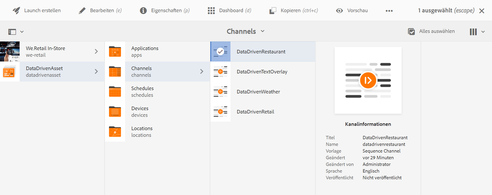

# Aktivierung der Reservierung im Gastgewerbe {#hospitality-reservation-activation}

>[!IMPORTANT]
>Dieser Inhalt gilt für AEM On-Premise/AMS (AEM 6.5LTS und AEM 6.5). Informationen zu AEM as a Cloud Service Screens-Inhalten finden Sie im [AEM as a Cloud Service-Handbuch](https://experienceleague.adobe.com/de/docs/experience-manager-cloud-service/content/screens-as-cloud-service/overview/introduction).

Das folgende Nutzungsszenario veranschaulicht die Verwendung der Aktivierung von Reservierungen im Gastgewerbe anhand der in Google Tabellen angegebenen Werten.

## Beschreibung {#description}

Für diesen Anwendungsfall wird die Google-Tabelle mit dem Prozentsatz der Reservierungen für zwei Restaurants **`Restaurant1`** und **`Restaurant2`** befüllt. Auf der Grundlage der Werte von `Restaurant1` und `Restaurant2` wird eine Formel angewendet und auf der Grundlage der Formel wird der Spalte **AdTarget** der Wert „1“ oder „2“ zugewiesen.

Wenn der Wert von **`Restaurant1`** > **`Restaurant2`** ist, dann wird **AdTarget** der Wert **1** zugewiesen, andernfalls wird **AdTarget** der Wert **2** zugewiesen. Der Wert „1“ generiert die Option *Steak-Gerichte* und der Wert „2“ zeigt die Option *Thailändisches Essen* auf Ihrem Bildschirm an.

## Voraussetzungen {#preconditions}

Bevor Sie mit der Implementierung der Reservierungsaktivierung beginnen, müssen Sie lernen, wie Sie in einem AEM Screens-Projekt ***Datenspeicher*** und ***Zielgruppensegmentierung*** einrichten und ***Targeting für Kanäle aktivieren***.

Genaue Informationen dazu finden Sie unter [Konfigurieren von ContextHub in AEM Screens](configuring-context-hub.md).

## Grundlegender Ablauf {#basic-flow}

Gehen Sie wie folgt vor, um den Anwendungsfall für die reservierungsgesteuerte Aktivierung der Reservierung im Gastgewerbe für Ihr AEM Screens-Projekt zu implementieren:

1. **Füllen der Google-Tabellen und Hinzufügen der Formel**.

   Wenden Sie beispielsweise die Formel auf die dritte Spalte **AdTarget** an, wie in der folgenden Abbildung dargestellt.

   

1. **Konfigurieren der Segmente in Zielgruppen gemäß den Anforderungen**

   1. Navigieren Sie zu den Segmenten in Ihrer Zielgruppe (siehe ***Schritt 2: Einrichten der Zielgruppensegmentierung*** auf der Seite **[Konfigurieren von ContextHub in AEM Screens](configuring-context-hub.md)**, um mehr zu erfahren).
   1. Klicken Sie auf **Tabellen A1 1** und dann auf **Bearbeiten**.
   1. Klicken Sie auf die Vergleichseigenschaften und dann auf das Symbol **Konfiguration**.
   1. Klicken Sie auf **googlesheets/value/1/2** aus der Dropdown-Liste in **Eigenschaftsname**.
   1. Wählen Sie für den **Operator** in der Dropdown-Liste **Gleich** aus.
   1. Geben Sie den **Wert** als **1** ein.
   1. Klicken Sie auf die gleiche Weise auf **Tabellen A1 2** und dann auf **Bearbeiten**.
   1. Klicken Sie auf die Vergleichseigenschaften und dann auf das Symbol **Konfiguration**.
   1. Klicken Sie auf **googlesheets/value/1/2** aus der Dropdown-Liste in **Eigenschaftsname**.
   1. Wählen Sie für den **Operator** den Wert **2**.

1. Navigieren Sie zu Ihrem Kanal (), wählen Sie ihn aus und klicken Sie in der Aktionsleiste auf **Bearbeiten**. Im folgenden Beispiel wird ein sequenzieller Kanal **DataDrivenRestaurant** verwendet, um die Funktionalität zu demonstrieren.

   >[!NOTE]
   >
   >Ihr Kanal sollte bereits über ein Standardbild verfügen und die Zielgruppen sollten vorkonfiguriert sein, wie unter [Konfigurieren von ContextHub in AEM Screens](configuring-context-hub.md) beschrieben.

   

   >[!CAUTION]
   >
   >Ihre **ContextHub**-**Konfigurationen**, die den Kanal auf der Registerkarte **Eigenschaften** > **Personalisierung** verwenden, sollten zu diesem Zeitpunkt bereits eingerichtet sein.

   

1. Klicken Sie im Editor auf **Targeting**, wählen Sie danach die **Marke** und die **Aktivität** aus dem Dropdown-Menü und klicken Sie auf **Targeting starten**.
1. **Überprüfen der Vorschau**

   1. Klicken Sie auf **Vorschau.** Öffnen Sie außerdem Ihre Google-Arbeitsblätter und aktualisieren Sie deren Wert.
   1. Aktualisieren Sie den Wert in den Spalten **`Restaurant1`** und **`Restaurant2`**. Wenn **`Restaurant1`** > **`Restaurant2`ist,** sollten Sie ein Bild eines *Steak-Gerichts* sehen. Andernfalls wird ein Bild mit *thailändischem Essen* auf Ihrem Bildschirm angezeigt.

   

