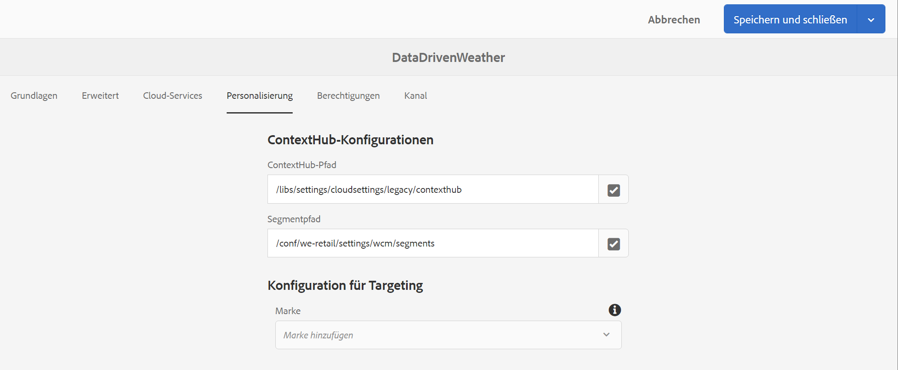

# Aktivierung der Gastgewerbereservierung {#hospitality-reservation-activation}

Das folgende Nutzungsszenario veranschaulicht die Verwendung der Aktivierung von Reservierungen im Gastgewerbe anhand der in Google Tabellen angegebenen Werten.

## Beschreibung {#description}

Für dieses Anwendungsbeispiel wird die Google Tabelle mit dem Prozentsatz der Reservierungen in zwei Restaurants gefüllt. **`Restaurant1`** und **`Restaurant2`**. Eine Formel wird anhand der Werte von `Restaurant1` und `Restaurant2` und basierend auf der Formel wird der Wert 1 oder 2 dem **AdTarget** Spalte.

Wenn der Wert von **`Restaurant1`** > **`Restaurant2`**, dann **AdTarget** zugewiesener Wert **1** else **AdTarget** zugewiesener Wert **2**. Wert 1 generiert *Stechnahrung* -Option und -Wert: Ergebnisse der Anzeige von *Thailändische Küche* auf Ihrem Bildschirm angezeigt.

## Voraussetzungen {#preconditions}

Bevor Sie mit der Implementierung der Reservierungsaktivierung beginnen, erfahren Sie, wie Sie ***Datenspeicher***, ***Zielgruppensegmentierung*** und ***Targeting für Kanäle aktivieren*** in einem AEM Screens-Projekt.

Siehe [Konfigurieren von ContextHub in AEM Screens](configuring-context-hub.md) für detaillierte Informationen.

## Grundlegender Ablauf {#basic-flow}

Gehen Sie wie folgt vor, um die Aktivierung der Reservierung für Gastgewerbe für Ihr AEM Screens-Projekt zu implementieren:

1. **Befüllen der Google Tabellen und Hinzufügen der Formel**.

   Wenden Sie beispielsweise die Formel auf die dritte Spalte **AdTarget** an, wie in der folgenden Abbildung dargestellt.

   

1. **Konfigurieren der Segmente in Zielgruppen gemäß den Anforderungen**

   1. Navigieren Sie zu den Segmenten in Ihrer Zielgruppe (siehe ***Schritt 2: Einrichten der Zielgruppensegmentierung*** in **[Konfigurieren von ContextHub in AEM Screens](configuring-context-hub.md)** Seite für weitere Details).
   1. Klicken Sie auf **Blätter A1 1** und klicken **Bearbeiten**.
   1. Klicken Sie auf die Vergleichseigenschaft und klicken Sie auf die **Konfiguration** Symbol.
   1. Klicks **googlesheets/value/1/2** aus der Dropdown-Liste **Eigenschaftsname**.
   1. Klicken Sie auf **Operator** as **equal** aus dem Dropdown-Menü.
   1. Geben Sie den **Wert** als **1** ein.
   1. Klicken Sie auf die **Blätter A1 2** und klicken **Bearbeiten**.
   1. Klicken Sie auf die Vergleichseigenschaft und klicken Sie auf die **Konfiguration** Symbol.
   1. Klicks **googlesheets/value/1/2** aus der Dropdown-Liste **Eigenschaftsname**.
   1. Klicken Sie auf **Operator** as **2**.

1. Navigieren Sie zu Ihrem Kanal () und klicken Sie auf **Bearbeiten** in der Aktionsleiste aus. Im folgenden Beispiel wird ein sequenzieller Kanal **DataDrivenRestaurant** verwendet, um die Funktionalität zu demonstrieren.

   >[!NOTE]
   >
   >Ihr Kanal sollte bereits über ein Standardbild verfügen und die Zielgruppen sollten vorkonfiguriert sein, wie unter [Konfigurieren von ContextHub in AEM Screens](configuring-context-hub.md) beschrieben.

   

   >[!CAUTION]
   >
   >Sie sollten Ihre **ContextHub** **Konfigurationen** über den Kanal **Eigenschaften** > **Personalisierung** Registerkarte.

   

1. Klicks **Targeting** Klicken Sie im Editor auf **Marke** und **Aktivität** aus dem Dropdown-Menü aus und klicken Sie auf **Targeting starten**.
1. **Überprüfen der Vorschau**

   1. Klicken Sie auf **Vorschau.** Öffnen Sie außerdem Google Tabellen und aktualisieren Sie den Wert.
   1. Aktualisieren Sie den Wert in **`Restaurant1`** und **`Restaurant2`** Spalten. Wenn **`Restaurant1`** > **`Restaurant2`,** Sie sollten ein Bild von *Steak* andernfalls *Thailändisch* Auf dem Bildschirm wird ein Bild mit Lebensmitteln angezeigt.

   
