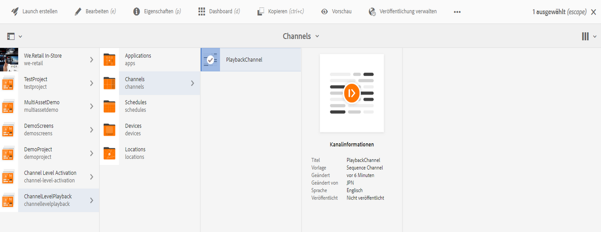
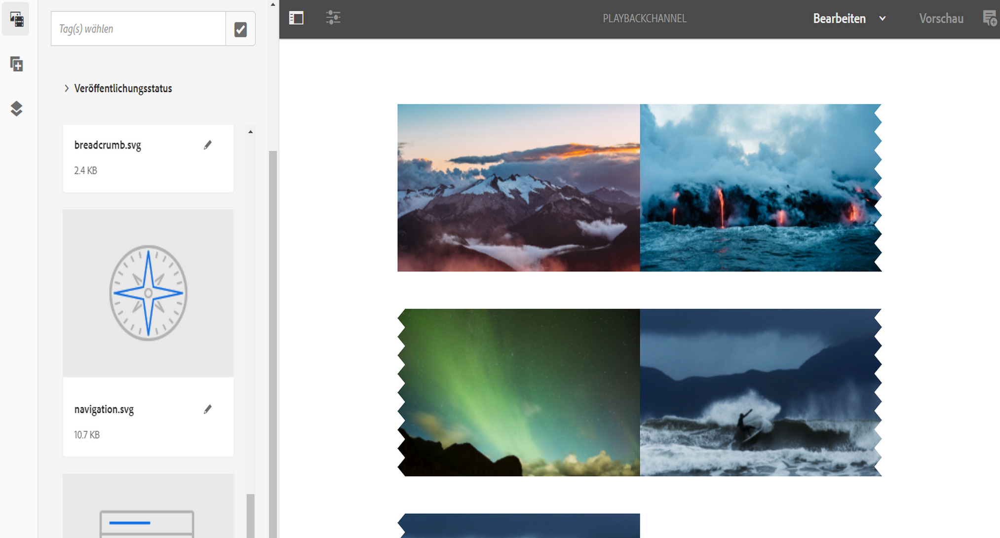
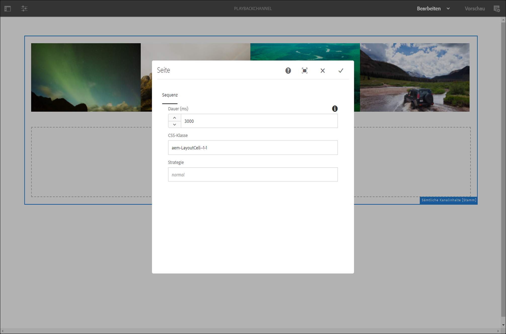

# Bildwiedergabedauer {#image-playback-duration}

## Übersicht {#overview}

Nachdem Sie einen Sequenzkanal erstellt und Bilder hinzugefügt haben, gehen standardmäßig alle Bilder von der in der Konfiguration auf Kanalebene definierten Wiedergabedauer aus. Jedes einzelne Bild kann jedoch den Standard überschreiben und eine andere Wiedergabedauer haben. Dies wird durch Bearbeiten der Wiedergabedauer der jeweiligen Bildkomponente erreicht.

### Voraussetzungen {#prerequisites}

Bevor Sie diese Funktion implementieren, stellen Sie sicher, dass Sie ein Projekt als Voraussetzung für die Implementierung dieser Funktion eingerichtet haben. Beispiel:

1. Erstellen eines AEM Screens-Projekts (in diesem Beispiel **ChannelLevelPlayback**)
1. Erstellen eines Sequenzkanals als **PlaybackChannel** im Ordner **Kanäle**
1. Hinzufügen von Inhalten zum **PlaybackChannel**

## Bearbeiten der Bildwiedergabedauer auf Kanalebene {#editing-channel-level-image-playback-duration-assignment}

Im folgenden Abschnitt wird beschrieben, wie Sie die Wiedergabedauer von Inhalten in einem AEM Screens-Kanal bearbeiten.

### Aktualisieren der Wiedergabedauer für Bilder in einem Kanal {#updating-the-playback-duration-for-images-in-a-channel}

Gehen Sie wie folgt vor, um zu erfahren, wie Sie die Wiedergabedauer auf Kanalebene aktualisieren:

1. Navigieren Sie zum Sequenzkanal **PlaybackChannel**.

   

1. Klicks **Bearbeiten** in der Aktionsleiste aus.

   

1. Fügen Sie im Kanaleditor zwei oder mehr Bilder hinzu, wie in der Abbildung unten gezeigt.

   

1. Wählen Sie alle Bilder im Kanal aus und klicken Sie oben links auf das Schraubenschlüsselsymbol (wie in der Abbildung unten dargestellt). Das Dialogfeld Konfiguration auf Kanalebene wird geöffnet.

   

1. Das Dialogfeld **Seite** wird geöffnet.

   >[!NOTE]
   >
   >Standardmäßig sind die Bilder in einem Kanal auf eine Wiedergabedauer von 8 Sekunden eingestellt.

   

   Bearbeiten Sie die **Dauer** von 8000 (Millisekunden) bis 3000 (Millisekunden), also 3 Sekunden. Klicken Sie oben rechts im **Seite** angezeigt, damit Sie Ihre Änderungen speichern können.

   

### Anzeigen des Ergebnisses {#viewing-the-result}

Wenn Sie die Dauer der Kanalwiedergabe aktualisiert haben (in diesem Beispiel alle drei Bilder), beachten Sie, dass die Bilder jetzt für 3 Sekunden statt für 8 Sekunden wiedergegeben werden (Standardwert).

