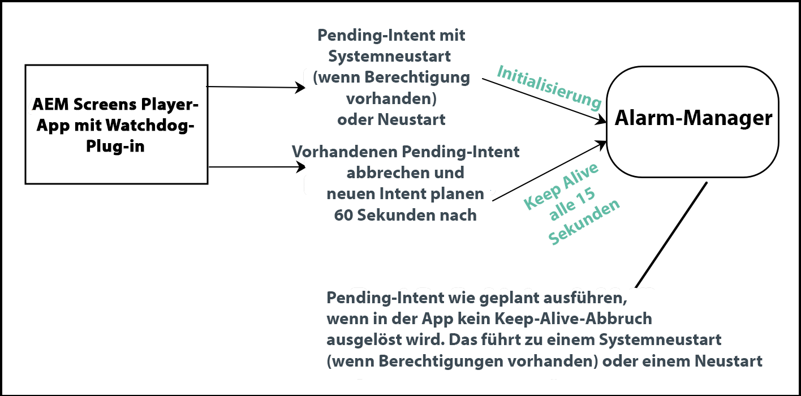

# Implementieren des Android™-Players {#implementing-android-player}

>[!CAUTION]
>Der Android-basierte AEM Screens-Player wird offiziell nicht mehr unterstützt. Benutzern wird empfohlen, zu einem anderen Betriebssystem zu migrieren, das von AEM Screens unterstützt wird.

In diesem Abschnitt wird die Konfiguration des Android™-Players beschrieben. Er enthält Informationen zur Konfigurationsdatei und präsentiert die verfügbaren Optionen und Empfehlungen zu den Einstellungen, die zum Entwickeln und Testen verwendet werden müssen.

Außerdem ist **Watchdog** eine Lösung, mit der der Player nach einem Absturz wiederhergestellt werden kann. Eine App muss sich selbst beim Watchdog-Dienst registrieren und dann regelmäßig Nachrichten zur Bestätigung ihrer Aktivität an den Dienst senden. Falls der Watchdog-Dienst nicht innerhalb einer festgelegten Zeit eine Keep-Alive-Meldung erhält, versucht der Dienst, das Gerät neu zu starten. Dies geschieht durch eine saubere Wiederherstellung (wenn die nötigen Berechtigungen vorhanden sind), oder die Anwendung wird neu gestartet.

## Installieren des Android™-Players {#installing-android-player}

Um den Android™-Player für AEM Screens zu implementieren, müssen Sie ihn zunächst installieren.

Rufen Sie die Seite [**AEM 6.5 Player-Downloads**](https://download.macromedia.com/screens/) auf.

### Einrichten der Umgebung für das AEM Screens 6.5.5 Service Pack {#fp-environment-setup}

>[!NOTE]
>Richten Sie eine Umgebung für den Android™-Player ein, wenn Sie das AEM Screens 6.5.5 Service Pack verwenden.

Legen Sie das **Attribut „SameSite“ für die Anmelde-Token-Cookies** in der **Konfiguration der Adobe Experience Manager-Web-Konsole** in allen AEM-Autoren- und Veröffentlichungsinstanzen von **Lax** (Gering) auf **None** (Keine) fest.

Führen Sie dazu folgende Schritte durch:

1. Navigieren Sie zur **Konfiguration der Adobe Experience Manager-Web-Konsole** über `http://localhost:4502/system/console/configMgr`.

1. Suchen Sie nach *Adobe Granite Token Authentication Handler*.

1. Legen Sie das **Attribut „SameSite“ für die Anmelde-Token-Cookies** von **Lax** (Gering) auf **None** (Keine) fest.
   

1. Klicken Sie auf **Speichern**.


### Ad-hoc-Methode {#ad-hoc-method}

Mit der Ad-hoc-Methode können Sie den aktuellen Android™-Player (*.exe*) installieren. Rufen Sie die Seite [**AEM 6.5 Player-Downloads**](https://download.macromedia.com/screens/) auf.

Nachdem Sie die Anwendung heruntergeladen haben, führen Sie die Schritte im Player aus, um die Ad-hoc-Installation abzuschließen:

1. Halten Sie die linke obere Ecke eine Weile gedrückt, um das Admin-Bedienfeld zu öffnen.
1. Navigieren Sie im linken Aktionsmenü zu **Konfiguration**, geben Sie den Standort (die Adresse) der AEM-Instanz ein, zu der Sie eine Verbindung aufbauen möchten, und klicken Sie auf **Speichern**.

1. Navigieren Sie im linken Aktionsmenü zum Link **Geräteregistrierung******, um den Status der Geräteregistrierung zu prüfen.

>[!NOTE]
>
>Wenn der **Status** **REGISTRIERT** lautet, ist das Feld **Geräte-ID** ausgefüllt.
>
>Wenn der **Status** **UNREGISTRIERT** ist, können Sie das Gerät mithilfe des **Tokens** registrieren.

## Implementieren von Android™ Watchdog {#implementing-android-watchdog}

Aufgrund der Android™-Architektur muss die Anwendung über Systemrechte verfügen, damit das Gerät neu gestartet werden kann. Signieren Sie das APK mithilfe der Signierungsschlüssel des Herstellers. Andernfalls startet Watchdog die Player-Anwendung neu und nicht das Gerät.

### Signieren von Android™-`apks` mithilfe von Herstellerschlüsseln         {#signage-of-android-apks-using-manufacturer-keys}

Um auf einige der privilegierten APIs von Android™ zuzugreifen, z. B. *PowerManager* oder *HDMIControlServices*, signieren Sie die `apk` von Android™ mit den Herstellerschlüsseln.

>[!CAUTION]
>
>Voraussetzungen:
>
>Das Android™ SDK sollte installiert sein, bevor Sie die folgenden Schritte durchführen.

Gehen Sie wie folgt vor, um das Android™-APK mithilfe der Herstellerschlüssel zu signieren:

1. Laden Sie das APK von Google Play oder von der Seite [AEM Screens-Player-Downloads](https://download.macromedia.com/screens/) herunter
1. Beschaffen Sie sich die Plattformschlüssel beim Hersteller, um eine *pk8*- und eine *pem*-Datei zu erhalten.

1. Suchen Sie im Android™ SDK mithilfe von `~/Library/Android/sdk/build-tools -name "apksigner"` das Tool `apksigner`.
1. `<pathto> /apksigner sign --key platform.pk8 --cert platform.x509.pem aemscreensplayer.apk`
1. Suchen Sie im Android™ SDK den Pfad zum Zipalign-Tool.
1. `<pathto> /zipalign -fv 4 aemscreensplayer.apk aemscreensaligned.apk`
1. Installieren Sie ***aemscreensaligned.apk*** mithilfe von adb install auf dem Gerät

## Einführung zu Android™-Watchdog-Services {#android-watchdog-services}

Der Cross-Android™ Watchdog-Service wird mithilfe von „AlarmManager *als Cordova-Plug-* implementiert.

Das folgende Diagramm zeigt die Implementierung des Watchdog-Services:



**1. Initialisierung** Zum Zeitpunkt der Initialisierung des Cordova-Plug-ins werden die Berechtigungen geprüft, um zu ermitteln, ob Sie über Systemrechte und damit über die Berechtigung zum Neustart verfügen. Sind diese beiden Kriterien erfüllt, wird ein Pending-Intent für den Neustart erstellt. Andernfalls wird ein Pending-Intent für den Neustart der Anwendung (basierend auf ihrer Startaktivität) erstellt.

**2. Keep-Alive-Timer** Ein Keep-Alive-Timer wird verwendet, um alle 15 Sekunden ein Ereignis auszulösen. Brechen Sie in diesem Fall den vorhandenen Pending-Intent ab (um die App neu zu starten) und registrieren Sie einen neuen Pending-Intent für dieselben 60 Sekunden in der Zukunft (Sie verschieben also im Grunde den Neustart).

>[!NOTE]
>
>In Android™ wird der *AlarmManager* für die Registrierung von *pendingIntents* verwendet, die auch dann noch ausgeführt werden können, wenn die App abgestürzt ist und die Alarmbereitstellung von API 19 (Kitkat) ungenau ist. Behalten Sie etwas Abstand zwischen dem Intervall des Timers und dem *AlarmManager*-Alarm *pendingIntent* bei.

**3. Anwendungsabsturz**: Bei einem Absturz wird der pendingIntent für den Neustart, der beim AlarmManager registriert ist, nicht mehr zurückgesetzt. Daher wird ein Neustart des Programms ausgeführt (abhängig von den zum Zeitpunkt der Initialisierung des Cordova-Plug-ins verfügbaren Berechtigungen).

## Massenbereitstellung eines Android™-Players {#bulk-provision-android-player}

Bei einer Massenbereitstellung des Android™-Players muss der Player auf eine AEM-Instanz verweisen und andere Eigenschaften konfigurieren, ohne dass diese manuell in der Administrator-Benutzeroberfläche eingegeben werden müssen.

>[!NOTE]
>Diese Funktion ist ab der Android™-Player-Version 42.0.372 verfügbar.

Gehen Sie wie folgt vor, um die Massenbereitstellung im Android™-Player zuzulassen:

1. Erstellen Sie eine JSON-Konfigurationsdatei mit dem Namen `player-config.default.json`.
Nutzen Sie dazu eine [Beispiel-JSON-Richtlinie](#example-json) sowie eine Tabelle, die die Verwendung der verschiedenen [Richtlinienattribute](#policy-attributes) beschreibt.

1. Verwenden Sie einen MDM- oder ADB- oder Android™ Studio-Datei-Explorer, um diese JSON-Richtliniendatei im Ordner *sdcard* auf dem Android™-Gerät abzulegen.

1. Nachdem die Datei bereitgestellt wurde, installieren Sie die Player-Anwendung mit dem MDM.

1. Wenn die Player-Anwendung gestartet wird, wird diese Konfigurationsdatei gelesen und auf den entsprechenden AEM-Server verwiesen, auf dem sie registriert und dann gesteuert wird.

   >[!NOTE]
   >Diese Datei ist *schreibgeschützt*, wenn die Anwendung zum ersten Mal gestartet wird, und kann nicht für nachfolgende Konfigurationen verwendet werden. Wenn der Player gestartet wird, bevor die Konfigurationsdatei abgelegt wird, deinstallieren Sie die Anwendung einfach und installieren Sie sie erneut auf dem Gerät.

### Richtlinienattribute {#policy-attributes}

Die folgende Tabelle fasst zur Referenz die Richtlinienattribute mit einer JSON-Beispielrichtlinie zusammen:

| **Richtlinienname** | **Zweck** |
|---|---|
| *Server* | Die URL zum Adobe Experience Manager-Server. |
| *resolution* | Die Auflösung des Geräts. |
| *rebootSchedule* | Der Zeitplan für den Neustart gilt für alle Plattformen. |
| *enableAdminUI* | Aktivierung der Administrator-Benutzeroberfläche zum Konfigurieren des Geräts vor Ort. Stellen Sie diesen Wert auf *false* ein, sobald die Benutzeroberfläche vollständig konfiguriert ist und in der Produktion verwendet wird. |
| *enableOSD* | Aktivierung der Kanalschalter-Benutzeroberfläche, damit Benutzende zwischen Kanälen auf dem Gerät wechseln können. Stellen Sie den Wert ggf. auf *false* ein, sobald die Benutzeroberfläche vollständig konfiguriert ist und in der Produktion verwendet wird. |
| *enableActivityUI* | Aktivieren Sie diese Option, wenn Sie den Fortschritt von Aktivitäten wie Herunterladen und Synchronisieren anzeigen möchten. Aktivieren Sie den Wert zwecks Fehlerbehebung und deaktivieren Sie ihn, sobald die Benutzeroberfläche vollständig konfiguriert ist und produktiv verwendet wird. |
| *enableNativeVideo* | Aktivieren Sie diese Option, um die native Hardware-Beschleunigung für die Videowiedergabe zu verwenden (nur Android™). |

### Beispiel für eine JSON-Richtlinie {#example-json}

```java
{
  "server": "https://author-screensdemo.adobecqms.net",
"device": "",
"user": "",
"password": "",
"resolution": "auto",
"rebootSchedule": "at 4:00 am",
"maxNumberOfLogFilesToKeep": 10,
"logLevel": 3,
"enableAdminUI": true,
"enableOSD": true,
"enableActivityUI": false,
"enableNativeVideo": false,
"enableAutoScreenshot": false,
"cloudMode": false,
"cloudUrl": "https://screens.adobeioruntime.net",
"cloudToken": "",
"enableDeveloperMode": true
}
```

>[!NOTE]
>Alle Android™-Geräte haben einen Ordner `*sdcard*`, unabhängig davon, ob tatsächlich eine `*sdcard*` eingelegt wurde oder nicht. Diese Datei befindet sich bei Bereitstellung auf derselben Ebene wie der Ordner „Downloads“. Einige MDMs wie Samsung Knox verweisen möglicherweise auf diesen Ordner *sdcard* als *Interner Datenspeicher*.

## Massenbereitstellung von Android™-Playern mit Enterprise Mobility Management {#bulk-provisioning}

Bei der Massenbereitstellung von Android™-Playern ist es mühsam, jeden einzelnen Player manuell bei AEM zu registrieren. Verwenden Sie eine EMM-Lösung (Enterprise Mobility Management) wie [`VMWare Airwatch`](https://docs.samsungknox.com/admin/uem/vm-configure-appconfig.htm), MobileIron oder Samsung Knox, um die Bereitstellung und Verwaltung aus der Ferne zu ermöglichen. Der AEM Screens-Android™-Player unterstützt den Branchenstandard EMM AppConfig, um eine Remote-Bereitstellung zu ermöglichen.

## Benennen des Android™-Players {#name-android}

Sie können Ihrem Android™-Player einen benutzerfreundlichen Gerätenamen zuweisen und so den zugewiesenen Gerätenamen an AEM (Adobe Experience Manager) senden. Mit dieser Funktion können Sie nicht nur Ihren Android™-Player benennen, sondern auch mühelos geeignete Inhalte zuweisen.

>[!NOTE]
>Sie können den Player-Namen nur vor der Registrierung auswählen. Nachdem der Player registriert wurde, kann der Player-Name nicht mehr geändert werden.

Gehen Sie wie folgt vor, um den Namen im Android™-Player zu konfigurieren:

1. Navigieren Sie zu **Einstellungen** > **Über das Gerät**.
1. Bearbeiten Sie den Gerätenamen und legen Sie ihn fest, um den Android™-Player zu benennen.

### Implementieren der Massenbereitstellung des Android™-Players mit Enterprise Mobility Management {#implementation}

Gehen Sie wie folgt vor, um die Massenbereitstellung im Android™-Player zuzulassen:

1. Stellen Sie sicher, dass Ihr Android™-Gerät die Google Play-Dienste unterstützt.
1. Registrieren Sie Ihre Android™-Player-Geräte bei Ihrer bevorzugten EMM-Lösung, die AppConfig unterstützt.
1. Melden Sie sich bei Ihrer EMM-Konsole an und rufen Sie die AEM Screens-Player-Anwendung von Google Play ab.
1. Klicken Sie auf die verwaltete Konfiguration oder die zugehörige Option.
1. Sie sollten nun eine Liste der Player-Optionen sehen, die konfiguriert werden können, wie z. B. Server und Massenregistrierungs-Code.
1. Konfigurieren Sie diese Parameter, speichern Sie sie und stellen Sie die Richtlinie auf den Geräten bereit.

   >[!NOTE]
   >Die Geräte sollten die Anwendung zusammen mit der Konfiguration erhalten. Diese sollte auf den richtigen AEM-Server mit der ausgewählten Konfiguration verweisen. Wenn Sie den Massenregistrierungs-Code konfiguriert haben und ihn so belassen haben, wie er in AEM konfiguriert wurde, sollte sich der Player automatisch registrieren können. Wenn Sie eine Standardanzeige konfiguriert haben, kann er auch einige Standardinhalte herunterladen und anzeigen (die später nach Ihren Wünschen geändert werden können).

Zudem sollten Sie sich bei Ihrem EMM-Anbieter erkundigen, ob AppConfig unterstützt wird. Die meisten etablierten Anbieter wie [`VMWare Airwatch`](https://docs.samsungknox.com/admin/uem/vm-configure-appconfig.htm), [`Mobile Iron`](https://docs.samsungknox.com/admin/uem/mobileiron2-configure-appconfig.htm), [`SOTI`](https://docs.samsungknox.com/admin/uem/soti-configure-appconfig.htm), [`BlackBerry&reg; UEM`](https://docs.samsungknox.com/admin/uem/bb-configure-appconfig.htm), [`IBM&reg; Maas360`](https://docs.samsungknox.com/admin/uem/ibm-configure-appconfig.htm) und [`Samsung Knox`](https://docs.samsungknox.com/admin/uem/km-configure-appconfig.htm) unterstützen diesen Branchenstandard.

### Verwenden der Fernbedienungs-Steuerung von Screens {#using-remote-control}

AEM Screens bietet Funktionen für die Steuerung per Fernbedienung. Mehr über diese Funktion erfahren Sie hier: [Fernbedienungs-Steuerung von Screens](implementing-remote-control.md)
