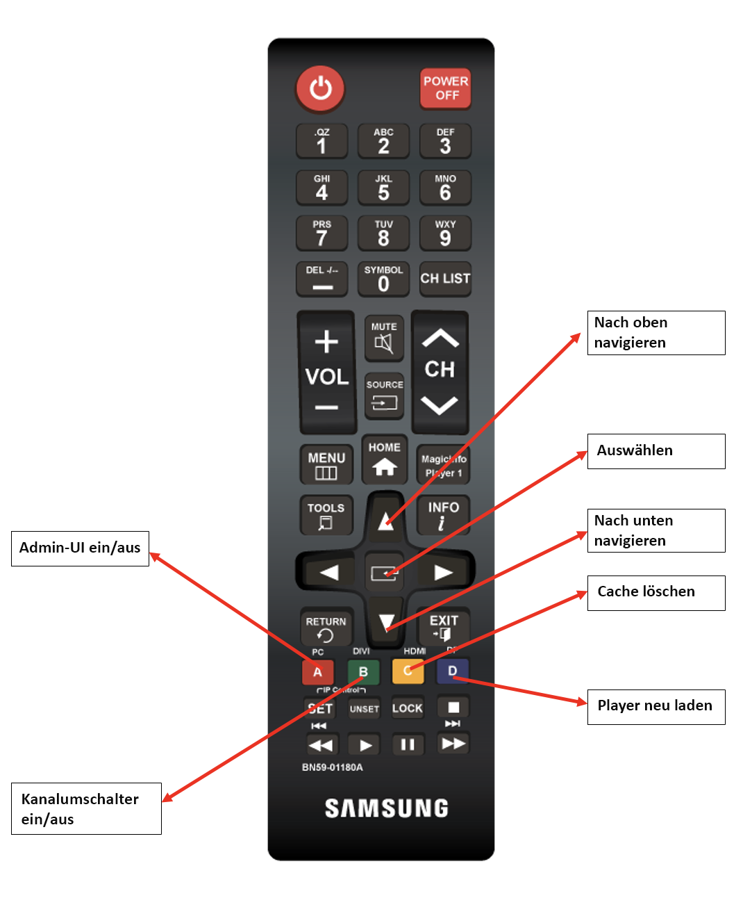

# Verwenden der Screens-Remote-Steuerung  {#implementing-remote-control}

Die Fernsteuerungsfunktion erleichtert den Zugriff auf die Admin-Benutzeroberfläche, den Kanalschalter oder Funktionen wie Cache löschen und neu laden. Darüber hinaus erhalten Sie eine Methode, die lokale Firmware-Version und Systeminformationen auf dem Player anzuzeigen. Dies ist besonders nützlich, da es schwierig sein kann, eine Maus anzuschließen und auf Produktionsgeräten zu arbeiten, die außer Reichweite sind, und noch mehr, wenn der Player die Verbindung zu AEM verloren hat. Dies ist auch bei der Verwendung von Samsung RMS nützlich, da es aufgrund der unterschiedlichen Auflösung sehr schwierig sein kann, die Admin-Benutzeroberfläche mit einer Maus zu finden und zu öffnen.

## Gemeinsame Tastenkombinationen für die Fernsteuerung {#using-common-remote-control}

Auf allen Playern können Sie die folgenden Tastenkombinationen in der Screens-Remote-Steuerung verwenden:

1. Admin-Benutzeroberfläche ein/aus - STRG + 1
1. Kanalschalter ein/aus - STRG + 2
1. Cache löschen - STRG + ALT + 3
1. Player neu laden - STRG + 4

## Tizen bestimmter Tastenkombinationen für die Fernsteuerung {#using-tizen-remote-control}

Speziell für den Tizen-Player können Sie entweder die Hardware-Remote oder die Software Remote in Samsung RMS verwenden, um auf diese Funktionen zuzugreifen:

1. A - Admin-Benutzeroberfläche ein/aus
1. B - Umschalten zwischen Kanalschalter
1. C - Cache löschen
1. D - Player neu laden

## Weitere Hinweise zur Verwendung {#using-additional-remote-control}

1. Wenn die Admin-Benutzeroberfläche geöffnet ist, können Sie mit den Nach-oben- und Nach-unten-Pfeilen in den Registerkarten navigieren, um Informationen über die Registerkarten hinweg anzuzeigen.
1. Wenn der Kanalschalter geöffnet ist, können Sie die Nach-oben- und Nach-unten-Tasten verwenden, um durch die Kanäle zu navigieren, und Sie können die Eingabetaste (oder die Schaltfläche in der Mitte der Pfeile auf der Fernbedienung) drücken, um die Kanäle zu wechseln.

Die folgende Abbildung zeigt die Schlüsselverwendung auf einem Samsung-Remote-Gerät:


>[!NOTE]
>Wenn Sie die Gerätekonfigurationswerte von enableAdminUI und/oder enableOSD auf &quot;false&quot;setzen, wird die Admin-Benutzeroberfläche und der Kanalschalter durch die Remote-Konsole nicht umgeschaltet. Sie können auch nicht mit den Pfeiltasten in der Admin-Benutzeroberfläche oder in den Kanälen navigieren. Sie können jedoch den Cache löschen und den Player neu laden. Sie können die Fernsteuerungsfunktion deaktivieren, wenn eine der Tastaturkombinationen mithilfe dieses Codes mit Ihrem interaktiven Inhalt in Konflikt gerät:

```javascript require(/['util/ScreensDisplay'/], function() /{window.ScreensDisplay.ignoreRemoteControl = true;/}); ```
