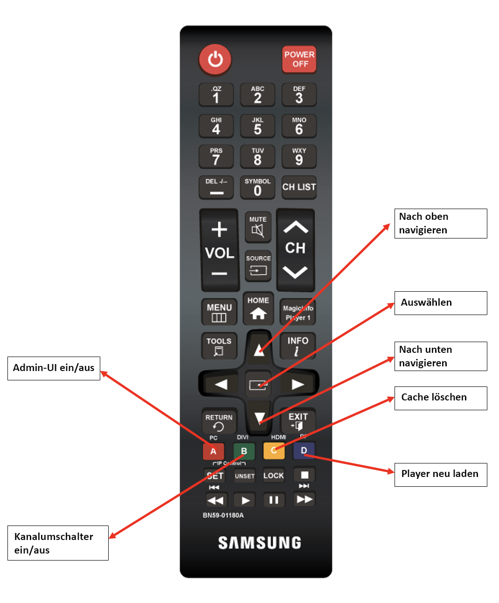

# Verwenden der Fernbedienungs-Steuerung von Screens {#implementing-remote-control}

>[!IMPORTANT]
>Dieser Inhalt gilt für AEM On-Premise/AMS (AEM 6.5LTS und AEM 6.5). Informationen zu AEM as a Cloud Service Screens-Inhalten finden Sie im [AEM as a Cloud Service-Handbuch](https://experienceleague.adobe.com/en/docs/experience-manager-cloud-service/content/screens-as-cloud-service/overview/introduction).

Die Fernbedienungs-Steuerungsfunktion erleichtert den Zugriff auf die Admin-Benutzeroberfläche, den Kanalumschalter oder Funktionen wie „Cache löschen“ und „Neu laden“. Außerdem bietet sie Ihnen eine Methode, die lokale Firmware-Version und Systeminformationen auf dem Player anzuzeigen. Diese Funktion ist besonders nützlich, da es schwierig sein kann, eine Maus zu verbinden. Oder an Produktionsgeräten zu arbeiten, die sich außerhalb der Reichweite befinden, vor allem, wenn der Player die Verbindung zu AEM verloren hat. Sie ist auch bei der Verwendung von Samsung RMS nützlich, da es aufgrund der unterschiedlichen Auflösung schwierig sein kann, die Administrator-Benutzeroberfläche zu finden und mit einer Maus zu öffnen.

## Gängige Tastenkombinationen für die Fernbedienungs-Steuerung {#using-common-remote-control}

Auf allen Playern können Sie die folgenden Tastenkombinationen in der Fernbedienungs-Steuerung von Screens verwenden:

1. Admin-Benutzeroberfläche ein/aus - STRG+1
1. Kanalumschalter ein/aus - STRG+2
1. Cache löschen - STRG+ALT+3
1. Player neu laden - STRG+4

## Tizen-spezifische Tastenkombinationen für die Fernbedienungs-Steuerung {#using-tizen-remote-control}

Speziell für den Tizen-Player können Sie entweder die Hardware-Fernbedienung oder die in Samsung RMS verfügbare Software-Fernbedienung verwenden, um auf diese Funktionen zuzugreifen:

1. A - Admin-Benutzeroberfläche ein/aus
1. B - Kanalumschalter ein/aus
1. C - Cache löschen
1. D - Player neu laden

## Weitere Nutzungshinweise {#using-additional-remote-control}

1. Wenn die Admin-Benutzeroberfläche geöffnet ist, können Sie mit den Pfeiltasten nach oben und unten durch die Registerkarten navigieren, um Informationen auf den verschiedenen Registerkarten anzuzeigen.
1. Wenn der Kanalschalter geöffnet ist, können Sie mit den Nach-oben- und Nach-unten-Pfeiltasten durch die Kanäle navigieren. Sie können auch die `Enter`-Taste (oder die Schaltfläche in der Mitte der Pfeile auf der Fernbedienung) drücken, um die Kanäle zu wechseln.

Die folgende Abbildung veranschaulicht die Verwendung der Tasten auf einer Samsung-Fernbedienung:


>[!NOTE]
>Wenn Sie die Gerätekonfigurationswerte von „enableAdminUI“ und/oder „enableOSD“ auf „false“ setzen, werden die Administrator-Benutzeroberfläche und der Kanalschalter durch die Fernbedienung nicht ein-/ausgeschaltet. Sie können nicht mit den Pfeiltasten in der Administrator-Benutzeroberfläche oder in den Kanälen navigieren. Sie können jedoch weiterhin den Cache löschen und den Player neu laden. Sie können die Fernbedienungs-Steuerungsfunktion deaktivieren, wenn eine der Tastenkombinationen mit Ihren interaktiven Inhalten in Konflikt steht, indem Sie diesen Code verwenden:

```
require(['util/ScreensDisplay'], function() {window.ScreensDisplay.ignoreRemoteControl = true;}); 
```
