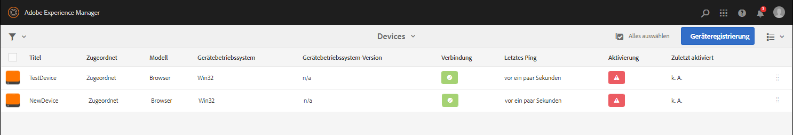
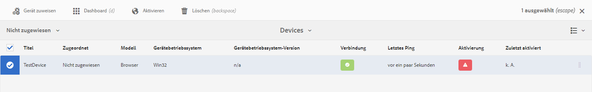

# Schnellstartanleitung {#kickstart-guide}

Dieser Abschnitt ist eine Schnellstartanleitung für AEM Screens und stellt eine Reihe von grundlegenden Aktionen vor. Er erläutert, wie Sie ein einfaches Erlebnis für digitale Displays mit Inhalten/Assets erstellen und in einem Screens-Player veröffentlichen. Detaillierte Informationen zu allen Komponenten für die Screens-Entwicklung finden Sie in den Ressourcen am Ende der Seite.

## Erstellen eines Erlebnisses für digitale Displays in fünf Minuten {#creating-a-digital-signage-experience-in-minutes}

Mit den nachfolgenden Schritten können Sie ein Beispielprojekt für Screens erstellen und Inhalte im Screens-Player veröffentlichen.

1. To download **AEM Screens Player**, click [here](https://download.macromedia.com/screens/).

   AEM Screens is also available in **Google Play**.

   Informationen zur Implementierung des Players für Chrome OS finden Sie unter [Chrome-Verwaltungskonsole](implementing-chrome-os-player.md).

   Weitere Einzelheiten finden Sie unter [Installieren und Konfigurieren von Screens](configuring-screens-introduction.md).

   >[!NOTE]
   >
   >**OSGi-Einstellungen** 
   >
   >
   >Sie müssen den leeren Referrer aktivieren, um dem Gerät das Bereitstellen von Daten auf dem Server zu erlauben. Wenn die Eigenschaft für den leeren Referrer deaktiviert ist, kann das Gerät keine Rückübertragung eines Screenshots durchführen. Derzeit sind einige dieser Funktionen nur verfügbar, wenn der Apache Sling Referrer-Filter „Allow Empty“ in der OSGi-Konfiguration aktiviert ist. Im Dashboard wird ggf. eine Warnung angezeigt, dass einige dieser Funktionen aufgrund der Sicherheitseinstellungen nicht funktionieren.
   >
   >
   >Führen Sie die nachfolgenden Schritte aus, um den ***Apache Sling Referrer-Filter „Allow Empty“ zu aktivieren***:
   >
   >
   >
   >    1. Navigate to **Adobe Experience Manager Web Console Configuration**, that is `https://localhost:4502/system/console/configMgr/org.apache.sling.security.impl.ReferrerFilter`.
   >    1. Check the **allow.empty** option.
   >    1. Klicken Sie auf **Speichern**.

1. **Erstellen eines neuen Projekts**

   1. Wählen Sie den Link zu Adobe Experience Manager (oben links) und dann **Screens** aus. Alternativ können Sie direkt zu navigieren `https://localhost:4502/screens.html/content/screens](https://localhost:4502/screens.html/content/screens`.

   1. Klicken Sie auf **Erstellen**, um ein neues Screens-Projekt zu erstellen (siehe Abbildung unten).
   1. Wählen Sie im Assistenten **Screens-Projekt erstellen** die Option **Screens** aus und klicken Sie auf **Weiter**.

   1. Enter the title as *Test_Project *and click **Create**.
   

   Wenn das Projekt erstellt wurde, kehren Sie zur Screens-Projektkonsole zurück. Sie können Ihr Projekt jetzt auswählen. In a project, there are five kind of folders namely **Applications**, **Channels**, **Devices**, **Locations**, and **Schedules**, as shown in the figure below.

   >[!NOTE]
   >
   >Zeitpläne sind nur verfügbar, wenn Sie das Feature Pack 1 für AEM 6.3 Sites installiert haben. Wenden Sie sich an den Adobe-Support, um Zugriff auf dieses Feature Pack zu erhalten. Wenn Sie die entsprechenden Berechtigungen erhalten haben, können Sie es von Package Share herunterladen.

   

   Weitere Informationen finden Sie unter Bildschirmprojekt [erstellen und verwalten](creating-a-screens-project.md) .

1. **Erstellen von neuen Kanälen**

   Wenn Sie ein Projekt konfiguriert haben, müssen Sie einen neuen Kanal zum Verwalten der Inhalte erstellen.

   Gehen Sie wie folgt vor, um einen neuen Kanal für Ihr Projekt zu erstellen:

   1. Navigieren Sie zum erstellten *Testprojekt* und wählen Sie den Ordner **Kanäle** aus.

   1. Klicken Sie in der Aktionsleiste auf** Erstellen* (siehe Abbildung unten). Ein Assistent wird geöffnet.
   1. Choose the **Sequence Channel **and click **Next**.

   1. Enter the **Name** and **Title** as *TestChannel* and click **Create**.
   

   The *TestChannel* is created and added to your channels folder, as shown in the figure below.

   

   See [Channel Management](managing-channels.md) for more details on creating and managing channels.

1. **Hinzufügen von Inhalten zu Kanälen**

   Wenn Sie einen Kanal erstellt haben, müssen Sie diesem Inhalte hinzufügen, die vom Screens-Player angezeigt werden.

   Gehen Sie wie folgt vor, um dem Kanal (*Testkanal*) Ihres Projekts Inhalte hinzuzufügen:

   1. Navigate to the *Test_Project* you created and select the **Channels **folder.

   1. Click **Edit** from the action bar (see the figure below). Der Editor für* TestChannel* wird geöffnet.

   1. Klicken Sie auf der linken Seite der Aktionsleiste auf das Symbol zum Ein-/Ausblenden des seitlichen Bedienfelds, um die Assets und Komponenten zu öffnen.
   1. Wählen Sie die Ihrem Kanal hinzuzufügenden Komponenten per Drag-and-Drop aus.
   

   In diesem Beispiel zeigt der Editor ein Bild, das dem Kanal hinzugefügt wurde.

   

1. **Erstellen eines neuen Speicherorts**

   Wenn der Kanal konfiguriert wurde, müssen Sie den Ort erstellen.

   ***Orte*** , an denen Sie Ihre verschiedenen digitalen Schilder unterteilen, enthalten die Konfigurationen der Bildschirme, je nachdem, wo sich die verschiedenen Bildschirme befinden.

   Gehen Sie wie folgt vor, um einen neuen Ort für Ihr Projekt zu erstellen:

   1. Navigate to the *Test_Project* you created and select the **Locations **folder.

   1. Click **Create** next to the plus icon in the action bar (see the figure below). Ein Assistent wird geöffnet.
   1. Select **Location** from the wizard and click **Next**.

   1. Enter the **Name** and **Title** for your location (enter the title as *TestLocation*) and click **Create**.
   

   The *TestLocation* is created and added to your **Locations** folder.

   

1. **Erstellen einer neuen Anzeige für *Testort***

   Wenn Sie einen Ort konfiguriert haben, müssen Sie eine neue Anzeige für diesen erstellen.

   ***Anzeigen*** repräsentieren das digitale Erlebnis, das auf einem oder mehreren Bildschirmen dargestellt wird.

   1. Navigate to the location where you want to create your display (*Test_Projec* t --&gt; **Locations** --&gt; *TestLocation)* as shown in the figure above and selct *TestLocation*.

   1. Klicken Sie in der Aktionsleiste auf** **erstellen.
   1. Select **Display **from the **Create** wizard and click **Next**.

   1. Geben Sie einen **Namen** und **Titel** für den Ort der Anzeige ein (geben Sie als Titel *Testanzeige* ein).

   1. Under the **Display** tab, choose the details of the Layout.

      1. Choose the **Resolution** as **Full HD**.

      1. Choose the **Number of Devices Horizontally** as 1.
      1. Choose the **Number of Devices Vertically** as 1.
   1. Klicken Sie auf **Erstellen**.
   Eine neue Anzeige (*Testanzeige*) wird zu Ihrem Ort (*Testort*) hinzugefügt, wie in der nachfolgenden Abbildung gezeigt.

   

1. **Hinzufügen von Zeitplänen**

   Mit der Funktion *Zeitpläne* in AEM Screens können Sie Kanäle zu wiederverwendbaren Gruppen zusammenfassen, sodass Sie nicht für jede einzelne Anzeige, in der Sie einen bestimmten Inhalt zeigen möchten, eine neue Zuweisung vornehmen müssen.

   >[!NOTE]
   >
   >Diese Screens-Funktion ist nur verfügbar, wenn Sie das Feature Pack 1 für AEM 6.3 Sites installiert haben. Wenden Sie sich an den Adobe-Support, um Zugriff auf dieses Feature Pack zu erhalten. Wenn Sie die entsprechenden Berechtigungen erhalten haben, können Sie es von Package Share herunterladen.

   1. Navigate to the **Schedules** folder from Test_Project --&gt; **Schedules**.

   1. Klicken Sie in der Aktionsleiste auf** **erstellen. Ein Assistent wird geöffnet.
   1. Wählen Sie auf der Seite des Assistenten **Erstellen** die Option **Zeitplan** aus.

   1. Geben Sie auf der Eigenschaftenseite *ZeitplanVormittag* als **Name** und **Titel** ein.

   1. Wenn Sie auf **Erstellen** klicken, wird der Zeitplan zum Ordner **Zeitpläne** hinzugefügt, wie in der nachfolgend Abbildung gezeigt.
   

   Wählen Sie darüber hinaus den Zeitplan (*ZeitplanVormittag*) aus und klicken Sie in der Aktionsleiste auf **Dashboard**, um das Dashboard für Zeitpläne anzuzeigen. Mit dem Dashboard können Sie die Eigenschaften des Zeitplans anzeigen/ändern, Kanäle zuweisen und zugewiesene Anzeigen anzeigen.

   

   Detaillierte Informationen zu Zeitplänen finden Sie unter [Erstellen und Verwalten von Zeitplänen](managing-schedules.md) .

1. **Zuweisen von Kanälen**

   1. Navigate to the display from *Test_Project* --&gt; **Locations** --&gt; *TestLocation* --&gt; *TestDisplay*.

   1. Select *TestDisplay* and tap/click **Assign Channel **from the action bar, *Or*,

   1. Click **Dashboard** and select **+Assign Channel** at the top right from **ASSIGNED CHANNELS &amp; SCHEDULES** panel, as shown in the figure below. Daraufhin wird das Dialogfeld **Kanalzuweisung** geöffnet.

   1. Wählen Sie als Vorgehensweise für **Kanal referenzieren** die Option **Pfad** aus

   1. Geben Sie als **Kanalrolle** den Wert *LiveStream* ein.

   1. Select the** Channel Path** (*Test_Project* --&gt; *Channels* --&gt; *TestChannel* ) in the **Channel**.

   1. Wählen Sie als **Priorität** für den Kanal *1* aus.

   1. Choose the **Supported Events** as **Initial Load **and **Idle Screen**.

   1. Enter **Schedule **and select the dates in **active from** and **active until**.

   1. Klicken Sie auf **Speichern**.
   Der Kanal wird erstellt und dem Bedienfeld hinzugefügt.

   

   To learn more about **Channel Assignment** dialog box and the properties associated with it, see [Assign Channels](channel-assignment.md).

1. **Hinzufügen von Zeitplänen zu Kanälen**

   1. Navigate to the display from *Test_Project* --&gt; **Locations** --&gt; *TestLocation* --&gt; *TestDisplay*.

   1. Click **Dashboard** and select **+Assign Schedule** at the top right from **ASSIGNED CHANNELS &amp; SCHEDULES** panel, as shown in the figure above. **Dialogfeld "Zuweisung** planen"wird angezeigt.

   1. Choose the path where you created your schedule (here, *Test_Project* --&gt; **Schedules** --&gt; *MorningSchedule*).

   1. Klicken Sie auf **Speichern**, um den Zeitplan zu Ihrem Kanal hinzuzufügen.
   

1. **Registrieren von Geräten**

   Sie müssen Ihr Gerät mithilfe des AEM-Dashboards registrieren.

   >[!NOTE]
   >
   >Sie können den Screens-Player über die heruntergeladene AEM Screens-App oder mithilfe des Webbrowsers öffnen.

   Anzeigen von ausstehenden Geräten:

   1. Öffnen Sie ein separates Browserfenster.
   1. Go to Screens player using the *web browser* `https://localhost:4502/content/mobileapps/cq-screens-player/firmware.html` or launch the AEM Screens app. Wenn Sie das Gerät öffnen, können Sie sehen, dass das Gerät nicht registriert ist.
   1. From the AEM dashboard, navigate to *Test_Project* --&gt; **Devices**

   1. Klicken Sie in der Aktionsleiste auf **Geräte-Manager**.
   1. Klicken Sie auf **Geräteregistrierung**. Daraufhin werden die ausstehenden Geräte angezeigt, wie in der nachfolgenden Abbildung dargestellt.
   

   Wählen Sie das zu registrierende Gerät aus und klicken Sie auf **Gerät registrieren**.

   

   Sie müssen den Code validieren, indem Sie ihn über den Webbrowser oder AEM Screens-Player überprüfen.

   Click **Validate** to navigate to **Device Registration** screen.

   

   Enter **Title** and click **Register **and** **the device will be registered.

   Click **Finish** to complete the device registration step.

   

   Clicking **Finish** returns you to the device page that displays unassigned and assigned devices.

   

   >[!NOTE]
   >
   >Das hinzugefügte Gerät wird unter **Zugeordnet** mit dem Status **Nicht zugewiesen** angezeigt.

1. **Zuweisen von Geräten zu Anzeigen**

   Wenn Sie das Gerät registriert haben, müssen Sie es einer Anzeige zuweisen.

   Gehen Sie wie folgt vor, um ein Gerät zuzuweisen:

   1. Wählen Sie das zuzuweisende Gerät aus.
   1. Click **Assign Device** from the action bar.
   1. Wählen Sie den Anzeigepfad für Ihren Kanal aus als `/content/screens/Test_Project/***Locations***/TestLocation/TestDisplay.`

   1. Klicken Sie auf **Zuweisen**.
   1. Click **Finish** to complete the process, and now the device is assigned.
   

   Das Dashboard der Anzeige wird geöffnet und zeigt alle Informationen zu den zugewiesenen Kanälen und Zeitplänen sowie die Details der Gerätekonfiguration an.

   

### Anzeigen von Inhalten im Screens-Player {#viewing-the-content-in-screens-player}

Nachdem Sie die oben genannten Konfigurationen hinzugefügt haben, sollte der Player automatisch den Standardkanal für die Anzeige auf Ihrem Gerät anzeigen, z. B. ein Bild (in diesem Szenario ist ein Sequenzkanal und der Inhalt im Bildschirmplayer für den Webbrowser sichtbar).

See [AEM Screens Player](working-with-screens-player.md) to get more detailed information on AEM Screens player.
