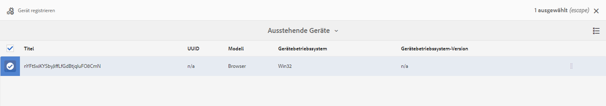

# Schnellstartanleitung {#kickstart-guide}

Die Schnellstartanleitung für AEM Screens zeigt, wie ein AEM Screens-Projekt eingerichtet und ausgeführt wird. Er führt Sie durch die Einrichtung eines einfachen Digital Signage-Erlebnisses, das Hinzufügen von Inhalten wie Assets und/oder Videos zu jedem Kanal und die weitere Veröffentlichung des Inhalts in einem AEM Screens-Player.

>[!NOTE]
>Bevor Sie mit der Arbeit an den Projektdetails beginnen, vergewissern Sie sich, dass Sie das neueste Feature Pack für AEM Screens installiert haben. Sie können das neueste Feature Pack im [Software Distribution-Portal](https://experience.adobe.com/#/downloads/content/software-distribution/de/aem.html) die Verwendung Ihrer Adobe ID.

## Voraussetzungen {#prerequisites}

Gehen Sie wie folgt vor, um ein Beispielprojekt für AEM Screens zu erstellen und Inhalte im Screens-Player zu veröffentlichen.

>[!NOTE]
>Im folgenden Tutorial wird die Wiedergabe des Inhalts Ihres Kanals in einem Chrome OS-Player gezeigt.

>[!IMPORTANT]
>**OSGi-Konfigurationseinstellungen**
>Sie müssen den leeren Referrer aktivieren, um dem Gerät das Bereitstellen von Daten auf dem Server zu erlauben. Wenn die Eigenschaft für den leeren Referrer deaktiviert ist, kann das Gerät keine Screenshots zurückgeben. Derzeit sind einige dieser Funktionen nur verfügbar, wenn der Apache Sling Referrer-Filter „Allow Empty“ in der OSGi-Konfiguration aktiviert ist. Im Dashboard wird ggf. eine Warnung angezeigt, dass einige dieser Funktionen aufgrund der Sicherheitseinstellungen nicht funktionieren.
>Führen Sie die nachfolgenden Schritte aus, um den ***Apache Sling Referrer-Filter „Allow Empty“*** zu aktivieren:

## Zulassen von leeren Referrer-Anforderungen {#allow-empty-referrer-requests}

1. Navigieren Sie zu **Konfiguration der Adobe Experience Manager-Web-Konsole** über AEM Instanz > Hammersymbol > **Aktivitäten** > **Web-Konsole**.

   

1. Die **Konfiguration der Adobe Experience Manager-Web-Konsole** wird geöffnet. Suchen Sie nach „sling referrer“.

   Um nach der Eigenschaft „sling referrer“ zu suchen, drücken Sie **Befehl+F** für **Mac** und **Strg+F** für **Windows**.

1. Markieren Sie die Option **Leere erlauben**, wie in der folgenden Abbildung dargestellt.

   

1. Klicken Sie auf **Speichern**, um den Apache Sling Referrer-Filter „Leere erlauben“ zu aktivieren.

## Erstellen eines Digital-Signage-Erlebnisses in fünf Minuten {#creating-a-digital-signage-experience-in-minutes}

### Erstellen eines AEM Screens-Projekts {#creating-project}

Erstellen Sie zuerst ein AEM Screens-Projekt.

1. Navigieren Sie zu Ihrer Adobe Experience Manager-Instanz und klicken Sie auf **Screens**. Sie haben auch die Möglichkeit, direkt zur folgenden URL zu wechseln: `https://localhost:4502/screens.html/content/screens](https://localhost:4502/screens.html/content/screens`.

1. Klicken Sie auf **Screens-Projekt erstellen**, um ein Screens-Projekt zu erstellen.
1. Geben Sie **DemoScreens** als Titel ein und klicken Sie auf **Speichern**.

   

   >[!NOTE]
   >Nachdem Sie das Projekt erstellt haben, gelangen Sie zurück zur Startseite des AEM Screens-Projekts. Sie können jetzt auf Ihr Projekt klicken. In einem Projekt gibt es fünf verschiedene Ordner mit dem Titel **Anwendungen**, **Kanäle**, **Geräte**, **Standorte** und **Zeitpläne**.

### Erstellen eines Kanals {#creating-channel}

Nachdem Sie Ihr AEM Screens-Projekt erstellt haben, erstellen Sie einen Kanal, in dem Sie den Inhalt verwalten.

Gehen Sie wie folgt vor, um einen Kanal für Ihr Projekt zu erstellen:

1. Nachdem Sie ein Projekt erstellt haben, klicken Sie auf das **DemoScreens** und klicken Sie auf **Kanäle** -Ordner, wie in der folgenden Abbildung dargestellt. Klicken Sie in der Aktionsleiste auf **+ Erstellen**.

   

1. Wählen Sie im Assistenten die Vorlage **Sequenz-Kanal** aus und klicken Sie auf **Weiter**.
   

1. Geben Sie **TestChannel** als **Titel** ein und klicken Sie auf **Erstellen**.

   

   Der **TestChannel** wird nun dem Ordner „Kanäle“ hinzugefügt, wie in der nachfolgenden Abbildung gezeigt.

   

### Hinzufügen von Inhalten zu Kanälen {#adding-content}

Wenn Sie Ihren Kanal eingerichtet haben, fügen Sie Inhalte zu Ihrem Kanal hinzu, die vom AEM Screens-Player angezeigt werden können.

Gehen Sie wie folgt vor, um dem Kanal (**TestChannel**) Ihres Projekts Inhalte hinzuzufügen:

1. Navigieren Sie zum **DemoProject** Sie haben erstellt und klicken Sie auf **TestChannel** aus dem **Kanäle** Ordner.

1. Klicken Sie in der Aktionsleiste auf **Bearbeiten** (siehe Abbildung unten). Der Editor für den **Testkanal** wird geöffnet.

   

1. Klicken Sie auf das Symbol, durch das das seitliche Bedienfeld auf der linken Seite der Aktionsleiste ein-/ausgeblendet wird, um die Assets und Komponenten zu öffnen.

1. Wählen Sie die Ihrem Kanal hinzuzufügenden Komponenten per Drag-and-Drop aus.

   

### Erstellen eines Standorts {#creating-location}

Wenn der Kanal konfiguriert wurde, erstellen Sie einen Standort.

>[!NOTE]
>***Standorte*** gliedern die verschiedenen Digital-Signage-Erlebnisse und enthalten die Konfigurationen der einzelnen Anzeigen, abhängig vom jeweiligen Standort.

Gehen Sie wie folgt vor, um einen Standort für Ihr Projekt zu erstellen:

1. Navigieren Sie zum **DemoProject** Sie haben erstellt und klicken Sie auf **Standorte** Ordner.
1. Klicken Sie in der Aktionsleiste auf **+ Erstellen**.
1. Klicks **Standort** Klicken Sie im Assistenten auf **Nächste**.
1. Geben Sie den **Namen** und Titel für Ihren Standort ein (geben Sie als Titel **TestLocation** ein) und klicken Sie auf **Erstellen**.

Der Standort **TestLocation** wird erstellt und dem Ordner **Standorte** hinzugefügt.

### Erstellen einer Anzeige für einen Standort {#creating-display}

Nachdem Sie einen Standort konfiguriert haben, erstellen Sie eine Anzeige für Ihren Standort.

>[!NOTE]
>Eine ***Anzeige*** steht für das digitale Erlebnis auf einem oder mehreren Bildschirmen.

1. Navigieren Sie zum **TestLocation** und klicken Sie darauf.
1. Klicken Sie in der Aktionsleiste auf **Erstellen**.

   

1. Klicks **Anzeige** aus dem **Erstellen** Assistent und klicken Sie auf **Nächste**.

   

1. Geben Sie unter **Titel** den Wert **LobbyDisplay** ein und klicken Sie auf **Erstellen**.

   

   Eine neue Anzeige (**TestDisplay**) wird Ihrem Standort (**TestLocation**) hinzugefügt, wie in der nachfolgenden Abbildung gezeigt.

   

### Zuweisen von Kanälen {#assigning-channel}

Wenn die Projekteinrichtung abgeschlossen ist, weisen Sie den Kanal einer Anzeige zu, um den Inhalt anzuzeigen.

1. Navigieren Sie über **DemoScreens** > **Standorte** > **TestLocation** > **LobbyDisplay** zur gewünschten Anzeige.

1. Klicken Sie in der Aktionsleiste auf **Kanal zuweisen**.

   

   ODER

   Klicks **Dashboard** Klicken Sie in der Aktionsleiste auf **+Kanal zuweisen** aus dem **ZUGEWIESENE KANÄLE UND ZEITPLÄNE** Bedienfeld.

   

1. Daraufhin wird das Dialogfeld **Kanalzuweisung** geöffnet.

1. Aus dem **Einstellungen** Option, wählen Sie den Kanal aus **nach Pfad** und **Unterstützte Ereignisse** wie **Erster Ladevorgang** und **Idle Screen**.

   >[!NOTE]
   >
   >Die Felder **Kanal-Rolle**, **Priorität** und **Unterbrechungsmethoden** werden standardmäßig ausgefüllt. Siehe [Kanaleigenschaften](/help/user-guide/channel-assignment-latest-fp.md#channel-properties) für weitere Informationen zu den Kanalzuweisungseigenschaften.

   

   Sie können auch auf die **Aktivierungsfenster** und **Wiederholungsplan**.

   >[!NOTE]
   >Mit dem *Intervallzeitplan* können Sie einen wiederkehrenden Zeitplan für Ihren Kanal festlegen. Sie können mehrere Intervallzeitpläne für einen Kanal einrichten.
   >Weitere Informationen finden Sie unter [Intervallzeitplan](/help/user-guide/channel-assignment-latest-fp.md#recurrence-schedule).

1. Klicken Sie auf **Speichern**, nachdem Sie Ihre Voreinstellungen konfiguriert haben.

### Registrieren eines Geräts und Zuweisen eines Geräts zu einer Anzeige {#registering-device}

Registrieren Sie Ihr Gerät über das AEM-Dashboard.

>[!IMPORTANT]
>Der Chrome OS-Player kann im Entwicklermodus als Chrome-Browser-Plug-in installiert werden, ohne dass ein aktuelles Chrome-Player-Gerät erforderlich ist. Gehen Sie zur Installation wie folgt vor:
>
>1. Klicken Sie [hier](https://download.macromedia.com/screens/), um den neuesten Chrome-Player herunterzuladen.
>1. Entpacken Sie die Datei und speichern Sie sie auf der Festplatte.
>1. Öffnen Sie den Chrome-Browser und klicken Sie auf **Erweiterungen** aus dem Menü oder direkt zu ***chrome://extensions***.
>1. Schalten Sie die **Entwicklermodus** oben rechts.
>1. Klicks **Entpacktes Laden** oben links und laden Sie den entpackten Chrome-Player.
>1. Überprüfen Sie, ob in der Liste der Erweiterungen das Plug-in **AEM Screens Chrome Player** aufgeführt wird.
>1. Öffnen Sie eine neue Registerkarte und klicken Sie oben links auf das Symbol **Apps** oder navigieren Sie direkt zu ***chrome://apps***.
>1. Klicken Sie auf das **AEM Screens**-Plug-in, damit Sie den Chrome-Player starten können. Standardmäßig wird der Player im Vollbildmodus gestartet. Drücken Sie **Esc**, um den Vollbildmodus zu beenden.

Nachdem Ihr Chrome OS-Player aktiviert ist, führen Sie die folgenden Schritte aus, um ein Chrome-Gerät zu registrieren.

1. Navigieren Sie von Ihrer AEM-Instanz zum Ordner **Geräte** Ihres Projekts.

1. Klicken Sie auf **Geräte-Manager** in der Aktionsleiste aus.

   

1. Klicken Sie auf **Geräteregistrierung** oben rechts.

1. Klicken Sie auf das gewünschte Gerät und klicken Sie auf **Gerät registrieren**.

   

1. Warten Sie, bis das Gerät seinen Registrierungs-Code sendet, und überprüfen Sie gleichzeitig von Ihrem Chrome-Gerät aus den **Registrierungs-Code**.
   

1. Wenn die Variable **Registrierungs-Code** auf beiden Computern identisch ist, klicken Sie auf **Bestätigen** in AEM.

1. Legen Sie den gewünschten Namen für das Gerät als **ChromeDeviceforDemo** fest und klicken Sie auf **Registrieren**.

   

1. Klicken Sie im Dialogfeld **Geräteregistrierung erfolgreich** auf **Anzeige zuweisen**.

   

1. Klicken Sie auf den Pfad zu Ihrer Anzeige als **DemoScreens** > **Standorte** > **TestLocation** > **LobbyDisplay** und klicken **Zuweisen**.

   

1. Wenn das Gerät erfolgreich zugewiesen wurde, wird die folgende Bestätigung angezeigt:

   

1. Klicks **Beenden** , um den Registrierungsprozess abzuschließen. Sie können Ihr registriertes Gerät nun über das Anzeigen-Dashboard anzeigen.

   

### Anzeigen von Inhalten im Chrome-Player {#viewing-content-output}

Alle Assets in Ihrem Kanal werden jetzt auf Ihrem Chrome OS-Player wiedergegeben.

Herzlichen Glückwunsch! Jetzt spielen Sie Inhalte in einem AEM Screens-Kanal ab!

