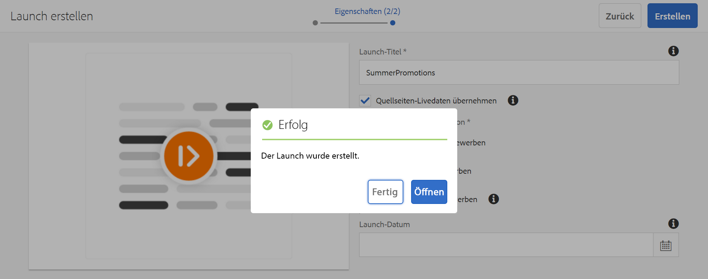

# Inhaltsaktualisierung mit Screens Launch {#launches}

Inhaltsautoren können eine zukünftige Version der Kanäle erstellen und das Live-Datum für diesen Launch weiter festlegen. Dadurch kann der Inhalt am angegebenen Live-Datum auf Geräten oder Playern live geschaltet werden.

Mithilfe von ***Screens Launch*** können Autorinnen und Autoren die einzelnen Kanäle im Launch in der Vorschau anzeigen und sollten eine Anfrage zur Überprüfung starten können. Die Gruppe der Genehmigenden erhält eine Benachrichtigung und kann die Anfrage genehmigen oder ablehnen. Wenn das Live-Datum erreicht ist, wird der Inhalt auf den Geräten abgespielt.

Wenn die Autorin oder der Autor z. B. zukünftige Versionen von c1, c2 (Kanäle) erstellen möchte, wird ein Launch generiert und ein Live-Datum festgelegt (z. B. 10. November, 8:00 Uhr). Alle weiteren Aktualisierungen des Inhalts werden zur Überprüfung gesendet.

Nach der Genehmigung und am Live-Datum (10. November, 8:00 Uhr) wird der Inhalt dieses Launches auf den Geräten oder Playern wiedergegeben.

## Voraussetzungen {#requirements}

Vorbereitung der Verwendung von *Screens Launch* Vergewissern Sie sich, dass Sie mit dem Konzept der Übergangsphase und ihrer Relevanz vertraut sind.

Das Ausführen eines Erlebnisses am festgelegten Live-Datum auf dem Player umfasst Folgendes:

* Launch-Promotion (dauert in der Regel einige Sekunden).

* Veröffentlichen der Ressourcen, um Instanzen zu veröffentlichen (dauert in der Regel einige Minuten, je nach Größe der Kanäle oder Assets, die veröffentlicht werden müssen).

* Die Zeitdauer, die zum Abschluss der Aktualisierung des Offline-Inhalts benötigt wird (in der Regel einige Minuten).

* Zeit, die die Player zum Herunterladen des Inhalts aus der Veröffentlichungsinstanz benötigen (in der Regel je nach Bandbreite und Größe der herunterzuladenden Assets einige Minuten).

* alle Zeitunterschiede zwischen Server und Player.

### Verstehen der Nachfrist {#understanding-grace-period}

Damit der Player mit der Wiedergabe des Inhalts am festgelegten Live-Datum beginnen kann, starten Sie die vorherigen Aktivitäten vor dem Live-Datum.

Wenn das Live-Datum *24. November, 9:00 Uhr* und *24 Stunden* die Übergangsphase ist, beginnt die obige Aktionssequenz am (Live-Datum - Übergangsphase) 23. November, um 9:00 Uhr Serverzeit. Mit dieser Einstellung erhalten Sie 24 Stunden, um alle oben genannten Aktionen durchzuführen, damit der Inhalt die Player erreicht. Player wissen, dass dieser Zeitraum ein Launch-Inhalt ist. Daher wird der Inhalt nicht sofort wiedergegeben. Player können diesen Inhalt jedoch als zukünftige Version speichern und die Wiedergabe exakt am festgelegten Live-Datum in der Zeitzone des Players starten.

Ein Beispiel: Der Server befindet sich in der Zeitzone „PST“ und die Geräte in der Zeitzone „EST“. Die maximale Zeitdifferenz beträgt drei Stunden. Es wird davon ausgegangen, dass die Promotion 1 Minute dauert und die Veröffentlichung von der Autoren- zur Veröffentlichungsinstanz 10 Minuten dauert und der Player die Ressourcen in der Regel in 10-15 Minuten herunterladen kann. Die Übergangsphase ist dann gleich dem Zeitunterschied (drei Stunden):

* + die Zeit für die Launch-Promotion (1 Minute)
* + die Zeit für die Launch-Veröffentlichung (10 Minuten)
* + die Zeit für den Download im Player (10 bis 15 Minuten)
* + Puffer (30 Minuten)

Daher 3 Stunden 56 Minuten (14160 Sekunden).

Wenn Sie also einen Launch live planen, beginnt die Promotion früh, indem Sie diesen Versatz berücksichtigen. In der obigen Gleichung nehmen die meisten Punkte nicht viel Zeit in Anspruch. Sie können einen angemessenen Schätzwert für diesen Versatz verwenden, wenn Sie den maximalen Zeitunterschied zwischen Server und Player kennen.

>[!NOTE]
>
>Standardmäßig ist die Übergangsphase für Screens Launch auf 24 Stunden festgelegt. Das bedeutet, dass Sie beim Festlegen eines Live-Datums für einen Launch für die Ressourcen unter */content/screens*, beginnt die Promotion mit diesem Versatz.

### Aktualisieren der standardmäßigen Übergangsphase {#updating-out-of-the-box-grace-period}

In diesem Abschnitt wird beschrieben, wie Sie eine vordefinierte Übergangsphase auf 10 Minuten aktualisieren können.

1. Navigieren Sie zu CRXDE Lite und dann zu `/libs/system/config.author/com.adobe.cq.wcm.launches.impl.LaunchesEventHandler.config`.
1. Klicken Sie mit der rechten Maustaste und kopieren Sie die Datei.
1. Navigieren Sie zu `/apps/system/config`, klicken Sie mit der rechten Maustaste und fügen Sie den Inhalt ein.
1. Doppelklicken Sie auf `/apps/system/config/com.adobe.cq.wcm.launches.impl.LaunchesEventHandler.config`, um die Datei im Editor unter CRXDE Lite zu öffnen. Die Übergangsphase für den Pfad */content/screens/* muss als **86400** angezeigt werden. Ändern Sie diesen Wert in **600**.

Jetzt sollte der Inhalt in der Textdatei wie folgt aussehen:

```java
launches.eventhandler.launch.promotion.graceperiod=[ \
   "/content/screens(/.*):600", \
   ]
```

Sie legen die Übergangsphase im obigen Beispiel auf 10 Minuten fest. Wenn Sie daher ein Live-Datum für einen Launch der Ressourcen unter festlegen */content/screens*, beginnt die Promotion mit diesem Versatz.

Wenn das Live-Datum beispielsweise auf den 24. November, 9.00 Uhr und die Übergangsphase auf 600 Sekunden eingestellt ist, beginnt der Promotion-Auftrag am 24. November um 8:50 Uhr.

## Verwenden von Screens Launch {#using-launches}

In diesem Abschnitt wird die Implementierung von Screens Launch in Ihrem AEM Screens-Projekt erläutert.

### Erstellen eines Screens Launch {#creating-a-launch}

Gehen Sie gemäß nachstehendem Abschnitt vor, um Screens Launch-Funktionen in Ihrem AEM Screens-Projekt zu implementieren:

1. Erstellen Sie einen Sequenzkanal in Ihrem AEM Screens-Projekt, z. B. **LaunchesDemo** > **Kanäle** > **FutureLaunch**, wie unten dargestellt.

   >[!CAUTION]
   >
   >Erstellen Sie einen Launch aus einem bereits vorhandenen Kanal in Ihrem AEM Screens-Projekt.

   

1. Klicken Sie auf den Kanal **FutureLaunch** und klicken **Launch erstellen** in der Aktionsleiste aus.

   

1. Der Assistent **Launch erstellen** wird geöffnet. Sie können entweder auf den Kanal klicken, der bereits im Assistenten angezeigt wird, oder auf **+ Kanäle hinzufügen** , um den Kanal hinzuzufügen, für den Sie den Launch erstellen möchten.

1. Klicken Sie im Assistenten **Launch erstellen** auf **Weiter**. Die Option **Unterseiten einschließen** ist standardmäßig ausgewählt.

   

   >[!NOTE]
   >Sie können die **+ Kanäle hinzufügen** -Option, um einen weiteren Kanal hinzuzufügen, für den Sie den Launch erstellen möchten.

   So verwenden Sie die **Kanäle hinzufügen** , navigieren Sie zu dem Kanal, für den Sie den Launch erstellen möchten, und klicken Sie auf **Auswählen**.

   Die **Auswählen** ist deaktiviert, wenn Sie versuchen, auf mehrere Kanäle oder einen Ordner zum Hinzufügen des Launches zu klicken.

   

   Klicken Sie nach dem Klicken auf den Kanal/die Kanäle auf **Nächste**.


1. Geben Sie unter **Launch-Titel** den Wert **SummerPromotions** ein. Sie müssen für **Launch-Datum** keinen Wert festlegen, wie in der folgenden Abbildung dargestellt. Klicken Sie auf **Erstellen**.

   >[!NOTE]
   >
   >Wenn Sie die Option **Quellseiten-Live-Daten übernehmen** *aktivieren*, können die Kanäle im Launch als Live Copies erstellt werden. Wenn Änderungen am ursprünglichen Kanal vorgenommen werden, werden diese Änderungen automatisch auf die Launch-Kanäle angewendet.
   >
   >
   >Durch *Deaktivieren* der Option **Quellseiten-Livedaten übernehmen** können die Kanäle ohne Live-Beziehung in den Launch kopiert werden. Wenn also Änderungen am ursprünglichen Kanal vorgenommen werden, werden diese Änderungen nicht auf die Launch-Kanäle angewendet.

   

   >[!NOTE]
   >
   >Sie können das Live-Launch-Datum in diesem Schritt festlegen oder es später einrichten, während Sie die Eigenschaften des Launches bearbeiten, nachdem er bereits erstellt wurde.

   **Der Umfang der Launch-Promotion**

   * **Vollständigen Launch bewerben**: Alle Kanäle des Launches werden am festgelegten Live-Datum beworben.
   * **Geänderte Seiten bewerben**: Es werden nur bearbeitete Launch-Ressourcen beworben. Verwenden Sie diese Option, wenn keine Launch-Überprüfung erforderlich ist.
   * **Genehmigte Seiten bewerben**: Für diese Option muss der Workflow „Launch-Bestätigung“ in den Launch-Kanälen ausgeführt werden. Nur genehmigte Seiten werden am festgelegten Live-Datum beworben.

     >[!CAUTION]
     >
     >Das Live-Datum des Launches berücksichtigt die Zeitzone des Players/Geräts und nicht die Server.

1. Ihr Launch wurde erstellt. Sie können entweder auf **Öffnen** klicken, um die Seiten im Editor anzuzeigen, oder auf **Fertig**, um zu Ihrem Projekt zurückzukehren.

   

   Wenn Sie **Fertig** auswählen, können Sie zurück zu Ihrem Kanal **FutureLaunch** navigieren.

   


### Bearbeiten der Launch-Eigenschaften zum Festlegen des Live-Datums und des Umfangs {#editing-the-launch-properties-to-set-the-live-date-and-scope}

Nach dem Erstellen des Launches können Sie Eigenschaften wie das Live-Datum, den Launch-Titel und den Promotion-Umfang über die Option **Launch-Eigenschaften** aktualisieren.

* **Launch-Datum**: Bezieht sich auf das Live-Datum, d. h. das Datum (und die Uhrzeit), zu dem der Inhalt im Screens-Player gemäß der Zeitzone des Players wiedergegeben wird.
* **Produktionsbereit** - Nach der Promotion können die Kanäle veröffentlicht und native Aktionen aktiviert werden, sodass keine Änderungen erforderlich sind.
* **Bereich**: Bestimmt, welche Kanäle während der Launch-Promotion beworben werden.

Gehen Sie wie folgt vor, um die Eigenschaften für den Launch zu bearbeiten:

1. Navigieren zum Kanal **FutureLaunch** *(der ausstehende Start)* und klicken Sie auf den Kanal, wie in der folgenden Abbildung dargestellt.

   

1. Klicks **Dashboard** in der Aktionsleiste angezeigt wird. **AUSSTEHENDE LAUNCHES** im Kanal-Dashboard aus.

   

1. Klicken Sie auf den Launch und dann auf **Launch-Eigenschaften** aus dem **AUSSTEHENDE LAUNCHES** Bedienfeld.

   

### Bearbeiten von Screens Launch zum Hinzufügen oder Entfernen von Kanälen {#editing-the-screens-launch-to-add-or-remove-channels}

Nachdem Sie den Launch erstellt haben, können Sie dem vorhandenen Launch Kanäle hinzufügen oder entfernen, indem Sie die **Launch bearbeiten** -Option.

Klicken Sie abschließend auf **Speichern** zurück zum **FutureLaunch** -Kanal.

### Manuelles Bewerben des Screens-Launch{#promote-the-screens-launch-manually}

Sie können den Launch manuell bewerben, indem Sie im Bedienfeld **AUSSTEHENDE LAUNCHES** die Option **`Promote Launch`** auswählen.

Sie können die Ressourcen, die Sie im Rahmen dieser manuellen Promotion bewerben möchten, im Assistenten **Launch bewerben** auswählen.


1. Sie können die Option zum Löschen des Launches nach der Produktion aktivieren oder deaktivieren.
1. Sie können den **Umfang** des Launches mit den folgenden Optionen festlegen:
   * **Vollständigen Launch bewerben**: Alle Kanäle des Launches werden am festgelegten Live-Datum beworben.
   * **Geänderte Seiten bewerben**: Es werden nur bearbeitete Launch-Ressourcen beworben. Verwenden Sie diese Option, wenn keine Launch-Überprüfung erforderlich ist.
   * **Genehmigte Seiten bewerben**: Für diese Option muss der Workflow „Launch-Bestätigung“ in den Launch-Kanälen ausgeführt werden. Nur genehmigte Seiten werden am festgelegten Live-Datum beworben.
   * **Aktuelle Seite bewerben**: Für diese Option darf der Workflow „Launch-Bestätigung“ nur für die aktuelle Seite ausgeführt werden.
1. Klicken Sie im Assistenten **Launch bewerben** auf **Weiter**.
1. Klicken Sie auf **Bewerben**, um den Launch zu bewerben.

### Löschen eines Screens Launch

Sie können den Launch mit dem **Launch löschen** Option aus der **AUSSTEHENDE LAUNCHES** Bedienfeld.

>[!CAUTION]
>
>Durch diese Aktion werden alle untergeordneten Elemente (verschachtelten Launches) ebenfalls gelöscht.
