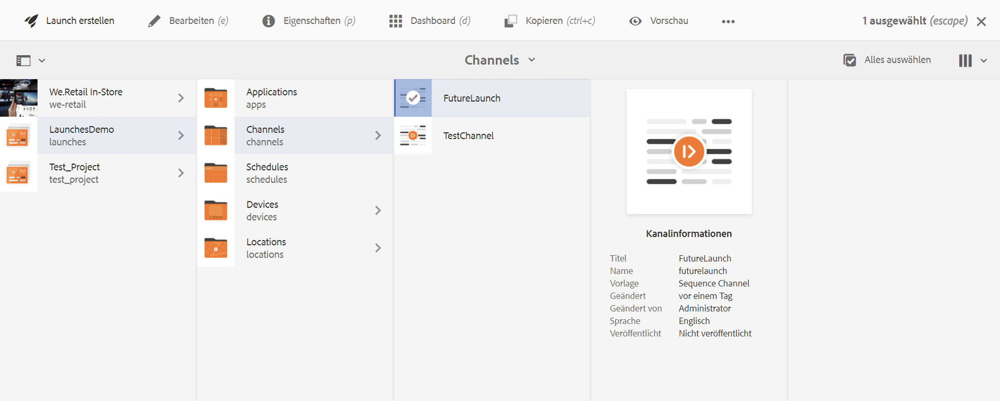
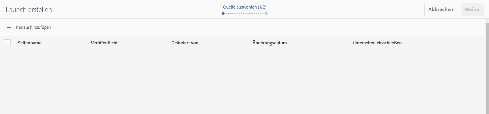
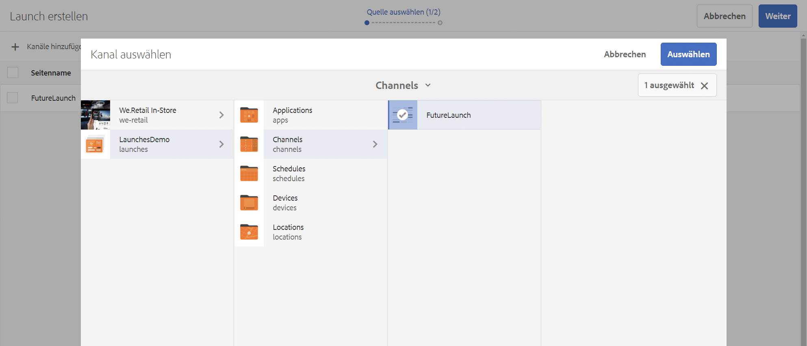
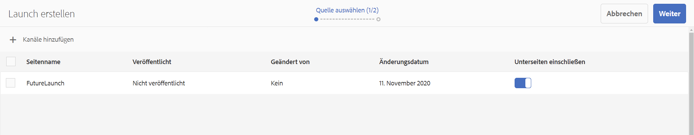
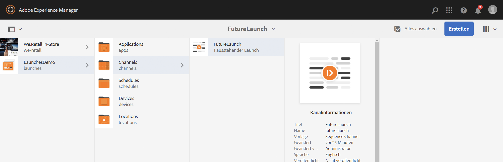
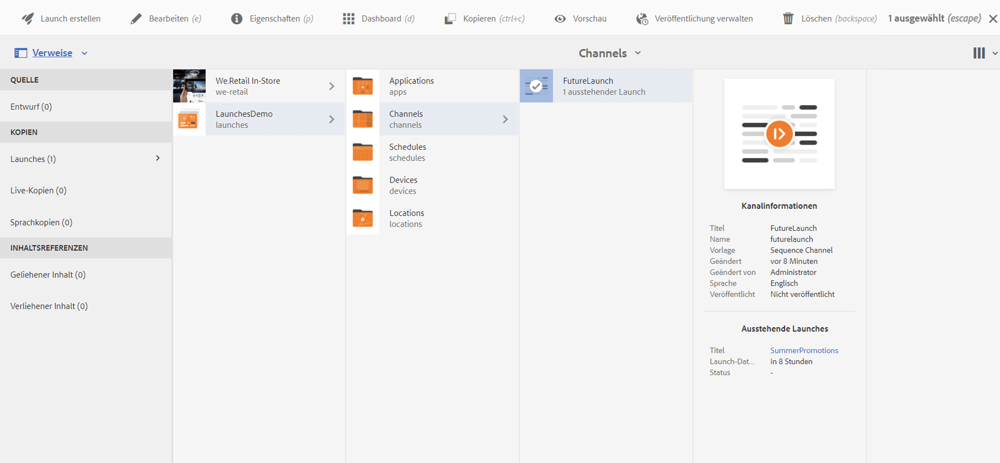
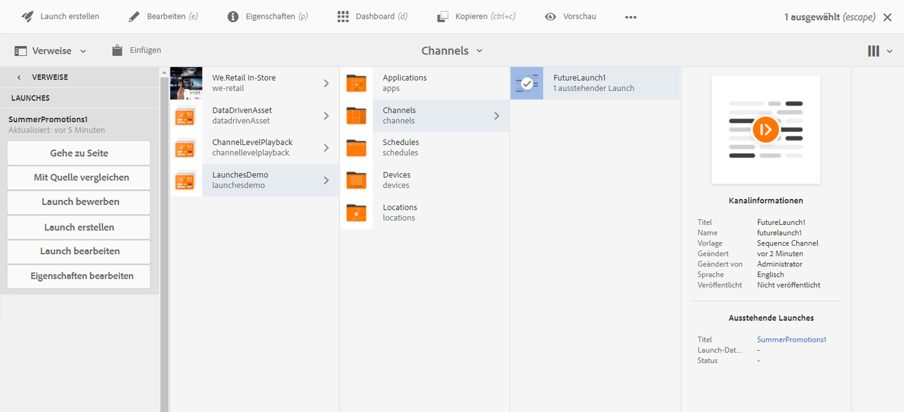
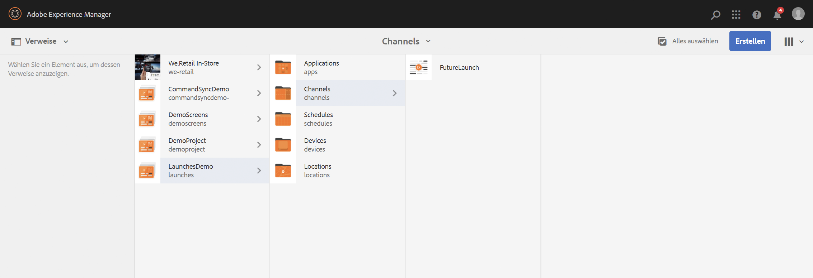

# Launches {#launches}

Autoren von Inhalten können zukünftige Versionen des Kanals (der Kanäle) erstellen, die als **Launch** bezeichnet werden. Wenn Sie das Live-Datum für diesen Launch festlegen, können Inhalte auf Geräten oder Playern live geschaltet werden.

Mithilfe von Launches können Autoren die einzelnen Kanäle im Launch in der Vorschau anzeigen und sollten eine Anfrage zur Überprüfung starten können. Die Gruppe der Genehmigenden erhält eine Benachrichtigung und kann die Anfrage genehmigen oder ablehnen. Wenn das Live-Datum erreicht ist, wird der Inhalt auf den Geräten abgespielt.

Wenn der Autor z. B. zukünftige Versionen von c1, c2 (Kanäle) erstellen möchte, wird ein Launch erstellt und ein Live-Datum festgelegt (z. B. 10. November, 08.00 Uhr). Alle weiteren Aktualisierungen des Inhalts werden zur Überprüfung gesendet. Nach der Genehmigung und am Live-Datum (10. November, 8:00 Uhr) wird der Inhalt bei diesem Launch auf den Geräten oder Playern wiedergegeben.

## Voraussetzungen {#requirements}

Bevor Sie mit der Implementierung von Launches in einem AEM Screens-Projekt beginnen, sollten Sie sich mit dem Konzept der Übergangsphase und ihrer Relevanz vertraut machen.

Im folgenden Abschnitt werden die Übergangsphase und weitere Schritte zur standardmäßigen Konfiguration beschrieben. Sie können auch eine Beispieltestkonfiguration herunterladen, um deren Verwendung zu verstehen.

### Verstehen der Übergangsphase {#understanding-grace-period}

Mit der folgenden Einrichtung kann der Administrator die in Launches erforderliche ***Übergangsphase ***konfigurieren.

Die **Übergangsphase** umfasst:

* Promotion des Launches
* Veröffentlichen der Ressourcen zur Veröffentlichung von Instanzen
* Zeit, die die Geräte zum Herunterladen des Inhalts von der Veröffentlichungsinstanz benötigen, sowie etwaige Zeitunterschiede zwischen Server und Player

Angenommen, der Server befindet sich in PST und die Geräte in EST. Die maximale Zeitdifferenz beträgt in diesem Fall 3 Stunden. Es wird davon ausgegangen, dass die Promotion 1 Minute und die Veröffentlichung vom Autor bis zur Veröffentlichung 10 Minuten dauert und der Player die Ressourcen in der Regel in 10-15 min herunterladen kann. Dann ist Übergangsphase = Zeitunterschied (3 Stunden) + Zeit zum Bewerben des Launches (1 Min.) + Zeit für die Veröffentlichung des Launches (10 Min.) + Zeit zum Herunterladen auf den Player (10-15 Min.) + Puffer (z. B. 30 Min.) = 3 Stunden 56 Min. = 14160 Sekunden. Wann immer wir also einen Launch live planen, beginnt die Promotion um diesen Offset früher. In der obigen Gleichung nehmen die meisten Elemente nicht viel Zeit in Anspruch. Wenn wir den maximalen Zeitunterschied zwischen dem Server und einem Player kennen, können wir einen guten Schätzwert für diesen Offset verwenden.

### Konfigurieren der standardmäßigen Übergangsphase {#configuring-out-of-the-box-grace-period}

Standardmäßig ist die Übergangsphase für einen Launch auf 24 Stunden festgelegt. Das bedeutet, dass die Promotion mit diesem Offset beginnt, wenn wir für jeden Launch der Ressourcen unter */content/screens* ein Live-Datum festlegen. Wenn das Live-Datum beispielsweise auf 24. November, 9.00 Uhr und die Übergangsphase auf 24 Stunden eingestellt sind, beginnt der Promotion-Auftrag am 23. November, 09.00 Uhr.

### Herunterladen von Konfigurationen {#downloading-configurations}

Laden Sie die folgenden Testkonfigurationen herunter:

[Datei laden](assets/launches_event_handlerconfig-10.zip)

>[!NOTE]
>
>Die oben genannte Konfiguration hat in dieser Testkonfiguration 600 Sekunden als Übergangsphase.

#### Aktualisieren der Konfigurationen {#updating-the-configurations}

Wenn Sie die oben beschriebene Konfiguration ändern möchten, gehen Sie wie folgt vor:

* Erstellen Sie die Datei ***sling:OsgiConfig/ nt:file in /apps/system/config ***mit dem Namen**com.adobe.cq.wcm.launches.impl.LaunchesEventHandler.config **und Inhalt

   *launches.eventhandler.updatelastmodification=B&quot;false&quot;
launches.eventhandler.launch.promotion.graceperiod=[&quot;/content/screens(/.*):600&quot;]launches.eventhandler.threadpool.maxsize=I&quot;5&quot;
launches.eventhandler.threadpool.priority=&quot;MIN&quot;*

* `launches.eventhandler.launch.promotion.graceperiod=["/content/screens(/.&#42;):600"`, damit können Sie eine Übergangsphase von 600 Sekunden im Pfad */content/screens* einstellen.

Das bedeutet, dass die Promotion mit diesem Offset beginnt, wenn Sie für jeden Launch der Ressourcen unter */content/screens* ein Live-Datum festlegen. Wenn das Live-Datum beispielsweise auf 24. November, 9.00 Uhr und die Übergangsphase auf 600 Sekunden eingestellt sind, beginnt der Promotion-Auftrag am 24. November, 08:50 Uhr.

## Verwenden von Launches {#using-launches}

Gehen Sie wie folgt vor, um Launches in Ihr AEM Screens-Projekt zu implementieren. Dieser Abschnitt behandelt folgende Themen:

1. **Erstellen eines Launches**
1. **Bearbeiten eines Launches zum Festlegen des Live-Datums und des Umfangs**

### Erstellen eines Launches {#creating-a-launch}

Gehen Sie wie folgt vor, um zukünftige Veröffentlichungsfunktionen in Ihr AEM Screens-Projekt zu implementieren:

1. Navigieren Sie zum Kanal in Ihrem AEM Screens-Projekt, z. B. **LaunchesDemo** --> **Kanäle** --> **FutureLaunch** wie unten dargestellt.

   >[!CAUTION]
   >
   >Sie müssen einen Launch aus einem bereits vorhandenen Kanal in Ihrem AEM Screens-Projekt erstellen.

   

1. Wählen Sie den Kanal **FutureLaunch** aus und klicken Sie auf **Erstellen**. Wählen Sie **Launch** aus dem Dropdown-Menü aus.

   

1. Der Assistent **Launch erstellen** wird geöffnet. Klicken Sie auf **+ Seiten hinzufügen**, um die AEM Screens-Kanäle auszuwählen, für die Sie den Launch erstellen möchten.

   

1. Navigieren Sie zum Kanal und klicken Sie auf **Auswählen**.

   

1. Nachdem Sie die Seite ausgewählt haben, klicken Sie auf **Weiter**, um im Assistenten **Launch erstellen** einen Schritt weiter zu gehen.

   

1. Enter the **Launch Title** as **SummerPromotions** and you do not need to set the **Launch Date**, as shown in the figure below. Klicken Sie auf **Erstellen**.

   >[!NOTE]
   >
   >Wenn Sie die Option **Quellseiten-Livedaten übernehmen** *aktivieren*, können die Kanäle im Launch als Live-Kopien erstellt werden. Wenn Änderungen am ursprünglichen Kanal vorgenommen werden, werden diese Änderungen automatisch auf die Launch-Kanäle angewendet.
   >
   >
   >Durch *Deaktivieren* der Option **Quellseiten-Livedaten übernehmen** können die Kanäle ohne Live-Beziehung in den Launch kopiert werden. Wenn also Änderungen am ursprünglichen Kanal vorgenommen werden, werden diese Änderungen nicht auf die Launch-Kanäle angewendet.

   

   >[!NOTE]
   >
   >Sie können das Live-Launch-Datum in diesem Schritt festlegen oder es später einrichten, während Sie die Eigenschaften des Launches bearbeiten, nachdem er bereits erstellt wurde.

1. Sie sehen, dass Ihr Launch erstellt wurde. Sie können entweder auf **Öffnen** klicken, um die Seiten im Editor anzuzeigen, oder auf **Fertig**, um zu Ihrem Projekt zurückzukehren.

   

   Durch Klicken auf **Fertig** können Sie zurück zu Ihrem **LaunchesDemo**-Projekt navigieren.

   

### Bearbeiten der Launch-Eigenschaften zum Festlegen des Live-Datums und des Umfangs {#editing-the-launch-properties-to-set-the-live-date-and-scope}

Nachdem Sie den Launch erstellt haben, müssen Sie die Launch-Eigenschaften bearbeiten, um das Live-Datum und den Umfang des Launches festzulegen.

Gehen Sie wie folgt vor, um die Eigenschaften für den Launch zu bearbeiten:

1. Navigieren Sie zum Kanal (**FutureLaunch**) und wählen Sie den Kanal aus, wie in der Abbildung unten dargestellt. Öffnen Sie die Leiste **Referenzen** in der linken Seitenleiste.

   >[!NOTE]
   >
   >Select the **Content Tree** option from the left rail to open the launch you created.

   

1. Navigieren Sie zu **Launches** und wählen Sie den von Ihnen erstellten Launch (**SummerPromotions**) aus. Klicken Sie auf **Eigenschaften bearbeiten**.

   

1. Das Launch-Dialogfeld **SummerPromotions** wird geöffnet. Füllen Sie die folgenden Felder aus:

   * Wählen Sie das **Launch-Datum** aus
   * Aktivieren Sie **Produktionsbereit**
   * Wählen Sie **Genehmigte Seiten bewerben** aus **Umfang** aus
   >[!NOTE]
   >
   >Verstehen der Launch-Einträge unter **Automatische Promotion**:

   >    * **Launch-Datum** bezieht sich auf das Live-Datum, d. h. das Datum (und die Uhrzeit), zu dem der Inhalt im Screens-Player gemäß der Zeitzone des Players wiedergegeben wird.
   >    * **Produktionsbereit** ermöglicht die Promotion Kanäle und bedeutet, dass der Launch verwendet werden kann.
   >    * **Umfang** bezieht sich auf die Kanäle, die während eines Launch beworben werden können.

   Die folgenden drei Optionen stehen zur Einrichtung des Umfangs zur Verfügung:
   1. **Vollständigen Launch bewerben**: Alle Kanäle des Launches werden am festgelegten Live-Datum beworben.
   1. **Geänderte Seiten bewerben**: Es werden nur bearbeitete Launch-Ressourcen beworben. Es wird empfohlen, diese Option zu verwenden, wenn keine Launch-Überprüfung erforderlich ist. Dadurch können Änderungen in den Launch-Kanälen beworben werden.
   1. **Genehmigte Seiten bewerben**: Nur genehmigte Seiten werden am festgelegten Live-Datum beworben.
   

   >[!CAUTION]
   >
   >Bei der Promotion des Launches wird die Zeitzone des Players/Geräts und nicht die des Servers berücksichtigt.

1. Klicken Sie auf **Speichern und schließen**, um zurück zum Kanal **FutureLaunch** zu navigieren.

   

