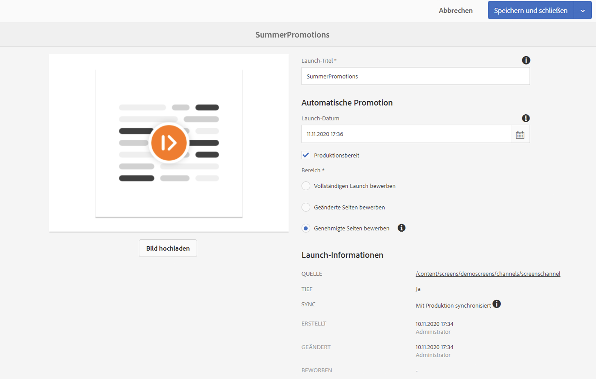

# Launches {#launches}

Autoren von Inhalten können zukünftige Versionen der Kanäle erstellen, die als " **Start** "bezeichnet werden, und durch die weitere Festlegung des Live-Datums für diesen Start können Inhalte auf Geräten oder Playern live geschaltet werden.

Mithilfe von Launches können Autoren die einzelnen Kanäle im Launch in der Vorschau anzeigen und sollten eine Überprüfungsanfrage starten können. Die Gruppe der Genehmiger erhält eine Benachrichtigung und kann die Anforderung genehmigen oder ablehnen. Wenn das Live-Datum erreicht ist, wird der Inhalt auf den Geräten abgespielt.

Wenn der Autor z. B. zukünftige Versionen von c1, c2 (Kanäle) erstellen möchte, wird ein Start erstellt und ein Live-Datum festgelegt (z. B. 10.08.00 Uhr). Alle weiteren Aktualisierungen des Inhalts werden zur Überprüfung gesendet. Nach der Genehmigung und am Live-Datum (10.11.2000) wird der Inhalt bei diesem Start auf den Geräten oder Playern wiedergegeben.

## Voraussetzungen {#requirements}

Bevor Sie mit der Implementierung von Starts in einem AEM Screens-Projekt beginnen, sollten Sie sich mit dem Konzept der Übergangsphase und ihrer Relevanz vertraut machen.

Im folgenden Abschnitt werden die Übergangsphase und weitere Schritte zur vordefinierten Konfiguration beschrieben. Sie können auch eine Beispieltestkonfiguration herunterladen, um deren Verwendung zu verstehen.

### Übergangsphase {#understanding-grace-period}

Mit der folgenden Einrichtung kann der Administrator die in Launches erforderliche ***Übergangsphase*** konfigurieren.

**Übergangsphase** umfasst:

* Förderung der Markteinführung
* Veröffentlichen der Ressourcen zur Veröffentlichung von Instanzen
* von den Geräten benötigte Zeit zum Herunterladen des Inhalts aus der Veröffentlichungsinstanz sowie etwaige Zeitdifferenzen zwischen Server und Player

Nehmen wir beispielsweise an, der Server befindet sich im PST und die Geräte sind im EST, der maximale Zeitunterschied beträgt in diesem Fall 3 Stunden und es wird davon ausgegangen, dass die Promotion 1 Minute dauert und die Veröffentlichung vom Autor 10 Minuten dauert und der Player die Ressourcen in der Regel 10-15 Minuten herunterladen kann. Dann Übergangsphase = Zeitunterschied (3 Stunden) + Zeit für den Start (1 Min.) + Zeit für die Veröffentlichung des Starts (10 Min.) + Zeit zum Herunterladen beim Player (10-15 Min.) + Puffer (z. B. 30 Min.) = 3 Stunden 56 Min. = 14160 Sekunden. Wenn wir also jeden Start live planen, beginnt die Promotion schon früh mit diesem Offset. In der obigen Gleichung, die meisten der Elemente nicht viel Zeit, können wir eine vernünftige Schätzung für diesen Offset, sobald wir die maximale Zeit b/w der Server und jeder Spieler wissen.

### Standardmäßige Übergangsphase konfigurieren {#configuring-out-of-the-box-grace-period}

Standardmäßig ist die Übergangsphase für einen Start auf 24 Stunden festgelegt. Das bedeutet, dass die Promotion mit diesem Offset beginnt, wenn wir für jeden Start der Ressourcen unter */content/screens* ein Live-Datum festlegen. Wenn beispielsweise liveDate auf 24. November, 9.00 Uhr und Übergangsphase auf 24 Stunden eingestellt ist, beginnt der Promotion-Auftrag am 23. November, 09.00 Uhr.

### Herunterladen von Konfigurationen {#downloading-configurations}

Laden Sie die folgenden Testkonfigurationen herunter:

[Datei abrufen](assets/launches_event_handlerconfig-10.zip)

>[!NOTE]
>
>Die oben genannte Konfiguration hat in dieser Testkonfiguration 600 Sekunden als Übergangsphase.

#### Aktualisieren der Konfigurationen {#updating-the-configurations}

Wenn Sie die oben beschriebene Konfiguration ändern möchten, befolgen Sie die folgenden Anweisungen:

* Erstellen Sie die Datei ***sling:OsgiConfig/ nt:file in /apps/system/config*** mit dem Namen **com.adobe.cq.wcm.launches.impl.LaunchesEventHandler.config** und Inhalt

   *launches.eventhandler.updatelastmodification=B"false"launches.eventhandler.launch.promotion.graceperiod=["/content/screens(/.*):600"]launches.eventhandler.threadpool.maxsize=I"5"launches.eventhandler.threadpool.priority="MIN"*

* `launches.eventhandler.launch.promotion.graceperiod=["/content/screens(/.&#42;):600"`können Sie eine Übergangsphase von 600 Sekunden im Pfad */Inhalt/Bildschirm* festlegen.

Das bedeutet, dass die Promotion mit diesem Offset beginnt, wenn Sie für jeden Start der Ressourcen unter */content/screens* ein Live-Datum festlegen. Wenn das Livedatum beispielsweise auf 24. November, 9.00 Uhr und die Übergangsphase auf 600 Sekunden festgelegt ist, beginnt der Promotion-Auftrag am 24. November, 8.50 Uhr.

## Verwenden von Starts {#using-launches}

Gehen Sie wie folgt vor, um Launches in Ihr AEM Screens-Projekt zu implementieren. Dieser Abschnitt behandelt folgende Themen:

1. **Erstellen eines Launches**
1. **Bearbeiten eines Starts zum Festlegen des Live-Datums und des Gültigkeitsbereichs**

### Erstellen eines Launches {#creating-a-launch}

Gehen Sie wie folgt vor, um zukünftige Veröffentlichungsfunktionen in Ihr AEM Screens-Projekt zu implementieren:

1. Navigieren Sie zum Kanal in Ihrem AEM Screens-Projekt, z. B. **LaunchesDemo** —&gt; **Channels** —&gt; **FutureLaunch**, wie unten dargestellt.

   >[!CAUTION]
   >
   >Sie müssen einen Start aus einem bereits vorhandenen Kanal in Ihrem AEM Screens-Projekt erstellen.

   

1. Wählen Sie den Kanal **FutureLaunch** und klicken Sie auf **Erstellen**. Wählen Sie **Start** aus dem Dropdownmenü.

   

1. Der Assistent zum **Erstellen des Startvorgangs** wird geöffnet. Klicken Sie auf **+ Seiten** hinzufügen, um die AEM Screens-Kanäle auszuwählen, für die Sie den Start erstellen möchten.

   

1. Navigieren Sie zum Kanal und klicken Sie auf **Auswählen**.

   

1. Nachdem Sie die Seite ausgewählt haben, klicken Sie auf **Weiter** , um einen Schritt weiter im Assistenten zum **Erstellen des Starts** zu gehen.

   

1. Geben Sie den **Starttitel** als **SummerPromotions** ein, und Sie müssen das Startdatum*** nicht festlegen, wie in der folgenden Abbildung dargestellt. Klicken Sie auf **Erstellen**.

   >[!NOTE]
   >
   >*Wenn Sie die Option "Quelldaten*&#x200B;übernehmen"aktivieren oder aktivieren **, können die Kanäle beim Start als Live-Kopien erstellt werden** . Wenn Änderungen am ursprünglichen Kanal vorgenommen werden, werden diese Änderungen automatisch auf die Startkanäle angewendet.
   >
   >
   >*Durch Deaktivieren oder Deaktivieren* der Option " **Erben von Quelldaten** "können die Kanäle während des Starts ohne Live-Beziehung kopiert werden. Wenn also Änderungen am ursprünglichen Kanal vorgenommen werden, werden diese Änderungen nicht auf Startkanäle angewendet.

   

   >[!NOTE]
   >
   >Sie können das Startdatum in diesem Schritt festlegen oder es später einrichten, während Sie die Eigenschaften des Startvorgangs bearbeiten, nachdem es bereits erstellt wurde.

1. Sie sehen, dass Ihr Start erstellt wurde. Sie können entweder auf **Öffnen** klicken, um die Seiten im Editor anzuzeigen, oder auf **Fertig** klicken, um zu Ihrem Projekt zurückzukehren.

   

   Durch Klicken auf **Fertig** können Sie zurück zu Ihrem **LaunchesDemo** -Projekt navigieren.

   

### Bearbeiten der Launch-Eigenschaften zum Festlegen des Livedatums und des Scope {#editing-the-launch-properties-to-set-the-live-date-and-scope}

Nachdem Sie den Start erstellt haben, müssen Sie die Starteigenschaften bearbeiten, um das Live-Datum auf den Umfang des Starts festzulegen.

Gehen Sie wie folgt vor, um die Eigenschaften für den Start zu bearbeiten:

1. Navigieren Sie zum Kanal (**FutureLaunch**) und wählen Sie den Kanal aus, wie in der Abbildung unten dargestellt. Öffnen Sie die Leiste **Referenzen** von der linken Seitenleiste.

   >[!NOTE]
   >
   >Wählen Sie in der linken Leiste die Option **Inhaltsstruktur **aus, um den von Ihnen erstellten Start zu öffnen.

   

1. Navigieren Sie zu **Starts** und wählen Sie den von Ihnen erstellten Start (**SummerPromotions**) aus. Klicken Sie auf Eigenschaften **bearbeiten**.

   

1. Das Dialogfeld **SummerPromotions** starten wird geöffnet. Füllen Sie die folgenden Felder aus:

   * Wählen Sie das **Startdatum aus**
   * Überprüfen der **Produktionsbereitschaft**
   * Wählen Sie **Genehmigte Seiten** aus dem **Anwendungsbereich bewerben.**
   >[!NOTE]
   >
   >Die Einträge unter " **Automatische Promotion**"unter "Starts":

   >* **Startdatum** bezieht sich auf das Live-Datum, d. h. das Datum/die Uhrzeit, zu dem der Inhalt im Bildschirmplayer gemäß der Zeitzone des Players wiedergegeben wird.
   >
   >
   >    * **Produktionsbereit**, ermöglicht die Förderung der Kanäle und bedeutet, dass der Start bereit ist zu verwenden.

   * **Scope** bezieht sich auf die Kanäle, die während eines Launch beworben werden können.

   Die folgenden drei Optionen stehen zur Einrichtung des Bereichs zur Verfügung:
   1. **Vollständiger Start** fördern: Alle Kanäle des Startvorgangs werden am festgelegten Live-Datum beworben.
   1. **Modifizierte Seiten** bewerben: Es werden nur bearbeitete Startressourcen beworben. Es wird empfohlen, diese Option zu verwenden, wenn die Überprüfung zum Starten nicht erforderlich ist. Dadurch können Änderungen in den Startkanälen gefördert werden.
   1. **Genehmigte Seiten** bewerben: Nur genehmigte Seiten werden am festgelegten Live-Datum beworben.
   

   >[!CAUTION]
   Beim Start der Promotion wird die Zeitzone des Spielers/Geräts und nicht die des Servers berücksichtigt.

1. Klicken Sie auf **Speichern &amp; Schließen** , um zurück zum Kanal **FutureLaunch** zu navigieren.

   

