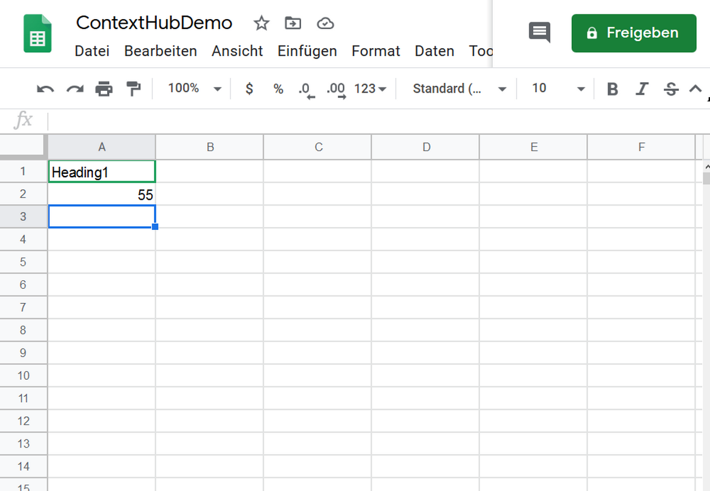
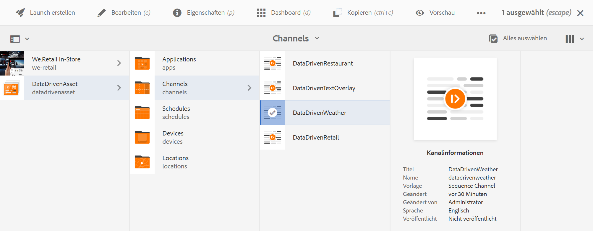
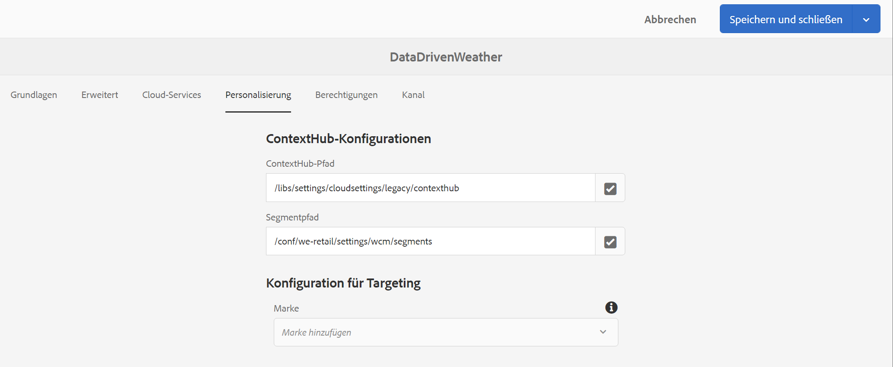

# Temperaturaktivierung für ein Reiseangebot {#travel-center-temperature-activation}

Das folgende Anwendungsbeispiel veranschaulicht die Verwendung der Temperaturaktivierung für ein Reiseangebot anhand der in Google Tabellen angegebenen Werten.

## Beschreibung {#description}

Wenn der Wert in Google-Tabellen für diesen Anwendungsfall unter 50 liegt, wird ein Bild mit heißen Getränken angezeigt. Wenn der Wert größer oder gleich 50 ist, wird ein Bild mit kalten Getränken angezeigt. Wenn ein anderer Wert oder gar kein Wert vorhanden ist, zeigt der Player ein Standardbild an.

## Voraussetzungen {#preconditions}

Bevor Sie mit der Implementierung der lokalen Temperaturaktivierung im Reisezentrum beginnen, sollten Sie wissen, wie Sie ***Datenspeicher***, ***Zielgruppensegmentierung*** und ***Targeting für Kanäle aktivieren*** in einem AEM Screens-Projekt einrichten.

Genaue Informationen dazu finden Sie unter [Konfigurieren von ContextHub in AEM Screens](configuring-context-hub.md).

## Grundlegender Ablauf {#basic-flow}

Gehen Sie wie folgt vor, um das Anwendungsbeispiel für die temperaturgesteuerte Aktivierung eines Reiseangebots zu implementieren:

1. **Ausfüllen der Google Tabellen**

   1. Navigieren Sie zur Google Tabelle „ContextHubDemo“.
   1. Fügen Sie eine Spalte mit **`Heading1`** mit dem entsprechenden Temperaturwert hinzu.

   

1. **Konfigurieren der Segmente in Zielgruppen gemäß den Anforderungen**

   1. Navigieren Sie zu den Segmenten in Ihrer Zielgruppe (siehe ***Schritt 2: Einrichten der Zielgruppensegmentierung*** auf der Seite **[Konfigurieren von ContextHub in AEM Screens](configuring-context-hub.md)**, um mehr zu erfahren).

   1. Klicken Sie auf **Tabellen A1 1** und dann auf **Bearbeiten**.

   1. Klicken Sie auf die Vergleichseigenschaft und dann auf das Konfigurationssymbol.
   1. Klicken Sie auf **googlesheets/value/1/0** aus der Dropdown-Liste in **Eigenschaftsname**.

   1. Wählen Sie für den **Operator** in der Dropdown-Liste **größer oder gleich** aus.

   1. Geben Sie den **Wert** als **50** ein

   1. Wählen Sie nun **Tabellen A1 2** aus und klicken Sie auf **Bearbeiten**.

   1. Klicken Sie auf die Option **Vergleichseigenschaft – Wert** und wählen Sie das Konfigurationssymbol aus.
   1. Klicken Sie auf **googlesheets/value/1/0** aus der Dropdown-Liste in **Eigenschaftsname**.

   1. Wählen Sie für den **Operator** in der Dropdown-Liste **kleiner als** aus

   1. Geben Sie den **Wert** als **50** ein

1. Navigieren Sie zu Ihrem Kanal () und klicken Sie in der Aktionsleiste auf **Bearbeiten**. Im folgenden Beispiel wird ein sequenzieller Kanal **DataDrivenWeather** verwendet, um die Funktionalität zu demonstrieren.

   >[!NOTE]
   >
   >Ihr Kanal sollte bereits über ein Standardbild verfügen und die Zielgruppen sollten vorkonfiguriert sein, wie unter [Konfigurieren von ContextHub in AEM Screens](configuring-context-hub.md) beschrieben.

   

   >[!CAUTION]
   >
   >Ihre **ContextHub**-**Konfigurationen**, die den Kanal auf der Registerkarte **Eigenschaften** > **Personalisierung** verwenden, sollten bereits eingerichtet sein.

   

1. Klicken Sie im Editor auf **Targeting**, wählen Sie danach die **Marke** und die **Aktivität** aus dem Dropdown-Menü und klicken Sie auf **Targeting starten**.

   

1. **Überprüfen der Vorschau**

   1. Klicken Sie auf **Vorschau**. Öffnen Sie außerdem Ihre Google Tabelle und aktualisieren Sie den Wert.
   1. Ändern Sie den Wert in weniger als 50. Sie können das Bild eines kalten Getränks sehen. Wenn der Wert in Google Sheets 50 oder höher ist, sollten Sie ein Bild eines heißen Getränks sehen.

   
