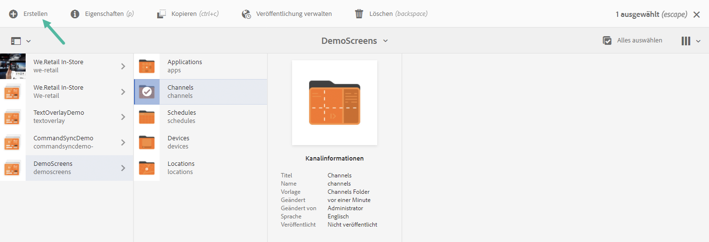
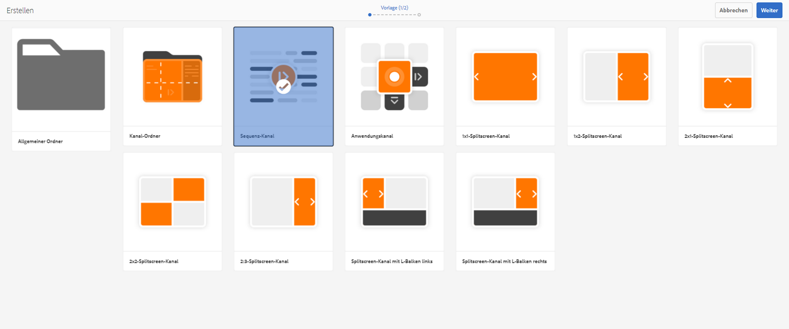
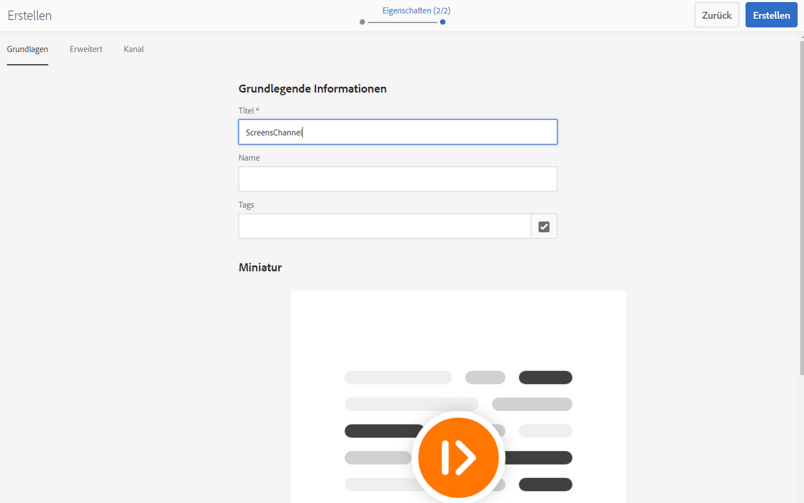
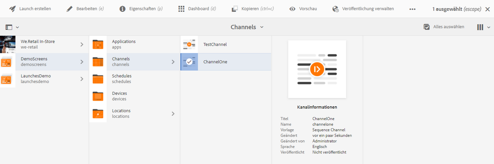
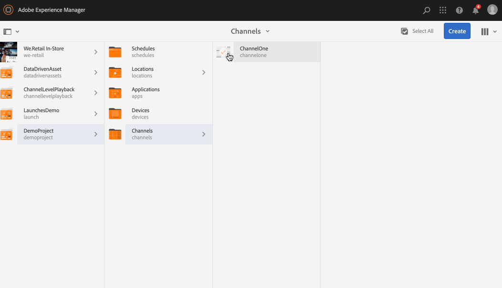
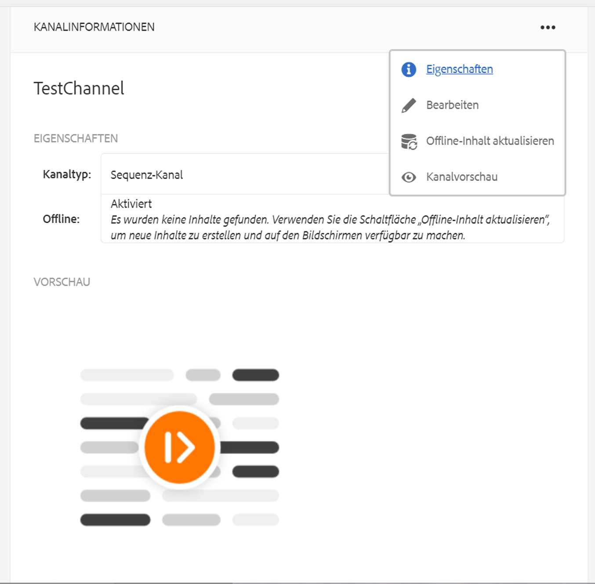
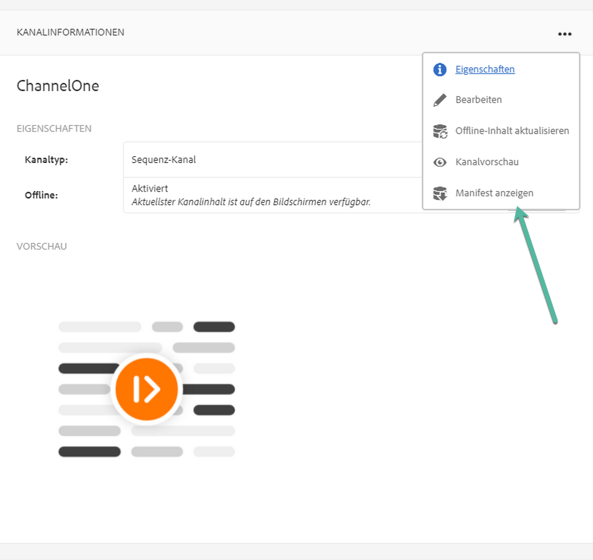
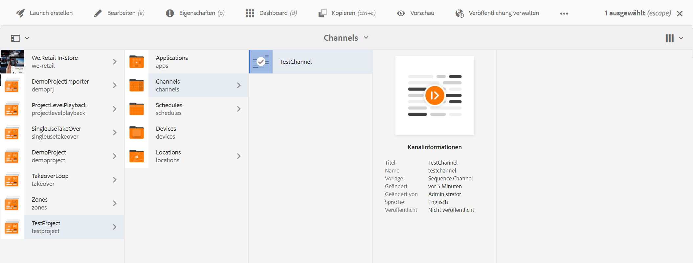
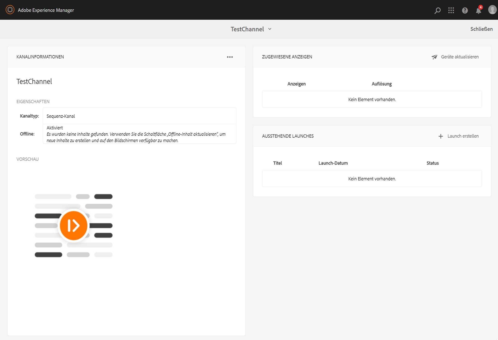
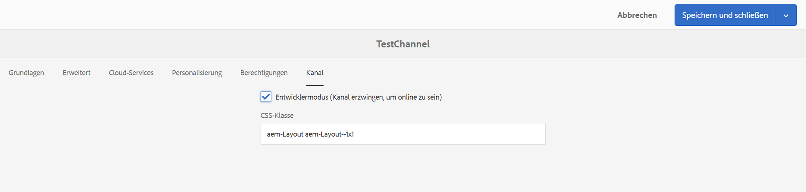

# Erstellen und Verwalten von Kanälen {#creating-and-managing-channels}

Ein Kanal zeigt eine Sequenz von Inhalten (Bilder und Videos) oder eine Website oder Single Page Application an.

Auf dieser Seite wird gezeigt, wie Kanäle für AEM Screens erstellt und verwaltet werden.

**Voraussetzungen**:

* [Konfigurieren und Bereitstellen von Screens](configuring-screens-introduction.md)
* [Erstellen und Verwalten von Screens-Projekten](creating-a-screens-project.md)

## Erstellen von neuen Kanälen {#creating-a-new-channel}

Nachdem Sie Ihr Projekt für AEM Screens erstellt haben, führen Sie die folgenden Schritte aus, um einen Kanal für Ihr Projekt zu erstellen:

1. Wählen Sie den Adobe Experience Manager-Link (oben links) und dann Screens aus. Sie haben auch die Möglichkeit, direkt zur folgenden URL zu wechseln: `https://localhost:4502/screens.html/content/screens`.

1. Navigieren Sie zu Ihrem Screens-Projekt und wählen Sie den Ordner **Kanäle**.

1. Auswählen **Erstellen** in der Aktionsleiste aus.

   

1. Wählen Sie die **Sequenzkanal** Vorlage aus der **Erstellen** Assistent und wählen Sie **Nächste**.

   

1. Geben Sie den Titel als **ScreensChannel** und wählen **Erstellen**.

   

1. Ein Sequenzkanal wird jetzt zu Ihrem **Kanäle** Ordner.

### Kanaltypen {#channel-types}

Beim Verwenden des Assistenten stehen unter anderem die folgenden Vorlagenoptionen zur Verfügung:

| **Vorlagenoption** | **Beschreibung** |
|---|---|
| Kanal-Ordner | Ermöglicht die Erstellung eines Ordners zum Speichern von Kanalsammlungen. |
| Sequenzkanal | Ermöglicht die Erstellung eines Kanals zum sequenziellen Wiedergeben der Komponenten (einzeln in einer Diashow). |
| Anwendungskanal | Ermöglicht die Präsentation Ihrer benutzerdefinierten Webanwendung im Screens-Player. |
| 1x1-Splitscreen-Kanal | Ermöglicht die Anzeige einer Komponente in einem einzigen Bereich. |
| 1x2-Splitscreen-Kanal | Ermöglicht die Anzeige der Assets in zwei Bereichen (horizontal geteilt). |
| 2x1-Splitscreen-Kanal | Ermöglicht die Anzeige der Assets in zwei Bereichen (vertikal geteilt). |
| 2x2-Splitscreen-Kanal | Ermöglicht die Anzeige der Assets in vier Bereichen (horizontal und vertikal in einer Matrix geteilt). |
| 2:3-Splitscreen-Kanal | Ermöglicht die Anzeige der Assets in zwei Bereichen (horizontal geteilt), wobei einer der Bereiche größer ist als der andere. |
| Splitscreen-Kanal mit L-Balken links oder rechts | Ermöglicht es Inhaltsautoren, verschiedene Asset-Typen in entsprechend großen Bereichen anzuzeigen. |

>[!NOTE]
>
>Die Splitscreen-Kanäle teilen die Anzeige in mehrere Bereiche auf, sodass Sie mehrere Erlebnisse gleichzeitig nebeneinander wiedergeben können. Die Erlebnisse können entweder statische Assets/Text oder eingebettete Sequenzen sein.

>[!IMPORTANT]
>
>Nachdem Sie Inhalte erstellt und zu Ihrem Kanal hinzugefügt haben, müssen Sie zunächst einen Ort erstellen und anschließend eine Anzeige erstellen. Weisen Sie diesen Kanal außerdem einer Anzeige zu. Siehe die Ressourcen unten am Ende des Abschnitts .

## Arbeiten mit Kanälen {#working-with-channels}

Sie können Änderungen vornehmen, Eigenschaften und Dashboard anzeigen sowie einen Kanal kopieren, in der Vorschau anzeigen und löschen.

### Hinzufügen/Bearbeiten von Inhalt eines Kanals {#adding-editing-content-to-a-channel}

Um Inhalt in einem Kanal hinzuzufügen oder zu bearbeiten, gehen Sie wie folgt vor:

1. Wählen Sie den Kanal aus, den Sie bearbeiten möchten (wie in der Abbildung oben gezeigt).
1. Auswählen **Bearbeiten** oben links in der Aktionsleiste, damit Sie die Kanaleigenschaften bearbeiten können. Der Editor wird geöffnet, mit dem Sie Assets/Komponenten zu Ihrem Kanal hinzufügen können, den Sie veröffentlichen möchten.

>[!NOTE]
>Sie können Ihrem Kanal Komponenten hinzufügen. Siehe **[Hinzufügen von Komponenten zu Kanälen](adding-components-to-a-channel.md)** für weitere Details.

**Hochladen von Videos in den Kanal**

Gehen Sie wie folgt vor, um Videos in Ihren Kanal hochzuladen:

1. Wählen Sie den Kanal aus, in den Sie das Video hochladen möchten.
1. Auswählen **Bearbeiten** in der Aktionsleiste aus.
1. Wählen Sie im Editor **Videos** unter Assets und ziehen Sie die erforderlichen Videos per Drag-and-Drop.

>[!NOTE]
>Wenn Sie beim Hochladen von Videos in Ihren Kanal auf Probleme stoßen, lesen Sie [Fehlerbehebung beim Arbeiten mit Videos](troubleshoot-videos.md).

### Anzeigen oder Bearbeiten von Eigenschaften eines Kanals {#viewing-properties}

1. Wählen Sie den Kanal aus, den Sie bearbeiten möchten.
1. Auswählen **Eigenschaften** in der Aktionsleiste, damit Sie die Kanaleigenschaften anzeigen/bearbeiten können. Im folgenden Tab können Sie die Optionen ändern.

### Anzeigen des Dashboards {#viewing-dashboard}

1. Wählen Sie den Kanal aus, den Sie bearbeiten möchten.
1. Auswählen **Dashboard** in der Aktionsleiste aus.

### Kanalinformationen {#channel-information}

Im Bedienfeld „Kanalinformationen“ werden die Kanaleigenschaften zusammen mit der Kanalvorschau beschrieben. Darüber hinaus finden Sie dort Informationen dazu, ob der Kanal offline oder online ist.

Wählen Sie die (**...**) aus dem **KANALINFORMATIONEN** Aktionsleiste, damit Sie Eigenschaften anzeigen, den Inhalt bearbeiten oder den Cache (Offline-Inhalt) für den Kanal aktualisieren können.

#### Anzeigen des Manifests {#view-manifest}

Sie können das Manifest vom Kanal-Dashboard aus anzeigen.

>[!IMPORTANT]
>Diese Option ist nur mit AEM 6.4 Feature Pack 8 oder AEM 6.5 Feature Pack 4 verfügbar.

Führen Sie die folgenden Schritte aus, damit Sie diese Option im Kanal-Dashboard aktivieren können:

1. **Kanal auf „Offline“ festlegen**
   1. Wählen Sie den Kanal aus und wählen Sie in der Aktionsleiste **Eigenschaften** aus.
   1. Navigieren Sie zu **Kanal** und deaktivieren Sie **Entwicklermodus (erzwingen, dass der Kanal online ist)** option
   1. Auswählen **Speichern und schließen**
1. **Offline-Inhalt aktualisieren**
   1. Wählen Sie den Kanal aus und wählen Sie in der Aktionsleiste **Dashboard** aus.
   1. Navigieren Sie zu **KANALINFORMATIONEN** Bedienfeld und wählen Sie *...*
   1. Auswählen **Offline-Inhalt aktualisieren**

Jetzt sollten Sie im Kanal-Dashboard im Dialogfeld **KANALINFORMATIONEN** die Option **Manifest anzeigen** sehen.

### Online- und Offline-Kanäle {#online-and-offline-channels}

>[!NOTE]
>Wenn Sie einen Kanal erstellen, ist der Kanal standardmäßig offline.

Wenn Sie einen Kanal erstellen, kann er entweder als Online- oder als Offline-Kanal definiert werden.

Ein ***Online-Kanal*** zeigt den aktualisierten Inhalt in der Echtzeit-Umgebung an, während eine ***Offline-Kanal*** zeigt den zwischengespeicherten Inhalt an.

Gehen Sie wie folgt vor, um den Kanal online zu schalten:

1. Navigieren Sie zum Kanal als **TestProject** > **Kanäle** > **TestChannel**.

   Wählen Sie den Kanal aus. 

   

   Auswählen **Dashboard** in der Aktionsleiste, damit Sie den Status des Players anzeigen können. Im Fenster **KANALINFORMATIONEN** wird angezeigt, ob der Kanal online oder offline ist.

   

1. Auswählen **Eigenschaften** von der Aktionsleiste aus und navigieren Sie zum **Kanal** wie unten gezeigt:

   

1. Aktivieren Sie den **Entwicklermodus** **(erzwingen, dass der Kanal online ist)**, um den Kanal in den Online-Modus zu schalten.

   Auswählen **Speichern und schließen** , um Ihre Option zu speichern.

   

   Navigieren Sie zurück zum Kanal-Dashboard. Das Bedienfeld **KANALINFORMATIONEN** zeigt jetzt an, dass der Player online ist.

   

>[!NOTE]
>Um den Kanal erneut als offline zu konfigurieren, deaktivieren Sie die Option Entwicklermodus in der **Eigenschaften** Registerkarte (wie in Schritt (3) gezeigt). Dann aus dem **KANALINFORMATIONEN** Bedienfeld auswählen **Offline-Inhalt aktualisieren**, wie in der folgenden Abbildung dargestellt.

#### Automatische oder manuelle Aktualisierungen über das Geräte-Dashboard {#automatic-versus-manual-updates-from-the-device-dashboard}

In der folgenden Tabelle werden die Ereignisse im Zusammenhang mit automatischen und manuellen Aktualisierungen über das Geräte-Dashboard zusammengefasst.

<table>
 <tbody>
  <tr>
   <td><strong>Ereignis</strong></td>
   <td><strong>Automatische Geräteaktualisierung</strong></td>
   <td><strong>Manuelle Geräteaktualisierung</strong></td>
  </tr>
  <tr>
   <td>Änderung am Online-Kanal</td>
   <td>Inhalt automatisch aktualisiert</td>
   <td>
Inhalt aktualisiert über „Gerät: Push-Konfiguration“
 
Oder
 
Inhalt aktualisiert über <strong><i>Gerät: Neustart</i></strong>
 </td>
  </tr>
  <tr>
   <td>Änderung am Offline-Kanal, aber „Push-Inhalt“ wird für den Kanal NICHT ausgelöst (keine Neuerstellung des Offline-Pakets)</td>
   <td>Keine Aktualisierung des Inhalts</td>
   <td>Keine Aktualisierung des Inhalts</td>
  </tr>
  <tr>
   <td>Änderung am Offline-Kanal und „Push-Inhalt“ wird für den Kanal ausgelöst (neues Offline-Paket)</td>
   <td>Inhalt automatisch aktualisiert</td>
   <td>
Inhalt aktualisiert über <strong><i>Gerät: Push-Konfiguration</i></strong>
 
Oder
 
Inhalt aktualisiert über <strong><i>Gerät: Neustart</i></strong>
 </td>
  </tr>
  <tr>
   <td>
Änderung an Konfiguration

    <ul>
     <li>Anzeige (erzwungener Kanal)</li>
     <li>Gerät</li>
     <li>Kanalzuweisungen (neuer Kanal, entfernter Kanal)</li>
     <li>Kanalzuweisung (Rolle, Ereignis, Planung)</li>
    </ul> </td>
   <td>Konfiguration automatisch aktualisiert</td>
   <td>
Konfiguration aktualisiert über <strong><i>Gerät: Push-Konfiguration</i></strong>
 
Oder
 
Konfiguration aktualisiert über <strong><i>Gerät: Neustart</i></strong>
 </td>
  </tr>
 </tbody>
</table>

### Zugewiesene Anzeigen {#assigned-displays}

Die **Zugewiesene Anzeigen** zeigt die mit dem Kanal verknüpfte Anzeige an. Er liefert eine Momentaufnahme der zugewiesenen Anzeige zusammen mit der Auflösung.

Die zugehörigen Anzeigen werden im **Zugewiesene Anzeigen** -Bedienfeld, wie unten dargestellt:

>[!NOTE]
>Weitere Informationen zum Erstellen einer Anzeige an einem Standort finden Sie unter:
>
>* [Erstellen und Verwalten von Standorten](managing-locations.md)
>* [Erstellen und Verwalten von Anzeigen](managing-displays.md)
>

Wählen Sie außerdem die Anzeige im **ZUGEWIESENE ANZEIGEN** -Bedienfeld, um die Anzeigeinformationen anzuzeigen, wie unten dargestellt:

### Die nächsten Schritte {#the-next-steps}

Der nächste Schritt nach der Erstellung eines Kanals und dem Hinzufügen/Bearbeiten von Inhalten in Ihrem Kanal besteht darin, zu erfahren, wie Sie einen Ort und eine Anzeige erstellen. Weisen Sie dann dieser Anzeige einen Kanal zu.

Die nächsten Schritte finden Sie in den folgenden Ressourcen:

* [Erstellen und Verwalten von Kanälen](managing-channels.md)
* [Erstellen und Verwalten von Standorten](managing-locations.md)
* [Erstellen und Verwalten von Anzeigen](managing-displays.md)
