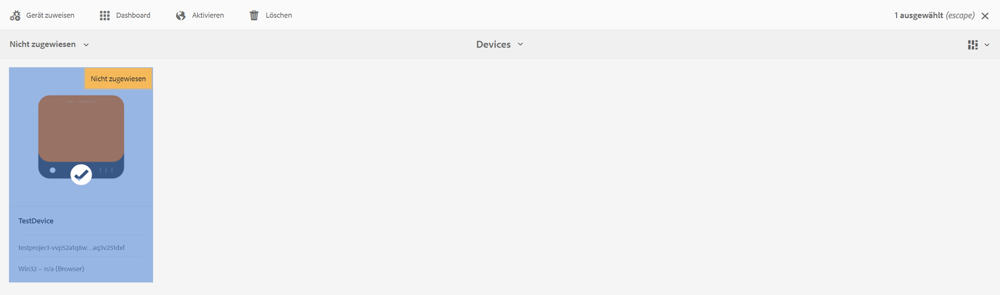
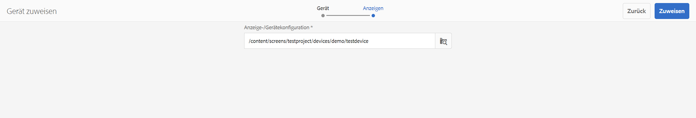
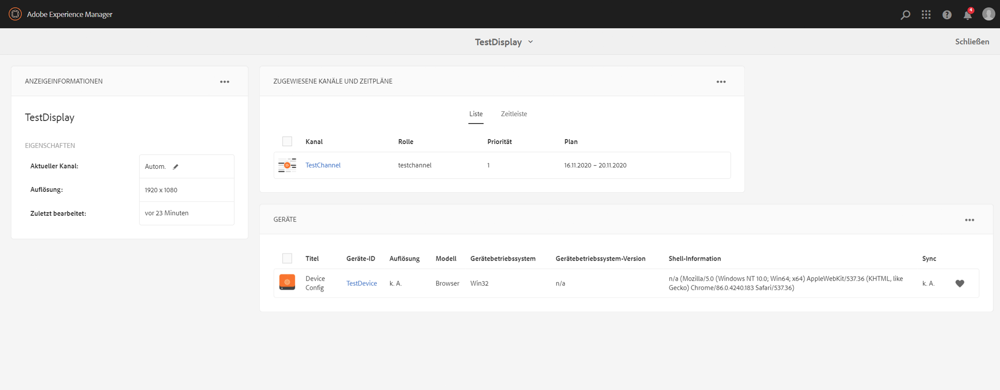
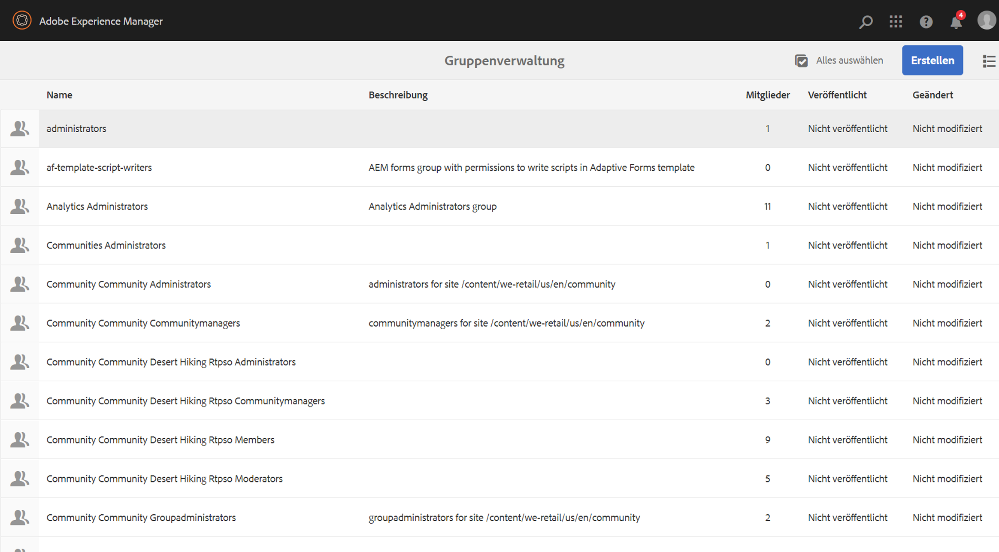

# Verwalten von Geräten {#managing-devices}

Auf dieser Seite wird die Gerätezuweisung beschrieben.

Die Gerätekonsole erlaubt es Ihnen, auf den Geräte-Manager zuzugreifen, um Ihr Gerät einer Anzeige zuzuweisen.

>[!CAUTION]
>
>Registrieren Sie das Gerät, bevor Sie es zuweisen. Siehe [Geräteregistrierung](device-registration.md).

## Gerätezuweisung {#device-assignment}

Gehen Sie wie folgt vor, um ein Gerät einer Anzeige zuzuweisen:

1. Navigieren Sie zum Ordner „Geräte“ Ihres Projekts, z. B.

   `http://localhost:4502/screens.html/content/screens/TestProject`

   

1. Klicken Sie auf den Ordner **Geräte** und dann in der Aktionsleiste auf **Geräte-Manager**. Die zugewiesenen und nicht zugewiesenen Geräte werden angezeigt.

   

1. Klicken Sie auf ein nicht zugewiesenes Gerät in der Liste und dann in der Aktionsleiste auf **Gerät zuweisen**.

   

1. Klicken Sie in der Liste auf die Anzeige, die dem Gerät zugewiesen werden soll, und dann auf **Zuweisen**.

   

1. Klicken Sie auf **Beenden**, um die Zuweisung abzuschließen.

   Das Anzeigen-Dashboard zeigt das zugewiesene Gerät im Bedienfeld **GERÄTE** an.

   

   Klicken Sie oben rechts im Bedienfeld **GERÄTE** auf die Auslassungspunkte (**…**), um entweder eine Gerätekonfiguration hinzuzufügen oder die Geräte zu aktualisieren.

   

>[!NOTE]
>
>Jedes Mal, wenn das erste Gerät zu einem neuen Screens-Projekt hinzugefügt wird, wird eine Benutzergruppe erstellt.
>>Wenn der Projektknotenname zum Beispiel *we-retail* lautet, dann lautet der Benutzergruppenname *screens-we-retail-devices*.
>>Diese Gruppe wird als Mitglied der Gruppe der **Mitwirkenden** hinzugefügt, wie in der folgenden Abbildung dargestellt:

### Die nächsten Schritte {#the-next-steps}

Nachdem Sie nun damit vertraut sind, wie ein Kanal einer Anzeige zugewiesen wird, fahren Sie mit dem Thema [Überwachung und Fehlerbehebung](monitoring-screens.md) fort.
