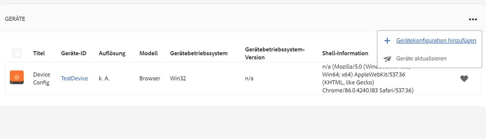

# Verwalten von Geräten {#managing-devices}

Auf dieser Seite wird die Gerätezuweisung beschrieben.

Über die Gerätekonsole können Sie auf den Geräte-Manager zugreifen, um Ihr Gerät einer Anzeige zuzuweisen.

>[!CAUTION]
>
>Bevor Sie Ihr Gerät zuweisen, registrieren Sie es. Siehe [Geräteregistrierung](device-registration.md).

## Gerätezuweisung {#device-assignment}

Gehen Sie wie folgt vor, um ein Gerät einer Anzeige zuzuweisen:

1. Navigieren Sie zum Ordner „Geräte“ Ihres Projekts, z. B.

   `http://localhost:4502/screens.html/content/screens/TestProject`

   

1. Klicken Sie auf **Geräte** Ordner und klicken Sie auf **Geräte-Manager** in der Aktionsleiste. Die zugewiesenen und nicht zugewiesenen Geräte werden angezeigt.

   

1. Klicken Sie auf ein nicht zugewiesenes Gerät in der Liste und klicken Sie auf das **Gerät zuweisen** in der Aktionsleiste.

   

1. Klicken Sie in der Liste auf die Anzeige, der Sie das Gerät zuweisen möchten, und klicken Sie auf die **Zuweisen**.

   

1. Klicken Sie auf **Beenden** , um den Zuweisungsprozess abzuschließen.

   Das Anzeigen-Dashboard zeigt das zugewiesene Gerät im Bedienfeld **GERÄTE** an.

   

   Klicken Sie auf (**...**) oben rechts im **Geräte** -Bedienfeld, um entweder die Gerätekonfiguration hinzuzufügen oder die Geräte zu aktualisieren.

   

>[!NOTE]
>
>Jedes Mal, wenn das erste Gerät zu einem neuen Screens-Projekt hinzugefügt wird, wird eine Benutzergruppe erstellt.
>Wenn der Projektknotenname zum Beispiel *we-retail* lautet, dann lautet der Benutzergruppenname *screens-we-retail-devices*.
>Diese Gruppe wird als Mitglied der **Mitarbeiter** -Gruppe, wie in der folgenden Abbildung dargestellt:

### Die nächsten Schritte {#the-next-steps}

Wenn Sie mit dem Zuweisen eines Kanals zu einer Anzeige vertraut sind, lesen Sie[Überwachung und Fehlerbehebung](monitoring-screens.md).
