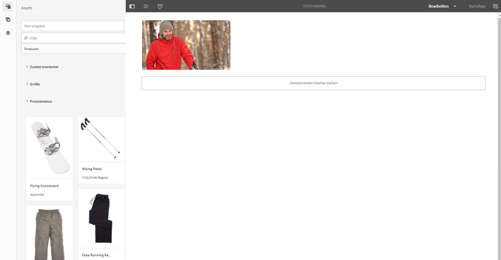
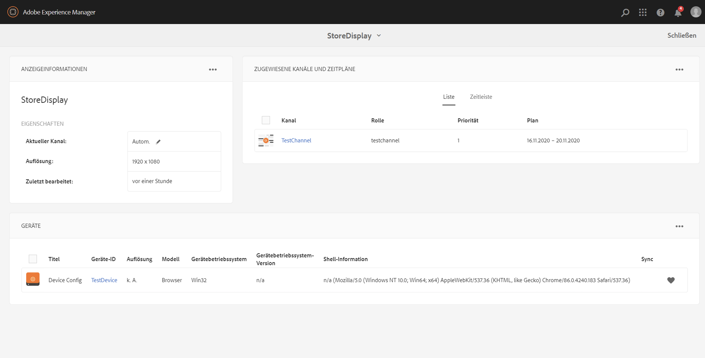
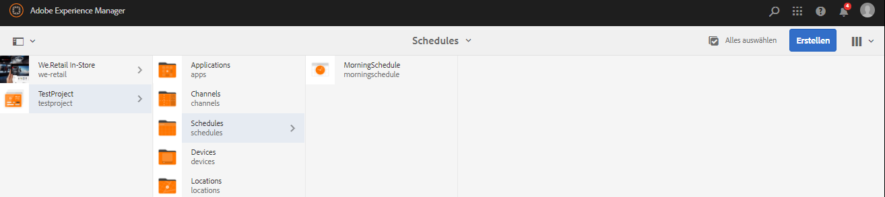

# Erstellen und Verwalten von Anzeigen {#creating-and-managing-displays}

Eine Anzeige ist eine virtuelle Gruppierung von Bildschirmen, die nebeneinander angeordnet sind. Die Installation einer Anzeige ist permanent. Sie ist das Objekt, mit dem Inhaltsautorinnen und Inhaltsautoren arbeiten und das sie immer als logische und nicht als physische Anzeige verstehen.

Wenn Sie einen Standort erstellen, müssen Sie eine Anzeige für Ihren Standort erstellen.

Auf dieser Seite wird gezeigt, wie Anzeigen für Screens erstellt und verwaltet werden.

**Voraussetzungen**:

* [Konfigurieren und Bereitstellen von Screens](configuring-screens-introduction.md)
* [Erstellen und Verwalten von Screens-Projekten](creating-a-screens-project.md)
* [Erstellen und Verwalten von Kanälen](managing-channels.md)
* [Erstellen und Verwalten von Standorten](managing-locations.md)

## Erstellen einer neuen Anzeige {#creating-a-new-display}

>[!NOTE]
>
>Erstellen Sie einen Standort, bevor Sie eine Anzeige erstellen.  Weitere Informationen finden Sie unter [Erstellen und Verwalten von Standorten](managing-locations.md).

1. Navigieren Sie zum entsprechenden Standort, z. B. `http://localhost:4502/screens.html/content/screens/TestProject`.
1. Wählen Sie Ihren Standortordner und klicken Sie neben dem Pluszeichen in der Aktionsleiste auf **Erstellen**.
1. Klicken Sie im Assistenten **Erstellen** auf die Option **Anzeige** und dann auf **Weiter**.
1. Geben Sie den **Namen** und **Titel** für Ihren Anzeigeort ein.
1. Wählen Sie auf der Registerkarte **Anzeige** die Details für das Layout aus. Wählen Sie die gewünschte **Auflösung** (z. B. **Full HD**) aus. Wählen Sie die Anzahl der Geräte horizontal und vertikal aus.
1. Klicken Sie auf **Erstellen**.

Die Anzeige (*StoreDisplay*) wird erstellt und dem Standort (*SanJose*) hinzugefügt.

Wenn Sie die Anzeige positioniert haben, besteht der nächste Schritt darin, für die Anzeige eine Gerätekonfiguration zu erstellen.

>[!NOTE]
>
>**Der nächste Schritt**:
>
>Wenn Sie eine Anzeige für einen Ort erstellen, müssen Sie Ihrer Anzeige einen Kanal zuweisen, um den Inhalt verwenden zu können.
>
>Informationen zum Zuweisen eines Kanals zu der Anzeige finden Sie unter [Zuweisen von Kanälen](channel-assignment.md).

## Erstellen einer neuen Gerätekonfiguration {#creating-a-new-device-config}

Eine Gerätekonfiguration fungiert als Platzhalter für ein Digital-Signage-Gerät, das noch nicht installiert ist.

1. Navigieren Sie zur entsprechenden Anzeige, z. B. `http://localhost:4502/screens.html/content/screens/TestProject/locations/newlocation`.
1. Klicken Sie auf Ihren Anzeigenordner und dann in der Aktionsleiste auf **Dashboard anzeigen**.
1. Klicken Sie in der oberen rechten Ecke des Bedienfelds **Geräte** auf die Option **+ Gerätekonfiguration hinzufügen**.

1. Klicken Sie auf **Gerätekonfiguration** als erforderliche Vorlage und klicken Sie auf **Weiter**.

1. Geben Sie die entsprechenden Eigenschaften ein und klicken Sie auf **Erstellen**.

Die Gerätekonfiguration wird erstellt und der aktuellen Anzeige hinzugefügt. (In der folgenden Demonstration ist *DeviceConfig* die neue Gerätekonfiguration.)

>[!NOTE]
>
>Nach der Erstellung der Gerätekonfiguration für Ihre Anzeige am Standort besteht der nächste Schritt darin, Ihrer Anzeige einen Kanal zuzuweisen.
>
>Wie in der folgenden Abbildung gezeigt, wird die Gerätekonfiguration im Bedienfeld **GERÄTE** als nicht zugewiesen angezeigt, wenn der Gerätekonfiguration kein Kanal zugewiesen ist.
>
>Sie sollten Vorkenntnisse im Erstellen und Verwalten von Kanälen haben.  Weitere Informationen finden Sie unter [Erstellen und Verwalten von Kanälen](managing-channels.md).

## Anzeigen-Dashboard {#display-dashboard}

Das Anzeigen-Dashboard bietet verschiedene Bedienfelder zum Verwalten von Anzeigegeräten. Sie können darüber außerdem Ihr Gerät konfigurieren.

>[!NOTE]
>
>Sie können auf die Dashboard-Listen klicken und Massenaktionen für Elemente auslösen, statt jedes einzelne Element durchzugehen.
>
>Beispielsweise zeigt die folgende Abbildung, wie Sie im Anzeigen-Dashboard auf mehrere Kanäle klicken können.

### Bedienfeld „Anzeigeinformationen“ {#display-information-panel}

Im Bedienfeld **ANZEIGEINFORMATIONEN** werden die Anzeigeeigenschaften angezeigt.

Klicken Sie oben rechts im Bedienfeld **ANZEIGEINFORMATIONEN** auf die Auslassungspunkte (**...**), um die Eigenschaften der Anzeige anzuzeigen und die Anzeige in einer Vorschau darzustellen.

#### Anzeigen von Eigenschaften {#viewing-properties}

Klicken Sie auf **Eigenschaften**, um die Eigenschaften Ihrer Anzeige anzuzeigen oder zu ändern.

Außerdem können Sie den Wert des Ereignis-Timers für Ihren interaktiven Kanal auf der Registerkarte **Anzeige** einstellen. Der Standardwert ist auf *300 Sekunden* eingestellt.

Verwenden Sie **CRXDE Lite**, um auf die Eigenschaft **idleTimeout** zuzugreifen: `http://localhost:4502/crx/de/index.jsp#/content/screens/we-retail/locations/demo/flagship/single/jcr%3Acontent/channels`.

### Bedienfeld „Zugewiesene Kanäle“ {#assigned-channels-panel}

Das Bedienfeld **ZUGEWIESENE KANÄLE** zeigt die zugewiesenen Kanäle des Geräts an.

### Bedienfeld „Geräte“ {#devices-panel}

Das Bedienfeld **GERÄTE** bietet Informationen zu den Gerätekonfigurationen.

Klicken Sie oben rechts im Bedienfeld **GERÄTE** auf die Auslassungspunkte (**…**), um Gerätekonfigurationen hinzuzufügen und Geräte zu aktualisieren.

Zudem können Sie auf die Gerätekonfiguration klicken, um Eigenschaften anzuzeigen, ein Gerät zuzuweisen oder ein Gerät komplett zu löschen.

#### Die nächsten Schritte {#the-next-steps}

Wenn Sie eine Anzeige für Ihren Standort erstellt haben, weisen Sie Ihrer Anzeige einen Kanal zu.

Weitere Informationen finden Sie unter [Zuweisen von Kanälen](channel-assignment.md).
