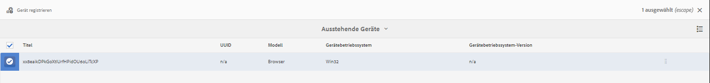
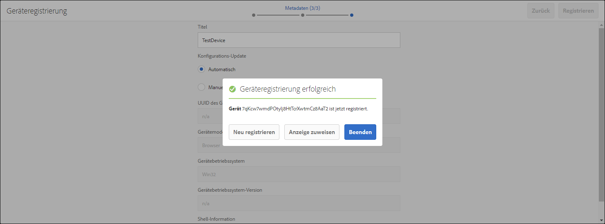
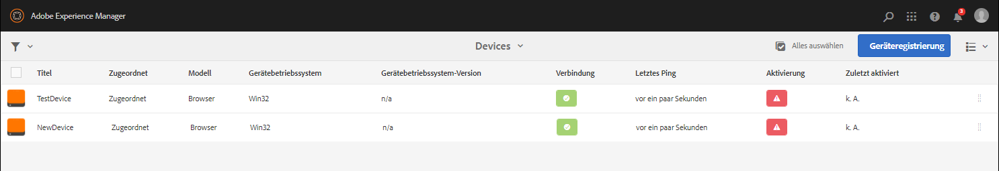
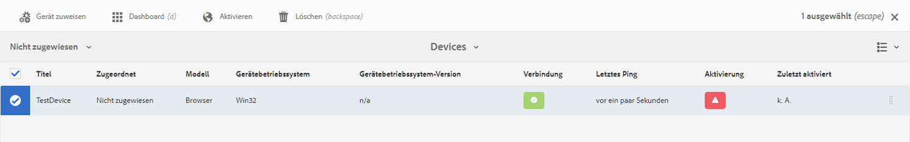
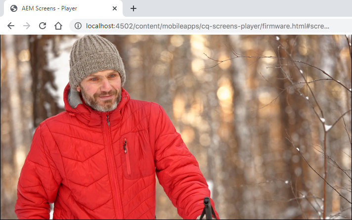
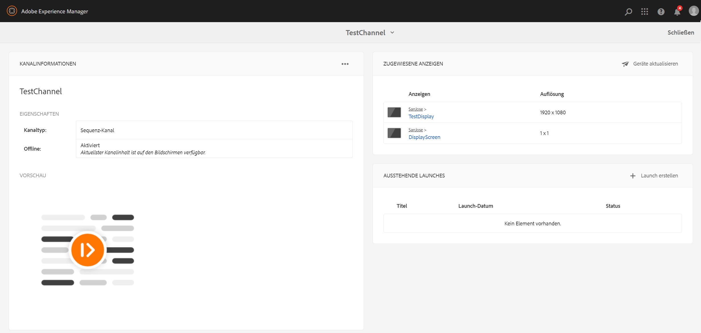

# Erstellen und Verwalten einer Live Copy {#creating-and-managing-a-live-copy}

Auf dieser Seite wird beschrieben, wie Live Copies von Kanälen erstellt und verwaltet werden.

Eine ***Live Copy*** ist eine Kopie spezifischer Site-Inhalte, für die eine Live-Beziehung zur ursprünglichen Quelle beibehalten wird. Durch diese Live-Beziehung kann die Live Copy Inhalts- und Seiteneigenschaften der Quelle übernehmen.

Auf dieser Seite wird beschrieben, wie eine Live Copy eines Kanals erstellt wird, Eigenschaften angezeigt werden, der Status überprüft und Änderungen von einem Kanal auf dessen Live Copy übertragen werden.

## Erstellen von Live Copies {#creating-a-live-copy}

Gehen Sie wie folgt vor, um eine Live Copy eines Kanals in Ihrem Projektordner zu erstellen.

1. Wählen Sie den Adobe Experience Manager-Link (oben links) und dann **Screens** aus. Sie haben auch die Möglichkeit, direkt zu `http://localhost:4502/screens.html/content/screens` zu wechseln.

1. Navigieren Sie zum Screens-Projekt und klicken Sie auf **Kanäle**.
1. Klicken Sie auf **Erstellen** und wählen Sie **Live Copy** aus, um eine Live Copy des Kanals zu erstellen.
1. Wählen Sie das Ziel aus und klicken Sie auf **Weiter**.
1. Wählen Sie den Speicherort aus, an dem die Live Copy gespeichert werden soll.
1. Geben Sie auf der Seite **Live Copy erstellen** den **Titel** und den **Namen** ein.

1. Klicken Sie auf **Öffnen**, um den Inhalt der neuen Live Copy anzuzeigen, oder auf **Fertig**, um zur Hauptseite zurückzukehren.

Sie können auch die folgenden Schritte ausführen, um zu sehen, wie Sie eine neue Live Copy eines Kanals erstellen.

Im folgenden Beispiel wird gezeigt, wie eine Live Copy (***IdleLiveCopy***) für ***Idle Channel*** (inaktiver Kanal) mit dem Zielordner ***Kanäle*** erstellt wird.

## Anzeigen des Inhalts des Live Copy-Kanals {#viewing-content-of-the-live-copy-channel}

Eine Live Copy ist eine Kopie eines Kanals, der bereits vorhanden ist.

Um den Inhalt einer Live Copy anzuzeigen, gehen Sie wie folgt vor:

1. Navigieren Sie zum Screens-Projekt und klicken Sie auf den Speicherort, an dem Sie die Live Copy ursprünglich erstellt haben, wie im obigen Abschnitt gezeigt. (Hier wurde als Speicherort der Ordner **Kanäle** gewählt.)

   

1. Klicken Sie in der Aktionsleiste auf **Erstellen**. 

   

   >[!NOTE]
   >
   >Wenn Sie Inhalte für einen Live Copy-Kanal anzeigen, sehen Sie im Menü das zusätzliche Element **Live Copy-Status**. Weitere Informationen finden Sie im folgenden Abschnitt.

### Anzeigen der Eigenschaften einer Live Copy {#viewing-properties-of-a-live-copy}

Außerdem können Sie die Eigenschaften Ihres Live Copy-Kanals anzeigen.

1. Navigieren Sie zu Ihrem Live Copy-Kanal und klicken Sie in der Aktionsleiste auf **Eigenschaften**.

   

1. Wählen Sie die Registerkarte **Live Copy** aus, um Details zu Ihrem Kanal anzuzeigen.

   

### Live Copy-Status {#live-copy-status}

Der in der folgenden Abbildung dargestellte Modus **Live Copy-Status** ermöglicht es Ihnen, den Beziehungsstatus aller Assets im Kanal anzuzeigen.

1. Klicken Sie auf **Bearbeiten**, um den **Live Copy-Status** auszuwählen. Sie können auch die Zuordnung des Kanalinhalts zum ursprünglichen Kanal anzeigen, aus dem die Live Copy erstellt wurde.

   

1. Wählen Sie **Live Copy-Status** aus, um die Vorschauseite anzuzeigen.

   Bei allen Ressourcen mit grünem Rand wurde der Inhalt des ursprünglichen Kanals übernommen.

   

### Aufheben der Vererbung {#breaking-the-inheritance}

Sie können auch die Vererbung der Live Copy aufheben, sodass der Inhalt von der ursprünglichen Verzweigung unabhängig wird.

Das folgende Beispiel zeigt, wie Sie das Bild im Modus „Bearbeiten“ auswählen und oben rechts auf das Symbol zum Aufheben der Vererbung klicken.

### Übertragen der Änderungen auf den Live Copy-Kanal {#propagating-changes-to-the-live-copy-channel}

Wenn Sie Änderungen oder Aktualisierungen am ursprünglichen Kanal vornehmen, müssen Sie diese Änderungen auch auf Ihren Live Copy-Kanal übertragen.

Führen Sie die folgenden Schritte aus, um sicherzustellen, dass Ihre Änderungen vom ursprünglichen Kanal auf den Live Copy-Kanal übertragen werden:

1. Wählen Sie den ursprünglichen Kanal (***Idle Channel*** (inaktiver Kanal)) aus und klicken Sie in der Aktionsleiste auf **Bearbeiten**.

   

1. Bearbeiten Sie den Kanalinhalt.  Löschen Sie beispielsweise ein Bild aus diesem Kanal.

   

1. Wählen Sie die Live Copy des Kanals (***IdleLiveCopy***) aus und klicken Sie in der Aktionsleiste auf **Bearbeiten**. Beachten Sie, dass das von Ihnen gelöschte Bild noch in der Live Copy sichtbar ist.

   Um die Änderungen zu übertragen, müssen Sie den Kanal synchronisieren.

   

1. Um Änderungen in den Live Copy-Kanal zu übertragen, navigieren Sie zum AEM-Dashboard. Wählen Sie dann den Live Copy-Kanal aus und klicken Sie in der Aktionsleiste auf **Eigenschaften**.

   

1. Klicken Sie auf die Registerkarte **Live Copy** und klicken Sie in der Aktionsleiste auf **Synchronisieren**.

   

1. Klicken Sie auf **Synchronisieren** und dann auf **Speichern und schließen**, um zum AEM-Dashboard zurückzukehren.

   

   Beachten Sie, dass das Bild jetzt auch aus dem Live Copy-Kanal gelöscht ist.
