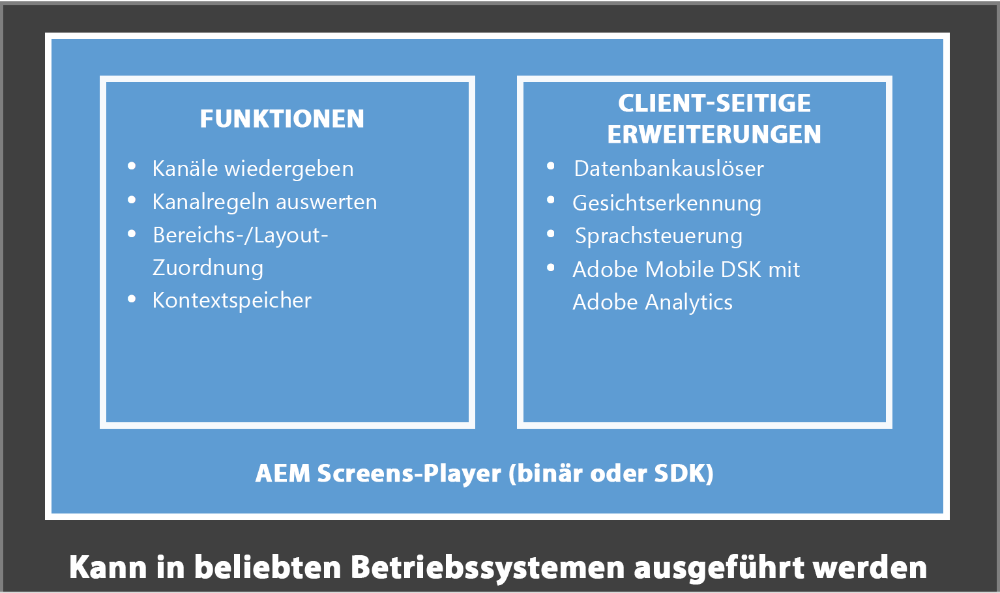

# Erstellen und Verwalten einer Live Copy {#creating-and-managing-a-live-copy}

Auf dieser Seite wird beschrieben, wie Live Copies von Kanälen erstellt und verwaltet werden.

Eine ***Live Copy*** ist eine Kopie spezifischer Site-Inhalte, für die eine Live-Beziehung zur ursprünglichen Quelle beibehalten wird. Durch diese Live-Beziehung kann die Live Copy Inhalts- und Seiteneigenschaften der Quelle übernehmen.

Auf dieser Seite wird beschrieben, wie eine Live Copy eines Kanals erstellt wird, Eigenschaften angezeigt werden, der Status überprüft und Änderungen von einem Kanal auf dessen Live Copy übertragen werden.

## Erstellen von Live Copies {#creating-a-live-copy}

Gehen Sie wie folgt vor, um eine Live Copy eines Kanals in Ihrem Projektordner zu erstellen.

1. Klicken Sie auf den Link Adobe Experience Manager (oben links) und dann **Screens**. Sie haben auch die Möglichkeit, direkt zur folgenden URL zu wechseln: `http://localhost:4502/screens.html/content/screens`.

1. Navigieren Sie zum Screens-Projekt und klicken Sie auf **Kanäle**.
1. Klicks **Erstellen** und klicken **Live Copy** damit Sie eine Live Copy des Kanals erstellen können.
1. Klicken Sie auf das Ziel und klicken Sie auf **Nächste**.
1. Klicken Sie auf den Speicherort, an dem sich die Live Copy befinden kann.
1. Geben Sie die **Titel** und **Name** im **Erstellen einer Live Copy** Seite.

1. Klicks **Öffnen** zum Anzeigen des Inhalts der neuen Live Copy oder **Fertig** , um zur Hauptseite zurückzukehren.

Alternativ dazu können Sie die folgenden Schritte für eine visuelle Darstellung zum Erstellen einer neuen Live Copy eines Kanals sehen.

Im folgenden Beispiel wird gezeigt, wie eine Live Copy (***IdleLiveCopy***) für ***Idle Channel*** (inaktiver Kanal) mit dem Zielordner ***Kanäle*** erstellt wird.

## Anzeigen des Inhalts des Live Copy-Kanals {#viewing-content-of-the-live-copy-channel}

Eine Live Copy ist eine Kopie eines existierenden Kanals.

Informationen zum Anzeigen des Inhalts Ihrer Live Copy finden Sie in den folgenden Schritten:

1. Navigieren Sie zum Screens-Projekt und klicken Sie auf den Speicherort, an dem Sie die Live Copy ursprünglich erstellt haben, wie im Abschnitt oben gezeigt. (Hier wurde als Speicherort der Ordner **Kanäle** gewählt.)

   

1. Klicks **Bearbeiten** in der Aktionsleiste aus.

   

   >[!NOTE]
   >
   >Beim Anzeigen von Inhalt für einen Live Copy-Kanal wird ein zusätzliches Element im Menü als **Live Copy-Status**. Weitere Informationen finden Sie im folgenden Abschnitt.

### Anzeigen der Eigenschaften einer Live Copy {#viewing-properties-of-a-live-copy}

Außerdem können Sie die Eigenschaften Ihres Live Copy-Kanals anzeigen.

1. Navigieren Sie zu Ihrem Live Copy-Kanal und klicken Sie auf **Eigenschaften** in der Aktionsleiste aus.

   

1. Klicken Sie auf **Live Copy** -Tab, damit Sie Details zu Ihrem Kanal anzeigen können.

   

### Live Copy-Status {#live-copy-status}

Der Modus **Live Copy-Status**, wie in der folgenden Abbildung dargestellt, können Sie den Beziehungsstatus aller Assets im Kanal anzeigen.

1. Klicks **Bearbeiten** so können Sie die **Live Copy-Status** und die Zuordnung Ihres Kanalinhalts zum ursprünglichen Kanal anzeigen (aus dem die Live Copy generiert wird).

   

1. Klicks **Live Copy-Status** sodass Sie die Vorschauseite anzeigen können.

   Alle Ressourcen mit grünem Rahmen zeigen, dass der Inhalt vom ursprünglichen Kanal übernommen wird.

   

### Aufheben der Vererbung {#breaking-the-inheritance}

Sie können die Vererbung auch von der Live Copy abbrechen, sodass der Inhalt unabhängig vom ursprünglichen Zweig wird.

Das folgende Beispiel zeigt, dass Sie auf das Bild im Bearbeitungsmodus klicken und oben rechts auf das Symbol Vererbung abbrechen klicken.

### Übertragen der Änderungen auf den Live Copy-Kanal {#propagating-changes-to-the-live-copy-channel}

Wenn Sie Änderungen oder Aktualisierungen im ursprünglichen Kanal vornehmen, propagieren Sie diese Änderungen auch in Ihren Live Copy-Kanal.

Gehen Sie wie folgt vor, um sicherzustellen, dass Ihre Änderungen vom ursprünglichen Kanal zum Live Copy-Kanal übertragen werden:

1. Klicken Sie auf den ursprünglichen Kanal (***Idle Channel***) und klicken Sie auf **Bearbeiten** in der Aktionsleiste aus.

   

1. Bearbeiten Sie den Kanalinhalt. Löschen Sie beispielsweise ein Bild aus diesem Kanal.

   

1. Klicken Sie auf die Live Copy des Kanals (***IdleLiveCopy***) und klicken Sie auf **Bearbeiten** in der Aktionsleiste aus. Beachten Sie, dass das gelöschte Bild weiterhin in der Live Copy sichtbar ist.

   Um die Änderungen zu übertragen, synchronisieren Sie den Kanal.

   

1. Um Änderungen an den Live Copy-Kanal zu übertragen, navigieren Sie zum AEM Dashboard, klicken Sie auf den Live Copy-Kanal und klicken Sie auf **Eigenschaften** in der Aktionsleiste aus.

   

1. Klicken Sie auf **Live Copy** Registerkarte und klicken Sie auf **Synchronisieren** in der Aktionsleiste aus.

   

1. Klicks **Synchronisieren** Klicken Sie auf **Speichern und schließen** , um zum AEM Dashboard zurückzukehren.

   

   Beachten Sie, dass das Bild jetzt auch aus dem Live Copy-Kanal gelöscht wird.
