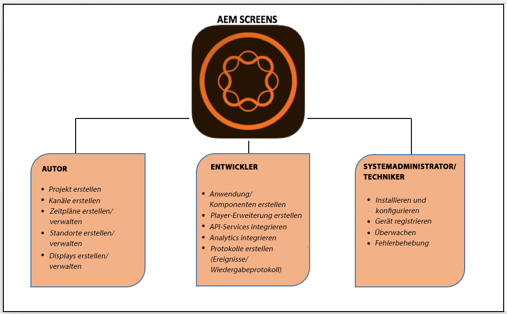

# Erstellen und Verwalten einer Live Copy {#creating-and-managing-a-live-copy}

Auf dieser Seite wird beschrieben, wie Live Copies von Kanälen erstellt und verwaltet werden.

A ***Live Copy*** is a copy of specific site content for which a live relationship with the original source is maintained. Durch diese Live-Beziehung kann die Live Copy Inhalts- und Seiteneigenschaften der Quelle übernehmen.

Auf dieser Seite wird beschrieben, wie eine Live Copy eines Kanals erstellt wird, Eigenschaften angezeigt werden, der Status überprüft und Änderungen von einem Kanal auf dessen Live Copy übertragen werden.

## Erstellen von Live Copies {#creating-a-live-copy}

Gehen Sie wie folgt vor, um eine Live Copy eines Kanals in Ihrem Projektordner zu erstellen.

1. Wählen Sie den Link zu Adobe Experience Manager (oben links) und dann **Screens** aus. Alternatively, you can go directly to: `http://localhost:4502/screens.html/content/screens`.

1. Navigieren Sie zum Screens-Projekt und klicken Sie auf **Kanäle**.
1. Click **Create** and select **Live Copy** to create a live copy of the channel.

1. Wählen Sie das Ziel aus und klicken Sie auf **Weiter**.
1. Wählen Sie den Speicherort aus, an dem die Live Copy gespeichert werden soll.
1. Geben Sie auf der Seite **Live Copy erstellen** den **Titel** und den **Namen** ein.

1. Klicken Sie auf **Öffnen**, um den Inhalt der neuen Live Copy anzuzeigen oder klicken Sie auf **Fertig**, um zur Hauptseite zurückzukehren.

Sie haben auch die Möglichkeit, die folgenden Schritte für die visuelle Darstellung auszuführen, um eine neue Live Copy eines Kanals zu erstellen.

Im folgenden Beispiel wird gezeigt, wie eine Live Copy (***IdleLiveCopy***) für ***Idle Channel*** (Ungenutzter Kanal) mit dem Zielordner *Kanäle **erstellt wird***.

## Anzeigen des Inhalts des Live Copy-Kanals {#viewing-content-of-the-live-copy-channel}

Eine Live Copy ist eine Kopie eines Kanals, der bereits vorhanden ist.

Um den Inhalt einer Live Copy anzuzeigen, gehen Sie wie folgt vor:

1. Navigieren Sie zum Screens-Projekt und klicken Sie auf die Stelle, an der Sie die Live Copy ursprünglich wie im obigen Abschnitt gezeigt erstellt haben. (Here, the location was chosen as **Channels** folder)

   

1. Klicken Sie in der Aktionsleiste auf **Bearbeiten**, um den Inhalt des Kanals anzuzeigen.

   

   >[!NOTE]
   >
   >Wenn Sie Inhalte für einen Live Copy-Kanal anzeigen, sehen Sie im Menü ein zusätzliches Element als **Live Copy-Status**. Weitere Informationen finden Sie im folgenden Abschnitt.

### Anzeigen der Eigenschaften einer Live Copy {#viewing-properties-of-a-live-copy}

Außerdem können Sie die Eigenschaften Ihres Live Copy-Kanals anzeigen.

1. Navigieren Sie zum Live Copy-Kanal und klicken Sie in der Aktionsleiste auf **Eigenschaften**.

   

1. Klicken Sie auf die Registerkarte **Live Copy**, um Details Ihres Kanals anzuzeigen.

   

### Live Copy-Status {#live-copy-status}

Der in der folgenden Abbildung dargestellte Modus **Live Copy-Status** erlaubt es Ihnen, den Beziehungsstatus aller Assets im Kanal anzuzeigen.

1. Click **Edit** to choose the **Live Copy Status** and view the association of your channel content to the original channel (from which the live copy is generated).

   

1. Wählen Sie **Live Copy-Status**, um die Vorschauseite anzuzeigen.

   Bei allen Ressourcen mit grünem Rand wurde der Inhalt des ursprünglichen Kanals übernommen.

   

### Aufheben der Vererbung {#breaking-the-inheritance}

Sie können auch die Vererbung der Live Copy aufheben, wodurch der Inhalt von der ursprünglichen Verzweigung unabhängig wird.

Das folgende Beispiel zeigt, wie Sie das Bild im Modus „Bearbeiten“ auswählen und oben rechts auf das Symbol zum Aufheben der Vererbung klicken.

### Übertragen der Änderungen auf den Live Copy-Kanal {#propagating-changes-to-the-live-copy-channel}

Wenn Sie Änderungen am ursprünglichen Kanal vornehmen, müssen Sie diese Änderungen auch auf Ihren Live Copy-Kanal übertragen.

Führen Sie die folgenden Schritte aus, um sicherzustellen, dass Ihre Änderungen vom ursprünglichen Kanal auf den Live Copy-Kanal übertragen werden:

1. Wählen Sie den ursprünglichen Kanal (***Idle Channel*** [Ungenutzter Kanal]) aus und klicken Sie in der Aktionsleiste auf **Bearbeiten**.

   

1. Bearbeiten Sie den Kanalinhalt. Löschen Sie beispielsweise ein Bild aus diesem Kanal.

   

1. Wählen Sie die Live Copy des Kanals (***IdleLiveCopy***) und klicken Sie in der Aktionsleiste auf **Bearbeiten**. Beachten Sie, dass das von Ihnen gelöschte Bild noch in der Live Copy sichtbar ist.

   Um die Änderungen zu übertragen, müssen Sie den Kanal synchronisieren.

   

1. Um Änderungen auf den Live Copy-Kanal zu übertragen, navigieren Sie zum AEM-Dashboard. Dann wählen Sie den Live Copy-Kanal aus und klicken Sie in der Aktionsleiste auf **Eigenschaften**.

   

1. Wählen Sie die Registerkarte **Live Copy** aus und klicken Sie in der Aktionsleiste auf **Synchronisieren**.

   

1. Klicken Sie auf **Synchronisieren**, um die Änderungen zu bestätigen. Click **Save &amp; Close** to navigate back to the AEM dashboard.

   

   Beachten Sie, dass das Bild jetzt auch aus dem Live Copy-Kanal gelöscht ist.

