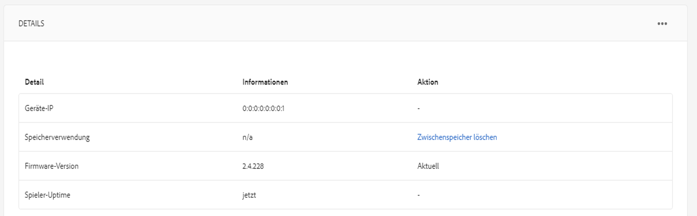

# Erstellen und Verwalten von Zeitplänen {#creating-and-managing-schedules}

Mit **Zeitplänen** in AEM Screens können Sie Kanäle zu wiederverwendbaren Gruppen zusammenfassen. Dies bedeutet, dass Sie die Zuweisung nicht für jeden Bildschirm, auf dem Sie Ihre Inhalte anzeigen möchten, wiederholen müssen.

Durch die Kombination von Zeitplänen mit ***Dayparting*** können Sie einen globalen Zeitplan mit mehreren Kanälen festlegen, die zu bestimmten Tageszeiten ausgeführt werden. Diese Einstellung können dann für alle Anzeigen wiederverwendet werden.

>[!NOTE]
>
>Diese AEM Screens-Funktion ist nur verfügbar, wenn Sie das Feature Pack 1 für AEM 6.3 Sites installiert haben. Wenden Sie sich an den Adobe-Support, um Zugriff auf dieses Feature Pack zu erhalten.  Nachdem Sie die erforderlichen Berechtigungen erhalten haben, können Sie es von Package Share herunterladen.

## Erstellen eines Zeitplans {#creating-a-schedule}

Sie können für Ihr Screens-Projekt einen Zeitplan erstellen, in dem alle Aktivitäten für Ihren Anwendungsfall verwaltet werden.

Führen Sie die folgenden Schritte aus, um einen Zeitplan für Ihren Kanal zu erstellen:

1. Klicken Sie auf den Link zu Adobe Experience Manager (oben links) und dann auf „Screens“.  Sie haben auch die Möglichkeit, direkt zur folgenden URL zu wechseln: `http://localhost:4502/screens.html/content/screens`.
1. Navigieren Sie zum Screens-Projekt und klicken Sie auf **Zeitpläne**.
1. Klicken Sie in der Aktionsleiste auf **Erstellen**.
1. Klicken Sie im Assistenten **Erstellen** auf **Zeitplan** und dann auf **Weiter**.

1. Geben Sie den **Namen** und den **Titel** ein und klicken Sie auf **Erstellen**.

In Ihrem Projekt wird daraufhin ein Zeitplanordner mit dem zugewiesenen Namen und Titel dargestellt.

## Anzeigen des Dashboards {#viewing-dashboard}

Sobald Sie den Zeitplanordner in Ihrem Projekt erstellt haben, können Sie sich die Details im Zeitplan-Dashboard ansehen.

Führen Sie die folgenden Schritte aus, um sich das Dashboard für den Zeitplan anzeigen zu lassen. Das folgende Beispiel veranschaulicht, wie das Dashboard des `We.Retail`-Projekts angezeigt wird:

1. Navigieren Sie zum Ordner **Zeitpläne** des Screens-Projekts (z. B. `We.Retail`).

   

1. Klicken Sie in der Aktionsleiste auf **Dashboard**.

   Dort finden Sie drei Bedienfelder: **ZEITPLANINFORMATIONEN**, **ZUGEWIESENE KANÄLE** und **ZUGEWIESENE ANZEIGEN**.

   

   **Bedienfeld „Zeitplaninformationen“** Klicken Sie in der oberen rechten Ecke des Bedienfelds „ZEITPLANINFORMATIONEN“ auf die Option „Eigenschaften“, um die Eigenschaften des Zeitplans anzuzeigen bzw. zu ändern.

   **Bedienfeld „Zugewiesene Kanäle“** Klicken Sie in der oberen rechten Ecke des Bedienfelds „ZUGEWIESENE KANÄLE“ auf „+ Kanal zuweisen“, um das Dialogfeld „Kanalzuweisung“ zu öffnen.

   **Bedienfeld „Zugewiesene Anzeigen“** Klicken Sie im Bedienfeld „ZUGEWIESENE ANZEIGEN“ auf beliebige Anzeigen, um das Anzeigen-Dashboard zu öffnen.
