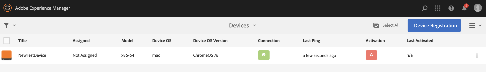
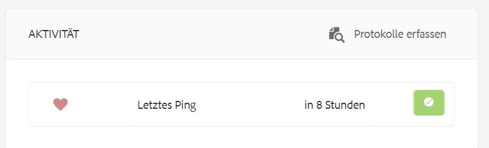

# Fehlerbehebung über das Geräte-Kontrollzentrum {#troubleshooting-device-control-center}

Über das Geräte-Dashboard können Sie die Performance Ihrer AEM Screens-Player-Aktivitäten und -Geräte überwachen und Probleme beheben. Auf dieser Seite finden Sie Informationen zur Überwachung und Fehlerbehebung bei erkannten Leistungsproblemen des Screens-Players und der zugeordneten Geräte.

## Durchführen der Überwachung und Fehlerbehebung über das Geräte-Kontrollzentrum {#monitor-and-troubleshoot-from-device-control-center}

Über das Geräte-Dashboard können Sie Aktivitäten überwachen und somit Probleme mit Ihrem AEM Screens-Player beheben.

### Geräte-Dashboard {#device-dashboard}

Führen Sie die folgenden Schritte aus, um zum Geräte-Dashboard zu navigieren:

1. Navigieren Sie ausgehend von Ihrem Projekt zum Geräte-Dashboard, z. B. über ***Testprojekt*** > ***Geräte***.

   Klicken Sie in der Aktionsleiste auf **Geräte** und **Geräte-Manager**.

   

1. Die Liste zeigt die zugewiesenen und nicht zugewiesenen Geräte an, wie in der folgenden Abbildung dargestellt.

   

1. Klicken Sie auf das Gerät (**NewTestDevice**) und dann in der Aktionsleiste auf **Dashboard**.

   

1. Auf der Seite werden die Geräteinformationen, die Aktivitäten und die Gerätedetails angezeigt, mit denen Sie die Geräteaktivitäten und -funktionen überwachen können.

   

### Überwachen der Geräteaktivität {#monitor-device-activity}

Im Bedienfeld **Aktivität** wird der letzte Ping Ihres AEM Screens-Players mit dem dazugehörigen Zeitstempel angezeigt. Der letzte Ping entspricht dem letzten Zeitpunkt, zu dem das Gerät den Server kontaktiert hat.

Klicken Sie außerdem oben rechts im Bedienfeld **Aktivität** auf die Option **Protokolle erfassen**, um die Protokolle für Ihren Player anzuzeigen.

### Aktualisieren der Gerätedetails {#update-device-details}

Rufen Sie das Bedienfeld **Gerätedetails** auf, um dort die Geräte-IP, Speichernutzung, Firmware-Version und Player-Betriebszeit für Ihr Gerät anzuzeigen.

Klicken Sie außerdem auf **Zwischenspeicher löschen** und **Aktualisieren**, um über dieses Bedienfeld den Zwischenspeicher Ihres Geräts zu löschen bzw. die Version der [Firmware](screens-glossary.md) zu aktualisieren.

Klicken Sie darüber hinaus oben rechts im Bedienfeld **Gerätedetails** auf die Auslassungspunkte (**…**), um den Player neu zu starten bzw. den Status zu aktualisieren.

### Aktualisieren der Geräteinformationen {#update-device-information}

Überprüfen Sie das Bedienfeld **GERÄTEINFORMATIONEN**. Dort können Sie die Konfigurationsaktualisierung, das Gerätemodell, das Betriebssystem des Geräts und die Shell-Informationen anzeigen.

Klicken Sie außerdem oben rechts im Bedienfeld „Geräteinformationen“ auf die Auslassungspunkte (**…**), um Eigenschaften anzuzeigen oder das Gerät zu aktualisieren.

Klicken Sie auf **Eigenschaften**, sodass das Dialogfeld **Geräteeigenschaften** angezeigt wird. Sie können den Gerätetitel bearbeiten oder als Option für Konfigurationsaktualisierungen **Manuell** oder **Automatisch** auswählen.

>[!NOTE]
>
>Weitere Informationen zu den Ereignissen, die den automatischen oder manuellen Aktualisierungen des Geräts zugeordnet sind, finden Sie im Abschnitt ***Automatische oder manuelle Aktualisierungen über das Geräte-Dashboard*** unter [Verwalten von Kanälen](managing-channels.md).

### Anzeigen des Player-Screenshots {#view-player-screenshot}

Sie können den Player-Screenshot für das Gerät im Bedienfeld **PLAYER-SCREENSHOT** anzeigen.

Klicken Sie oben rechts im Bedienfeld „Player-Screenshot“ auf die Auslassungspunkte (**…**) und wählen Sie die Option **Screenshot aktualisieren** aus, um den Screenshot des ausgeführten Players anzuzeigen.

### Verwalten von Voreinstellungen {#manage-preferences}

Im Bedienfeld **VOREINSTELLUNGEN** können Benutzende die Voreinstellungen des Geräts für **Administrator-Benutzeroberfläche**, **Kanalschalter** und **Remote-Debugging** ändern.

>[!NOTE]
>Weitere Informationen zu diesen Optionen finden Sie unter [AEM Screens-Player](working-with-screens-player.md).

Klicken Sie außerdem oben rechts auf die Option **Einstellungen**, um die Gerätevoreinstellungen zu aktualisieren. Sie können die folgenden Voreinstellungen aktualisieren:

* **Server-URL**
* **Auflösung**
* **Neustartzeitplan**
* **Max. Anzahl der beizubehalt. Prot.dateien**
* **Protokollebene**

>[!NOTE]
>Sie können auf eine der folgenden Protokollebenen klicken:
>* **Deaktivieren**
>* **Debug**
>* **Info**
>* **Warnung**
>* **Fehler**

## Durchführen der Fehlerbehebung für die OSGi-Einstellungen {#troubleshoot-osgi-settings}

Aktivieren Sie den leeren Referrer, um dem Gerät das Bereitstellen von Daten auf dem Server zu erlauben. Wenn die Eigenschaft für den leeren Referrer deaktiviert ist, kann das Gerät keine Screenshots zurückgeben.

Derzeit sind einige dieser Funktionen nur verfügbar, wenn der *Apache Sling Referrer-Filter „Allow Empty“* in der OSGi-Konfiguration aktiviert ist. Im Dashboard wird ggf. eine Warnung angezeigt, dass einige dieser Funktionen aufgrund der Sicherheitseinstellungen nicht funktionieren.

Führen Sie die nachfolgenden Schritte aus, um den Apache Sling Referrer-Filter „Allow Empty“ zu aktivieren

1. Navigieren Sie zur **Konfiguration der Adobe Experience Manager-Web-Konsole**: `https://localhost:4502/system/console/configMgr/org.apache.sling.security.impl.ReferrerFilter`.
1. Aktivieren Sie die Option **allow.empty**.
1. Klicken Sie auf **Speichern**.

### Empfehlungen {#recommendations}

Im folgenden Abschnitt wird die Überwachung der Netzwerklinks, des Servers und der Player empfohlen, um Informationen zum Zustand zu erhalten und auf Probleme reagieren zu können.

AEM ermöglicht die integrierte Überwachung für:

* *Heartbeat* alle fünf Sekunden, um anzugeben, dass der AEM Screens-Player betriebsbereit ist.
* *Screenshot* des Players, um zu sehen, was derzeit im Player angezeigt wird.
* Die Version der *AEM Screens-Player-Firmware*, die auf dem Player installiert ist.
* *Freier Speicherplatz* auf dem Player.

Empfehlungen für die Remote-Überwachung mit Software von Drittanbietern:

* CPU-Auslastung auf den Playern.
* Überprüfung, ob der Prozess für AEM Screens-Player ausgeführt wird.
* Remote Neustart/Reboot des Players.
* Benachrichtigungen in Echtzeit.

Es wird empfohlen, die Player-Hardware und das Betriebssystem so bereitzustellen, dass eine Remote-Anmeldung möglich ist, um Probleme zu diagnostizieren und den Player neu zu starten.

#### Sonstige Ressourcen {#additional-resources}

Informationen zum Debuggen und Behandeln von Problemen beim Abspielen von Videos in Ihrem Kanal finden Sie unter [Konfiguration der Videowiedergabe und Fehlerbehebung](troubleshoot-videos.md).
