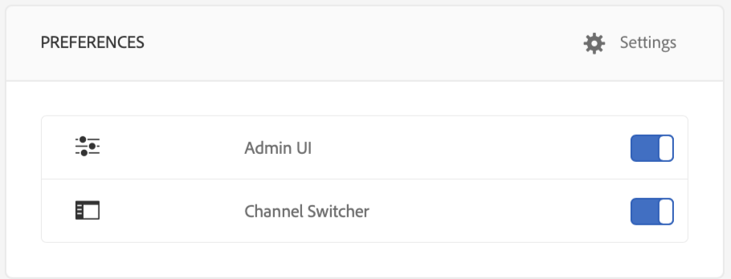

# Fehlerbehebung beim Device Control Center {#troubleshooting-device-control-center}

Mit dem Geräte-Dashboard können Sie die Leistung für die Bildschirmplayer-Aktivität und das Gerät überwachen und Fehler beheben. Diese Seite enthält Informationen dazu, wie Sie bei auftretenden Leistungsproblemen für den Screens-Player und die zugewiesenen Geräte die Überwachung und Fehlerbehebung durchführen.

## Durchführen der Überwachung und Fehlerbehebung über das Geräte-Kontrollzentrum {#monitor-and-troubleshoot-from-device-control-center}

Mit dem Geräte-Dashboard können Sie die Aktivität überwachen und somit eine Fehlerbehebung für Ihren Bildschirmplayer durchführen.

### Geräte-Dashboard {#device-dashboard}

Führen Sie die folgenden Schritte aus, um zum Geräte-Dashboard zu navigieren:

1. Navigate to the device dashboard from your project, for example, ***Test Project*** --&gt; ***Devices***.

   Select **Devices** and **Device Manager** from the action bar.

   

1. Die Liste zeigt die zugewiesenen und nicht zugewiesenen Geräte an, wie in der folgenden Abbildung dargestellt.

   

1. Wählen Sie das Gerät (**NewTestDevice**) und klicken Sie in der Aktionsleiste auf **Dashboard** .

   

1. Auf der Seite werden die Geräteinformationen, die Aktivitäten und die Gerätedetails angezeigt, mit denen Sie die Geräteaktivitäten und -funktionen überwachen können.

   

### Überwachen der Geräteaktivität {#monitor-device-activity}

Im Bedienfeld **Aktivität** wird das letzte Ping Ihres Screens-Players mit dem dazugehörigen Zeitstempel angezeigt. Das letzte Ping entspricht dem letzten Zeitpunkt, zu dem das Gerät den Server kontaktiert hat.

Additionally, click **Collect Logs** from the top right hand corner of the **Activity** panel to view the logs for your player.

### Aktualisieren der Gerätedetails {#update-device-details}

Zeigen Sie im Bedienfeld **Gerätedetails** die Geräte-IP, Speicherverwendung, Firmware-Version und Player-Uptime für Ihr Gerät an.

Klicken Sie außerdem auf **Zwischenspeicher löschen** und **Aktualisieren**, um den Zwischenspeicher Ihres Geräts zu löschen und die [Firmware-Version](screens-glossary.md) über dieses Bedienfeld zu aktualisieren.

Klicken Sie darüber hinaus oben rechts im Bedienfeld **Gerätedetails** auf **...**, um den Player neu zu starten bzw. den Status zu aktualisieren.

### Aktualisieren der Geräteinformationen {#update-device-information}

Überprüfen Sie im Bedienfeld " **GERÄTEINFORMATIONEN** ", um die Konfigurationsupdates, das Gerätemodell, das Betriebssystem des Geräts und die Shell-Informationen anzuzeigen.

Additionally, click the (**...**) from the top right corner of the Device Information panel to view properties or update the device.

Klicken Sie auf **Eigenschaften**, um das Dialogfeld **Geräteeigenschaften** anzuzeigen. Sie können den Gerätetitel bearbeiten oder als Option für Konfigurationsaktualisierungen **Manuell** oder **Automatisch** wählen.

>[!NOTE]
>
>To learn more about the events associated with device's automatic or manual updates, see the section ***Automatic versus Manual Updates from the Device Dashboard*** in [Managing Channels](managing-channels.md).

### Anzeigen des Player-Screenshots {#view-player-screenshot}

Sie können den Screenshot des Players vom Gerät aus im **PLAYER SCREENSHOT **Bedienfeld anzeigen.

Click (**...**) on the top right corner of the Player Screenshot panel and select **Refresh Screenshot **to view the snapshot of the running player.

### Verwalten von Einstellungen {#manage-preferences}

The **PREFERENCES** panel allows the user to change preferences for **Admin UI**, **Channel Switcher**, and **Remote Debugging** for the device.

>[!NOTE]
>
>Weitere Informationen zu dieser Option finden Sie unter [Player für AEM Screens](working-with-screens-player.md).

Klicken Sie in der rechten oberen Ecke auf **Einstellungen** , um die Gerätevoreinstellungen zu aktualisieren. Sie können die folgenden Voreinstellungen aktualisieren:

* **Server-URL**
* **Problemlösung**
* **Neustartzeitplan**
* **Max. Anzahl der Protokolldateien, die**
* **Protokollebene**

>[!NOTE]
>
>Sie können eine der folgenden Protokollebenen auswählen:
>
>* **Deaktivieren**
>* **Debug**
>* **Info**
>* **Warning**
>* **Fehler**
>

## Durchführen der Fehlerbehebung für die OSGi-Einstellungen {#troubleshoot-osgi-settings}

Sie müssen den leeren Referrer aktivieren, um für das Gerät das Posten von Daten auf dem Server zuzulassen. Wenn die Eigenschaft für den leeren Referrer deaktiviert ist, kann das Gerät keine Rückübertragung eines Screenshots durchführen.

Derzeit sind einige dieser Funktionen nur verfügbar, wenn der *Apache Sling Referrer-Filter „Allow Empty“* in der OSGi-Konfiguration aktiviert ist. Im Dashboard wird ggf. eine Warnung angezeigt, dass einige dieser Funktionen aufgrund der Sicherheitseinstellungen nicht funktionieren.

Führen Sie die nachfolgenden Schritte aus, um den Apache Sling Referrer-Filter „Allow Empty“ zu aktivieren.

1. Navigate to **Adobe Experience Manager Web Console Configuration**, that is, `https://localhost:4502/system/console/configMgr/org.apache.sling.security.impl.ReferrerFilter`.
1. Markieren Sie die Option **allow.empty **.
1. Klicken Sie auf **Speichern**.

### Empfehlungen {#recommendations}

Im folgenden Abschnitt wird die Überwachung der Netzwerklinks, des Servers und der Player empfohlen, um Informationen zum Zustand zu erhalten und auf Probleme reagieren zu können.

AEM ermöglicht die integrierte Überwachung für:

* *Takt* alle fünf Sekunden, um anzugeben, dass der Player für AEM Screens betriebsbereit ist
* *Screenshot* vom Player, um zu sehen, was derzeit im Player angezeigt wird
* Auf dem Player installierte *Firmware für den Player für AEM Screens*
* *Freier Speicherplatz* auf dem Player

Empfehlungen für die Remoteüberwachung mit Drittanbieter-Software:

* CPU-Auslastung auf den Playern
* Überprüfung, ob der Prozess des Players für AEM Screens ausgeführt wird
* Neustart des Players per Remote-Zugriff
* Benachrichtigungen in Echtzeit

Es wird empfohlen, die Player-Hardware und das Betriebssystem so bereitzustellen, dass eine Remote-Anmeldung möglich ist, um Probleme zu diagnostizieren und den Player neu zu starten.

#### Zusätzliche Ressourcen {#additional-resources}

Informationen zum Debugging und zur Fehlerbehebung bei Videos, die in Ihrem Kanal wiedergegeben werden, finden Sie unter Konfiguration der [Videowiedergabe und Fehlerbehebung](troubleshoot-videos.md) .
