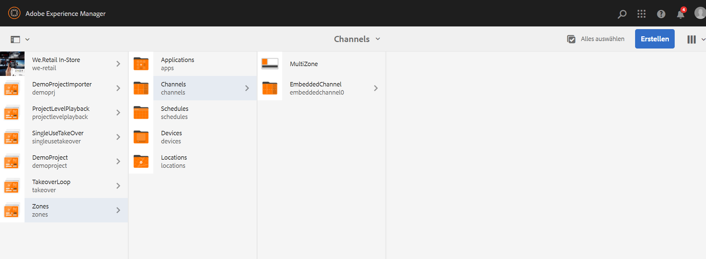
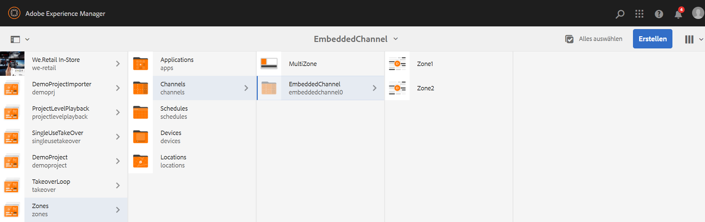

# Mehrzonen-Layout {#multi-zone-layout}

Die folgende Seite beschreibt die Verwendung des Mehrzonen-Layouts und behandelt die folgenden Themen:

* Überblick
* Erstellen eines Mehrzonen-Layouts
* Voraussetzungen
* Verwenden einzelner Assets in einem oder mehreren Bereichen
* Verwenden sequenzieller Inhalte in einem oder mehreren Bereichen

## Überblick {#overview}

Das ***Mehrzonen-Layout*** ermöglicht es Ihnen, Inhalte für mehrere Zonen zu erstellen und verschiedene Elemente wie Videos, Bilder und Text zu verwenden, die in einem einzigen Bildschirm kombiniert werden können. Sie können Bilder, Videos und Text einblenden, sodass alles miteinander verschmelzen und ein intuitives digitales Erlebnis schaffen kann.

Abhängig von den Projektanforderungen sind ggf. mehrere Bereiche in einem Kanal erforderlich, die dann zusammen als Einheit bearbeitet werden. Beispiel: eine Produktsequenz mit entsprechendem Social-Media-Feed, die in drei separaten Zonen auf einem einzigen Kanal läuft.

### Voraussetzungen {#prerequisites}

Bevor Sie mit der Implementierung dieser Funktion beginnen, vergewissern Sie sich, dass Sie mit folgenden Themen vertraut sind:

* [Erstellen eines AEM Screens-Projekts](https://experienceleague.adobe.com/docs/experience-manager-screens/user-guide/authoring/setting-up-projects/creating-a-screens-project.html?lang=de)
* [Erstellen einer Anzeige](https://experienceleague.adobe.com/docs/experience-manager-screens/user-guide/authoring/setting-up-projects/managing-displays.html?lang=de)
* [Zuweisen eines Kanals zu einem Display](/help/user-guide/channel-assignment.md)

## Erstellen eines Mehrzonen-Layouts {#creating-multi-zone-layout}

Beim Erstellen eines Kanals können Sie mithilfe verschiedener Vorlagen Bereiche in Ihrem Kanal erstellen. Sie können ein einzelnes Bild, Video oder einen eingebetteten Kanal hinzufügen, sodass mehrere Assets in einer Sequenz angezeigt werden können.

**Erstellen eines Kanals**

1. Wählen Sie den Adobe Experience Manager-Link (oben links) und dann **Screens** aus. Sie haben auch die Möglichkeit, direkt zur folgenden URL zu wechseln: `http://localhost:4502/screens.html/content/screens`.
1. Navigieren Sie zum Ordner **Kanäle** und klicken Sie in der Aktionsleiste auf **Erstellen**.

1. Wählen Sie im Assistenten **Erstellen** die Option **1x2-Splitscreen-Kanal**.

1. Klicken Sie auf **Weiter** und geben Sie unter **Titel** den Wert **MultiZone** ein.

1. Klicken Sie auf **Erstellen**, um die Kanalerstellung abzuschließen.

### Verwenden einzelner Assets in einem oder mehreren Bereichen {#using-single-assets-in-one-or-more-zones}

Sie können einzelne Assets wie ein Bild oder ein Video in allen Bereichen verwenden. Gehen Sie zur Implementierung wie folgt vor:

1. **Hinzufügen von Inhalten zum Kanal**

   1. Navigieren Sie zu **Bereiche** > **Kanäle**> **MultiZone**.
   1. Wählen Sie den Kanal **Multizone** aus und klicken Sie in der Aktionsleiste auf **Bearbeiten**, um den Editor zu öffnen.

1. **Hinzufügen von Bildern zum Kanal**

   Um ein einzelnes Bild oder Video in zwei Bereichen abzuspielen, ziehen Sie das Bild einfach per Drag-and-Drop in jeden Bereich des Kanal-Editors, wie in der folgenden Abbildung dargestellt:

   

### Verwenden sequenzieller Inhalte in einem oder mehreren Bereichen {#using-sequenced-content-in-one-or-more-zones}

Wenn Sie möchten, dass eine Bildsequenz und ein Video in verschiedenen Bereichen angezeigt werden, führen Sie die folgenden Schritte aus, um mehr zu erfahren.

1. **Erstellen eines Kanalordners**

   1. Navigieren Sie zu **Bereiche** > **MultiZone** > **Kanäle** und klicken **Erstellen** in der Aktionsleiste aus.
   1. Wählen Sie im Assistenten **Erstellen** die Option **Kanalordner** aus und klicken Sie auf **Weiter**.
   1. Geben Sie **EmbeddedChannels** als Titel ein und klicken Sie auf **Erstellen**.

   

1. **Hinzufügen von zwei weiteren Kanälen zum Kanalordner**

   1. Navigieren Sie zu **Bereiche** > **Kanäle** > **EmbeddedChannels** und klicken **Erstellen** in der Aktionsleiste aus.
   1. Wählen Sie im Assistenten **Erstellen** die Option **Sequenzkanal** aus, um einen Kanal mit dem Namen **Zone1** zu erstellen.
   1. Wählen Sie **Zone1** aus und klicken Sie in der Aktionsleiste auf **Bearbeiten**, um den Editor zu öffnen.
   1. Ziehen Sie einige Bilder in diesen Kanal.
   1. Erstellen Sie auf ähnliche Weise einen weiteren Sequenzkanal mit dem Namen **Zone2** im Ordner **EmbeddedChannels**.
   1. Ziehen Sie einige Bilder per Drag-and-Drop in diesen Kanal.

   Die folgende Abbildung zeigt die Kanäle **Zone1** und **Zone2**:

   

   Die Bilder, die dem Editor des Sequenzkanals **Zone1** hinzugefügt wurden, sind im Folgenden dargestellt:

   

   Das Video, das em Editor des Sequenzkanals **Zone2** hinzugefügt wurde, ist im Folgenden zu sehen:

   

1. **Hinzufügen eingebetteter Sequenzen (Komponenten) zum Hauptkanal (MultiZone)**

   1. Navigieren Sie zu **Bereiche** > **Kanäle** > **MultiZone**.
   1. Klicken Sie in der Aktionsleiste auf **Bearbeiten**, um den Editor zu öffnen.
   1. Ziehen Sie die Komponente **Eingebettete Sequenz** per Drag-and-Drop in beide Bereiche.
   1. Wählen Sie die eingebettete Sequenz in einem der Bereiche aus.
   1. Klicken Sie auf das Symbol **Konfigurieren** (Schraubenschlüssel), um eine der eingebetteten Sequenzen im Editor zu konfigurieren.
   1. Wählen Sie den Kanalpfad als **Bereiche** > **Kanäle** > **EmbeddedChannels** > **Zone1**, wie in der folgenden Abbildung dargestellt.
   1. Fügen Sie auf ähnliche Weise **Zone2** einer anderen eingebetteten Sequenzkomponente im Editor hinzu.

      

### Erstellen eines Standorts und eines Displays {#creating-location}

Erstellen Sie einen Speicherort und einen Display, um den Inhalt im Screens-Player anzuzeigen.

1. **Erstellen eines Standorts**

   1. Navigieren Sie zu **Bereiche** > **Standorte** Ordner.
   1. Wählen Sie den Ordner **Standorte** aus und klicken Sie in der Aktionsleiste auf **Erstellen**.
   1. Wählen Sie im Assistenten **Erstellen** die Option **Standort** aus und klicken Sie auf **Weiter**.
   1. Geben Sie unter **Titel** den Wert **SanJose** ein und klicken Sie auf **Erstellen**.

1. **Erstellen einer Anzeige**

   1. Navigieren Sie zu **Bereiche** > **Standorte** Ordner.
   1. Wählen Sie den Standort **SanJose** aus und klicken Sie in der Aktionsleiste auf **Erstellen**.
   1. Wählen Sie im Assistenten **Erstellen** die Option **Anzeige** aus und klicken Sie auf **Weiter**.
   1. Geben Sie unter **Titel** den Wert **Lobby** ein und klicken Sie auf **Erstellen**.

### Zuweisen von Kanälen zur Anzeige {#channel-channel}

Weisen Sie die Kanäle dem Display zu, um den Inhalt anzuzeigen. Gehen Sie wie folgt vor, um einer Anzeige einen Kanal zuzuweisen.

1. **Zuweisen eines Kanals zur Anzeige**

   1. Navigieren Sie zu **Bereiche** > **Standorte** > **SanJose**> **Lobby**.
   1. Wählen Sie die Anzeige **Lobby** aus und klicken Sie in der Aktionsleiste auf **Kanal zuweisen**.
   1. Geben Sie den Pfad zum Kanal **MultiZone** unter **Kanalpfad** ein.
   1. Wählen Sie unter **Unterstützte Ereignisse** die Optionen **Erster Ladevorgang**, **Bildschirm bei Untätigkeit** und **Benutzerinteraktion**.
   1. Klicken Sie auf **Speichern**.

      
   1. Entsprechend müssen Sie die anderen beiden eingebetteten Kanäle (**Zone1** und **Zone2**) dieser Anzeige zuweisen.
   1. Nachdem Sie alle drei Kanäle der Anzeige **Lobby** zugewiesen haben, sollten Sie die zugewiesenen Kanäle im Anzeigen-Dashboard sehen.

      

      >[!IMPORTANT]
      >
      > Nachdem Sie den Hauptkanal (in diesem Fall **MultiZone**) der Anzeige zugewiesen haben, müssen Sie die anderen beiden eingebetteten Kanäle **Zone1** und **Zone2** derselben Anzeige zuweisen.

### Registrieren des Geräts {#registering-device}

Nachdem Sie einen Standort und eine Anzeige eingerichtet haben, gehen Sie wie folgt vor, um das Gerät zu registrieren und dem Gerät eine Anzeige zuzuweisen.

1. **Registrieren des Geräts**

   1. Navigieren Sie zu **Bereiche** > **Geräte** Ordner.
   1. Wählen Sie den Ordner **Geräte** aus und klicken Sie in der Aktionsleiste auf **Geräte-Manager**.
   1. Klicken Sie auf **Geräteregistrierung** und wählen Sie in der Liste das ausstehende Gerät aus.
      >[!NOTE]
      > Der Titel des Geräts muss mit dem Geräte-Token (Feld **Token**) übereinstimmen, das auf der Registerkarte **Geräteregistrierung** angezeigt wird.
   1. Wenn der Titel mit dem Geräte-Token übereinstimmt, wählen Sie das Gerät aus und klicken Sie in der Aktionsleiste auf **Gerät registrieren**.
   1. Wenn der Registrierungs-Code mit dem Code auf der Registerkarte **Geräteregistrierung** im Screens-Player übereinstimmt, klicken Sie in der Aktionsleiste auf **Validieren**.
      
   1. Geben Sie unter **Titel** den Wert **Chrome-Device1** ein und klicken Sie auf **Registrieren**.
   1. Wählen Sie **Anzeige zuweisen** und dann den Pfad zur Gerätekonfiguration.

   >[!NOTE]
   >Wenn Sie versuchen, den Inhalt im Screens-Player anzuzeigen, klicken Sie unbedingt für jeden der Anzeige zugewiesenen Kanal im Kanal-Dashboard auf **Offline-Inhalt aktualisieren**.

### Anzeigen des Ergebnisses {#viewing-the-result}

Nachdem Sie Mehrzonen-Layouts mit den vorhergehenden Schritten implementiert haben, wird die folgende Ausgabe angezeigt.

Überprüfen Sie den Screens-Player, um die Ausgabe zu sehen, in der der Inhalt in zwei verschiedenen Bereichen angezeigt wird. Die linken und die rechten Zonen (beide verwenden eine eingebettete Sequenz als Komponente).

Der linke Bereich ist ein Sequenzkanal und der rechte Bereich enthält ein Video.

