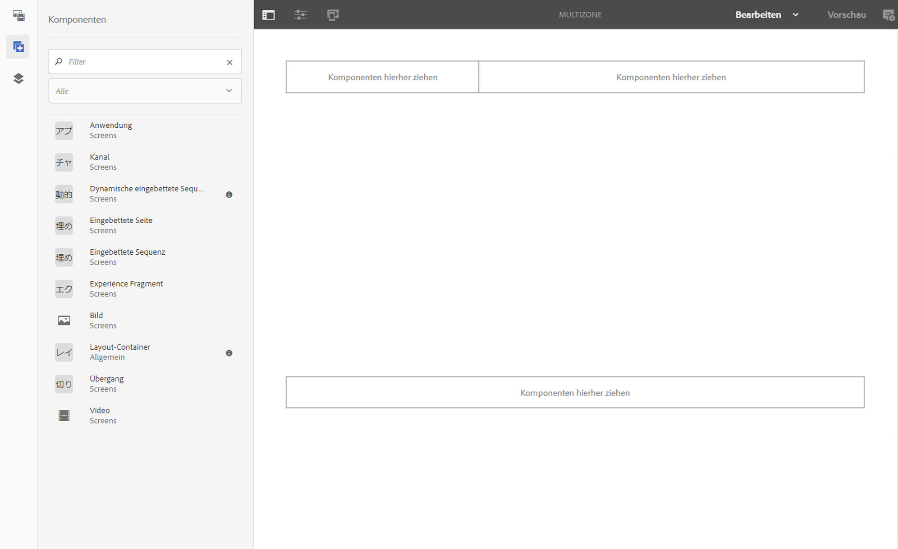

# Mehrzonen-Layout {#multi-zone-layout}

Die folgende Seite beschreibt die Verwendung des Mehrzonen-Layouts und behandelt die folgenden Themen:

* Überblick
* Erstellen eines Mehrzonen-Layouts
* Voraussetzungen
* Verwenden einzelner Assets in einem oder mehreren Bereichen
* Verwenden sequenzieller Inhalte in einem oder mehreren Bereichen

## Überblick {#overview}

***Mehrzonen-Layout ermöglicht es Ihnen, Inhalte für mehrere Bereiche zu erstellen und eine Vielzahl von Assets wie Videos, Bilder und Text zu verwenden, die in einem einzigen Bildschirm kombiniert werden können.*** Sie können Bilder, Videos und Text einblenden, sodass alles miteinander verschmelzen und ein intuitives digitales Erlebnis schaffen kann.

Abhängig von den Projektanforderungen sind ggf. mehrere Bereiche in einem Kanal erforderlich, die dann zusammen als Einheit bearbeitet werden. Beispiel: eine Produktsequenz mit entsprechendem Social-Media-Feed, die in drei separaten Bereichen in einem Kanal läuft.

## Erstellen eines Mehrzonen-Layouts {#creating-multi-zone-layout}

Beim Erstellen eines Kanals können Sie mithilfe verschiedener Vorlagen Bereiche in Ihrem Kanal erstellen. Sie können ein einzelnes Bild, Video oder einen eingebetteten Kanal hinzufügen, sodass mehrere Assets in einer Sequenz angezeigt werden können.

### Voraussetzungen {#prerequisites}

Bevor Sie mit der Implementierung dieser Funktion beginnen, stellen Sie sicher, dass Sie ein Projekt als Voraussetzung für die Implementierung des Mehrzonen-Layouts vorbereitet haben. Beispiel:

* Erstellen eines AEM Screens-Projekts mit dem Titel **Bereiche**
* Erstellen einer Anzeige unter **Standorte** mit dem Namen **MultiZoneDisplay**

Erstellen Sie einen Kanal mit dem Titel **MultiZone** im Projekt **Bereiche**. Führen Sie dazu folgende Schritte durch:

**Erstellen des Kanals**

1. Wählen Sie den Adobe Experience Manager-Link (oben links) und dann **Screens** aus. Sie haben auch die Möglichkeit, direkt zur folgenden URL zu wechseln: `http://localhost:4502/screens.html/content/screens`.
1. Navigieren Sie zum Ordner **Kanäle** und klicken Sie in der Aktionsleiste auf **Erstellen**.

1. Wählen Sie **Splitscreen-Kanal mit L-Balken links** aus dem Assistenten **Erstellen** aus.

1. Klicken Sie auf **Weiter** und geben Sie unter **Titel** den Wert **MultiZone** ein.

1. Klicken Sie auf **Erstellen**, um die Kanalerstellung abzuschließen.

### Verwenden einzelner Assets in einem oder mehreren Bereichen {#using-single-assets-in-one-or-more-zones}

Sie können einzelne Assets wie ein Bild oder ein Video in allen drei verschiedenen Bereichen verwenden. Gehen Sie zur Implementierung wie folgt vor:

1. **Hinzufügen von Inhalten zum Kanal**

   1. Navigieren Sie zu **Bereiche** > **Kanäle**>**MultiZone**.
   1. Wählen Sie den Kanal **Multizone** aus und klicken Sie in der Aktionsleiste auf **Bearbeiten**, um den Editor zu öffnen.
   

1. **Hinzufügen von Bildern zum Kanal**

   Um ein einzelnes Bild oder Video in allen drei Bereichen abzuspielen, ziehen Sie das Bild einfach in den Kanaleditor, wie unten dargestellt.

   

### Verwenden sequenzieller Inhalte in einem oder mehreren Bereichen {#using-sequenced-content-in-one-or-more-zones}

Wenn Sie möchten, dass in den Bereichen eine Abfolge von Bildern oder Inhalten und ein statisches Bild in drei verschiedenen Bereichen angezeigt werden, führen Sie die folgenden Schritte aus, um mehr zu erfahren.

1. **Erstellen eines Kanalordners**

   1. Navigieren Sie zu **Bereiche** > **MultiZone** > **Kanäle** und klicken Sie in der Aktionsleiste auf **Erstellen**.
   1. Wählen Sie im Assistenten **Erstellen** die Option **Kanalordner** aus und klicken Sie auf **Weiter**.
   1. Geben Sie **EmbeddedChannels** als Titel ein und klicken Sie auf **Erstellen**.
   

1. **Hinzufügen von zwei weiteren Kanälen zum Kanalordner**

   1. Navigieren Sie zu **Bereiche** > **Kanäle** > **EmbeddedChannels** und klicken Sie in der Aktionsleiste auf **Erstellen**.
   1. Select **Sequence Channel** from the **Create** wizard to create a channel titled as **Zone1**.
   1. Wählen Sie **Zone1** aus und klicken Sie in der Aktionsleiste auf **Bearbeiten**, um den Editor zu öffnen.
   1. Ziehen Sie einige Bilder in diesen Kanal.
   Erstellen Sie auf ähnliche Weise einen weiteren Sequenzkanal mit dem Namen **Zone2** im Ordner **EmbeddedChannels**.

   

   Die Bilder, die dem Editor des **Zone1** -Sequenzcodes hinzugefügt werden, sind im Folgenden dargestellt:

   

   Die Bilder, die zum Editor des **Zone2** -Sequenzcodes hinzugefügt wurden, sind unten dargestellt:

   

1. **Hinzufügen eingebetteter Sequenzen/Komponenten zum Hauptkanal (MultiZone)**

   1. Navigieren Sie zu **Bereiche** > **Kanäle** > **MultiZone**.
   1. Klicken Sie in der Aktionsleiste auf **Bearbeiten**, um den Editor zu öffnen.
   1. Ziehen Sie die Komponente &quot; **Eingebettete Sequenz** &quot;auf zwei Bereiche.

1. **Inhalt zu allen drei Bereichen hinzufügen**

   1. Navigieren Sie zu **Bereiche** > **Kanäle** > **MultiZone**.
   1. Wählen Sie die eingebettete Sequenz in einem der Bereiche aus.
   1. Klicken Sie auf das Symbol **Konfigurieren** (Schraubenschlüssel), um eine der eingebetteten Sequenzen im Editor zu konfigurieren.
   1. Wählen Sie als Kanalpfad **Bereiche** > **Kanäle** > **EmbeddedChannels** > **Zone1** aus, wie in der Abbildung unten dargestellt.
   Fügen Sie auf ähnliche Weise die **Zone2** einer anderen eingebetteten Sequenzkomponente im Editor hinzu.

   

#### Anzeigen des Ergebnisses {#viewing-the-result}

Wenn Sie Mehrzonen-Layouts implementiert haben, wird die folgende Ausgabe angezeigt, wie in der folgenden Abbildung dargestellt.

Klicken Sie im Kanal-Editor auf die **Vorschau** , um die folgende Ausgabe, die den Inhalt in zwei verschiedenen Zonen anzeigt, Ansicht. Die linke und die rechte Zone (beide verwenden eine eingebettete Sequenz als Komponente).

>[!NOTE]
>Wenn Sie versuchen, den Inhalt im Bildschirmplayer Ansicht, klicken Sie im Kanal-Dashboard auf &quot;Offline-Inhalte **** aktualisieren&quot;.

