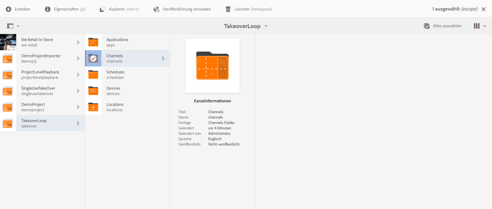
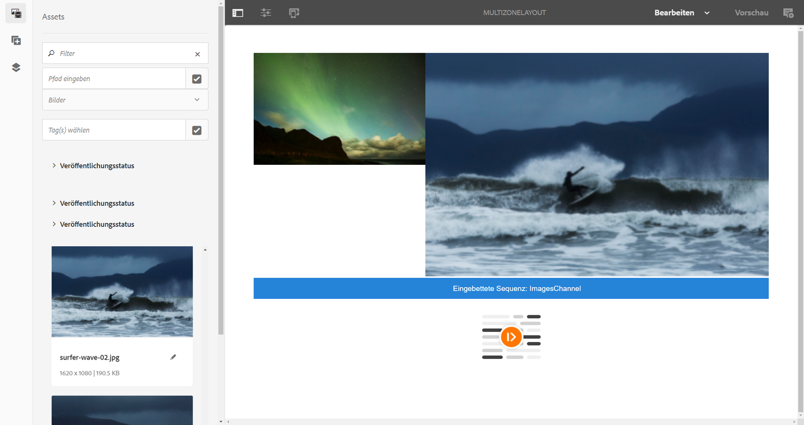
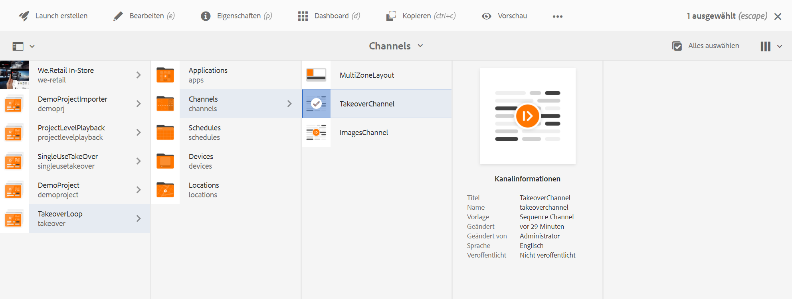
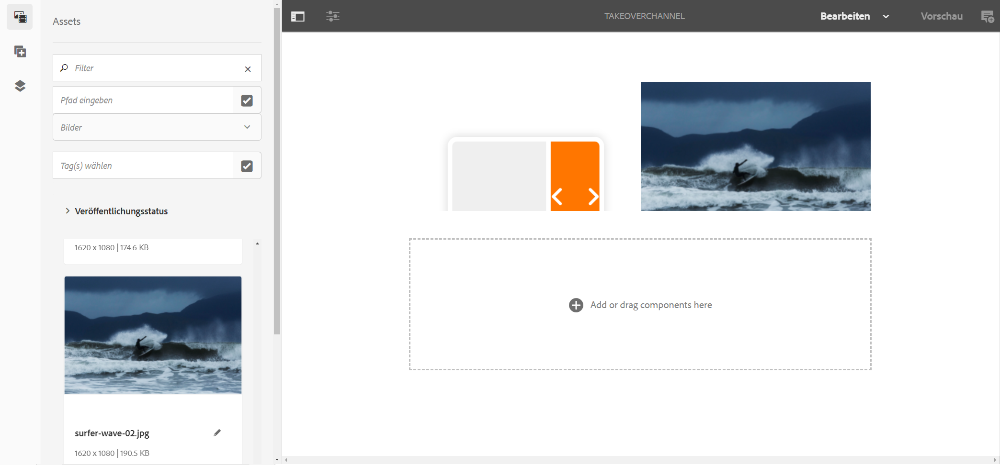
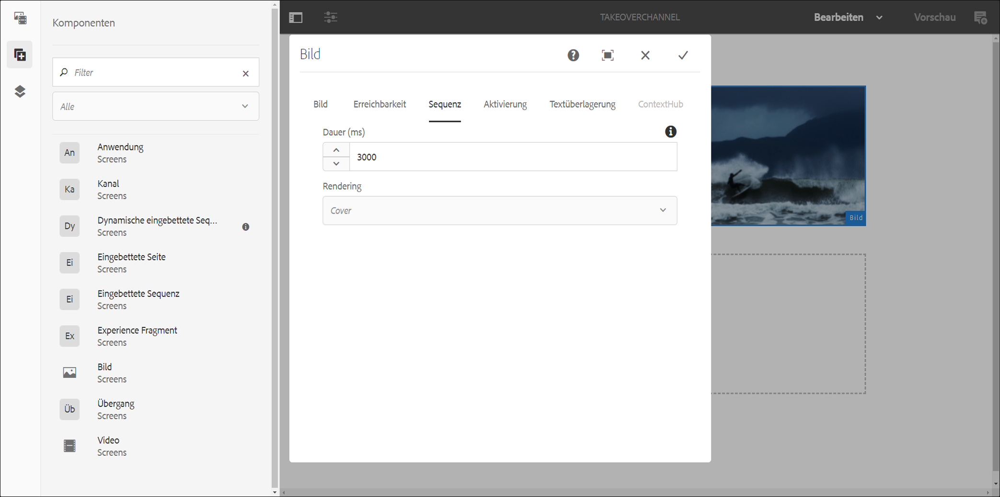

# Übergang von mehreren zu einzelnen Zonen {#multizone-to-singlezone-use-case}

## Anwendungsfallbeschreibung {#use-case-description}

In diesem Abschnitt wird ein Anwendungsfall beschrieben, indem erläutert wird, wie man einen Mehrzonen-Layout-Kanal im Wechsel mit einem Einzelzonen-Layout-Kanal einrichtet. Der Mehrzonen-Kanal verfügt über sequenzierende Bild-/Video-Assets und zeigt, wie Sie ein Projekt einrichten können, das von mehreren Zonen zu einzelnen Zonen wechselt und umgekehrt.

### Voraussetzungen {#preconditions}

Bevor Sie mit diesem Nutzungsszenario beginnen, sollten Sie sich mit den folgenden Themen vertraut machen:

* **[Erstellen und Verwalten von Kanälen](managing-channels.md)**
* **[Erstellen und Verwalten von Standorten](managing-locations.md)**
* **[Erstellen und Verwalten von Zeitplänen](managing-schedules.md)**
* **[Geräteregistrierung](device-registration.md)**

### Hauptakteure {#primary-actors}

Autoren von Inhalten

## Einrichten des Projekts {#setting-up-the-project}

Gehen Sie wie folgt vor, um ein Projekt einzurichten:

1. Erstellen Sie ein AEM Screens-Projekt mit dem Namen **TakeoverLoop** wie unten dargestellt.

   

1. **Erstellen eines Mehrzonenkanals in Screens**

   1. Klicken Sie auf **Kanäle** Ordner und klicken Sie auf **Erstellen** in der Symbolleiste und öffnen Sie den Assistenten, damit Sie einen Kanal erstellen können.
   1. Klicks **Splitscreen-Kanal mit L-Balken links** Erstellen Sie im Assistenten den Kanal mit dem Titel **MultiZoneLayout**.
   1. Fügen Sie dem Kanal Inhalt hinzu. Ziehen Sie die Assets in die einzelnen Zonen. Das folgende Beispiel zeigt einen **MultiZoneLayout**-Kanal, der aus einem Video, einem Bild und einem Textbanner (in einer eingebetteten Sequenz) besteht, wie unten dargestellt.

   

   >[!NOTE]
   >
   >Weitere Informationen zum Erstellen eines Mehrzonen-Layouts in Ihrem Kanal finden Sie unter [Mehrzonen-Layout](multi-zone-layout-aem-screens.md).

1. Erstellen Sie einen weiteren Kanal mit der Bezeichnung **TakeoverChannel** in Ihrem Ordner **Kanäle**.

   

1. Klicken Sie in der Aktionsleiste auf **Bearbeiten**, um Inhalte zu diesem Kanal hinzuzufügen. Fügen Sie dem Kanal eine Komponente **Kanal** und ein Bild-Asset hinzu, zu dem Sie wechseln möchten, wie in der folgenden Abbildung gezeigt:

   

1. Öffnen Sie die Einstellungen für die Komponente Kanal und verweisen Sie sie auf den **MultiZoneLayout** Kanal, den Sie in erstellt haben *Schritt 2*.

   

1. Legen Sie die Dauer im Feld **Sequenz** auf **10000 Millisekunden** fest.

   

1. Öffnen Sie auf ähnliche Weise die Einstellungen für das Bild (Asset, das Sie hinzugefügt haben) und legen Sie die Dauer über die **Sequenz** -Feld zu **3000 Millisekunden**.

   

## Überprüfen der Vorschau {#checking-the-preview}

Sie können die gewünschte Ausgabe auf dem Player oder durch Auswählen der **Vorschau** im Editor anzeigen.

Die Ausgabe zeigt, wie ein Mehrzonen-Layout für *10000 Millisekunden*. Anschließend wird zu einem Einzelzonen-Layout mit einer Wiedergabedauer von *3000 Millisekunden*. Und schließlich wechselt er zurück zum Mehrzonen-Layout.

>[!VIDEO](https://video.tv.adobe.com/v/30366)

>[!NOTE]
>
>Sie können Ihren Kanalübergang entsprechend Ihren Anforderungen (vom Mehrzonen- zum Einzelzonen-Layout oder umgekehrt) anpassen.
