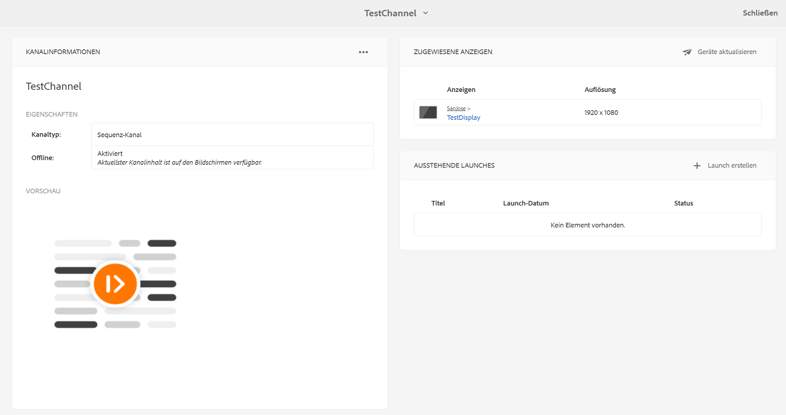

# Offline-Kanäle {#offline-channels}

Der Screens-Player bietet eine Offline-Unterstützung für die Kanäle mithilfe der Technologie ***ContentSync***.

Die Player verwenden einen lokalen HTTP-Server, um den entpackten Inhalt bereitzustellen.

Wenn ein Kanal so konfiguriert ist, dass er *online* läuft, stellt der Player die Kanal-Ressourcen durch Zugriff auf den AEM-Server bereit. Wenn der Kanal jedoch so konfiguriert ist, dass er *offline* läuft, stellt der Player die Kanalressourcen von einem lokalen HTTP-Server bereit.

Der Workflow für den Prozess ist wie folgt:

1. Analysieren der gewünschten Seiten.
1. Sammeln aller zugehörigen Assets.
1. Verpacken aller Elemente in einer ZIP-Datei.
1. Herunterladen und lokales Extrahieren der ZIP-Datei.
1. Anzeigen einer lokalen Kopie des Inhalts.

## Update-Handler {#update-handlers}

***ContentSync*** verwendet Update-Handler, um alle erforderlichen Seiten und Assets für ein bestimmtes Projekt zu analysieren und zu sammeln. AEM Screens verwendet die folgenden Update-Handler:

### Allgemeine Optionen {#common-options}

* *type*: der zu verwendende Update-Handler-Typ
* *path*: Pfad zur Ressource
* *[targetRootDirectory]*: Zielordner in der ZIP-Datei

<table>
 <tbody>
  <tr>
   <td><strong>Typ</strong></td> 
   <td><strong>Beschreibung</strong></td> 
   <td><strong>Optionen</strong></td> 
  </tr>
  <tr>
   <td><code>channels</code></td> 
   <td>erfasst einen Kanal</td> 
   <td>extension: Erweiterung der zu erfassenden Ressource  [pathSuffix='']: Suffix zum Hinzufügen zum Kanalpfad  </td> 
  </tr>
  <tr>
   <td><code>clientlib</code></td> 
   <td>erfasst die angegebene Client-Bibliothek</td> 
   <td>[extension='']: kann entweder css oder js sein, um nur das Erstere oder nur das Letztere zu sammeln</td> 
  </tr>
  <tr>
   <td><code>assetrenditions</code></td> 
   <td>erfasst die Asset-Wiedergaben</td> 
   <td>[renditions=[]]: Liste der zu erfassenden Wiedergaben. Standardmäßig wird die ursprüngliche Wiedergabe verwendet</td> 
  </tr>
  <tr>
   <td><code>copy</code></td> 
   <td>Kopiert die angegebene Struktur aus dem Pfad</td> 
   <td> </td> 
  </tr>
 </tbody>
</table>

### Testen der ContentSync-Konfiguration {#testing-contentsync-configuration}

Befolgen Sie die folgenden Schritte, um die ContentSync-Konfiguration zu testen:

1. Öffnen Sie `https://localhost:4502/libs/cq/contentsync/content/console.html`.
1. Klicken Sie auf Ihre Konfiguration in der Liste.
1. Klicken Sie auf **Zwischenspeicher löschen**.
1. Klicken Sie auf **Cache aktualisieren**.
1. Klicken Sie auf **Alles herunterladen**.
1. Entpacken Sie die ZIP-Datei.
1. Starten Sie einen lokalen Server im extrahierten Ordner.
1. Öffnen Sie Ihre Startseite und überprüfen Sie Ihren App-Status.

## Aktivieren der Offline-Konfiguration für einen Kanal {#enabling-offline-config-for-a-channel}

Befolgen Sie die folgenden Schritte, um die Offline-Konfiguration für einen Kanal zu aktivieren:

1. Überprüfen Sie den Kanalinhalt und ermitteln Sie, ob dieser von einer AEM-Instanz (online) angefordert wurde.

   

1. Navigieren Sie zum Kanal-Dashboard.
1. Klicken Sie im Bedienfeld **KANALINFORMATIONEN** auf **…**.

   

1. Navigieren Sie zu den Kanaleigenschaften.
1. Vergewissern Sie sich auf der Registerkarte ((Kanal)), dass das Kontrollkästchen deaktiviert ist, und klicken Sie dann auf **Speichern und schließen**.

   

   Bevor der Inhalt ordnungsgemäß auf dem Gerät bereitgestellt wird, klicken Sie auf **Offline-Inhalt aktualisieren**.

   

   Der **Offline**-Status unter **EIGENSCHAFTEN** wird ebenfalls entsprechend aktualisiert.

   

1. Kontrollieren Sie den Inhalt des Kanals und überprüfen Sie, ob er vom lokalen Player-Cache angefordert wird.

   

>[!NOTE]
>
>Weitere Informationen zur Vorlage für benutzerdefinierte Offline-Ressourcen-Handler. und zu den Mindestanforderungen in der Datei `pom.xml` für das Projekt. finden Sie unter **Entwickeln einer benutzerdefinierten Komponente für AEM Screens** im Abschnitt [Vorlage für benutzerdefinierte Handler](/help/user-guide/developing-custom-component-tutorial-develop.md#custom-handlers).
