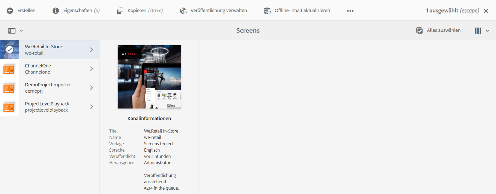
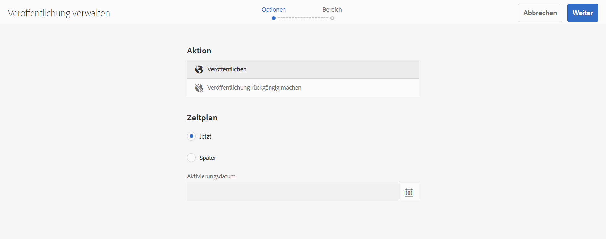
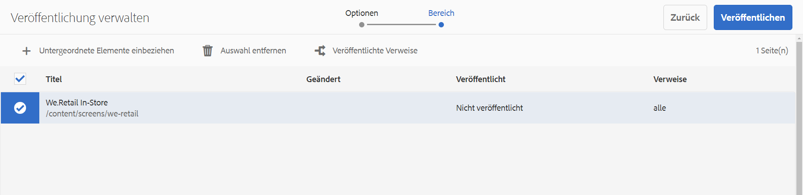
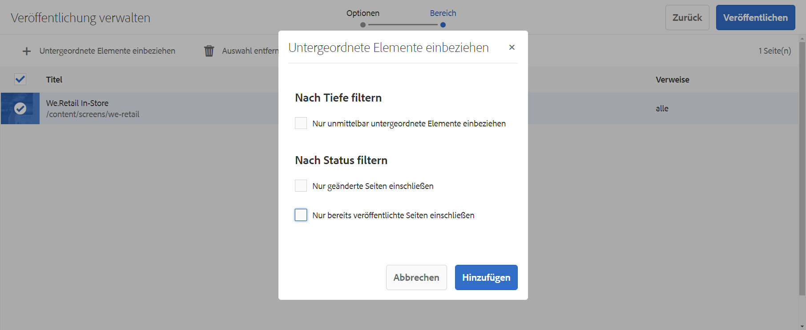
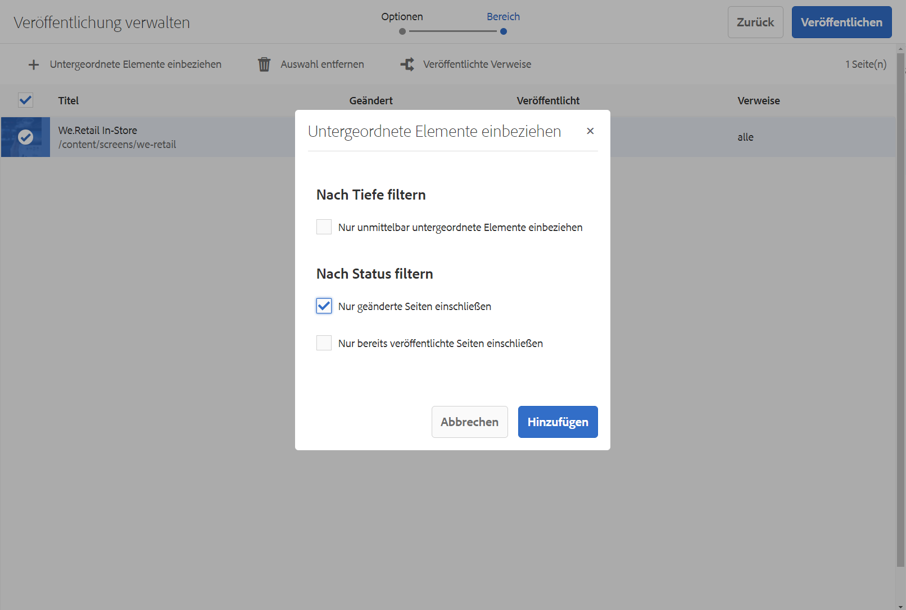
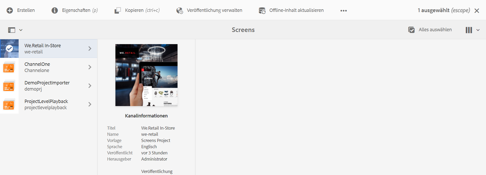
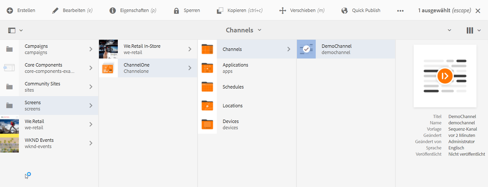
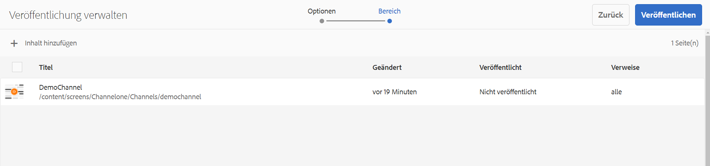
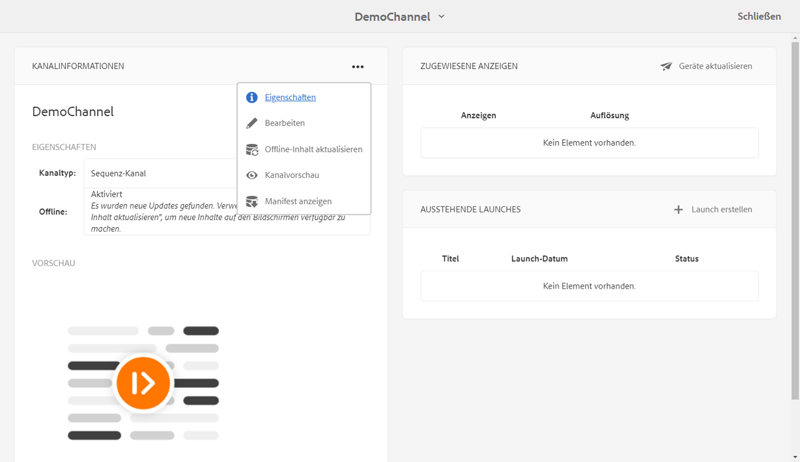

# On-Demand-Inhaltsaktualisierungen {#on-demand}

In diesem Abschnitt werden On-Demand-Inhalte für die Verwaltung von Veröffentlichungen beschrieben.

## Verwalten von Veröffentlichungen: Bereitstellen von Inhaltsaktualisierungen vom Autor zur Veröffentlichung auf dem Gerät {#managing-publication-delivering-content-updates-from-author-to-publish-to-device}

Sie können Inhalte in AEM Screens veröffentlichen und deren Veröffentlichung aufheben. Mit der Funktion Veröffentlichung verwalten können Sie Inhaltsaktualisierungen vom Autor zur Veröffentlichung auf dem Gerät bereitstellen. Sie können Inhalte für Ihr gesamtes AEM Screens-Projekt oder nur für einen Ihrer Kanäle, Standorte, Geräte, Anwendungen oder Zeitpläne veröffentlichen bzw. dessen Veröffentlichung rückgängig machen.

### Verwalten von Veröffentlichungen für ein AEM Screens-Projekt {#managing-publication-for-an-aem-screens-project}

Gehen Sie wie folgt vor, um Inhaltsaktualisierungen vom Autor zur Veröffentlichung auf dem Gerät für ein AEM Screens-Projekt bereitzustellen:

1. Navigieren Sie zu Ihrem AEM Screens-Projekt.
1. Klicks **Veröffentlichung verwalten** in der Aktionsleiste, damit Sie das Projekt in Ihrer Veröffentlichungsinstanz veröffentlichen können.

   

1. Der Assistent **Veröffentlichung verwalten** wird geöffnet. Sie können auf die **Aktion** und planen Sie außerdem die Veröffentlichungszeit für jetzt oder später. Klicken Sie auf **Weiter**.

   

1. Aktivieren Sie das Kontrollkästchen, damit Sie auf das gesamte Projekt im **`Manage Publication`** Assistent.

   

1. Klicks **+ Untergeordnete Elemente einschließen** in der Aktionsleiste und deaktivieren Sie alle Optionen, damit Sie alle Module in Ihrem Projekt veröffentlichen können. Klicken Sie dann auf **Hinzufügen** zum Veröffentlichen.

   >[!NOTE]
   >
   >Standardmäßig sind alle Kästchen markiert und Sie müssen die Kontrollkästchen manuell deaktivieren, um alle Module in Ihrem Projekt zu veröffentlichen.

   

   **Dialogfeld „Untergeordnete Elemente einbeziehen“**

   Die oben genannten Schritte zeigen, wie Sie den gesamten Inhalt veröffentlichen können. Wenn Sie die anderen drei verfügbaren Alternativen verwenden möchten, müssen Sie diese Option aktivieren.
Die folgende Abbildung zeigt beispielsweise, wie Sie nur die geänderten Seiten in Ihrem Projekt verwalten und aktualisieren können:
   

   Befolgen Sie die nachstehenden Erläuterungen, damit Sie die verfügbaren Optionen verstehen:

   1. **Nur unmittelbar untergeordnete Elemente einschließen**: Mit dieser Option können Sie Aktualisierungen verwalten, die nur für die Unterknoten in Ihrer Projektstruktur gelten.
   1. **Nur geänderte Seiten einschließen**: Mit dieser Option können Sie Aktualisierungen verwalten, die nur für die geänderten Seiten des Projekts gelten, auf denen sich die Änderungen in Ihrer Projektstruktur befinden.
   1. **Nur bereits veröffentlichte Seiten einschließen**: Mit dieser Option können Sie Aktualisierungen verwalten, die nur für zuvor veröffentlichte Seiten gelten.

1. Aus dem **`Manage Publication wizard`** klicken **Veröffentlichen**.

   

   >[!NOTE]
   >
   >Warten Sie einige Sekunden/Minuten, damit der Inhalt die Veröffentlichungsinstanz erreicht.
   >
   >
   >    1. Der Workflow funktioniert nicht, wenn keine Änderungen am Projekt vorgenommen wurden und nichts für **Offline-Inhalt aktualisieren**.
   >    1. Der Workflow funktioniert nicht, wenn der Autor den Replikationsprozess nicht abgeschlossen hat (Inhalte werden weiterhin in die Veröffentlichungsinstanz hochgeladen), nachdem Sie die **Veröffentlichen** im Workflow zur Verwaltung von Veröffentlichungen.

   >[!CAUTION]
   >Wenn Sie als Autor oder Ersteller von Inhalten die Änderungen auf den Geräten sehen möchten, die mit der Autoreninstanz verbunden sind, klicken Sie im Kanal-Dashboard auf **Offline-Inhalte aktualisieren** oder wählen Sie das Projekt aus. In diesem Fall wird der Offline-Inhalt nur in der Autoreninstanz aktualisiert.

1. Navigieren Sie zum Projekt und klicken Sie in der Aktionsleiste auf **Offline-Inhalt aktualisieren**. Mit dieser Aktion wird derselbe Befehl an die Veröffentlichungsinstanz weitergeleitet, sodass die Offline-Zips auch auf Ihrer Veröffentlichungsinstanz erstellt werden.

   

   >[!NOTE]
   >
   >Nachdem Sie den Workflow für die Verwaltung von Veröffentlichungen abgeschlossen haben und wenn ein Player auf die Autoreninstanz verweist, sollten Sie den Offline-Inhalt in der Autoreninstanz aktualisieren. Dadurch wird die Aktualisierung offline auf der Autoreninstanz erstellt.

   >[!CAUTION]
   >
   >Trigger der Aktualisierung der Offline-Inhalte in der -Autoreninstanz, wenn Sie einen Player beim -Autorenserver registriert haben. Die Aktualisierung von Offline-Inhalten ist für den in der Veröffentlichungsinstanz registrierten Player nicht erforderlich.

### Verwalten der Veröffentlichung für einen Kanal {#managing-publication-for-a-channel}

Gehen Sie wie folgt vor, um Inhaltsaktualisierungen über &quot;Autor&quot;> &quot;Veröffentlichen&quot;> &quot;Gerät für einen Kanal in einem AEM Screens-Projekt bereitzustellen:

>[!NOTE]
>
>Folgen Sie diesem Abschnitt nur, wenn Änderungen in einem Kanal vorliegen. Wenn ein Kanal nach der vorherigen Aktualisierung der Offline-Inhalte keine Änderungen aufweist, funktioniert der Verwaltungs-Workflow für die Veröffentlichung eines einzelnen Kanals nicht.

1. Navigieren Sie zu Ihrem AEM Screens-Projekt und klicken Sie auf den Kanal.
1. Klicks **Veröffentlichung verwalten** in der Aktionsleiste, damit Sie den Kanal in Ihrer Veröffentlichungsinstanz veröffentlichen können.

   

1. Der Assistent **Veröffentlichung verwalten** wird geöffnet. Sie können auf die **Aktion** und planen Sie außerdem die Veröffentlichungszeit für jetzt oder später. Klicken Sie auf **Weiter**.

   

1. Klicks **Veröffentlichen** aus dem **`Manage Publication`** Assistent.

   

   >[!NOTE]
   >
   >Warten Sie einige Sekunden/Minuten, damit der Inhalt die Veröffentlichungsinstanz erreicht.

1. Auslösen **Offline-Inhalt aktualisieren** im Kanal-Dashboard sendet den Offline-Inhalt nur an die Autoreninstanz, nicht aber an die Veröffentlichungsinstanz. Schritte 1 bis 4 dienen zum Pushen von Offline-Inhalten an die Veröffentlichungsinstanz.

   

   >[!CAUTION]
   >
   >Veröffentlichen Sie zuerst und dann Trigger der Aktualisierung der Offline-Inhalte, wie in den vorherigen Schritten zusammengefasst.

### Neuzuweisung von Kanälen und Geräten: {#channel-and-device-re-assignment}

Wenn Sie ein Gerät neu zugewiesen haben, veröffentlichen Sie sowohl die Erstanzeige als auch die neue Anzeige, sobald das Gerät der neuen Anzeige neu zugewiesen wurde.

Wenn Sie einen Kanal neu zugewiesen haben, veröffentlichen Sie sowohl die Erstanzeige als auch die neue Anzeige, sobald der Kanal der neuen Anzeige neu zugewiesen wurde.
