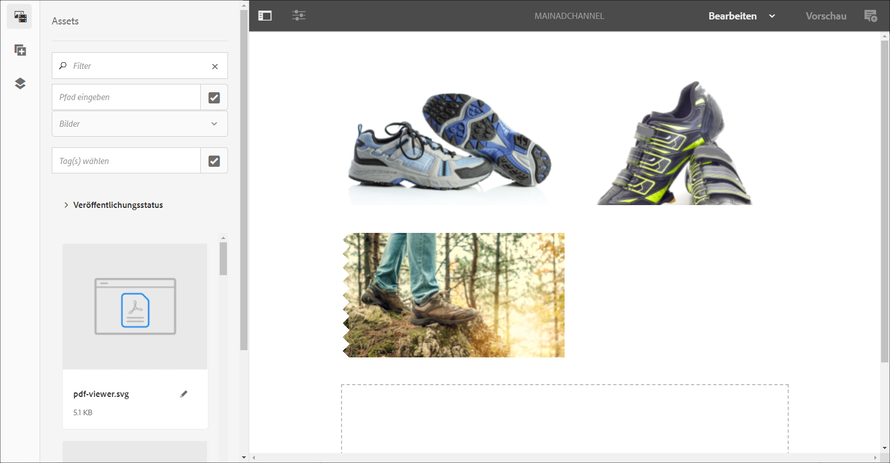
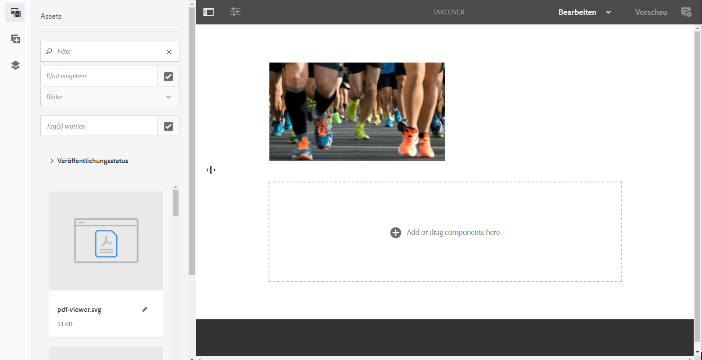
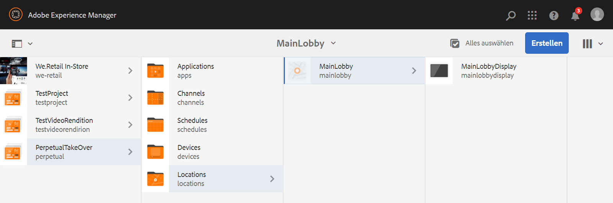
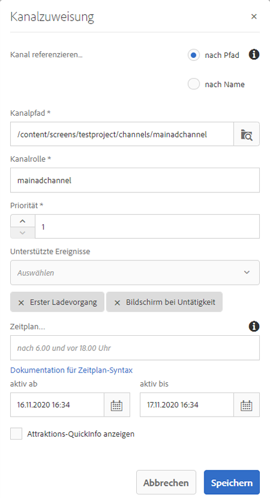
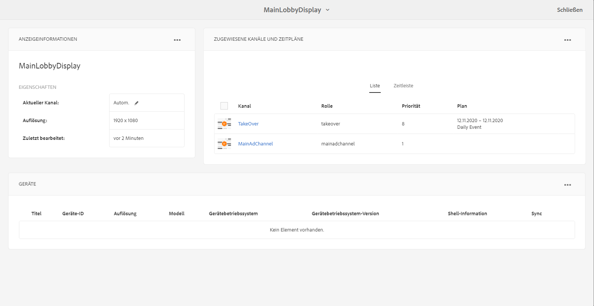

# Unbefristeter Übernahmekanal {#perpetual-takeover-channel}

Auf der folgenden Seite finden Sie ein Nutzungsszenario, in dem ein Projekt eingerichtet wird. In diesem wird ein unbefristeter Übernahmekanal erstellt, der an einem bestimmten Tag und zu einer bestimmten Zeit kontinuierlich wiedergegeben wird.

## Anwendungsfall – Beschreibung {#use-case-description}

In diesem Anwendungsfall wird erläutert, wie Sie einen Kanal erstellen, der die Funktion des normalerweise zur Wiedergabe verwendeten Kanals für eine Anzeige oder eine Gruppe von Anzeigen *übernimmt*. Die Übernahme erfolgt unbefristet an einem bestimmten Tag und zu einer bestimmten Zeit.
Beispielsweise gibt es einen unbefristeten Übernahmekanal, der jeden Freitag von 9:00 Uhr bis 10:00 Uhr wiedergegeben wird. Während dieser Zeit sollte kein anderer Kanal wiedergegeben werden. Das folgende Beispiel zeigt die Erstellung eines unbefristeten Übernahmekanals, der es ermöglicht, den Inhalt jeden Mittwoch für 2 Stunden von 14:00 Uhr bis 16:00 Uhr wiederzugeben.

### Voraussetzungen {#preconditions}

Bevor Sie mit diesem Nutzungsszenario beginnen, sollten Sie sich mit den folgenden Themen vertraut machen:

* **[Erstellen und Verwalten von Kanälen](managing-channels.md)**
* **[Erstellen und Verwalten von Standorten](managing-locations.md)**
* **[Erstellen und Verwalten von Zeitplänen](managing-schedules.md)**
* **[Geräteregistrierung](device-registration.md)**

### Hauptakteure {#primary-actors}

Autoren von Inhalten

## Einrichten des Projekts {#setting-up-the-project}

Gehen Sie wie folgt vor, um ein Projekt einzurichten:

**Einrichten der Kanäle und Anzeigen**

1. Erstellen Sie ein AEM Screens-Projekt mit dem Namen **PerpetualTakeOver**, wie unten dargestellt.

   

1. Erstellen Sie einen Kanal **MainAdChannel** im Ordner **Kanäle**.

   

1. Klicken Sie auf den Kanal **MainAdChannel** und dann in der Aktionsleiste auf **Bearbeiten**. Ziehen Sie einige Assets (Bilder, Videos, eingebettete Sequenzen) in Ihren Kanal.

   

   >[!NOTE]
   >Der Kanal **MainAdChannel** in diesem Beispiel ist ein Sequenzkanal, der Inhalt kontinuierlich wiedergibt.

1. Erstellen Sie einen Kanal **TakeOver**, der den Inhalt des Kanals **MainAdChannel** übernimmt und jeden Mittwoch von 14:00 bis 16:00 Uhr wiedergibt.

1. Wählen Sie den Kanal **TakeOver** aus und klicken Sie in der Aktionsleiste auf **Bearbeiten**. Ziehen Sie einige Assets in Ihren Kanal. Im folgenden Beispiel wird gezeigt, wie Sie diesem Kanal ein Bild für eine Einzelzone hinzufügen.

   

1. Richten Sie einen Standort und eine Anzeige für Ihre Kanäle ein. Beispielsweise werden für dieses Projekt der Standort **MainLobby** und die Anzeige **MainLobbyDisplay** eingerichtet.

   

**Zuweisen von Kanälen zu einer Anzeige**

1. Wählen Sie die Anzeige **MainLobbyDisplay** aus dem Ordner **Standorte** aus. Klicken Sie in der Aktionsleiste auf **Kanal zuweisen**, um das Dialogfeld **Kanalzuweisung** zu öffnen.

   >[!NOTE]
   >Informationen zum Zuweisen eines Kanals zu einer Anzeige finden Sie unter **[Kanalzuweisung](channel-assignment.md)**.

1. Füllen Sie die Felder (**Kanalpfad**, **Priorität** und **Unterstützte Ereignisse**) aus dem Dialogfeld **Kanalzuweisung** aus und klicken Sie auf **Speichern**, um Ihrer Anzeige den Kanal **MainAdChannel** zuzuweisen.

   * **Kanalpfad**: Wählen Sie den Pfad zum Kanal **MainAdChannel** aus
   * **Priorität**: Legen Sie die Priorität dieses Kanals auf „1“ fest.
   * **Unterstützte Ereignisse**: Wählen Sie **Erster Ladevorgang** und **Bildschirm bei Untätigkeit** aus.

   

1. Wählen Sie die Anzeige **TakeOver** aus dem Ordner **Standorte** aus. Klicken Sie in der Aktionsleiste auf **Kanal zuweisen**, um den Übernahmekanal zuzuweisen.

1. Weisen Sie Ihrer Anzeige den Kanal **TakeOver** zu einem geplanten Zeitpunkt zu. Füllen Sie dann die folgenden Felder dem Dialogfeld **Kanalzuweisung** aus und wählen Sie **Speichern** aus:

   * **Kanalpfad**: Wählen Sie den Pfad zum Kanal **TakeOver** aus
   * **Priorität**: Legen Sie die Priorität dieses Kanals höher als die von **MainAdChannel** fest. Die in diesem Beispiel eingestellte Priorität ist beispielsweise „8“.
   * **Unterstützte Ereignisse**: Klicken Sie auf **Bildschirm bei Untätigkeit** und **Timer**.
   * **Zeitplan**: Geben Sie den Text für den Zeitplan ein, nach dem dieser Kanal in der Anzeige ausgeführt werden soll. Der in diesem Beispiel erwähnte Text im **Zeitplan** ist *am Mittwoch nach 14:00 und vor 16:00 Uhr*.

     >[!NOTE]
     >Weitere Informationen zu den Ausdrücken, die Sie dem **Zeitplan** hinzufügen können, finden Sie im Abschnitt [Beispielausdrücke](#example-expressions) unten.
   * **aktiv ab**: Startdatum und -zeit.
   * **aktiv bis**: Enddatum und -zeit.

     Zum Beispiel ermöglicht der Text unter **Zeitplan** sowie die Datums- und Uhrzeitangabe unter **aktiv ab** und **aktiv bis**, dass der Inhalt jeden Mittwoch von 14:00 bis 16:00 Uhr wiedergegeben wird.

     

     Navigieren Sie zur Anzeige unter **TakeOver** > **Standorte** > **MainLobby** > **MainLobbyDisplay**. Klicken Sie dann in der Aktionsleiste auf **Dashboard**, um die zugewiesenen Kanäle mit ihren Prioritäten anzuzeigen (siehe unten).

     >[!NOTE]
     >Es ist zwingend erforderlich, die Priorität des Übernahmekanals auf die höchste Stufe zu setzen.

     
Nun übernimmt der Kanal **TakeOver** den **MainAdChannel** jeden Mittwoch zwei Stunden lang (von 14:00 bis 16:00 Uhr) und gibt den Inhalt vom 9. Januar 2020 bis 31. Januar 2020 wieder.

## Beispielausdrücke {#example-expressions}

Die folgende Tabelle enthält einige Beispielausdrücke, die Sie dem Zeitplan hinzufügen können, während Sie einer Anzeige einen Kanal zuweisen.

| **Ausdruck** | **Interpretation** |
|---|---|
| vor 8:00 Uhr | Der Inhalt des Kanals wird täglich vor 8:00 Uhr wiedergegeben. |
| nach 14:00 Uhr | Der Inhalt des Kanals wird täglich nach 14:00 Uhr wiedergegeben. |
| nach 12:15 Uhr und vor 12:45 Uhr | Der Inhalt des Kanals wird täglich 30 Minuten lang nach 12:15 Uhr wiedergegeben. |
| vor 12:15 Uhr auch nach 12:45 Uhr | Der Kanal wird täglich vor 12:15 Uhr und danach auch nach 12:45 Uhr wiedergegeben |
| am 1. Januar nach 14:00 Uhr, außerdem am 2. Januar und am 3. Januar vor 3:00 Uhr | Der Kanal startet die Wiedergabe am 01. Januar um 14:00 Uhr und läuft am 02. Januar den ganzen Tag bis um 3:00 Uhr am 03. Januar. |
| am 1./2. Januar nach 14:00 Uhr, auch am 2./3. Januar vor 3:00 Uhr | Der Kanal startet den Player am 01. Januar um 14:00 Uhr, läuft bis 3:00 Uhr am 02. Januar und beginnt dann wieder am 02. Januar um 14:00 Uhr, um bis 3:00 Uhr am 03. Januar zu laufen. |

>[!NOTE]
>
>Statt mit dem _24-Stunden-Format_ (z. B. 14:00 Uhr) kann die Zeit auch mit *A.M./P.M* (z. B. 2:00 P.M.) angegeben werden.
