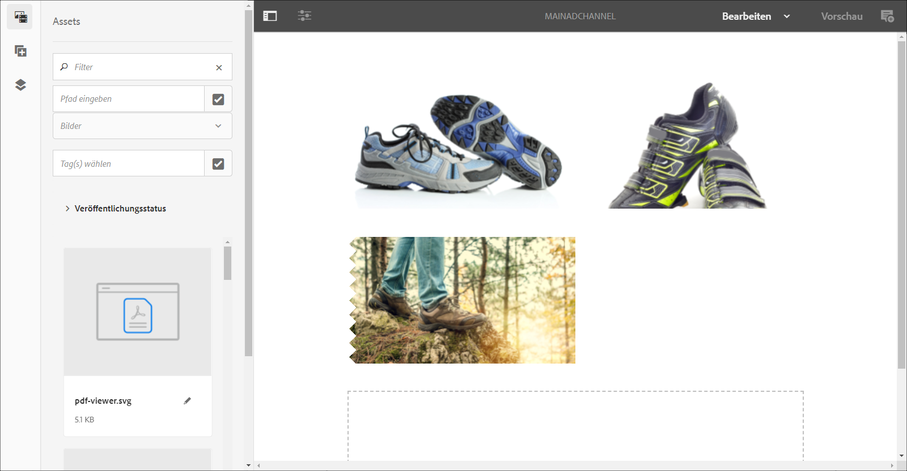
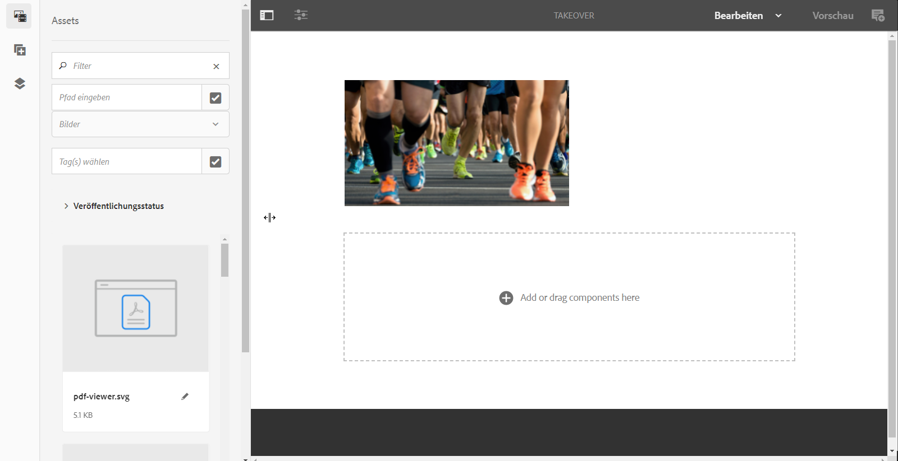
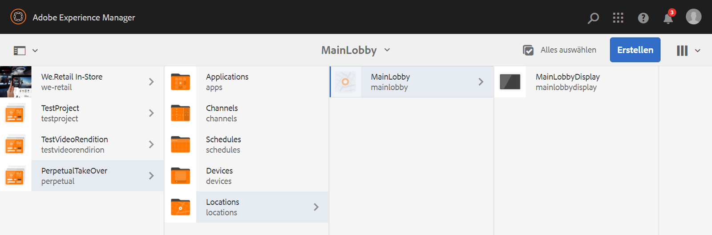
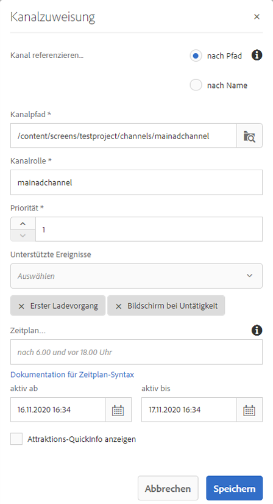
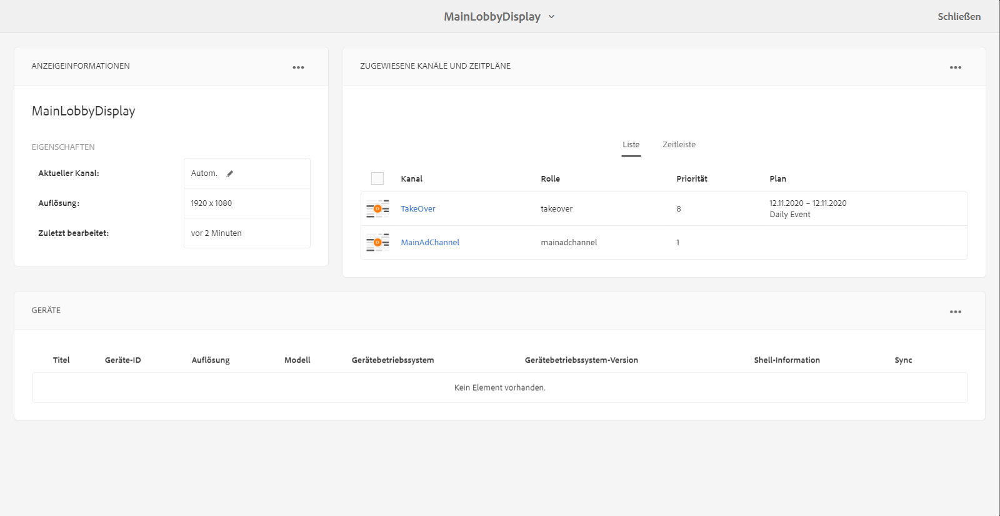

# Unbefristeter Übernahmekanal {#perpetual-takeover-channel}

>[!IMPORTANT]
>Dieser Inhalt gilt für AEM On-Premise/AMS (AEM 6.5LTS und AEM 6.5). Informationen zu AEM as a Cloud Service Screens-Inhalten finden Sie im [AEM as a Cloud Service-Handbuch](https://experienceleague.adobe.com/de/docs/experience-manager-cloud-service/content/screens-as-cloud-service/overview/introduction).

Auf der folgenden Seite finden Sie ein Nutzungsszenario, in dem ein Projekt eingerichtet wird. In diesem wird ein unbefristeter Übernahmekanal erstellt, der an einem bestimmten Tag und zu einer bestimmten Zeit kontinuierlich wiedergegeben wird.

## Anwendungsfall – Beschreibung {#use-case-description}

In diesem Anwendungsbeispiel wird erläutert, wie Sie einen Kanal erstellen *der* normalen Wiedergabekanal für ein Display oder eine Gruppe von Displays übernimmt. Die Übernahme erfolgt an einem bestimmten Tag und zu einer bestimmten Uhrzeit ständig.
Zum Beispiel gibt es einen Perpetual TakeOver Kanal, der jeden Freitag von 9 :00 bis 10 :00 spielt. Während dieser Zeit sollte kein anderer Kanal abgespielt werden. Das folgende Beispiel zeigt die Erstellung eines unbefristeten Übernahmekanals, in dem der Inhalt jeden Mittwoch für zwei Stunden von 14 :00 16 :00 abgespielt werden kann.

### Voraussetzungen {#preconditions}

Bevor Sie mit diesem Nutzungsszenario beginnen, sollten Sie sich mit den folgenden Themen vertraut machen:

* **[Erstellen und Verwalten von Kanälen](managing-channels.md)**
* **[Erstellen und Verwalten von Standorten](managing-locations.md)**
* **[Erstellen und Verwalten von Zeitplänen](managing-schedules.md)**
* **[Geräteregistrierung](device-registration.md)**

### Hauptakteure {#primary-actors}

Autoren von Inhalten

## Einrichten des Projekts {#setting-up-the-project}

Gehen Sie wie folgt vor, um ein Projekt einzurichten:

**Einrichten der Kanäle und Anzeigen**

1. Erstellen Sie ein AEM Screens-Projekt mit dem Namen **PerpetualTakeOver**, wie unten dargestellt.

   

1. Erstellen Sie einen Kanal **MainAdChannel** im Ordner **Kanäle**.

   

1. Klicken Sie auf den Kanal **MainAdChannel** und dann in der Aktionsleiste auf **Bearbeiten**. Ziehen Sie einige Assets (Bilder, Videos, eingebettete Sequenzen) in Ihren Kanal.

   

   >[!NOTE]
   >Der Kanal **MainAdChannel** in diesem Beispiel ist ein Sequenzkanal, der Inhalt kontinuierlich wiedergibt.

1. Erstellen Sie einen **TakeOver**-Kanal, der den Inhalt in **MainAdChannel** übernimmt und jeden Mittwoch von 14 :00 bis 16 :00 wiedergegeben wird.

1. Wählen Sie den Kanal **TakeOver** aus und klicken Sie in der Aktionsleiste auf **Bearbeiten**. Ziehen Sie einige Assets in Ihren Kanal. Im folgenden Beispiel wird gezeigt, wie Sie diesem Kanal ein Bild für eine Einzelzone hinzufügen.

   

1. Richten Sie einen Standort und eine Anzeige für Ihre Kanäle ein. Beispielsweise werden für dieses Projekt der Standort **MainLobby** und die Anzeige **MainLobbyDisplay** eingerichtet.

   

**Zuweisen von Kanälen zu einer Anzeige**

1. Wählen Sie die Anzeige **MainLobbyDisplay** aus dem Ordner **Standorte** aus. Klicken Sie in der Aktionsleiste auf **Kanal zuweisen**, um das Dialogfeld **Kanalzuweisung** zu öffnen.

   >[!NOTE]
   >Informationen zum Zuweisen eines Kanals zu einer Anzeige finden Sie unter **[Kanalzuweisung](channel-assignment.md)**.

1. Füllen Sie die Felder (**Kanalpfad**, **Priorität** und **Unterstützte Ereignisse**) aus dem Dialogfeld **Kanalzuweisung** aus und klicken Sie auf **Speichern**, um Ihrer Anzeige den Kanal **MainAdChannel** zuzuweisen.

   * **Kanalpfad**: Wählen Sie den Pfad zum Kanal **MainAdChannel** aus
   * **Priorität**: Legen Sie die Priorität dieses Kanals auf „1“ fest.
   * **Unterstützte Ereignisse**: Wählen Sie **Erster Ladevorgang** und **Bildschirm bei Untätigkeit** aus.

   

1. Wählen Sie die Anzeige **TakeOver** aus dem Ordner **Standorte** aus. Klicken Sie in der Aktionsleiste auf **Kanal zuweisen**, um den Übernahmekanal zuzuweisen.

1. Weisen Sie Ihrer Anzeige den Kanal **TakeOver** zu einem geplanten Zeitpunkt zu. Füllen Sie dann die folgenden Felder dem Dialogfeld **Kanalzuweisung** aus und wählen Sie **Speichern** aus:

   * **Kanalpfad**: Wählen Sie den Pfad zum Kanal **TakeOver** aus
   * **Priorität**: Legen Sie die Priorität dieses Kanals höher als die von **MainAdChannel** fest. Die in diesem Beispiel eingestellte Priorität ist beispielsweise „8“.
   * **Unterstützte Ereignisse**: Klicken Sie auf **Bildschirm bei Untätigkeit** und **Timer**.
   * **Zeitplan**: Geben Sie den Text für den Zeitplan ein, nach dem dieser Kanal in der Anzeige ausgeführt werden soll. Der Text im **Zeitplan** in diesem Beispiel erwähnt wird *am Mittwoch nach 14:00 und vor 16:00*.

     >[!NOTE]
     >Weitere Informationen zu den Ausdrücken, die Sie dem **Zeitplan** hinzufügen können, finden Sie im Abschnitt [Beispielausdrücke](#example-expressions) unten.
   * **aktiv ab**: Startdatum und -zeit.
   * **aktiv bis**: Enddatum und -zeit.

     Zum Beispiel ermöglicht der Text in **Zeitplan** und **aktiv ab** und **aktiv bis** Datum und Uhrzeit, dass der Inhalt jeden Mittwoch von 14:00 bis 16:00 Uhr wiedergegeben wird.

     

     Navigieren Sie zur Anzeige unter **TakeOver** > **Standorte** > **MainLobby** > **MainLobbyDisplay**. Klicken Sie dann in der Aktionsleiste auf **Dashboard**, um die zugewiesenen Kanäle mit ihren Prioritäten anzuzeigen (siehe unten).

     >[!NOTE]
     >Es ist zwingend erforderlich, die Priorität des Übernahmekanals auf die höchste Stufe zu setzen.

     
Der Kanal **TakeOver** übernimmt nun jeden Mittwoch um 14 :00 Uhr den **MainAdChannel** und spielt seinen Inhalt vom 09. Januar 2020 bis zum 31. Januar 2020 um 16 :00 Uhr ab.

## Beispielausdrücke {#example-expressions}

Die folgende Tabelle enthält einige Beispielausdrücke, die Sie dem Zeitplan hinzufügen können, während Sie einer Anzeige einen Kanal zuweisen.

| **Ausdruck** | **Interpretation** |
|---|---|
| vor :00 h. | Der Kanal spielt jeden :00 vor 8 Uhr morgens |
| nach :00 Uhr nachmittags | Der Kanal spielt jeden :00 um 14 Uhr |
| Nach 12:15 und vor 12:45 | Der Kanal spielt nach 12 :15 täglich 30 Minuten |
| Vor 12:15 auch nach 12:45 | Der Kanal spielt jeden :15 vor 12 Uhr und dann auch nach :45 Uhr. |
| am ersten Januartag nach 14 :00, auch am zweiten Januartag und auch am dritten Januartag vor 3 :00 Uhr. | Der Kanal beginnt nach 14 :00 am 01. Januar, spielt den ganzen Tag am 02. Januar bis 3:00 Uhr am 03. Januar weiter |
| An den 1-2 Tagen des Januar nach :00 Uhr auch an den 2-3 Tagen des Januar vor :00 Uhr. | Der Kanal beginnt am 01. Januar um 14 :00, läuft bis am 02. Januar um :00 Uhr, dann beginnt er am 02. Januar um 14 :00 erneut und läuft bis zum 3. :00 am 03. Januar |

>[!NOTE]
>
>Sie können auch _Militärische Zeit_ Notation (14:00) anstelle von *A.M./P.M.* (14:00) verwenden.
