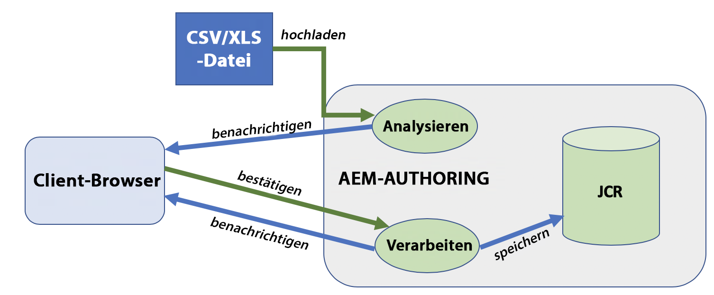
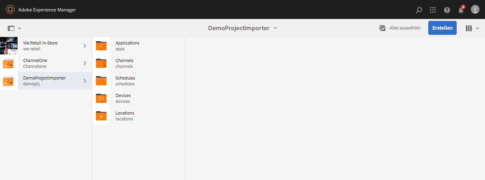
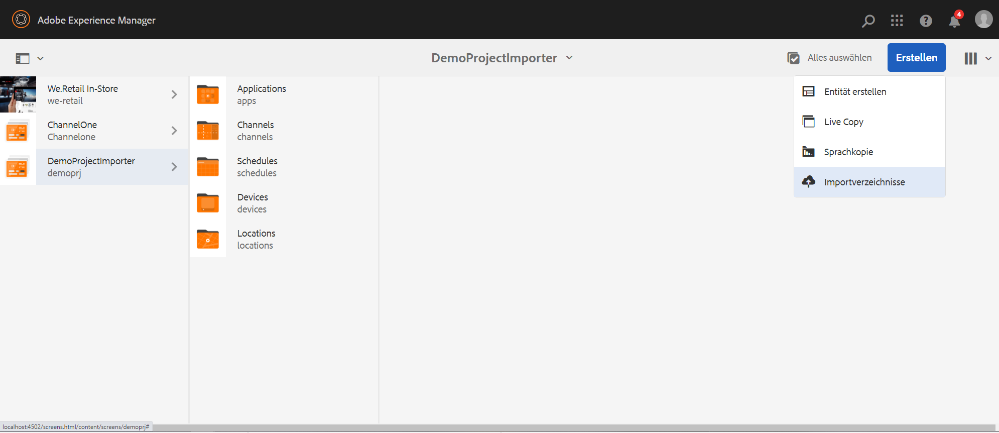
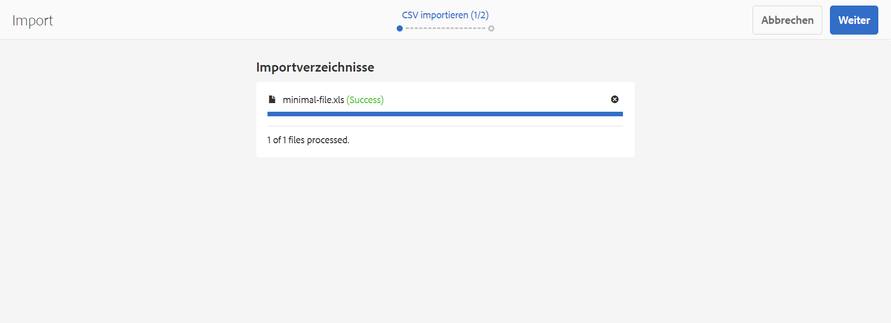
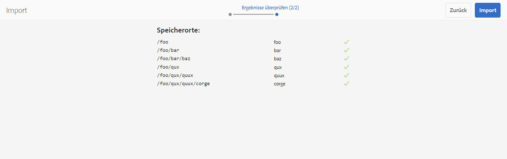
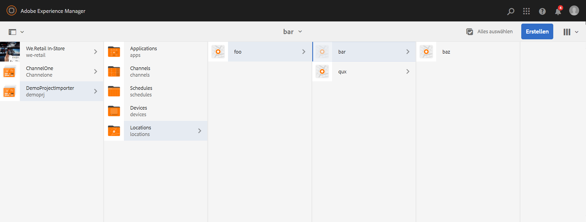

# Importer für neue Projekte aus einer Datei {#new-project-importer-from-file}

In diesem Abschnitt wird eine Funktionalität beschrieben, mit der Sie verschiedene Standorte aus einer CSV/XLS-Tabelle per Massenimport in Ihr AEM Screens-Projekt importieren können.

## Einführung {#introduction}

Wenn Sie zum ersten Mal in Ihrer Organisation ein AEM Screens-Projekt einrichten, müssen Sie auch alle Standorte erstellen. Bei einem Projekt mit vielen Standorten ist dies eine durchaus mühsame Aufgabe, mit großem Auswahlaufwand und entsprechender Warterei in der Benutzeroberfläche.

Das Ziel dieser Funktion ist es, die Zeit für die Einrichtung des Projekts zu reduzieren und somit Budgetierungsprobleme zu lösen.

Diese Funktion ermöglicht es dem Autor, eine Tabelle als Eingabedatei bereitzustellen und das System automatisch die Standortstruktur im Back-End erstellen zu lassen:

* *Dies ist wesentlich effizienter als eine manuelle Auswahl in der Benutzeroberfläche.*
* *ermöglicht es der Kundin oder dem Kunden, ihre bzw. seine Standorte aus dem eigenen System zu exportieren und einfach direkt in AEM zu importieren*

Durch dieses Vorgehen sparen Sie Zeit und Geld bei der ersten Projekteinrichtung oder beim Erweitern bestehender AEM Screens-Projekte auf neue Standorte.

## Architektonische Übersicht {#architectural-overview}

Das folgende Diagramm zeigt die Architekturübersicht für die Projekt-Importer-Funktion:

### Datenmodell {#data-model}

Im Folgenden wird das Datenmodell für den Projekt-Importer beschrieben:

>[!NOTE]
>
>Die aktuelle Version unterstützt nur das Importieren von Standorten.

| **Eigenschaft** | **Beschreibung** |
|---|---|
| ***`path {string*}`*** | Der Ressourcenpfad für den Standort |
| ***`[./jcr:title] {string*}`*** | Der Name der zu verwendenden Vorlage (d. h. Standort für *screens/core/templates/location*) |
| ***`template {string}`*** | Optionaler Titel für die Seite |
| ***`[./jcr:description] {string}`*** | Optionale Beschreibung für die Seite |

Für die Tabellendatei (CSV/XLS) sind daher die folgenden Spalten erforderlich:

* **path {string}** Der Pfad für den zu importierenden Standort, wobei der Stammordner des Pfades der Standortordner für das Projekt ist (d. h. *`/foo`* wird in *`/content/screens/<project>/locations/foo`* importiert).
* **template {string}** Die Vorlage, die für den neuen Standort verwendet werden soll. Im Moment ist nur der Wert „location“ erlaubt, aber dieser Wert wird in Zukunft auf alle Screens-Vorlagen ausgedehnt (`display`, `sequencechannel`).
* **[./*] {string}** Jede optionale Eigenschaft, die für den Standort festgelegt wird (d. h. `./jcr:title`, `./jcr:description`, `./foo, ./bar`). Die aktuelle Version erlaubt keine Filterung.

>[!NOTE]
>
>Sämtliche Spalten, die nicht den oben genannten Bedingungen entsprechen, werden ignoriert. Wenn Sie beispielsweise eine andere Spalte in Ihrer Tabellendatei (CSV/XLS) als **Pfad**, **Vorlage**, **Titel** und **Beschreibung** definiert haben, werden diese Felder ignoriert. Zudem überprüft der **Projekt-Importer** diese zusätzlichen Felder nicht, um Ihr Projekt in Ihr AEM Screens-Projekt zu importieren.

## Verwenden des Projekt-Importers {#using-project-importer}

Im folgenden Abschnitt wird beschrieben, wie der Projekt-Importer in einem AEM Screens-Projekt verwendet wird.

>[!CAUTION]
>
>Beschränkungen:
>
>* Andere Dateien als CSV/XLS/XLSX-Erweiterungen werden in der aktuellen Version nicht unterstützt.
>* Für importierte Dateien gibt es keine Filterung der Eigenschaften und es wird alles importiert, was mit „./“ beginnt.
>

### Voraussetzungen {#prerequisites}

* Erstellen Sie ein neues Projekt mit dem Namen **DemoProjectImport**.

* Verwenden Sie eine CSV- oder Excel-Beispieldatei, die Sie importieren müssen.

Zu Demozwecken können Sie eine Excel-Datei aus dem folgenden Abschnitt herunterladen.

[Datei abrufen](assets/minimal-file.xls)

### Importieren der Datei mit den erforderlichen Mindestfeldern {#importing-the-file-with-minimum-required-fields}

Gehen Sie wie folgt vor, um eine Datei mit den erforderlichen Mindestfeldern in den Standortordner zu importieren:

>[!NOTE]
>
>Das folgende Beispiel zeigt die vier Felder, die mindestens zum Importieren des Projekts erforderlich sind:

1. Navigieren Sie zu Ihrem AEM Screens-Projekt (**DemoProjectImport**).

   

1. Klicken Sie auf das Projekt *DemoProjectImporter“ **>** „Erstellen“ **>** „Importverzeichnisse“ aus der Seitenleiste.

   

1. Der **Importassistent** wird angezeigt. Klicken Sie auf die Datei mit den Standorten für Ihr Projekt oder die Datei ***minimal-file.xls***, die Sie im Abschnitt *Voraussetzungen* heruntergeladen haben.

   Klicken Sie nach Auswahl der Datei auf **Weiter**.

   

1. Überprüfen Sie den Inhalt der Datei (Standorte) im Importassistenten und klicken Sie auf **Importieren**.

   

1. Dadurch können Sie nun alle in Ihr Projekt importierten Standorte anzeigen.

   
