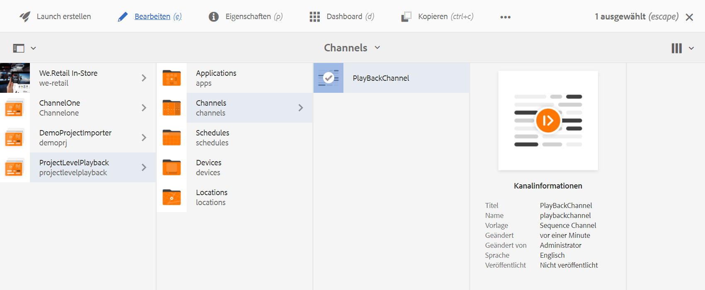
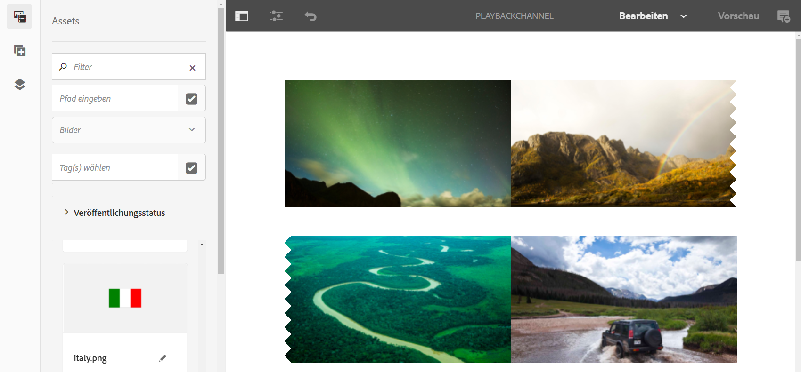
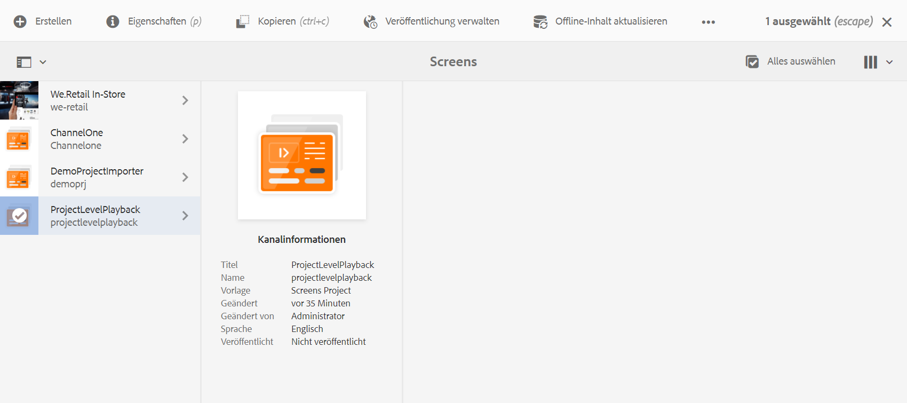

# Dauer der Bildwiedergabe auf Projektebene {#project-level-image-playback}

## Überblick {#overview}

Mit dieser Funktion können Sie die Dauer der Bildwiedergabe auf der Projektebene festlegen. Diese Wiedergabedauer wird von allen Bildern standardmäßig übernommen. Wenn auf Projektebene keine Dauer definiert ist, wird die Standardwiedergabe von 8 Sekunden fortgeführt.

### Voraussetzungen {#prerequisites}

Bevor Sie mit der Verwendung dieser Funktion beginnen, richten Sie ein Projekt als Voraussetzung für die Implementierung dieser Funktion ein.  Zum Beispiel:

1. Erstellen eines AEM Screens-Projekts (in diesem Beispiel **ProjectLevelPlayback**).
1. Erstellen eines Sequenzkanals als **PlayBackChannel** im Ordner **Kanäle**.
1. Hinzufügen von Inhalten zum **PlayBackChannel**

   

   Die folgende Abbildung zeigt beispielsweise die Bilder, die dem **PlayBackChannel**-Editor hinzugefügt wurden:

   

## Bearbeiten der Zuweisung der Bildwiedergabedauer auf Projektebene {#editing-project-level-image-playback-duration-assignment}

Im folgenden Abschnitt wird beschrieben, wie Sie die Wiedergabedauer von Inhalten in einem AEM Screens-Projekt bearbeiten.

### Aktualisieren der Wiedergabedauer für Bilder auf Projektebene {#updating-the-playback-duration-for-images-in-a-project}

>[!NOTE]
>
>Wenn Sie die Wiedergabedauer auf Bild- oder Kanalebene aktualisieren möchten, lesen Sie die Informationen unter [Bildwiedergabedauer auf Kanalebene](channel-level-image-playback.md).

Gehen Sie wie folgt vor, um zu erfahren, wie Sie die Wiedergabedauer auf Projektebene aktualisieren:

1. Navigieren Sie zu Ihrem Projekt (**ProjectLevelPlayback**) und klicken Sie in der Aktionsleiste auf **Eigenschaften**.
   

1. Klicken Sie auf alle Bilder im Kanal und klicken Sie oben links auf das Schraubenschlüsselsymbol (wie in der Abbildung unten gezeigt), damit Sie das Dialogfeld Konfigurieren auf Kanalebene öffnen können.

   

1. Das Dialogfeld **Seite** wird geöffnet.

   >[!NOTE]
   >
   >Standardmäßig sind die Bilder in einem Kanal auf eine Wiedergabedauer von 8 Sekunden eingestellt, während Videos mit ihrer Standarddauer abgespielt werden.

   

   Ändern Sie die **Dauer** von 8000 (Millisekunden) in 3000 (Millisekunden), d. h. 3 Sekunden. Markieren Sie das Häkchen oben rechts im **Seite** angezeigt, damit Ihre Änderungen gespeichert werden.

   

### Anzeigen des Ergebnisses {#viewing-the-result}

Nachdem Sie die Dauer der Kanalwiedergabe (in diesem Beispiel alle drei Bilder) aktualisiert haben, werden Sie feststellen, dass die Bilder jetzt jeweils für 3 Sekunden statt für 8 Sekunden (Standardwert) wiedergegeben werden.

