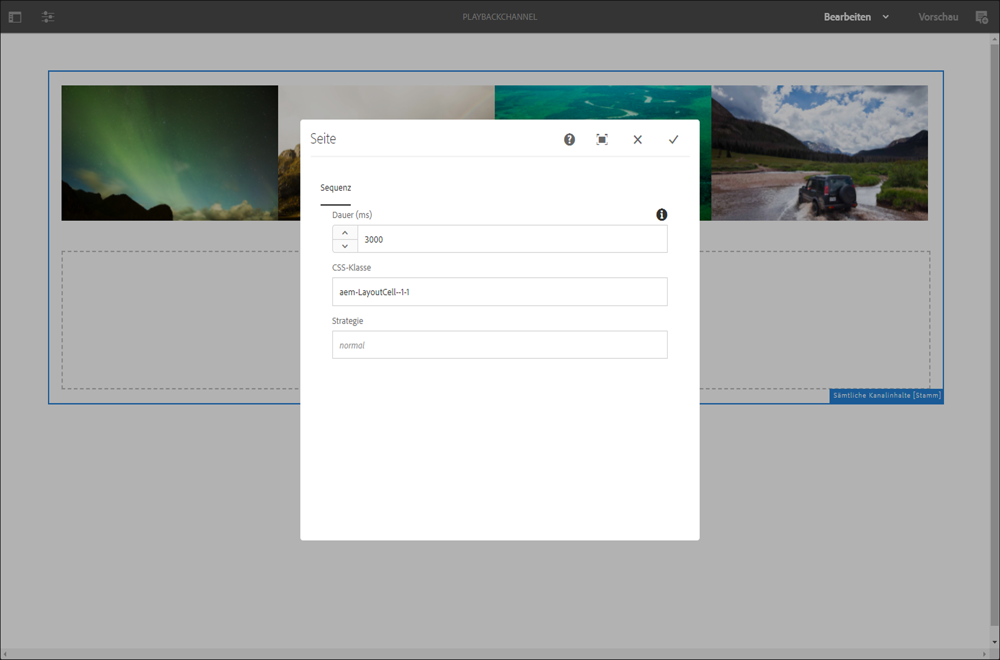

# Bildwiedergabedauer auf Projektebene {#project-level-image-playback}

## Übersicht {#overview}

Mit dieser Funktion können Sie die Dauer der Bildwiedergabe auf Projektebene festlegen. Diese Wiedergabedauer wird von allen Bildern standardmäßig übernommen. Wenn auf Projektebene keine Dauer definiert ist, wird die standardmäßige Wiedergabe von 8 Sekunden fortgesetzt.

### Voraussetzungen {#prerequisites}

Bevor Sie diese Funktion verwenden, richten Sie ein Projekt als Voraussetzung für die Implementierung dieser Funktion ein. Beispiel:

1. Erstellen eines AEM Screens-Projekts (in diesem Beispiel ) **ProjectLevelPlayback**).
1. Erstellen eines Sequenzkanals als **PlayBackChannel** under **Kanäle** Ordner.
1. Hinzufügen von Inhalten zu **PlayBackChannel**.

   

   Die folgende Abbildung zeigt beispielsweise die Bilder, die dem **PlayBackChannel**-Editor hinzugefügt wurden:

   

## Bearbeiten der Zuweisung der Bildwiedergabedauer auf Projektebene {#editing-project-level-image-playback-duration-assignment}

Im folgenden Abschnitt wird beschrieben, wie Sie die Wiedergabedauer von Inhalten in einem AEM Screens-Projekt bearbeiten.

### Aktualisieren der Wiedergabedauer für Bilder auf Projektebene {#updating-the-playback-duration-for-images-in-a-project}

>[!NOTE]
>
>Wenn Sie die Wiedergabedauer auf Bild- oder Kanalebene aktualisieren möchten, lesen Sie [Bildwiedergabedauer auf Kanalebene](channel-level-image-playback.md).

Gehen Sie wie folgt vor, um zu erfahren, wie Sie die Wiedergabedauer auf Projektebene aktualisieren:

1. Navigieren Sie zu Ihrem Projekt (**ProjectLevelPlayback**) und klicken Sie in der Aktionsleiste auf **Eigenschaften**.
   

1. Wählen Sie alle Bilder im Kanal aus und klicken Sie oben links auf das Schraubenschlüsselsymbol (wie in der Abbildung unten gezeigt), damit Sie das Dialogfeld Konfigurieren auf Kanalebene öffnen können.

   

1. Die **Seite** wird geöffnet.

   >[!NOTE]
   >
   >Standardmäßig sind die Bilder in einem Kanal auf eine Wiedergabedauer von 8 Sekunden eingestellt, während Videos mit ihrer Standarddauer abgespielt werden.

   

   Bearbeiten Sie die **Dauer** von 8000 (Millisekunden) bis 3000 (Millisekunden), also 3 Sekunden. Klicken Sie oben rechts im **Seite** angezeigt, damit Ihre Änderungen gespeichert werden.

   

### Anzeigen des Ergebnisses {#viewing-the-result}

Nachdem Sie die Dauer der Kanalwiedergabe (in diesem Beispiel alle drei Bilder) aktualisiert haben, beachten Sie, dass die Bilder jetzt für 3 Sekunden statt für 8 Sekunden wiedergegeben werden (Standardwert).

