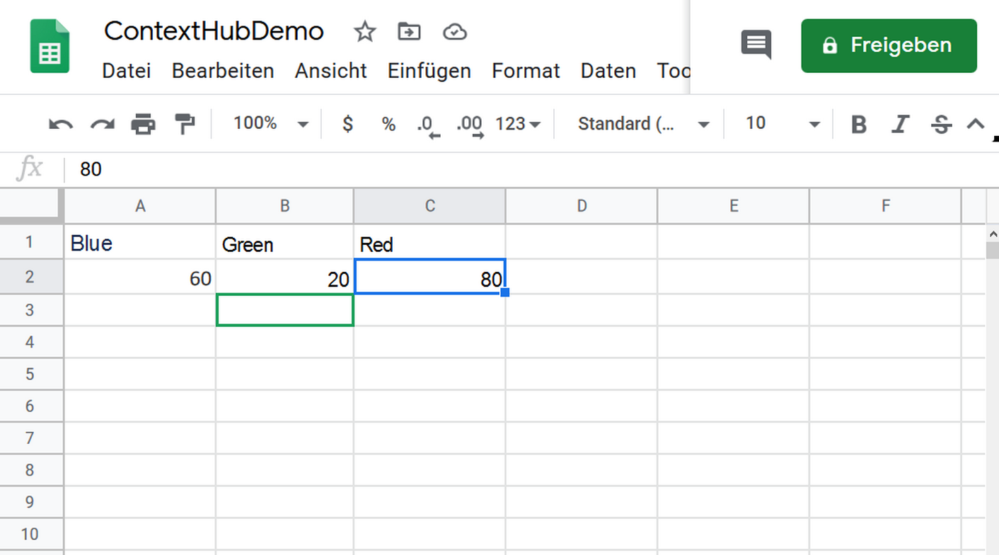
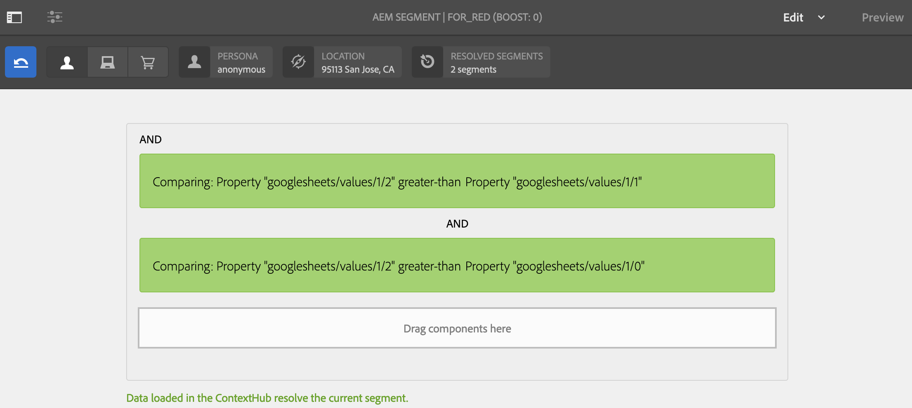
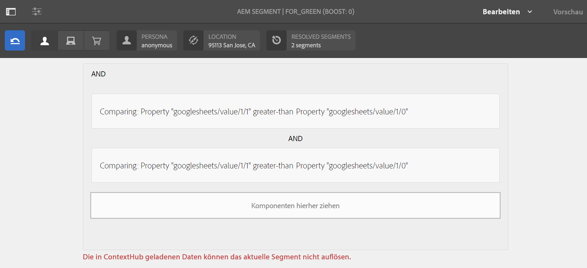
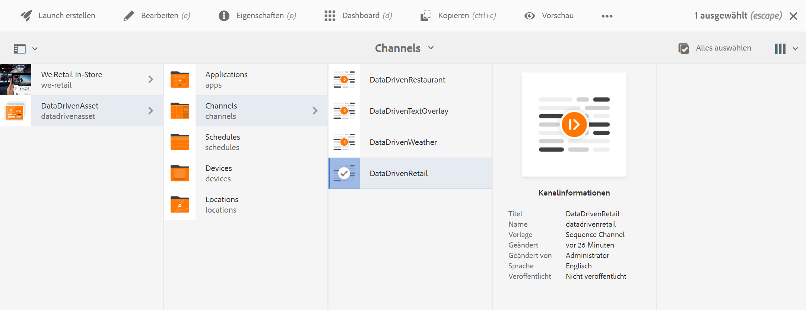
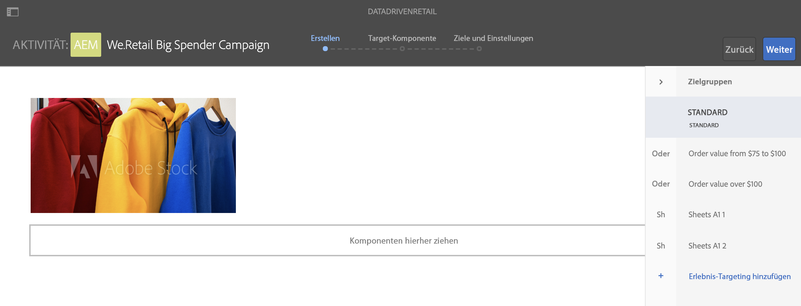
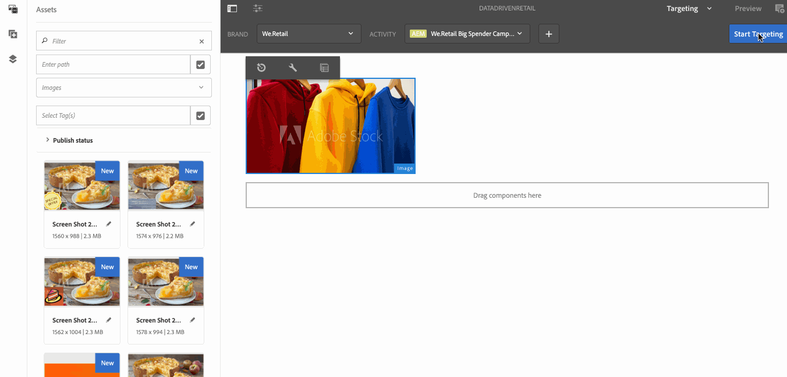

# Zielgerichtete Aktivierung des Lagerbestands im Einzelhandel {#retail-inventory-targeted-activation}

Im folgenden Anwendungsbeispiel werden je nach den Werten in Ihrer Google Tabelle drei verschiedene Bilder dargestellt.

## Beschreibung {#description}

In diesem Anwendungsfall wird der Lagerbestand im Einzelhandel für drei verschiedenfarbige Sweatshirts präsentiert. Je nachdem, wie viele Sweatshirts auf Lager sind (erfasst in Google Tabellen), wird das Bild (rotes, grünes oder blaues Sweatshirt) mit der höchsten Zahl angezeigt.

Das rote, grüne oder blaue Sweatshirt wird basierend auf der höchsten Anzahl verfügbarer Sweatshirts angezeigt.

## Voraussetzungen {#preconditions}

Bevor Sie die Targeting-Aktivierung für den Lagerbestand implementieren, müssen Sie wissen, wie Sie in einem AEM Screens-Projekt den ***Datenspeicher*** und die ***Zielgruppensegmentierung*** einrichten und das ***Targeting für Kanäle aktivieren***.

Genaue Informationen dazu finden Sie unter [Konfigurieren von ContextHub in AEM Screens](configuring-context-hub.md).

## Grundlegender Ablauf {#basic-flow}

Gehen Sie wie folgt vor, um das Anwendungsbeispiel zur Aktivierung des Einzelhandelsinventars zu implementieren:

1. **Ausfüllen der Google Tabellen**

   1. Navigieren Sie zur Google Tabelle „ContextHubDemo“.
   1. Fügen Sie drei Spalten (Rot, Grün und Blau) mit entsprechenden Werten für drei verschiedene Pullover hinzu.

   

1. **Konfigurieren der Zielgruppen gemäß den Anforderungen**

   1. Navigieren Sie zu den Segmenten in Ihrer Zielgruppe (weitere Informationen unter ***Schritt 2: Einrichten der Zielgruppensegmentierung*** auf der Seite **[Konfigurieren von ContextHub in AEM Screens](configuring-context-hub.md)**).

   1. Fügen Sie drei neue Segmente **Für_Rot**, **Für_Grün** und **Für_Blau** hinzu.

   1. Klicken Sie auf **Für_Rot** und dann in der Aktionsleiste auf **Bearbeiten**.

   1. Ziehen Sie die Komponente **Vergleich: Eigenschaft – Eigenschaft** in den Editor.
   1. Klicken Sie auf das Symbol **Konfiguration**.
   1. Klicken Sie im Dropdown-Menü **Erster Eigenschaftsname** auf **googlesheets/value/1/2**.
   1. Klicken Sie im Dropdown-Menü **Operator** auf **größer als**.
   1. Klicken Sie unter **Datentyp** auf **Zahl**.
   1. Klicken Sie im Dropdown-Menü **Zweiter Eigenschaftsname** auf **googlesheets/value/1/0**.
   1. Ziehen Sie eine weitere Komponente **Vergleich: Eigenschaft – Eigenschaft** in den Editor und klicken Sie auf das Symbol **Konfiguration**.
   1. Klicken Sie im Dropdown-Menü **Erster Eigenschaftsname** auf **googlesheets/value/1/2**.
   1. Klicken Sie im Dropdown-Menü **Operator** auf **größer als**.
   1. Klicken Sie unter **Datentyp** auf **Zahl**.
   1. Klicken Sie im Dropdown-Menü **Zweiter Eigenschaftsname** auf **googlesheets/value/1/0**.

   

   Bearbeiten Sie auf gleiche Weise Vergleichseigenschaftsregeln für das Segment **Für_Blau** und fügen Sie diese hinzu, wie in der folgenden Abbildung dargestellt:

   

   Bearbeiten Sie auf gleiche Weise Vergleichseigenschaftsregeln für das Segment **Für_Grün** und fügen Sie diese hinzu, wie in der folgenden Abbildung dargestellt:

   

   >[!NOTE]
   >
   >Sie werden feststellen, dass sich die Daten für die Segmente **Für_Grün** und **Für_Grün** im Editor nicht auflösen lassen, da gemäß den Werten in der Google Tabelle von nun an nur der erste Vergleich gültig ist.

1. Navigieren Sie zum Kanal **DataDrivenRetail** (ein Sequenzkanal) und klicken Sie darauf.
1. Klicken Sie in der Aktionsleiste auf **Bearbeiten**. 

   

   >[!CAUTION]
   >
   >Sie sollten Ihre **ContextHub**-**Konfigurationen** bereits über die **Eigenschaften** des Kanals auf der Registerkarte **Personalisierung** eingerichtet haben.

   

   >[!NOTE]
   >
   >Legen Sie die **Marke** und den **Bereich** fest, damit die Aktivitäten beim Starten des Targeting-Prozesses korrekt aufgeführt werden.

1. **Hinzufügen eines Standardbilds**

   1. Fügen Sie Ihrem Kanal ein Standardbild hinzu und klicken Sie auf **Targeting**.
   1. Klicken Sie auf **Marke** und **Aktivität** im Dropdown-Menü und dann auf **Targeting starten**.
   1. Klicken Sie auf **Targeting starten**.

   

   >[!NOTE]
   >
   >Bevor Sie mit dem Targeting beginnen, fügen Sie die Segmente (**Für_Grün**, **Für_Rot** und **Für_Blau**) hinzu, indem Sie in der Seitenleiste die Option **+ Experience Targeting hinzufügen** auswählen, wie in der folgenden Abbildung dargestellt.

   

1. Fügen Sie die Bilder den drei verschiedenen Szenarien hinzu, wie unten dargestellt.

   

1. **Überprüfen der Vorschau**

   1. Klicken Sie auf **Vorschau**. Öffnen Sie außerdem Ihre Google Tabelle und aktualisieren Sie den Wert.
   1. Ändern Sie den Wert für die drei verschiedenen Spalten. Beachten Sie, dass das Anzeigebild entsprechend dem höchsten Bestandswert geändert wird.

   
