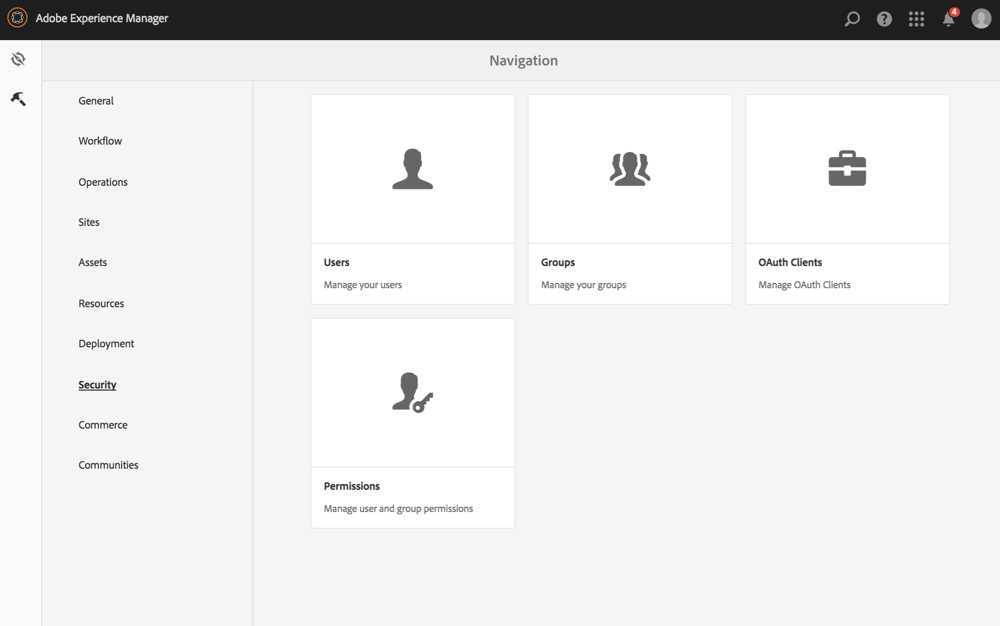

# Einrichten von ACLs {#setting-up-acls}

Im folgenden Abschnitt wird erläutert, wie Sie Projekte mithilfe von ACLs separieren können, sodass jede Person bzw. jedes Team ein eigenes Projekt erhält.

Als AEM-Administrator möchten Sie sicherstellen, dass Teammitglieder eines Projekts nicht in andere Projekte eingreifen und jedem Benutzer gemäß den Projektanforderungen spezifische Rollen zugewiesen werden.

## Einrichten von Berechtigungen {#setting-up-permissions}

Die folgenden Schritte fassen die Vorgehensweise zum Einrichten von ACLs für ein Projekt zusammen:

1. Melden Sie sich bei AEM an und navigieren Sie zu **Tools** > **Sicherheit**.

   

1. Auswählen **Gruppen** und geben Sie eine ID ein (z. B. Acme).

   Alternativ können Sie diesen Link verwenden: `http://localhost:4502/libs/granite/security/content/groupadmin.html`.

   Wählen Sie als Nächstes **Speichern**.

   

1. Auswählen **Mitarbeiter** aus der Liste aus und doppelklicken Sie darauf.

   

1. Fügen Sie die **Acme** (Projekt, das Sie erstellt haben) in **Mitglieder zu Gruppe hinzufügen**. Wählen Sie **Speichern** aus.

   

   >[!NOTE]
   >
   >Wenn Sie möchten, dass Mitglieder aus Projekt-Teams Player registrieren (was die Erstellung eines Benutzers für jeden Player umfasst), suchen Sie nach der Gruppe „user-administrators“ und fügen Sie die ACME-Gruppe zu „user-administrators“ hinzu.

1. Fügen Sie alle Benutzer hinzu, die am **Acme** Projekt für **Acme** hinzugefügt.

   

1. Einrichten der Berechtigungen für die Gruppe **Acme** mithilfe dieses `(http://localhost:4502/useradmin)`.

   Gruppe auswählen **Acme** und wählen Sie die **Berechtigungen**.

   

### Berechtigungen {#permissions}

Die folgende Tabelle fasst den Pfad mit den Berechtigungen auf Projektebene zusammen:

| **Pfad** | **Berechtigung** | **Beschreibung** |
|---|---|---|
| `/apps/<project>` | READ | Bietet ggf. Zugriff auf Projektdateien. |
| `/content/dam/<project>` | ALLE | Bietet Zugriff zum Speichern von Projekt-Assets wie Bildern oder Videos in DAM. |
| `/content/screens/<project>` | ALLE | Entfernt den Zugriff auf alle anderen Projekte unter /content/screens. |
| `/content/screens/svc` | READ | Bietet Zugriff auf den Registrierungsdienst. |
| `/libs/screens` | READ | Bietet Zugriff auf DCC. |
| `/var/contentsync/content/screens/` | ALLE | Ermöglicht die Aktualisierung von Offline-Inhalten für das Projekt. |

>[!NOTE]
>
>Manchmal können Sie Autorenfunktionen (z. B. das Verwalten von Assets und Erstellen von Kanälen) von Administratorfunktionen (z. B. das Registrieren von Playern) trennen. Erstellen Sie in einem solchen Szenario zwei Gruppen und fügen Sie die Gruppe &quot;Autoren&quot;den Mitwirkenden und die Administratorgruppe sowohl den Mitwirkenden als auch den Benutzer-Administratoren hinzu.

### Erstellen von Gruppen {#creating-groups}

Beim Erstellen eines Projekts sollten auch Standard-Benutzergruppen mit einem grundlegenden Satz von Berechtigungen erstellt werden. Erweitern Sie die Berechtigungen auf die typischen, in AEM Screens definierten Rollen.

Sie können beispielsweise die folgenden projektspezifischen Gruppen erstellen:

* Screens-Projektadministratoren
* Screens-Projektoperatoren (Registrieren von Playern und Verwalten von Standorten und Geräten)
* Screens-Projektbenutzer (Arbeiten mit Kanälen, Zeitplänen und Kanalzuweisungen)

Die folgende Tabelle fasst die Gruppen mit Beschreibungen und Berechtigungen für ein AEM Screens-Projekt zusammen:

<table>
 <tbody>
  <tr>
   <td><strong>Gruppenname</strong></td>
   <td><strong>Beschreibung</strong></td>
   <td><strong>Berechtigungen</strong></td>
  </tr>
  <tr>
   <td>Screens-Administratoren  <em><code>screens-admins</code></em></td>
   <td>Zugriff auf AEM Screens-Funktionen auf Administratorebene</td>
   <td>
    <ul>
     <li>Mitglied der beitragenden Länder</li>
     <li>Mitglied von user-administrators</li>
     <li>ALL /content/screens</li>
     <li>ALL /content/dam</li>
     <li>ALL /content/experience-fragments</li>
     <li>ALL /etc/design/screens</li>
    </ul> </td>
  </tr>
  <tr>
   <td>Screens-Benutzer  <em><code>screens-users</code></em></td>
   <td>Erstellen und Aktualisieren von Kanälen und Zeitplänen und Zuweisen zu Standorten in AEM Screens</td>
   <td>
    <ul>
     <li>Mitglied der beitragenden Länder</li>
     <li><code>&lt;project&gt; /content/screens</code></li>
     <li><code>&lt;project&gt; /content/dam</code></li>
     <li><code>&lt;project&gt; /content/experience-fragments</code></li>
    </ul> </td>
  </tr>
  <tr>
   <td>Screens-Operatoren  <em><code>screens-operators</code></em></td>
   <td>Erstellen und aktualisieren Sie die Standortstruktur und registrieren Sie Player in AEM Screens</td>
   <td>
    <ul>
     <li>Mitglied der beitragenden Länder</li>
     <li><code>jcr:all /home/users/screens</code></li>
     <li><code>jcr:all /home/groups/screens</code></li>
     <li><code>&lt;project&gt; /content/screens</code></li>
    </ul> </td>
  </tr>
  <tr>
   <td>Screens-Player  <em><code>screens-&lt;project&gt;-devices</code></em></td>
   <td>Gruppiert alle Player und alle Player/Geräte sind automatisch Mitglieder der Mitwirkenden.</td>
   <td>
 Mitglied von „contributors“
 </td>
  </tr>
 </tbody>
</table>
