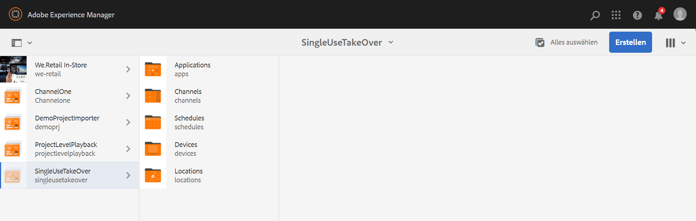
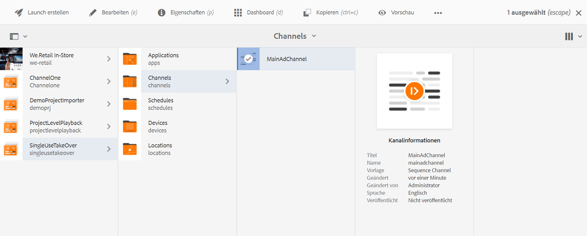
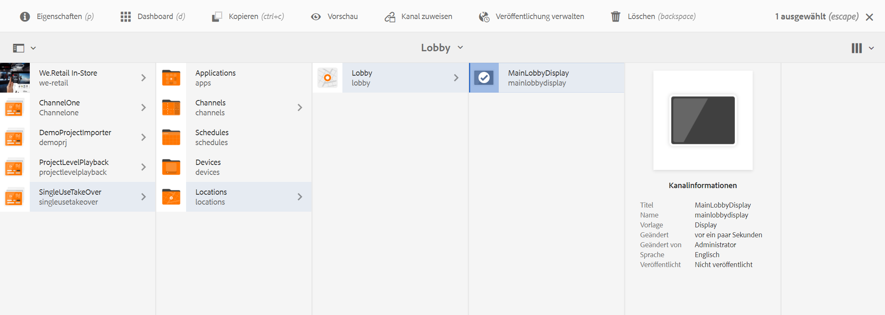
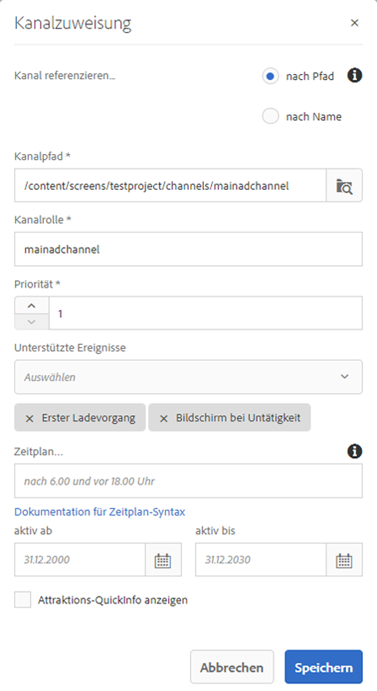
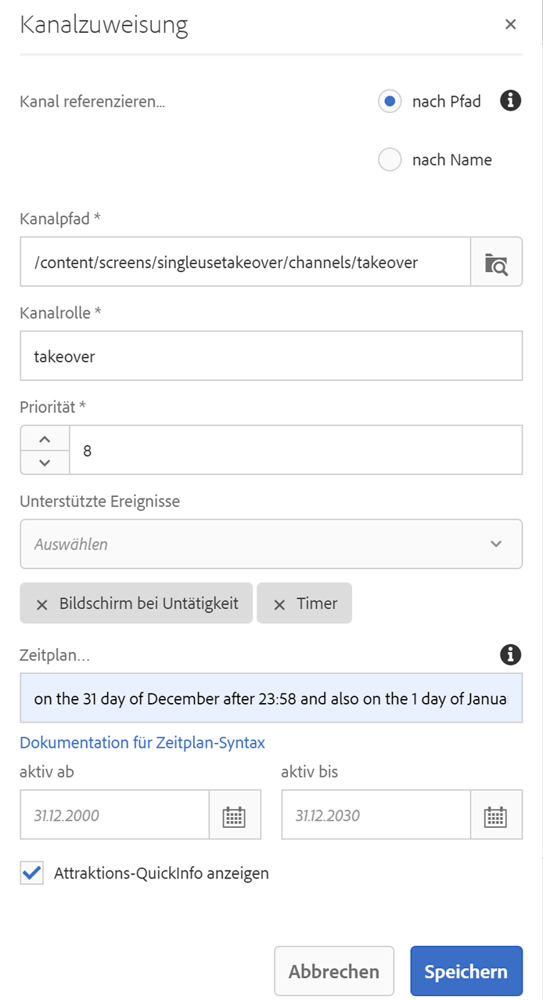
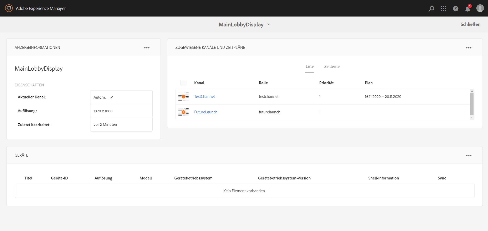

# Übernahmekanal für die einmalige Verwendung {#single-use-takeover-channel}

Auf der folgenden Seite finden Sie einen Anwendungsfall, der sich auf die Einrichtung eines Projekts zum Erstellen eines Übernahmekanals für die einmalige Verwendung konzentriert, der einmal für eine bestimmte Zeit wiedergegeben wird.

## Nutzungsszenario – Beschreibung {#use-case-description}

In diesem Anwendungsfall wird erläutert, wie Sie einen Kanal erstellen, der *Übernahme* aus dem normalen Wiedergabekanal für eine Anzeige oder eine Gruppe von Anzeigen. Die Übernahme erfolgt nur einmal und für eine bestimmte Zeit.

Beispielsweise gibt es einen Übernahmekanal für die einmalige Verwendung, der von Freitag 9:00 bis 10:00 Uhr wiedergegeben wird. Während dieser Zeit sollte kein anderer Kanal wiedergegeben werden. Vor und nach dieser Zeit wird der Übernahmekanal für die einmalige Verwendung nicht wiedergegeben. Im folgenden Beispiel wird die Erstellung eines Übernahmekanals für die einmalige Verwendung gezeigt, der es ermöglicht, den Inhalt für 2 Minuten vor 12:00 Uhr am 31. Dezember bis 12:01 Uhr wiederzugeben.

### Voraussetzungen {#preconditions}

Bevor Sie mit diesem Nutzungsszenario beginnen, sollten Sie sich mit den folgenden Themen vertraut machen:

* **[Erstellen und Verwalten von Kanälen](managing-channels.md)**
* **[Erstellen und Verwalten von Standorten](managing-locations.md)**
* **[Erstellen und Verwalten von Zeitplänen](managing-schedules.md)**
* **[Geräteregistrierung](device-registration.md)**

### Hauptakteure {#primary-actors}

Autoren von Inhalten

## Einrichten des Projekts {#setting-up-the-project}

Gehen Sie wie folgt vor, um ein Projekt einzurichten:

**Einrichten der Kanäle und Anzeigen**

1. Erstellen Sie ein AEM Screens-Projekt mit dem Namen **SingleUseTakeOver**, wie unten dargestellt.

   

1. Erstellen Sie einen Kanal **MainAdChannel** im Ordner **Kanäle**.

   

1. Wählen Sie den Kanal **MainAdChannel** aus und klicken Sie in der Aktionsleiste auf **Bearbeiten**. Ziehen Sie einige Assets (Bilder, Videos, eingebettete Sequenzen) in Ihren Kanal.

   

   >[!NOTE]
   >Der Kanal **MainAdChannel** in diesem Beispiel ist ein Sequenzkanal, der Inhalt kontinuierlich wiedergibt.

   

1. Erstellen Sie eine **TakeOver** -Kanal, der den Inhalt in **MainAdChannel** und wird nur für einen bestimmten Tag und eine bestimmte Uhrzeit wiedergegeben.

1. Wählen Sie die **TakeOver** und klicken **Bearbeiten** in der Aktionsleiste aus. Ziehen Sie einige Assets in Ihren Kanal. Im folgenden Beispiel wird gezeigt, wie Sie diesem Kanal ein Bild für eine Einzelzone hinzufügen.

   

1. Richten Sie einen Standort und eine Anzeige für Ihre Kanäle ein. Beispielsweise die folgenden **Lobby** Standort und  **MainLobbyDisplay** für dieses Projekt eingerichtet sind.

   

**Zuweisen von Kanälen zu einer Anzeige**

1. Wählen Sie die Anzeige **MainLobbyDisplay** aus dem Ordner **Standorte** aus. Klicken Sie in der Aktionsleiste auf **Kanal zuweisen**.

   

   >[!NOTE]
   >Informationen zum Zuweisen eines Kanals zu einer Anzeige finden Sie unter **[Kanalzuweisung](channel-assignment.md)**.

1. Füllen Sie die Felder (**Kanalpfad**, **Priorität** und **unterstützte Ereignisse**) im Dialogfeld **Kanalzuweisung** aus und klicken Sie auf **Speichern**. Sie haben Ihrer Anzeige den Kanal **MainAdChannel** zugewiesen.

   

1. Wählen Sie die Anzeige **TakeOver** aus dem Ordner **Standorte** aus. Klicks **Kanal zuweisen** in der Aktionsleiste, damit Sie den Übernahmekanal für die einmalige Verwendung zuweisen können.

1. Zuweisen der **TakeOver** zu einer geplanten Zeit zu Ihrer Anzeige zu gelangen und die folgenden Felder aus dem **Kanalzuweisung** und klicken Sie auf **Speichern**:

   * **Kanalpfad**: Wählen Sie den Pfad zum Kanal „TakeOver“ aus
   * **Priorität**: Legen Sie die Priorität dieses Kanals höher als die von **MainAdChannel** fest. Die in diesem Beispiel eingestellte Priorität ist beispielsweise „8“.

     >[!NOTE]
     >Die Priorität kann ein beliebiger Wert sein, der höher ist als die Priorität des normalen Wiedergabekanals.
   * **Unterstützte Ereignisse**: Wählen Sie **Bildschirm bei Untätigkeit** und **Timer** aus.
   * **Zeitplan**: Geben Sie den Text für den Zeitplan ein, nach dem dieser Kanal die Anzeige ausführen soll. Der Text hier ermöglicht es beispielsweise, den Inhalt 2 Minuten vor 12:00 Uhr am 31. Dezember bis 12:01 Uhr wiederzugeben. Der Text im **Zeitplan** in diesem Beispiel erwähnt *am 31. Dezember nach 23:58 Uhr sowie am 1. Januar vor 00.01 Uhr*.

     

     Zur Anzeige navigieren von **SingleUseTakeOver** > **Standorte** > **Lobby** > **MainLobbyDisplay** und klicken **Dashboard** in der Symbolleiste, damit Sie die zugewiesenen Kanäle mit ihren Prioritäten anzeigen können, wie unten dargestellt.

     >[!NOTE]
     >Es ist zwingend erforderlich, die Priorität des Übernahmekanals auf die höchste zu setzen.

     

>[!NOTE]
>
>Es empfiehlt sich, den Übernahmekanal für die einmalige Verwendung nach der Wiedergabe zu löschen.
