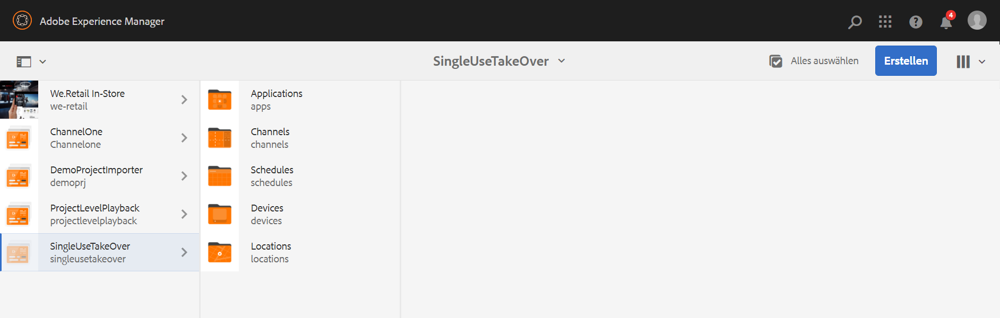
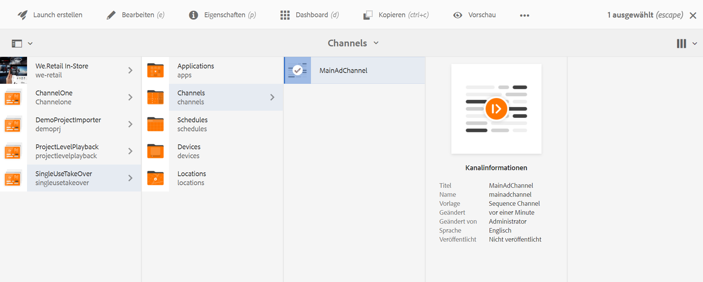
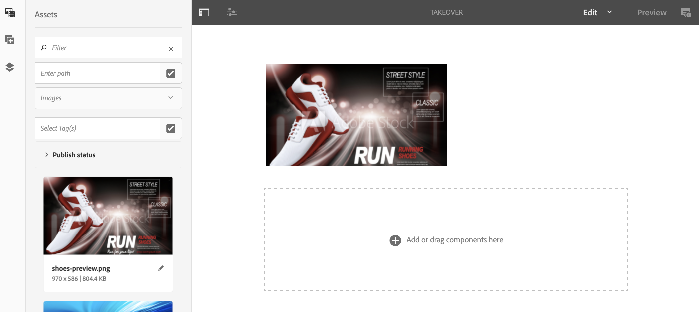
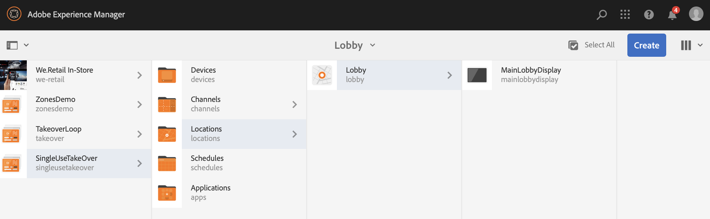
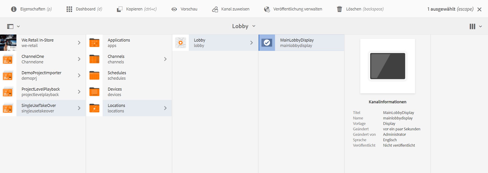
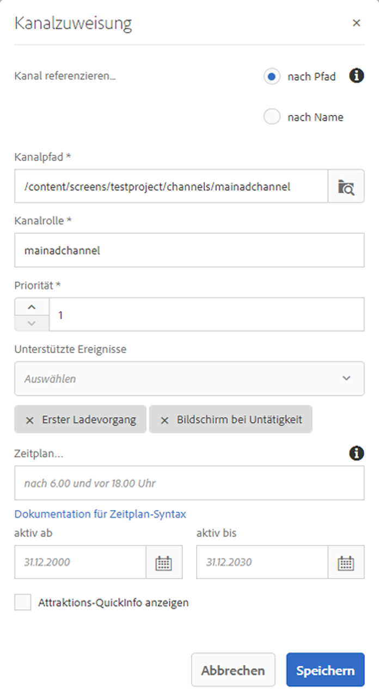
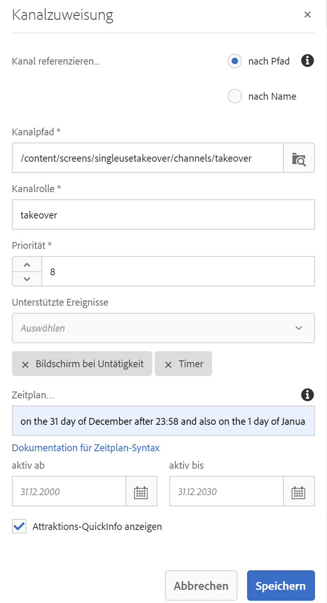
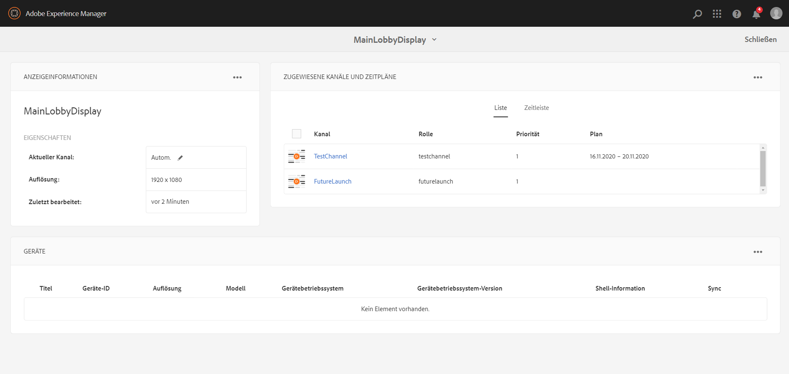

# Übernahmekanal für die einmalige Verwendung {#single-use-takeover-channel}

>[!IMPORTANT]
>Dieser Inhalt gilt für AEM On-Premise/AMS (AEM 6.5LTS und AEM 6.5). Informationen zu AEM as a Cloud Service Screens-Inhalten finden Sie im [AEM as a Cloud Service-Handbuch](https://experienceleague.adobe.com/en/docs/experience-manager-cloud-service/content/screens-as-cloud-service/overview/introduction).

Auf der folgenden Seite finden Sie einen Anwendungsfall zur Projekteinrichtung, bei dem ein Übernahmekanal für die einmalige Verwendung erstellt wird, der Inhalte einmal für eine bestimmte Zeit wiedergibt.

## Anwendungsfall – Beschreibung {#use-case-description}

In diesem Anwendungsfall wird erläutert, wie Sie einen Kanal erstellen, der die Funktion des normalerweise zur Wiedergabe verwendeten Kanals für eine Anzeige oder eine Gruppe von Anzeigen *übernimmt*. Die Übernahme erfolgt nur einmal und für eine bestimmte Zeit.

Zum Beispiel gibt es einen einzelnen TakeOver-Kanal, der am Freitag, :00 Uhr bis 10 Uhr :00 wird. Während dieser Zeit sollte kein anderer Kanal abgespielt werden. Vor und nach dieser Zeit erfolgt keine Wiedergabe über den Übernahmekanal für die einmalige Verwendung. Das folgende Beispiel zeigt die Erstellung eines einzigen Übernahmekanals, in dem der Inhalt 2 Minuten vor 12 :00 Uhr am 31. Dezember bis 12 Uhr :01 wiedergegeben werden kann.

### Voraussetzungen {#preconditions}

Bevor Sie mit diesem Nutzungsszenario beginnen, sollten Sie sich mit den folgenden Themen vertraut machen:

* **[Erstellen und Verwalten von Kanälen](managing-channels.md)**
* **[Erstellen und Verwalten von Standorten](managing-locations.md)**
* **[Erstellen und Verwalten von Zeitplänen](managing-schedules.md)**
* **[Geräteregistrierung](device-registration.md)**

### Hauptakteure {#primary-actors}

Autoren von Inhalten

## Einrichten des Projekts {#setting-up-the-project}

Gehen Sie wie folgt vor, um ein Projekt einzurichten:

**Einrichten der Kanäle und Anzeigen**

1. Erstellen Sie ein AEM Screens-Projekt mit dem Namen **SingleUseTakeOver**, wie unten dargestellt.

   

1. Erstellen Sie einen Kanal **MainAdChannel** im Ordner **Kanäle**.

   

1. Klicken Sie auf den Kanal **MainAdChannel** und dann in der Aktionsleiste auf **Bearbeiten**. Ziehen Sie einige Assets (Bilder, Videos, eingebettete Sequenzen) in Ihren Kanal.

   

   >[!NOTE]
   >Der Kanal **MainAdChannel** in diesem Beispiel ist ein Sequenzkanal, der Inhalt kontinuierlich wiedergibt.

   

1. Erstellen Sie einen Kanal **TakeOver**, der den Inhalt des Kanals **MainAdChannel** übernimmt und diesen nur einmal an einem bestimmten Tag und zu einer bestimmten Uhrzeit wiedergibt.

1. Wählen Sie den Kanal **TakeOver** aus und klicken Sie in der Aktionsleiste auf **Bearbeiten**. Ziehen Sie einige Assets in Ihren Kanal. Im folgenden Beispiel wird gezeigt, wie Sie diesem Kanal ein Bild für eine Einzelzone hinzufügen.

   

1. Richten Sie einen Standort und eine Anzeige für Ihre Kanäle ein. Beispielsweise werden für dieses Projekt der Standort **Lobby** und die Anzeige **MainLobbyDisplay** eingerichtet.

   

**Zuweisen von Kanälen zu einer Anzeige**

1. Wählen Sie die Anzeige **MainLobbyDisplay** aus dem Ordner **Standorte** aus. Klicken Sie in der Aktionsleiste auf **Kanal zuweisen**.

   

   >[!NOTE]
   >Informationen zum Zuweisen eines Kanals zu einer Anzeige finden Sie unter **[Kanalzuweisung](channel-assignment.md)**.

1. Füllen Sie die Felder (**Kanalpfad**, **Priorität** und **unterstützte Ereignisse**) im Dialogfeld **Kanalzuweisung** aus und klicken Sie auf **Speichern**. Sie haben Ihrer Anzeige den Kanal **MainAdChannel** zugewiesen.

   

1. Wählen Sie die Anzeige **TakeOver** aus dem Ordner **Standorte** aus. Klicken Sie in der Aktionsleiste auf **Kanal zuweisen**, um den Übernahmekanal für die einmalige Verwendung zuzuweisen.

1. Weisen Sie den Kanal **TakeOver** Ihrer Anzeige zu einem geplanten Zeitpunkt zu, füllen Sie die folgenden Felder im Dialogfeld **Kanalzuweisung** aus und klicken Sie auf **Speichern**:

   * **Kanalpfad**: Klicken Sie auf den Pfad zum Kanal „TakeOver“
   * **Priorität**: Legen Sie die Priorität dieses Kanals höher als die von **MainAdChannel** fest. Die in diesem Beispiel eingestellte Priorität ist beispielsweise „8“.

     >[!NOTE]
     >Die Priorität kann ein beliebiger Wert sein, der höher als die Priorität des normalerweise zur Wiedergabe verwendeten Kanals ist.
   * **Unterstützte Ereignisse**: Klicken Sie auf **Bildschirm bei Untätigkeit** und **Timer**.
   * **Zeitplan**: Geben Sie den Text für den Zeitplan ein, nach dem dieser Kanal in der Anzeige ausgeführt werden soll. Beispielsweise ermöglicht der Text hier die Wiedergabe des Inhalts 2 Minuten vor 12 :00 am 31. Dezember bis 12 :01 Uhr morgens.
Der Text im **Zeitplan** in diesem Beispiel ist *am 31. Dezember nach dem 23:58 und auch am 1. Januar vor 00.01*.

     

     Navigieren Sie mit **SingleUseTakeOver** > **Standorte** > **Lobby** > **MainLobbyDisplay** zur Anzeige. Klicken Sie in der Aktionsleiste auf **Dashboard**, um die zugewiesenen Kanäle mit ihren Prioritäten anzuzeigen, wie unten dargestellt.

     >[!NOTE]
     >Es ist zwingend erforderlich, die Priorität des Übernahmekanals auf die höchste Stufe zu setzen.

     

>[!NOTE]
>
>Es empfiehlt sich, den Übernahmekanal für die einmalige Verwendung nach der Wiedergabe zu löschen.
