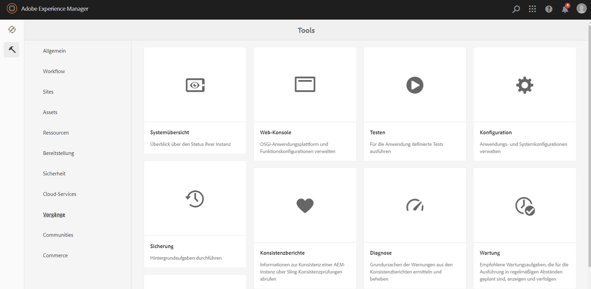
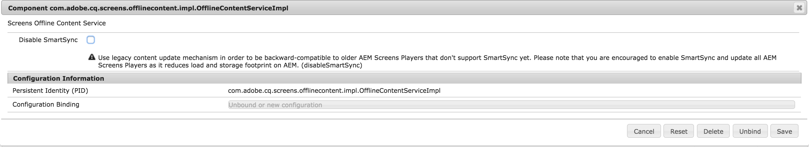
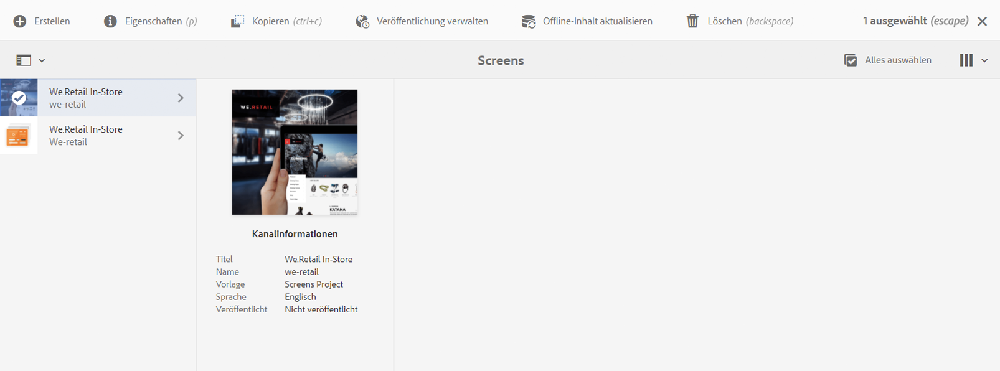

# Umstellung von ContentSync auf SmartSync {#transitioning-from-contentsync-to-smartsync}

In diesem Abschnitt erhalten Sie einen Überblick über die Funktion SmartSync und dazu, wie sie Lade- und Speichervorgänge auf Servern und Netzwerk-Traffic minimiert, um Kosten zu senken.

## Überblick {#overview}

SmartSync ist das neueste von AEM Screens verwendete Verfahren. Es ersetzt die aktuelle Methode zum Zwischenspeichern von Offline-Kanälen und deren Bereitstellung an den Player.

SmartSync wird sowohl Server-seitig als auch Client-seitig ausgeführt.

**Auf Server-Seite**:

* Inhalte der Kanäle, einschließlich Assets, werden zwischengespeichert in *`/var/contentsync`*.
* Der Cache wird den Playern über ein Manifest zur Verfügung gestellt, das den verfügbaren Inhalt für eine Anzeige beschreibt.

**Auf Client-Seite**:

* Der Player aktualisiert seinen Inhalt auf Grundlage des oben generierten Manifests.

### Vorteile von SmartSync {#benefits-of-using-smartsync}

Die Funktion SmartSync bietet verschiedene Vorteile für Ihr AEM Screens-Projekt, z. B.:

* Deutliche Reduzierung des Netzwerk-Traffics und der Server-seitigen Speicheranforderungen.
* Der Player lädt Assets nur dann intelligent herunter, wenn das Asset fehlt oder geändert wurde.
* Serverseitige und Client-seitige Speicheroptimierungen.

>[!NOTE]
>
>Adobe empfiehlt für AEM Screens-Projekte dringend den Einsatz von SmartSync.

## Migration von ContentSync zu SmartSync {#migrating-from-contentsync-to-smartsync}

>[!NOTE]
>
>Wenn Sie AEM 6.3 Feature Pack 5 und AEM 6.4 Feature Pack 3 bereits installiert haben, können Sie SmartSync für Assets aktivieren, um die Speichernutzung zu verbessern. Befolgen Sie den unten stehenden Abschnitt, um von ContentSync auf SmartSync zu wechseln und SmartSync so zu aktivieren.
>
>SmartSync ist für Screens-Player mit unterstützten Servern (AEM 6.4.3 FP3) verfügbar.
>
>Siehe [AEM Screens Player-Downloads](https://download.macromedia.com/screens/) , um den neuesten Player herunterzuladen. In der folgenden Tabelle werden die Mindestversionen des Players aufgeführt, die für die einzelnen Plattformen erforderlich sind:

| **Plattform** | **Unterstützte Minimalversion des Players** |
|---|---|
| Android™ | 3.3.72 |
| Chrome OS | 1.0.136 |
| Windows | 1.0.136 |

Gehen Sie wie folgt vor, um von ContentSync zu SmartSync zu wechseln:

1. Für die Migration von ContentSync zu SmartSync muss der ContentSync-Cache gelöscht werden, und zwar vor der Aktivierung von SmartSync.

   Navigieren Sie von Ihrer Instanz mithilfe des Links zur ContentSync-Konsole. ***https://localhost:4502/libs/cq/contentsync/content/console.html*** und wählen **Cache löschen**, wie in der folgenden Abbildung dargestellt:

   

   >[!CAUTION]
   >
   >Der gesamte Inhalts-Cache muss vor der erstmaligen Verwendung von SmartSync gelöscht werden.

1. Navigieren Sie zu **Konfiguration der Adobe Experience Manager-Web-Konsole** über AEM-Instanz > Hammersymbol > **Aktivitäten** > **Web-Konsole**.

   

1. Die **Konfiguration der Adobe Experience Manager-Web-Konsole** wird geöffnet. Suchen Sie nach *offlinecontentservice*.

   So durchsuchen Sie die **Screens-Offline-Inhaltsdienst** Eigenschaft, drücken **Befehl+F** für **Mac**, und **Strg+F** für **Windows**.

   

1. Auswählen **Speichern** um die **Screens Offline Content Services** -Eigenschaft und verwenden Sie daher SmartSync für AEM Screens.
1. Wenn Sie SmartSync aktiviert haben, navigieren Sie zu Ihrem Projekt und wählen Sie **Offline-Inhalt aktualisieren** *(in der Symbolleiste),* wie in der folgenden Abbildung dargestellt.

   
