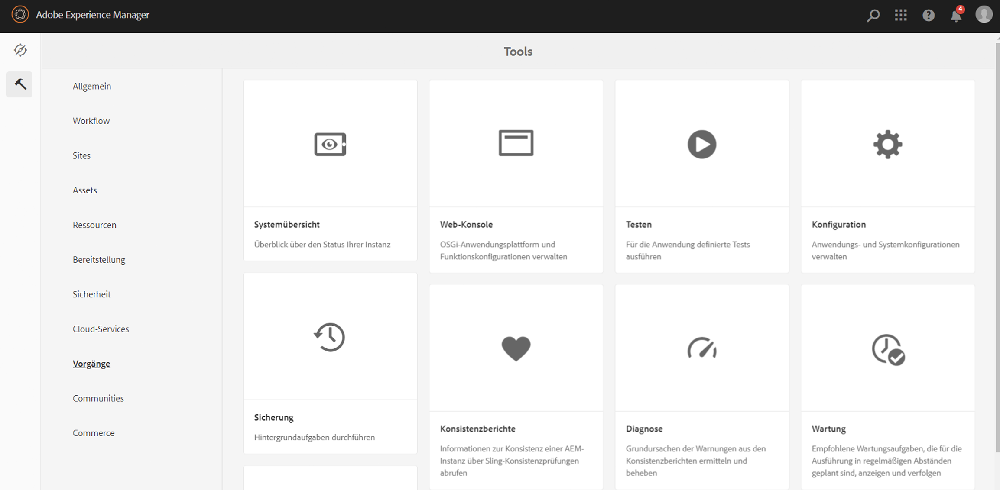
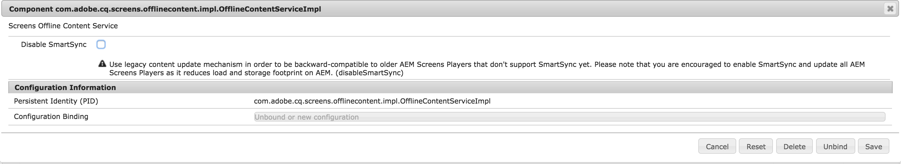
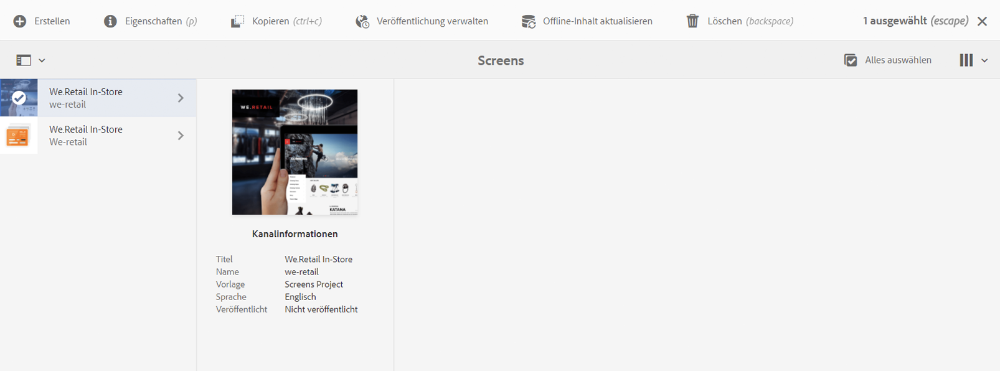

# Umstellung von ContentSync auf SmartSync {#transitioning-from-contentsync-to-smartsync}

>[!IMPORTANT]
>Dieser Inhalt gilt für AEM On-Premise/AMS (AEM 6.5LTS und AEM 6.5). Informationen zu AEM as a Cloud Service Screens-Inhalten finden Sie im [AEM as a Cloud Service-Handbuch](https://experienceleague.adobe.com/en/docs/experience-manager-cloud-service/content/screens-as-cloud-service/overview/introduction).

In diesem Abschnitt erhalten Sie einen Überblick über die Funktion SmartSync und dazu, wie sie Lade- und Speichervorgänge auf Servern und Netzwerk-Traffic minimiert, um Kosten zu senken.

## Überblick {#overview}

SmartSync ist das neueste von AEM Screens verwendete Verfahren. Es ersetzt die aktuelle Methode zum Zwischenspeichern von Offline-Kanälen und deren Bereitstellung an den Player.

SmartSync wird sowohl Server-seitig als auch Client-seitig ausgeführt.

**Server-seitig**

* Der Inhalt der Kanäle, einschließlich Assets, wird in *`/var/contentsync`* zwischengespeichert.
* Der Cache wird den Playern über ein Manifest zur Verfügung gestellt, das den verfügbaren Inhalt für eine Anzeige beschreibt.

**Client-seitig**

* Der Player aktualisiert seinen Inhalt auf Grundlage des oben generierten Manifests.

### Vorteile von SmartSync {#benefits-of-using-smartsync}

Die Funktion „SmartSync“ bietet verschiedene Vorteile für Ihr AEM Screens-Projekt, z. B.:

* Deutliche Reduzierung des Netzwerk-Traffics und des Server-seitigen Speicherbedarfs.
* Der Player lädt auf intelligente Weise nur dann Assets herunter, wenn ein Asset fehlt oder geändert wurde.
* Server-seitige und Client-seitige Speicheroptimierungen.

>[!NOTE]
>
>Adobe empfiehlt die Verwendung von SmartSync für AEM Screens-Projekte.

## Migration von ContentSync zu SmartSync {#migrating-from-contentsync-to-smartsync}

>[!NOTE]
>
>Wenn Sie AEM 6.3 Feature Pack 5 und AEM 6.4 Feature Pack 3 bereits installiert haben, können Sie SmartSync für Assets aktivieren, um die Speichernutzung zu verbessern. Befolgen Sie den unten stehenden Abschnitt, um von ContentSync auf SmartSync zu wechseln und SmartSync so zu aktivieren.
>
>SmartSync ist für Screens-Player mit unterstützten Servern (AEM 6.4.3 FP3) verfügbar.
>
>Über die Seite [AEM Screens-Player-Downloads](https://download.macromedia.com/screens/) können Sie den neuesten Player herunterladen. In der folgenden Tabelle werden die Mindestversionen des Players aufgeführt, die für die einzelnen Plattformen erforderlich sind:

| **Plattform** | **Unterstützte Minimalversion des Players** |
|---|---|
| Android™ | 3.3.72 |
| Chrome OS | 1.0.136 |
| Windows | 1.0.136 |

Gehen Sie wie folgt vor, um von ContentSync zu SmartSync zu wechseln:

1. Für die Migration von ContentSync zu SmartSync muss der ContentSync-Cache gelöscht werden, und zwar vor der Aktivierung von SmartSync.

   Navigieren Sie von Ihrer Instanz zur ContentSync -Konsole über den Link ***https://localhost:4502/libs/cq/contentsync/content/console.html*** und klicken Sie auf **Cache löschen**, wie in der folgenden Abbildung dargestellt:

   

   >[!CAUTION]
   >
   >Der gesamte Inhalts-Cache muss vor der erstmaligen Verwendung von SmartSync gelöscht werden.

1. Navigieren Sie über die AEM-Instanz > Hammersymbol > **Vorgänge** > **Web-Konsole** zur **Konfiguration der Adobe Experience Manager-Web-Konsole**.

   

1. Die **Konfiguration der Adobe Experience Manager-Web-Konsole** wird geöffnet. Suchen Sie nach *offlinecontentservice*.

   Zum Durchsuchen der Eigenschaft **Screens-Offline-Inhaltsdienst** drücken Sie **Befehlstaste+F** unter **Mac** bzw. **Strg+F** unter **Windows**.

   

1. Klicken Sie auf **Speichern**, um die Eigenschaft **Screens-Offline-Inhalts-Service** zu aktivieren und SmartSync für AEM Screens zu verwenden.
1. Nachdem Sie SmartSync aktiviert haben, müssen Sie zu Ihrem Projekt navigieren und auf **Offline-Inhalt aktualisieren** klicken *(in der Aktionsleiste)*, wie in der folgenden Abbildung dargestellt.

   
