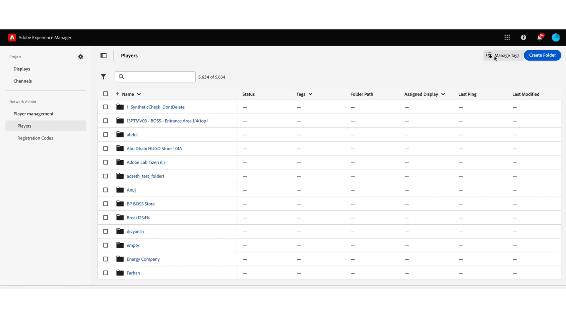

# Tagging in der Screens Cloud {#tagging-on-Screens-Cloud}

>[!IMPORTANT]
>Dieser Inhalt gilt für AEM On-Premise/AMS (AEM 6.5LTS und AEM 6.5). Informationen zu AEM as a Cloud Service Screens-Inhalten finden Sie im [AEM as a Cloud Service-Handbuch](https://experienceleague.adobe.com/de/docs/experience-manager-cloud-service/content/screens-as-cloud-service/overview/introduction).

>[!CAUTION]
>
>Die **Tagging**-Funktion ist nur verfügbar, wenn sie für Ihren Mandanten aktiviert ist. AEM Screens Engineering kontaktieren, um sie zu aktivieren.

## Einführung {#introduction}

Benutzende können Tags in der Screens Cloud erstellen und diese zum Klassifizieren von Anzeigen und Playern verwenden.

## Erstellen und Verwalten von Tags {#create-and-manage-tags}

.

Verwenden Sie dasselbe Aktionsmenü, um ein Tag umzubenennen oder zu löschen.

>[!NOTE]
> 
> Für einen Mandanten sind insgesamt 500 Tags zulässig

## Verwalten von Tags-Zuweisungen {#manage-tags-assignments}

Verwenden Sie erstellte Tags in Displays und Playern.

.

>[!NOTE]
>
> Einem Display oder Player können maximal 30 Tags zugewiesen sein.
> Es können maximal 30 Elemente in einem Schritt getaggt werden.

## Filtern nach Tags {#filter-by-tags}

Wählen Sie Tags aus, um die Liste der Anzeigen oder Player zu filtern.

.

>[!NOTE]
> 
> In der Screens-Cloud definierte Tags werden nicht mit in AEM definierten Tags verknüpft/synchronisiert.
> 
