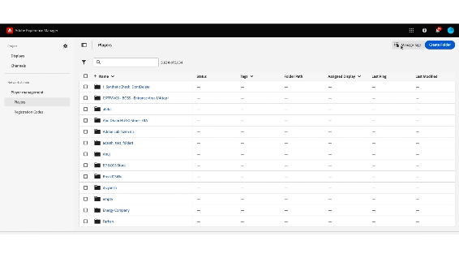

# Tagging in Screens Cloud {#tagging-on-Screens-Cloud}

>[!CAUTION]
>
>Die **Tagging** -Funktion ist nur verfügbar, wenn sie für Ihren Mandanten aktiviert ist. Wenden Sie sich zur Aktivierung an AEM Screens Engineering.

## Einführung {#introduction}

Benutzer können Tags in der Screens Cloud erstellen und diese zum Klassifizieren von Anzeigen und Playern verwenden.

## Erstellen und Verwalten von Tags {#create-and-manage-tags}

.

Verwenden Sie dasselbe Aktionsmenü, um ein Tag umzubenennen oder zu löschen.

>[!NOTE]
> 
> Der Tag-Name darf nur Buchstaben, Zahlen, Bindestriche und Unterstriche enthalten. Der Name sollte nur mit Buchstaben oder Zahlen beginnen und enden.
> Für einen Mandanten sind insgesamt 500 Tags zulässig

## Verwalten von Tagzuweisungen {#manage-tags-assignments}

Verwenden Sie erstellte Tags auf Anzeigen und Playern. Sie können eines mit maximal 30 Tags taggen.

.

## Nach Tags filtern {#filter-by-tags}

Wählen Sie Tags aus, um die Liste der Anzeigen oder Player zu filtern.

.

>[!NOTE]
> 
> In Screens Cloud definierte Tags sind nicht mit in AEM definierten Tags verknüpft/synchronisiert.
> 
