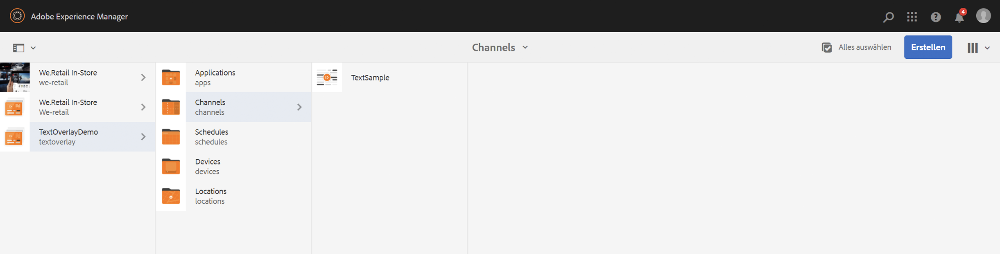
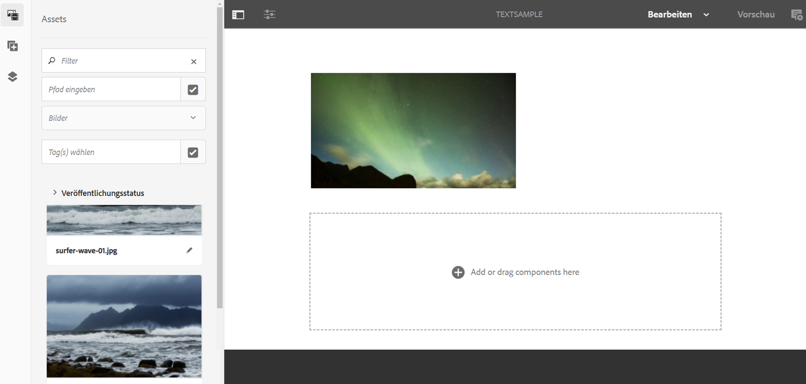
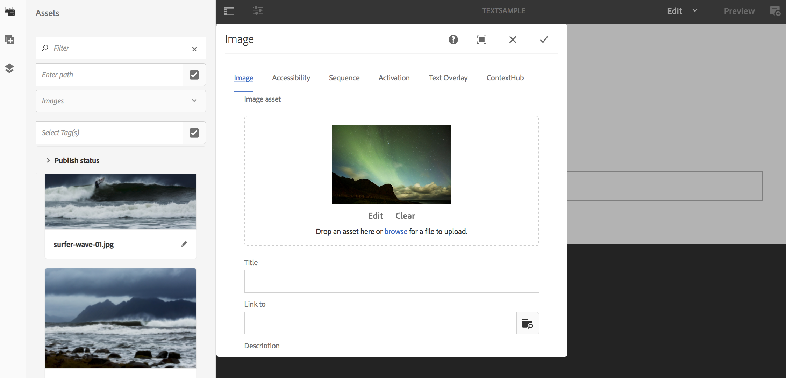

# Textüberlagerung {#text-overlay}

In diesem Abschnitt werden folgende Themen behandelt:

* **Überblick**
* **Verwenden von Textüberlagerung**
* **Verstehen der Eigenschaften von Textüberlagerung**
* **Verwenden von ContextHub-Werten in Textüberlagerung**

>[!CAUTION]
>
>Die **Textüberlagerung** Funktion ist nur verfügbar, wenn Sie AEM 6.3 Feature Pack 5 oder AEM 6.4 Feature Pack 3 installiert haben.

## Übersicht {#overview}

Textüberlagerung ist eine in AEM Screens verfügbare Funktion, mit der Sie in einem Sequenzkanal ein überzeugendes Erlebnis erstellen können, indem Sie einen Titel oder eine Beschreibung angeben, die über einem Bild überlagert ist.

Informationen zum Erstellen einer eigenen benutzerdefinierten Komponente finden Sie unter **Erweitern einer AEM Screens-Komponente**.

In diesem Abschnitt wird nur gezeigt, wie die Poster-Komponente in einem AEM Screens-Projekt verwendet und als Textüberlagerung in einem Ihrer Sequenzkanäle eingesetzt werden kann.

## Verwenden von Textüberlagerung {#using-text-overlay}

Im folgenden Abschnitt wird die Verwendung von Textüberlagerung in AEM Screens-Projekten beschrieben.

**Voraussetzungen**

Bevor Sie diese Funktion implementieren, stellen Sie sicher, dass Sie ein Projekt als Voraussetzung für die Implementierung der Textüberlagerung eingerichtet haben. Beispiel:

* Erstellen Sie ein AEM Screens-Projekt (in diesem Beispiel **TextOverlayDemo**)

* Erstellen eines Sequenzkanals als **TextSample** im Ordner **Kanäle**

* Fügen Sie Inhalte zu Ihrem Kanal **TextSample** hinzu

Die folgende Abbildung zeigt das Projekt **TextOverlayDemo** mit dem Kanal **TextSample** im Ordner **Kanäle**.

Gehen Sie wie folgt vor, um die Textüberlagerung in einem AEM Screens-Kanal zu verwenden:

1. Navigieren Sie zu **TextOverlayDemo** > **Kanäle** > **TextSample** und wählen **Bearbeiten** in der Aktionsleiste aus.

   

1. Wählen Sie das Bild aus und wählen Sie **Konfigurieren** (Schraubenschlüsselsymbol), um das Dialogfeld &quot;Eigenschaften&quot;zu öffnen.

   

1. Wählen Sie in der Navigationsleiste des Dialogfelds die Option **Textüberlagerung**, wie in der folgenden Abbildung dargestellt.

   

### Verstehen der Eigenschaften von Textüberlagerung {#understanding-text-overlay-properties}

Mit den Eigenschaften der Textüberlagerung können Sie zu jeder Komponente in Ihrem Screens-Projekt Text hinzufügen. Im folgenden Abschnitt erhalten Sie eine Übersicht über die Eigenschaften, die in der Textüberlagerung verfügbar sind:

Sie können dem Textfeld einen Text hinzufügen und typografische Hervorhebungen wie fett, kursiv und unterstrichen hinzufügen.

**Farbvariante**: Mit dieser Option kann der Text entweder dunkel (Text in schwarzer Farbe) oder hell (Text in weißer Farbe) dargestellt werden.

**Größe und Anordnung**: Mit dieser Option können Benutzende den Text horizontal oder vertikal ausrichten oder zusätzlich fein abgestufte Werkzeuge für die Textausrichtung verwenden.

>[!NOTE]
>
>Für einen richtigen Einsatz der Werkzeuge müssen Sie die gewünschte Position in Pixel mit „px“ als Suffix angeben (z. B. „200px“). Das Ergebnis dieses Ausdrucks ist 200 Pixel vom Startpunkt entfernt.

## Verwenden von ContextHub-Werten in Textüberlagerung {#using-text-overlay-context-hub}

Im folgenden Abschnitt wird die Verwendung von Werten aus einem Datenspeicher beschrieben, z. B. Google-Tabellen in der Komponente für Textüberlagerung.

**Voraussetzungen**

Erstellen Sie ContextHub-Konfigurationen für Ihr AEM Screens-Projekt.

Informationen zum Einrichten und Verwalten von datengesteuerten Asset-Änderungen mithilfe eines Datenspeichers finden Sie unter [Konfigurieren von ContextHub in AEM Screens](https://experienceleague.adobe.com/en/docs/experience-manager-screens/user-guide/developing/configuring-context-hub).

Nachdem Sie die erforderlichen Konfigurationen für Ihr Projekt eingerichtet haben, führen Sie die folgenden Schritte aus, um Werte aus den Google Tabellen zu verwenden:

1. Navigieren Sie zu **TextOverlayDemo** > **Kanäle** > **TextSample** und wählen **Eigenschaften** in der Aktionsleiste aus.

1. Wählen Sie die **Personalisierung** -Registerkarte, damit Sie die ContextHub-Konfigurationen einrichten können.

   1. Wählen Sie die **ContextHub-Pfad** as **libs** > **settings** > **cloudsettings** > **default** > **ContextHub-Konfigurationen** und wählen **Auswählen**.

   1. Wählen Sie die **Segmentpfad** as **conf** > **screens** > **settings** > **wcm** > **Segmente** und wählen **Auswählen**.

   1. Klicken Sie auf **Speichern und schließen**.

      >[!NOTE]
      >
      >Verwenden Sie den ContextHub- und den Segmentpfad, in dem Sie Ihre Kontexthub-Konfigurationen und -Segmente anfänglich gespeichert haben.

      

1. Navigieren Sie zu **TextOverlayDemo** > **Kanäle** > **TextSample** und wählen **Bearbeiten** in der Aktionsleiste aus.

   

1. Fügen Sie eine Bild- und eine Textüberlagerungskomponente zu Ihrem Bild hinzu, wie im Abschnitt [Verwenden von Textüberlagerung](/help/user-guide/text-overlay.md#using-text-overlay) auf dieser Seite beschrieben.

1. Wählen Sie aus **Konfigurieren** (Schraubenschlüsselsymbol), um die **Bild** Dialogfeld.

   

1. Navigieren Sie zur Registerkarte **ContextHub** im Dialogfeld **Bild**. Wählen Sie **Hinzufügen**.

   >[!NOTE]
   >Wenn Sie Ihre ContextHub-Konfiguration nicht eingerichtet haben, ist diese Option für Ihr Projekt deaktiviert.

1. Eingabe **Wert** im **Platzhalter** -Feld. Wählen Sie die Zeile aus, die Sie aus Ihrem Google-Blatt abrufen möchten in **ContextHub-Variable**. In diesem Fall wird der Wert aus Zeile 2 und Spalte 1 aus den Google-Arbeitsblättern abgerufen. Geben Sie nun den **Standardwert** als **20** ein, wie in der folgenden Abbildung dargestellt. Wenn Sie fertig sind, wählen Sie das Kontrollkästchen aus.

   

   >[!NOTE]
   >Für Ihre Referenz zeigt die folgende Abbildung den Wert, der aus den Google Tabellen abgerufen wird:

   

1. Gehen Sie im Dialogfeld „Bild“ zurück zur Registerkarte **Textüberlagerung** und fügen Sie den Text *Aktuelle Temperatur {Wert}* hinzu, wie in der nachstehenden Abbildung dargestellt.

   

1. Wählen Sie **Vorschau**.

   
