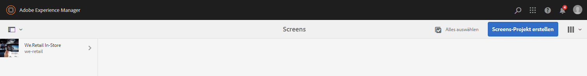
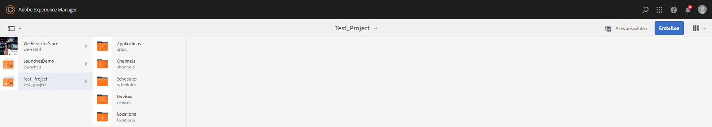
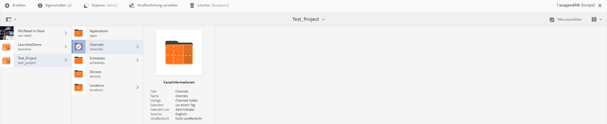
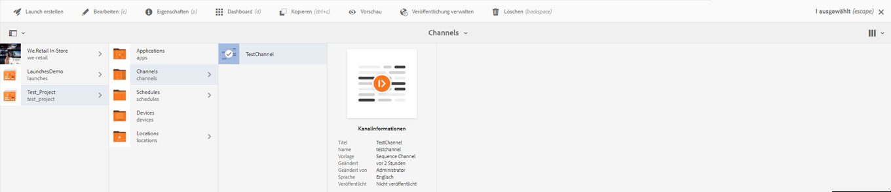

# Konfiguration der Videowiedergabe und Fehlerbehebung {#video-playback-configuration-and-troubleshooting}

Wenn Sie ein Video zu DAM hochladen und zu Ihrem Kanal hinzufügen, kann das Problem auftreten, dass das Video im AEM Screens-Player möglicherweise nicht wiedergegeben wird.

In den folgenden Abschnitten werden das Debugging und die Problembehebung für die Videowiedergabe in Ihrem Kanal beschrieben.

## DAM-Ausgaben {#dam-renditions}

Nachdem Sie das Video in den Kanal hochgeladen haben, sollte AEM damit beginnen, einige Ausgaben dafür zu erzeugen. Sie können Ihre Videos unter „Assets“ anzeigen.

So zeigen Sie das Video an:

1. Navigieren Sie zu Ihrem Video, beispielsweise `http://localhost:4502/assets.html/content/dam/we-retail/en/videos`.
1. Klicken Sie auf das Video. Erweitern Sie das obere linke Menü und klicken Sie auf **Ausgabedarstellungen**.

Es sollten unterschiedliche Ausgabedarstellungen vorliegen (ein MP4- oder M4V-Video).

Wenn keine Ausgabe verfügbar ist, überprüfen Sie, ob FFMPEG im Betriebssystem installiert ist, unter dem AEM ausgeführt wird.

>[!CAUTION]
>
>Wenn keine Ausgabe verfügbar ist, überprüfen Sie, ob FFMPEG im Betriebssystem installiert ist, unter dem AEM ausgeführt wird.
>
>Klicken Sie [hier](https://www.ffmpeg.org/download.html), um FFMPEG zu installieren.

## Video-Assets {#video-assets}

Wenn unter dem Video kein Quellattribut angezeigt wird, wurde das Video möglicherweise nicht transkodiert. Wenn das Video ordnungsgemäß transkodiert wurde, wird es im Dashboard angezeigt (wie nachfolgend dargestellt).

Vergewissern Sie sich, dass FFMPEG installiert ist, und prüfen Sie die Videoprofile.

### Prüfen des Videoprofils {#checking-video-profile}

1. Navigieren Sie zum **Videoprofil**, d. h. `http://localhost:4502/etc/dam/video.html`, und klicken Sie auf **Test-Video hochladen**.

   

1. Laden Sie ein Testvideo hoch und klicken Sie auf **OK**, um die Transkodierung zu starten.

   Falls das transkodierte Video fehlschlägt, erweitern Sie die FFMPEG-Ausgabe, um die Fehler in der Konsolenausgabe von FFMPEG zu verstehen.

   

   Wenn das Video erfolgreich transkodiert wurde, können Sie die transkodierte Datei herunterladen.

   

   >[!NOTE]
   >
   >Stellen Sie sicher, dass Sie lange genug warten, bis das Video transkodiert wurde (es sollte das Tag „neu“ aufweisen statt „in Bearbeitung“), bevor Sie es zu einem Kanal hinzufügen.

### Testen des Profils mit einer Videokomponente {#checking-profile-with-a-video-component}

Prüfen Sie die Liste der Profile über die Design-Seite, wenn die Videokomponente nicht korrekt konfiguriert ist.

1. Navigieren Sie zu Ihrem Kanal und klicken Sie auf den Modus **Design**.

   

1. Wählen Sie das Video aus und öffnen Sie das Dialogfeld **Bearbeiten**. Öffnen Sie die Registerkarte **Profile**.

   >[!NOTE]
   >Wählen Sie unterschiedliche Profile aus (es sollte wenigstens das Profil „Hohe Qualität H.264“ vorhanden sein).

### Prüfen des Videos im Web-Player {#checking-the-video-in-the-web-player}

Mit dem **Web-Player** `http://localhost:4502/content/mobileapps/cq-screens-player/firmware.html/content/screens/we-retail/locations/demo/flagship/single/device0` können Sie die Wiedergabe in Browsern (Chrome und Safari) testen. Chrome wird auf Android™-Geräten genutzt, Safari ist der Browser unter OS X und iOS.

Wenn das Video in Safari nicht läuft, funktioniert es auch nicht bei den OS X- und iOS-Playern.  Dieses Problem wird wahrscheinlich durch einen Kodierungsfehler verursacht. Das Video muss also neu kodiert werden.

Gehen Sie wie folgt vor, um einen DAM-Workflow zum Erstellen von FullHD-Wiedergaben zu verwenden:

1. Navigieren Sie zur *Workflow-Modelladministration*, d. h. `http://localhost:4502/libs/cq/workflow/admin/console/content/models.html/etc/workflow/models`.
1. Wählen Sie das Modell **Screens – Asset aktualisieren** aus.
1. Klicken Sie in der Symbolleiste auf **Workflow starten**.
1. Wählen Sie im Dialogfeld **Workflow ausführen** Ihr Video-Asset in der **Payload** aus.
1. Klicken Sie auf **Ausführen**.

>[!NOTE]
>
>Warten Sie eine Weile, während die Ausgabedarstellungen erstellt werden. Laden Sie nach einigen Sekunden/Minuten (je nach Videogröße) den Web-Player in Safari neu.

#### Problembehebung für das Flag „Autoplay-Richtlinie“ {#troubleshooting-autoplay-policy-flag}

Falls der AEM Screens-Player das Video zwar abruft, aber nicht anzeigt, müssen Sie eine Problembehebung für das Flag „Autoplay-Richtlinie“ durchführen.

Führen Sie folgende Schritte aus, um das Problem mit dem Flag „Autoplay-Richtlinie“ von Google zu beheben:

1. Navigieren Sie zu ***chrome://flags/#autoplay-policy***
1. Die **Autoplay-Richtlinie** muss von **Standard** in **Keine Benutzergeste erforderlich** geändert werden

1. Starten Sie den Webbrowser neu und aktualisieren Sie den Player

>[!NOTE]
>
>Weitere Informationen zu Best Practices für gute Benutzererlebnisse mit den neuen Autoplay-Richtlinien in Chrome  finden Sie unter *Änderungen an der Autoplay-Richtlinie* auf `https://developers.google.com/web/updates/2017/09/autoplay-policy-changes#webaudio`.

### Synchronisieren von Videos über mehrere Player hinweg {#syncing-video-across-multiple-players}

Um Videos synchron auf mehreren Geräten wiederzugeben, sollten Sie die absolute Strategie für die Sequenz nutzen, zu der das Video gehört.

#### Voraussetzungen {#requirements}

* zwei oder mehr identische Player
* im Idealfall ähnliche Hardware
* identische Netzwerktopologie (die Player sind mit einem NTP-Server verbunden, der ihre internen Systemuhren synchronisiert)

#### Einrichten der absoluten Strategie {#setting-up-the-absolute-strategy}

Die absolute Strategie:

* berechnet eine Ankerzeit (Mitternacht des aktuellen Tages).
* berechnet die Dauer der Sequenz (Summe der Dauer aller Elemente).
* berechnet zu jedem beliebigen Zeitpunkt mit der Formel „verbleibende_Sequenzzeit = (aktuelle_Zeit – Ankerzeit) % Sequenzdauer“, welches Element aktuell und als nächstes wiedergegeben werden soll.

Führen Sie die folgenden Schritte durch, um eine absolute Strategie einzurichten:

1. Navigieren Sie zur Autoreninstanz Ihres Kanals und wählen Sie die Sequenzkomponenten wie in der nachfolgenden Abbildung gezeigt aus.
1. Öffnen Sie das Konfigurations-Dialogfeld.
1. Bearbeiten Sie die **Strategie** und fügen Sie „absolut“ hinzu.

   

   >[!NOTE]
   >Die Betriebssysteme der Player müssen über dieselbe Uhr verfügen.

**Synchronisieren der Uhren unter OS X** Gehen Sie wie folgt vor, um die Uhren unter OS X zu synchronisieren:

1. Öffnen Sie in jeder OS X-Box die Einstellungen für **Datum und Uhrzeit**.
1. Aktivieren Sie **Datum und Uhrzeit automatisch festlegen**.
1. Fügen Sie den Wert 0.pool.ntp.org, 1.pool.ntp.org, 2.pool.ntp.org, 3.pool.ntp.org, time.apple.com in das Dropdown-Menü ein oder führen Sie einfach *`sudo ntpdate -u -v 0.pool.ntp.org`* aus
1. Starten Sie alle Player (mind. zwei).

Es kann eine Weile dauern, bis die Player eine neue synchronisierte Sequenz beginnen.
