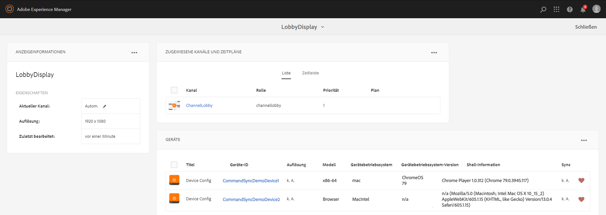
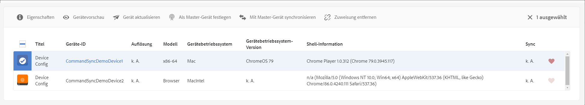

# Befehlssynchronisierung {#command-sync}

Auf der folgenden Seite wird die Verwendung der Befehlssynchronisierung beschrieben. Die Befehlssynchronisierung ermöglicht die synchronisierte Wiedergabe über verschiedene Player hinweg. Die Player können unterschiedliche Inhalte abspielen, aber jedes Asset muss dieselbe Dauer haben.

## Überblick {#overview}

Die Lösungen für digitale Schilder müssen Videowände und synchronisierte Wiedergabe unterstützen, um Szenarien wie Neujahrszählungen oder große Videoschnitte zu unterstützen, die über mehrere Bildschirme verteilt abgespielt werden können. In diesem Fall kommt die Befehlssynchronisierung sofort zum Einsatz.

To use Command Sync, one player acts as a *master* and sends command and all the other players act as *clients* and play when they receive the command.

Der *Master* sendet einen Befehl an alle registrierten Clients, wenn er im Begriff ist, die Wiedergabe eines Elements zu starten. Die Nutzlast kann hier der Index bzw. der äußere HTML-Code des abzuspielenden Elements sein.

## Implementierung der Befehlssynchronisierung {#using-command-sync}

Im folgenden Abschnitt wird beschrieben, wie Sie die Befehlssynchronisierung in einem AEM Screens-Projekt verwenden können.

### Einrichten des Projekts {#setting-up}

Bevor Sie die Funktion für die Befehlssynchronisierung verwenden, stellen Sie sicher, dass ein Projekt und ein Kanal mit Inhalten für Ihr Projekt eingerichtet wurden.

1. Das folgende Beispiel zeigt ein Demoprojekt mit dem Namen **CommandSyncDemo** und einen Sequenzkanal **ChannelLobby**.

   

   >[!NOTE]
   >
   >Informationen zum Erstellen eines Kanals oder Hinzufügen von Inhalten zu einem Kanal finden Sie unter [Erstellen und Verwalten von Kanälen](/help/user-guide/managing-channels.md)

   Der Kanal enthält den folgenden Inhalt, wie in der Abbildung unten dargestellt.

   

1. Erstellen Sie eine Anzeige im Ordner &quot; **Speicherorte** &quot;, wie in der Abbildung unten dargestellt.
   

1. Weisen Sie den Kanal **ChannelLobby** Ihrem **LobbyDisplay**zu.
   

   >[!NOTE]
   >
   >To learn how to assign a channel to a display, refer to [Creating and Managing Displays](/help/user-guide/managing-displays.md).

1. Navigieren Sie zum Ordner &quot; **Geräte** &quot;und klicken Sie in der Aktionsleiste auf &quot; **Geräte-Manager** &quot;, um die Geräte zu registrieren.

   

   >[!NOTE]
   >
   >To learn how to assign a channel to a display, refer to [Creating and Managing Displays](/help/user-guide/managing-displays.md)

1. Zu Demozwecken werden in diesem Beispiel ein Chrome-Gerät und ein Windows-Player als zwei separate Geräte dargestellt. Beide Geräte verweisen auf dasselbe Display.
   

### Kanaleinstellungen aktualisieren

1. Navigieren Sie zu **ChannelLobby** und klicken Sie in der Aktionsleiste auf **Bearbeiten** , um die Kanaleinstellungen zu aktualisieren.

1. Wählen Sie den gesamten Kanal aus, wie in der Abbildung unten dargestellt.
   

1. Klicken Sie auf das Schraubenschlüsselsymbol, um das Dialogfeld &quot; **Seite** &quot;zu öffnen.
   

1. Geben Sie den *synchronisierten* Suchbegriff in das Feld &quot; **Strategie** &quot;ein.

   

### Setting up a Master {#setting-up-master}

1. Navigieren Sie zum Display-Dashboard von **CommandSyncDemo** —> **Speicherorte** —> **Lobby** —> **LobbyDisplay** und klicken Sie in der Aktionsleiste auf **Dashboard** .
Die beiden Geräte (Chrom- und Windows-Player) werden im Bedienfeld **GERÄTE** angezeigt, wie in der folgenden Abbildung dargestellt.

   

1. Wählen Sie im Bedienfeld **GERÄTE** das Gerät aus, das Sie als Master festlegen möchten. Das folgende Beispiel zeigt, wie Sie das Chrome-Gerät als Master einrichten. Klicken Sie auf Als **Hauptgerät** festlegen.

   

1. Geben Sie die IP-Adresse in **Set as master device** ein und klicken Sie auf **Save**.

   

### Synchronisieren mit Master {#sync-up-master}

1. Nachdem Sie das Chrome-Gerät als Master festgelegt haben, können Sie das andere Gerät synchronisieren, um es mit dem Master zu synchronisieren.
Wählen Sie das andere Gerät aus dem **Bedienfeld &quot;GERÄTE** &quot;und klicken Sie auf &quot;Mit **Hauptgerät** synchronisieren&quot;, wie in der folgenden Abbildung dargestellt.

1. Wählen Sie das Gerät in der Liste aus und klicken Sie auf **Speichern**.

1. Navigate to the [Web Player](http://localhost:4502/screens/player.html).

