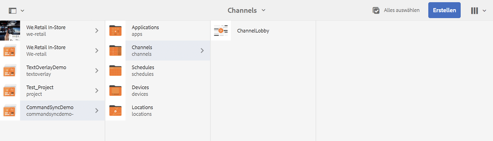
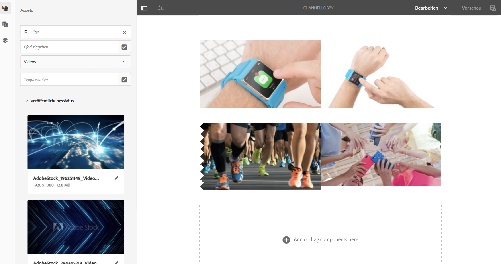
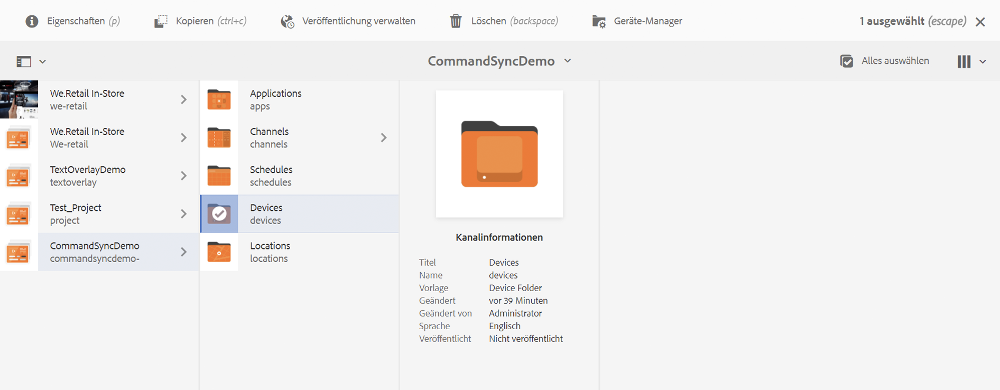
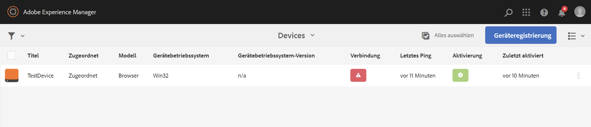
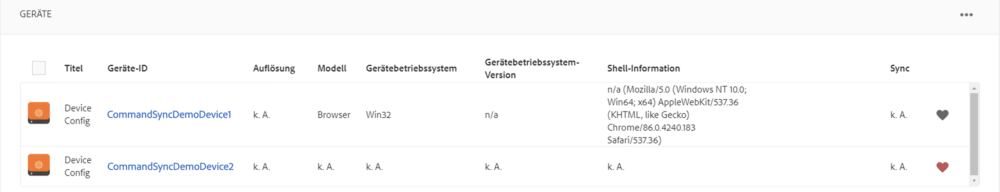
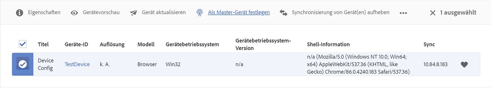
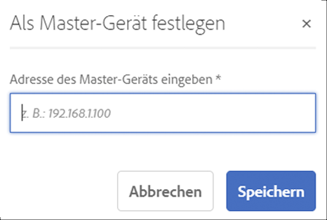
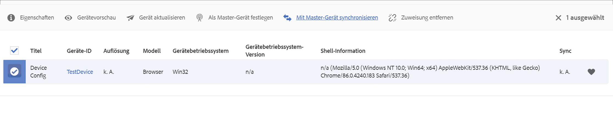
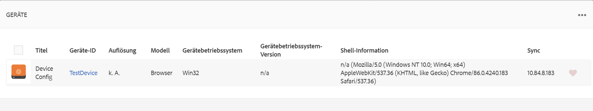
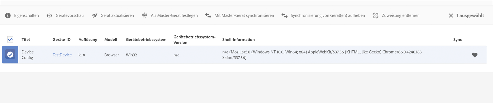

# Befehlssynchronisierung {#command-sync}

Auf der folgenden Seite wird die Verwendung der Befehlssynchronisierung beschrieben. Mithilfe der Befehlssynchronisierung kann die Wiedergabe über verschiedene Player hinweg synchronisiert werden. Die Player können unterschiedliche Inhalte wiedergeben, aber jedes Asset muss dieselbe Dauer haben.

>[!IMPORTANT]
>
>Diese Funktion unterstützt keine eingebetteten Sequenzen, dynamischen eingebetteten Sequenzen, Anwendungskanäle oder Übergänge.

## Überblick {#overview}

Digital-Signage-Lösungen müssen Videowände und die synchronisierte Wiedergabe unterstützen. Dieses Szenario trifft zu, wenn Sie etwa versuchen, Szenarien wie Neujahrs-Countdowns oder große Videos zu unterstützen, die auf mehreren Bildschirmen abgespielt werden sollen. In solchen Szenarien kommt die Befehlssynchronisierung zum Tragen.

Bei der Befehlssynchronisation agiert ein Player als *Primärgerät* und sendet den Befehl. Alle anderen Player agieren als *Clients* und beginnen mit der Wiedergabe, wenn sie den Befehl erhalten.

Das *Primärgerät* sendet einen Befehl an alle registrierten Clients, wenn es im Begriff ist, die Wiedergabe eines Elements zu starten. Die Payload dieser Aktion kann der Index des abzuspielenden Elements oder der äußere HTML-Code des abzuspielenden Elements oder beides sein.

## Implementieren der Befehlssynchronisierung {#using-command-sync}

Im folgenden Abschnitt wird beschrieben, wie Sie die Befehlssynchronisierung in einem AEM Screens-Projekt verwenden können.

>[!NOTE]
>
>Für die synchronisierte Wiedergabe ist es erforderlich, dass alle Hardwaregeräte über dieselben Spezifikationen und vorzugsweise über dasselbe Betriebssystem verfügen. Eine Synchronisierung zwischen verschiedenen Hardware- und Betriebssystemen wird nicht empfohlen.

### Einrichten des Projekts {#setting-up}

Bevor Sie die Funktion zur Befehlssynchronisierung verwenden, stellen Sie sicher, dass Sie ein Projekt und einen Kanal mit Inhalten für Ihr Projekt eingerichtet haben.

1. Das folgende Beispiel veranschaulicht ein Demoprojekt mit dem Namen **CommandSyncDemo** und einem Sequenzkanal namens **ChannelLobby**.

   

   >[!NOTE]
   >
   >Informationen zum Erstellen eines Kanals oder Hinzufügen von Inhalten zu einem Kanal finden Sie unter [Erstellen und Verwalten von Kanälen](/help/user-guide/managing-channels.md).

   Der Kanal enthält den folgenden Inhalt, wie in der Abbildung unten dargestellt.

   

1. Erstellen Sie einen Standort **Lobby** und dann ein Display mit dem Namen **LobbyDisplay** im Ordner **Standorte**, wie in der Abbildung unten dargestellt.
   

1. Weisen Sie den Kanal **ChannelLobby** Ihrem **LobbyDisplay** zu. Sie können jetzt den der Anzeige zugewiesenen Kanal im Anzeige-Dashboard anzeigen.
   

   >[!NOTE]
   >
   >Informationen zum Zuweisen eines Kanals zu einer Anzeige finden Sie unter [Erstellen und Verwalten von Anzeigen](/help/user-guide/managing-displays.md).

1. Navigieren Sie zum Ordner **Geräte**.
1. Klicken Sie in der Aktionsleiste auf **Geräte-Manager**.

   

   >[!NOTE]
   >
   >Informationen zum Registrieren eines Geräts finden Sie unter [Geräteregistrierung](/help/user-guide/device-registration.md).

1. Zu Demozwecken werden in diesem Beispiel ein Chrome-Gerät und ein Windows-Player als zwei separate Geräte dargestellt. Beide Geräte verweisen auf dieselbe Anzeige.
   

### Aktualisieren von Kanaleinstellungen

1. Navigieren Sie zu **ChannelLobby**.
1. Klicken Sie in der Aktionsleiste auf **Bearbeiten**. 
1. Klicken Sie auf den gesamten Kanal, wie in der Abbildung unten dargestellt.
   

1. Klicken Sie auf das Schraubenschlüssel-Symbol.
   

1. Geben Sie im Dialogfeld **Seite** das Keyword *synced* in das Feld **Strategie** ein.
   

### Einrichten eines Primärgeräts {#setting-up-primary}

1. Navigieren Sie über **CommandSyncDemo** > **Standorte** > **Lobby** > **LobbyDisplay** zum Anzeige-Dashboard. Klicken Sie dann in der Aktionsleiste auf **Dashboard**.
Beachten Sie die beiden Geräte (Chrome und Windows-Player) im Bedienfeld **GERÄTE**, wie in der folgenden Abbildung dargestellt:
   

1. Klicken Sie im Bedienfeld **GERÄTE** auf das Gerät, das Sie als Primärgerät festlegen möchten. Das folgende Beispiel veranschaulicht die Einrichtung des Chrome-Geräts als Primärgerät. Klicken Sie auf **Als Primärgerät festlegen**.

   

1. Geben Sie die IP-Adresse in **Als Primärgerät festlegen** ein und klicken Sie auf **Speichern**.

   

>[!NOTE]
>
>Es können mehrere Geräte als Primärgeräte eingerichtet werden.

### Synchronisieren mit dem Primärgerät {#sync-up-primary}

1. Nachdem Sie das Chrome-Gerät als Primärgerät festgelegt haben, synchronisieren Sie das andere Gerät (in diesem Fall den Windows-Player), um es mit dem Primärgerät zu synchronisieren.
Klicken Sie dazu im Bedienfeld **GERÄTE** auf das andere Gerät (in diesem Fall den Windows-Player) und klicken Sie auf **Mit Primärgerät synchronisieren**.

   

1. Klicken Sie auf das Gerät in der Liste und dann auf **Speichern**.

   >[HINWEIS:]
   > Im Dialogfeld **Mit Primärgerät synchronisieren** wird die Liste der Primärgeräte angezeigt. Wählen Sie das bevorzugte aus.

1. Sobald das Gerät (Windows-Player) mit dem Primärgerät (Chrome-Player) synchronisiert ist, wird das synchronisierte Gerät im Fenster **GERÄTE** angezeigt.

   

### Aufheben der Synchronisierung mit dem Primärgerät {#desync-up-primary}

Sobald ein oder mehrere Geräte mit einem Primärgerät synchronisiert wurden, kann deren Synchronisierung mit diesem Gerät aufgehoben werden.

>[!NOTE]
>
>Wenn die Synchronisierung eines Primärgeräts aufgehoben wird, werden auch alle Verknüpfungen zu Client-Geräten, die mit diesem Primärgerät verbunden sind, aufgehoben.

Um die Synchronisierung des Primärgeräts aufzuheben, führen Sie die folgenden Schritte aus:

1. Navigieren Sie zum Bedienfeld **GERÄTE** und klicken Sie auf das Gerät.

1. Klicken Sie auf **Geräte desynchronisieren**, um die Synchronisierung des Clients mit dem Primärgerät aufzuheben.

   

1. Klicken Sie auf **Bestätigen**, um die Synchronisierung des ausgewählten Geräts mit dem Primärgerät aufzuheben.

   >[HINWEIS:]
   > Wenn Sie auf das Primärgerät klicken und die Option zur Aufhebung der Synchronisierung verwenden, wird die Synchronisierung aller mit dem Primärgerät verbundenen Geräte in einem Schritt aufgehoben.
