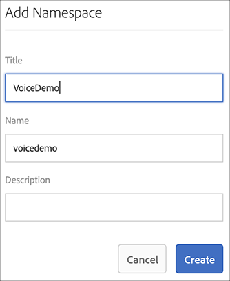

# Spracherkennung in AEM Screens {#voice-recognition}

>[!IMPORTANT]
>
>**Wichtige Datenschutzinformationen**
>
>Bei Verwendung der Spracherkennungsfunktion befolgen Sie alle geltenden rechtlichen und ethischen Richtlinien für Ihre Region (einschließlich, aber nicht darauf beschränkt, Endbenutzern einen sichtbaren Hinweis darauf zu geben, dass der Player die Spracherkennung verwendet). Adobe Inc. empfängt, speichert oder verarbeitet keine der sprachbezogenen Informationen. Die AEM Screens-Player verwenden die Standard-Web-Sprache-API, die in der Browsing-Engine integriert ist. Hinter den Kulissen wird eine Wellenform Ihrer Sprache zur Konvertierung von Sprache in Text an die Server von Google gesendet, und dieser Text wird vom Player mit den konfigurierten Suchbegriffen abgeglichen.
>
>Weitere Informationen finden Sie im Whitepaper zum Datenschutz von [Google über die Web-Sprach-API](https://www.google.com/chrome/privacy/whitepaper.html#speech) .

## Übersicht {#overview}

Die Spracherkennungsfunktion ermöglicht die Inhaltsänderung in einem AEM Screens-Kanal, der durch Sprachinteraktionen gesteuert wird.

Ein Inhaltsautor kann eine Anzeige so konfigurieren, dass Sprachaktivierung möglich ist. Diese Funktion soll Kunden die Möglichkeit geben, Sprache als Methode der Interaktion mit ihren Displays zu verwenden. Einige ähnliche Anwendungsfälle umfassen das Auffinden von Produktempfehlungen in Geschäften, das Bestellen von Menüpunkten in Restaurants und Restaurants. Diese Funktion verbessert die Barrierefreiheit für Benutzer und kann die Kundenerfahrung erheblich verbessern.

>[!NOTE]
>Die Player-Hardware muss Spracheingaben wie ein Mikrofon unterstützen.

## Implementierung der Spracherkennung {#implementing}

>[!IMPORTANT]
> Die Spracherkennungsfunktion ist nur auf Chrome- und Electron-Playern verfügbar.

Um die Spracherkennung in Ihrem AEM Screens-Projekt zu implementieren, müssen Sie die Spracherkennung für die Anzeige aktivieren und jeden Kanal mit einem eindeutigen Tag verknüpfen, um eine Kanal-Transition auszulösen.

Im folgenden Abschnitt wird beschrieben, wie Sie die Spracherkennungsfunktion in einem AEM Screens-Projekt aktivieren und verwenden können.

### Einrichten des Projekts {#setting-up}

Bevor Sie die Spracherkennungsfunktion verwenden, stellen Sie sicher, dass Sie über ein Projekt und einen Kanal mit Inhalten verfügen, die für Ihr Projekt eingerichtet wurden.

1. Das folgende Beispiel zeigt ein Demoprojekt mit dem Namen **VoiceDemo** und drei Kanal **Main**, **ColdDrinks** und **HotDrinks**.

   

   >[!NOTE]
   >
   >Informationen zum Erstellen eines Kanals oder Hinzufügen von Inhalten zu einem Kanal finden Sie unter [Erstellen und Verwalten von Kanälen](/help/user-guide/managing-channels.md)

1. Navigieren Sie zu jedem Kanal und fügen Sie Inhalt hinzu. Navigieren Sie beispielsweise zu **VoiceDemo** —> **Kanal** —> **Main** und wählen Sie den Kanal aus. Klicken Sie in der Aktionsleiste auf &quot; **Bearbeiten** &quot;, um den Editor zu öffnen und den gewünschten Inhalt (Bilder/Videos) hinzuzufügen. Fügen Sie auf ähnliche Weise Inhalt zu **ColdDrinks** - und **HotDrinks** -Kanälen hinzu.

   Die Kanäle enthalten jetzt Assets (Bilder), wie in den folgenden Abbildungen dargestellt.

   **Allgemein**:

   

   **ColdDrinks**:

   

   **HotDrinks**:

   

### Setting up Tags for Channels {#setting-tags}

Nachdem Sie Ihren Kanälen Inhalte hinzugefügt haben, müssen Sie zu jedem der Kanal navigieren und entsprechende Tags hinzufügen, die die Spracherkennung auslösen würden.

Gehen Sie wie folgt vor, um Ihrem Kanal Tags hinzuzufügen:

1. Navigieren Sie zu jedem Kanal und fügen Sie Inhalt hinzu. Navigieren Sie beispielsweise zu **VoiceDemo** —> **Kanal** —> **Main** und wählen Sie den Kanal aus.

1. Klicken Sie in der Aktionsleiste auf **Eigenschaften**.

   

1. Navigieren Sie zur Registerkarte &quot; **Grundlagen** &quot;und wählen Sie im Feld &quot; **Tags** &quot;ein bereits vorhandenes Tag aus oder erstellen Sie ein neues.

   Sie können entweder ein neues Tag erstellen, indem Sie einen neuen Namen für das Tag eingeben und die `return` Eingabetaste drücken, wie in der folgenden Abbildung gezeigt:

   

   Oder

   Sie können Tags aus Ihrer AEM-Instanz im Voraus für Ihr Projekt erstellen und auch diese auswählen. Nachdem Sie die unter [Erstellen von Tags](#creating-tags)erläuterten Schritte ausgeführt haben, können Sie das Tag an der gewünschten Stelle auswählen und dem Kanal hinzufügen, wie in der folgenden Abbildung dargestellt:

   

1. Klicken Sie auf **Speichern &amp; Schließen** , sobald Sie fertig sind.

Fügen Sie entsprechend dem Kanal **HotDrinks** das Tag **hot** hinzu.

#### Erstellen von Tags {#creating-tags}

Gehen Sie wie folgt vor, um Tags zu erstellen:

1. Navigieren Sie zu Ihrer AEM Instanz.
1. Klicken Sie auf Tools —> **Tagging**.
   
1. Click **Create** --> **Create Namespace**.
   
1. Geben Sie den Namen Ihres Projekts ein, z. B.: **VoiceDemo** und klicken Sie auf **Erstellen**.
   
1. Select the **VoiceDemo** project and click **Create Tag** from the action bar.
   
1. Geben Sie den Namen Ihres Tags ein und klicken Sie auf **Senden**.
   

Jetzt können Sie diese Tags in Ihrem AEM Screens-Projekt verwenden.

### Zuweisen von Kanal zu einer Anzeige und Aktivieren der Spracherkennung {#channel-assignment}

1. Erstellen Sie eine Anzeige im Ordner **Standorte**, wie in der Abbildung unten dargestellt.

   

   >[!NOTE]
   >Informationen zum Zuweisen eines Kanals zu einer Anzeige finden Sie unter [Erstellen und Verwalten von Anzeigen](/help/user-guide/managing-displays.md).

1. Weisen Sie die Kanal **Main**, **ColdDrinks** und **HotDrinks** Ihrem **LobbyDisplay** zu.

1. Legen Sie beim Zuweisen des Kanals für jeden Kanal die folgenden Eigenschaften fest.

   | **Kanalname** | **Priorität** | **Unterstützte Ereignisse** |
   |---|---|---|
   | Allgemein | 2 | Initial Load, Idle Screen, Timer |
   | HotDrinks | 1 | Benutzerinteraktion |
   | ColdDrinks | 1 | Benutzerinteraktion |

   >[!NOTE]
   >
   >Informationen zum Zuweisen eines Kanals zu einer Anzeige finden Sie unter [Erstellen und Verwalten von Anzeigen](/help/user-guide/managing-displays.md).

1. Nachdem Sie einer Anzeige Kanal zugewiesen haben, navigieren Sie zum **LobbyDisplay** und wählen Sie die Anzeige aus. Wählen Sie in der Aktionsleiste &quot; **Eigenschaften** &quot;aus.

1. Navigieren Sie zur Registerkarte **Anzeige** und aktivieren Sie die Option **Sprachaktivierung** unter **Inhalt**.

   

   >[!IMPORTANT]
   >Die Spracherkennungsfunktion muss auf der Anzeige aktiviert werden.

#### Anzeigen des Inhalts im Chrome Player {#viewing-content}

Nach Abschluss der obigen Schritte können Sie Ihr Chrome-Gerät registrieren und die Ausgabe Ansicht.

>[!NOTE]
>Informationen zum Registrieren eines Geräts auf einem AEM Screens-Player finden Sie unter [Geräteregistrierung](device-registration.md) .

Dieses Beispiel zeigt die Ausgabe auf einem Chrome Player.

Der **Main** Kanal spielt seinen Inhalt, aber wenn Sie Wörter mit Suchbegriff **heiß** , wie *ich möchte ein warmes Getränk*, den Kanal Beginn spielen den Inhalt des **HotDrinks** Kanal.

Ebenso, wenn Sie Wörter mit einem Suchbegriff **kalt** , wie *ich gerne hätte etwas kalt*, der Kanal Beginn spielen den Inhalt des **ColdDrinks** Kanal.

