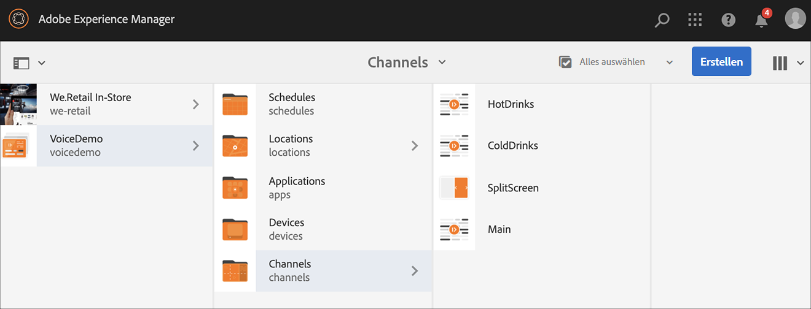

# Spracherkennung in AEM Screens {#voice-recognition}

>[!IMPORTANT]
>
>**Wichtige Datenschutzinformationen**
>
>Befolgen Sie bei der Verwendung der Spracherkennungsfunktion alle geltenden rechtlichen und ethischen Richtlinien für Ihre Region. Zu diesen Richtlinien gehört u. a. ein sichtbarer Hinweis für die Benutzenden, dass der Player die Spracherkennung verwendet. Adobe erhält, speichert oder verarbeitet keine der sprachbezogenen Informationen. Die AEM Screens-Player verwenden die standardmäßige Web Speech API, die in die Browser-Engine integriert ist. Hinter den Kulissen sendet diese API eine Wellenform Ihrer Sprache an die Server von Google zur Umwandlung von Sprache in Text. Der Player gleicht den Text mit den konfigurierten Keywords ab.
>
>Weitere Informationen finden Sie im [Datenschutz-Whitepaper von Google zur Web Speech API](https://www.google.com/chrome/privacy/whitepaper.html#speech).

Die Spracherkennungsfunktion ermöglicht Inhaltsänderungen in einem AEM Screens-Kanal via Sprachinteraktionen.

Eine Inhaltsautorin oder ein Inhaltsautor kann eine Anzeige so konfigurieren, dass sie sprachaktiviert ist. Der Zweck dieser Funktion ist es, Kundinnen und Kunden die Möglichkeit zu geben, per Sprache mit ihrem Anzeigegerät zu interagieren. Einige ähnliche Anwendungsfälle umfassen das Auffinden von Produktempfehlungen in Geschäften oder das Bestellen von der Speisekarte in Gaststätten und Restaurants. Diese Funktion erhöht die Zugänglichkeit für Benutzer und kann das Kundenerlebnis erheblich verbessern.

>[!NOTE]
>Die Player-Hardware muss Spracheingabegeräte wie Mikrofone unterstützen.

## Implementieren der Spracherkennung {#implementing}

>[!IMPORTANT]
> Die Spracherkennungsfunktion ist nur bei Chrome- und Windows-Playern verfügbar.

Um die Spracherkennung in Ihrem AEM Screens-Projekt zu implementieren, aktivieren Sie die Spracherkennung für die Anzeige und verknüpfen jeden Kanal mit einem eindeutigen Tag, um einen Kanalübergang auszulösen.

Im folgenden Abschnitt wird beschrieben, wie Sie die Spracherkennungsfunktion in einem AEM Screens-Projekt aktivieren und verwenden können.

## Anzeigen von Inhalten im Vollbild- oder Splitscreen-Kanalschalter {#sequence-channel}

Bevor Sie eine Funktion zur Spracherkennung verwenden, stellen Sie sicher, dass Sie ein Projekt und einen Kanal mit Inhalten für Ihr Projekt eingerichtet haben.

1. Im folgenden Beispiel sehen Sie ein Demoprojekt mit dem Namen **VoiceDemo** und drei Kanälen **Main**, **ColdDrinks** und **HotDrinks**.

   

   >[!NOTE]
   >
   >Informationen zum Erstellen eines Kanals oder Hinzufügen von Inhalten zu einem Kanal finden Sie unter [Erstellen und Verwalten von Kanälen](/help/user-guide/managing-channels.md).

   ODER

   Sie können drei Sequenzkanäle **Main**, **ColdDrinks** und **HotDrinks** und einen weiteren 1x2-Splitscreen-Kanal **SplitScreen** erstellen, wie in der Abbildung unten dargestellt.

   

1. Navigieren Sie zu jedem der Kanäle und fügen Sie Inhalte hinzu. Navigieren Sie beispielsweise zu **VoiceDemo** > **Kanäle** > **Main** und klicken Sie auf den Kanal. Klicken Sie in der Aktionsleiste auf **Bearbeiten** und fügen Sie dann Inhalte (Bilder/Videos) nach Ihren Wünschen hinzu. Fügen Sie auf die gleiche Weise Inhalte zu den Kanälen **ColdDrinks** und **HotDrinks** hinzu.

   Die Kanäle enthalten nun Assets (Bilder), wie in den folgenden Abbildungen dargestellt.

   **Main**:

   

   **ColdDrinks**:

   

   **HotDrinks**:

   

   Wenn Sie den Splitscreen-Kanal zu Ihrem Projekt hinzugefügt haben, navigieren Sie zu **SplitScreen** und ziehen Sie zwei eingebettete Sequenzen per Drag-and-Drop dorthin. Fügen Sie, wie in der folgenden Abbildung dargestellt, Pfade zu den beiden Kanälen **ColdDrinks** und **HotDrinks** hinzu.
   

### Festlegen von Tags für Kanäle {#setting-tags}

Nachdem Sie Ihren Kanälen Inhalte hinzugefügt haben, navigieren Sie zu den einzelnen Kanälen und fügen die entsprechenden Tags hinzu, die die Spracherkennung auslösen würden.

Gehen Sie wie folgt vor, um Ihrem Kanal Tags hinzuzufügen:

1. Navigieren Sie zu jedem der Kanäle und fügen Sie Inhalte hinzu. Navigieren Sie beispielsweise zu **VoiceDemo** > **Kanäle** > **Main** und klicken Sie auf den Kanal.

1. Klicken Sie in der Aktionsleiste auf **Eigenschaften**.

   

1. Navigieren Sie zur Registerkarte **Grundlagen** und wählen Sie ein bereits vorhandenes Tag aus dem Feld **Tags** aus oder erstellen Sie ein neues.

   Sie können entweder ein Tag erstellen, indem Sie einen neuen Namen für das Tag eingeben und die `return`-Taste drücken, wie in der folgenden Abbildung gezeigt:

   

   ODER

   Sie können auch vorab Tags aus Ihrer AEM-Instanz für Ihr Projekt erstellen und diese auswählen. Nachdem Sie die unter [Erstellen von Tags](#creating-tags) erläuterten Schritte ausgeführt haben, können Sie das Tag an der gewünschten Stelle auswählen und dem Kanal hinzufügen, wie in der folgenden Abbildung dargestellt:

   

1. Fügen Sie dem Kanal **HotDrinks** in ähnlicher Weise ein Tag mit dem Namen **heiß** hinzu.

1. Wenn Sie einen Splitscreen-Kanal verwenden, fügen Sie beide Tags (**hot** und **cold**) wie in der Abbildung unten dargestellt zu den Eigenschaften des Kanals **SplitScreen** hinzu.

   

1. Klicken Sie auf **Speichern und schließen**, wenn Sie fertig sind.

### Erstellen von Tags {#creating-tags}

Gehen Sie wie folgt vor, um Tags zu erstellen:

1. Navigieren Sie zu Ihrer AEM-Instanz.

1. Klicken Sie auf das Symbol „Tools“ > **Tagging**.
   

1. Klicken Sie auf **Erstellen** > **Namespace erstellen**.
   

1. Geben Sie den Namen Ihres Projekts ein, z. B. **VoiceDemo**, und klicken Sie auf **Erstellen**.

1. Wählen Sie das Projekt **VoiceDemo** aus und klicken Sie in der Aktionsleiste auf **Tag erstellen**.
   

1. Geben Sie den Namen Ihres Tags ein und klicken Sie auf **Senden**.
   

Jetzt können Sie diese Tags in Ihrem AEM Screens-Projekt verwenden.

### Zuweisen eines Kanals zu einer Anzeige und Aktivieren der Spracherkennung {#channel-assignment}

1. Erstellen Sie eine Anzeige im Ordner **Standorte**, wie in der Abbildung unten dargestellt.

   

   >[!NOTE]
   >Informationen zum Zuweisen eines Kanals zu einer Anzeige finden Sie unter [Erstellen und Verwalten von Anzeigen](/help/user-guide/managing-displays.md).

1. Weisen Sie die Kanäle **Main**, **ColdDrinks** und **HotDrinks** Ihrer Anzeige **LobbyDisplay** zu. Wenn Sie außerdem den Kanal **SplitScreen** für Ihr Projekt verwenden, stellen Sie sicher, dass Sie ihn auch der Anzeige zuweisen.

   >[!NOTE]
   >Wenn Sie einen Splitscreen-Kanal erstellt haben, weisen Sie Ihrer Anzeige den **SplitScreen**-Kanal zu.

1. Legen Sie beim Zuweisen des Kanals für jeden Kanal die folgenden Eigenschaften fest.

   | **Kanalname** | **Priorität** | **Unterstützte Ereignisse** |
   |---|---|---|
   | Main | 2 | Erster Ladevorgang, Bildschirm bei Untätigkeit, Timer |
   | HotDrinks | 1 | Benutzerinteraktion |
   | ColdDrinks | 1 | Benutzerinteraktion |
   | SplitScreen | 1 | Benutzerinteraktion |

   >[!NOTE]
   >
   >Informationen zum Zuweisen eines Kanals zu einer Anzeige finden Sie unter [Erstellen und Verwalten von Anzeigen](/help/user-guide/managing-displays.md).

1. Nachdem Sie einer Anzeige Kanäle zugewiesen haben, navigieren Sie zu **LobbyDisplay** und wählen Sie die Anzeige aus. Klicken Sie in der Aktionsleiste auf **Eigenschaften**.

1. Navigieren Sie zur Registerkarte **Anzeige** und aktivieren Sie unter **Inhalt** die Option **Sprachaktiviert**.

   

   >[!IMPORTANT]
   >Die Spracherkennungsfunktion muss von der Anzeige aus aktiviert werden.

### Anzeigen von Inhalten im Chrome-Player {#viewing-content}

Sobald die vorhergehenden Schritte abgeschlossen sind, können Sie Ihr Chrome-Gerät registrieren, um die Ausgabe anzusehen.

>[!NOTE]
>Weitere Informationen finden Sie unter [Geräteregistrierung](device-registration.md).

**Gewünschte Ausgabe für den Sequenz-Kanal**

Der Kanal **Main** spielt seinen Inhalt ab. Wenn Sie jedoch Wörter mit dem Keyword **heiß** verwenden, wie z. B. *Ich hätte gerne ein heißes Getränk*, beginnt der Kanal mit der Wiedergabe des Inhalts des Kanals **HotDrinks**.

Ähnlich verhält es sich, wenn Sie ein Wort mit dem Keyword **kalt** verwenden, wie z. B. *Ich hätte gerne etwas Kaltes*: der Kanal beginnt dann mit der Wiedergabe des Inhalts des Kanals **ColdDrinks**.

**Gewünschte Ausgabe für den Splitscreen-Kanal**

Der Kanal **Main** spielt seinen Inhalt ab. Wenn Sie jedoch Wörter mit den Keywords **heiß** und **kalt** zusammen verwenden, wie z. B. *Ich möchte die Karte für heiße und kalte Getränke sehen*, spielt der Kanal den Inhalt des Kanals **SplitScreen** ab. Wenn Sie *zurück zum Hauptmenü* sagen, wird zum **Hauptkanal** zurückgekehrt.
