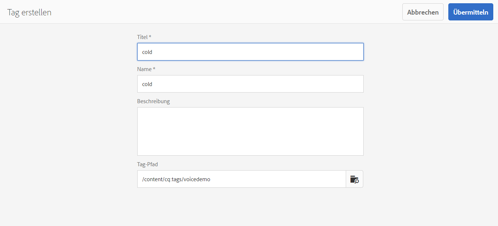

# Spracherkennung in AEM Screens {#voice-recognition}

>[!IMPORTANT]
>
>**Wichtige Datenschutzinformationen**
>
>Befolgen Sie bei der Verwendung der Spracherkennungsfunktion alle geltenden rechtlichen und ethischen Richtlinien für Ihre Region (einschließlich, aber nicht beschränkt auf die Bereitstellung eines sichtbaren Hinweises für Endbenutzer, dass der Player die Spracherkennung verwendet). Adobe erhält, speichert oder verarbeitet keine der sprachbezogenen Informationen. Die AEM Screens-Player verwenden die standardmäßige Web Speech API, die in die Browser-Engine integriert ist. Hinter den Kulissen sendet diese API eine Wellenform Ihrer Sprache an die Server von Google zur Konvertierung von Sprache in Text. Dieser Text wird vom Player mit den konfigurierten Keywords abgeglichen.
>
>Siehe [Google-Datenschutz-Whitepaper zur Web Speech API](https://www.google.com/chrome/privacy/whitepaper.html#speech) für weitere Details.

Die Spracherkennungsfunktion ermöglicht Inhaltsänderungen in einem AEM Screens-Kanal via Sprachinteraktionen.

Ein Inhaltsautor kann eine Anzeige so konfigurieren, dass sie sprachaktiviert ist. Mit dieser Funktion können Kunden Sprache als Methode zur Interaktion mit ihren Anzeigen verwenden. Einige ähnliche Anwendungsfälle umfassen das Auffinden von Produktempfehlungen in Geschäften oder das Bestellen von der Speisekarte in Gaststätten und Restaurants. Diese Funktion erhöht die Zugänglichkeit für Benutzer und kann das Kundenerlebnis erheblich verbessern.

>[!NOTE]
>Die Player-Hardware muss Spracheingabegeräte wie Mikrofone unterstützen.

## Implementieren der Spracherkennung {#implementing}

>[!IMPORTANT]
> Die Spracherkennungsfunktion ist nur bei Chrome- und Windows-Playern verfügbar.

Um die Spracherkennung in Ihrem AEM Screens-Projekt zu implementieren, aktivieren Sie die Spracherkennung für die Anzeige und verknüpfen Sie jeden Kanal mit einem eindeutigen Tag, um einen Kanalübergang Trigger.

Im folgenden Abschnitt wird beschrieben, wie Sie die Spracherkennungsfunktion in einem AEM Screens-Projekt aktivieren und verwenden können.

## Anzeigen von Inhalten im Vollbild- oder Splitscreen-Kanalschalter {#sequence-channel}

Bevor Sie die Funktion zur Spracherkennung verwenden, stellen Sie sicher, dass Sie ein Projekt und einen Kanal mit Inhalten für Ihr Projekt eingerichtet haben.

1. Im folgenden Beispiel sehen Sie ein Demoprojekt mit dem Namen **VoiceDemo** und drei Kanälen **Main**, **ColdDrinks** und **HotDrinks**.

   

   >[!NOTE]
   >
   >Informationen zum Erstellen eines Kanals oder Hinzufügen von Inhalten zu einem Kanal finden Sie unter [Erstellen und Verwalten von Kanälen](/help/user-guide/managing-channels.md)

   Oder

   Sie können drei Sequenzkanäle erstellen **Main**, **ColdDrinks**, und **HotDrinks** und einen weiteren 1x2-Splitscreen-Kanal **SplitScreen** wie in der folgenden Abbildung dargestellt.

   

1. Navigieren Sie zu jedem Kanal und fügen Sie Inhalt hinzu. Navigieren Sie beispielsweise zu **VoiceDemo** > **Kanäle** > **Main** und wählen Sie den Kanal aus. Auswählen **Bearbeiten** Fügen Sie in der Aktionsleiste entsprechend Ihren Anforderungen Inhalte (Bilder/Videos) hinzu. Fügen Sie auf ähnliche Weise den Kanälen **ColdDrinks** und **HotDrinks** Inhalt hinzu.

   Die Kanäle enthalten nun Assets (Bilder), wie in den folgenden Abbildungen dargestellt.

   **Main**:

   

   **ColdDrinks**:

   

   **HotDrinks**:

   

   Wenn Sie dem Projekt den Splitscreen-Kanal hinzugefügt haben, navigieren Sie zu **SplitScreen**, ziehen Sie zwei eingebettete Sequenzen per Drag-and-Drop und fügen Sie Pfade zu den Kanälen **ColdDrinks** und **HotDrinks** hinzu, wie in der Abbildung unten dargestellt.
   

### Festlegen von Tags für Kanäle {#setting-tags}

Nachdem Sie Ihren Kanälen Inhalte hinzugefügt haben, navigieren Sie zu jedem Kanal und fügen Sie entsprechende Tags hinzu, die die Spracherkennung Trigger.

Gehen Sie wie folgt vor, um Ihrem Kanal Tags hinzuzufügen:

1. Navigieren Sie zu jedem Kanal und fügen Sie Inhalt hinzu. Navigieren Sie beispielsweise zu **VoiceDemo** > **Kanäle** > **Main** und wählen Sie den Kanal aus.

1. Wählen Sie in der Aktionsleiste **Eigenschaften** aus.

   

1. Navigieren Sie zum **Grundlagen** und wählen Sie ein vorhandenes Tag aus dem **Tags** oder erstellen Sie ein Feld.

   Sie können entweder ein Tag erstellen, indem Sie einen neuen Namen für Ihr Tag eingeben und `return` -Taste, wie in der folgenden Abbildung dargestellt:

   

   Oder

   Sie können vorab Tags aus Ihrer AEM-Instanz für Ihr Projekt erstellen und diese ebenfalls auswählen. Nachdem Sie die unter [Erstellen von Tags](#creating-tags)können Sie das Tag aus der Position auswählen und Ihrem Kanal hinzufügen, wie in der folgenden Abbildung dargestellt:

   

1. Fügen Sie dem Kanal **HotDrinks** in ähnlicher Weise ein Tag mit dem Namen **heiß** hinzu.

1. Wenn Sie einen Splitscreen-Kanal verwenden, fügen Sie beide Tags (**hot** und **cold**) wie in der Abbildung unten dargestellt zu den Eigenschaften des Kanals **SplitScreen** hinzu.

   

1. Auswählen **Speichern und schließen** wenn Sie fertig sind.

### Erstellen von Tags {#creating-tags}

Gehen Sie wie folgt vor, um Tags zu erstellen:

1. Navigieren Sie zu Ihrer AEM-Instanz.

1. Symbol Tools auswählen > **Tagging**.
   

1. Auswählen **Erstellen** > **Namespace erstellen**.
   

1. Geben Sie den Namen Ihres Projekts ein, beispielsweise **VoiceDemo** und wählen **Erstellen**.

1. Wählen Sie die **VoiceDemo** Projekt und wählen Sie **Tag erstellen** in der Aktionsleiste aus.
   

1. Geben Sie den Namen Ihres Tags ein und wählen Sie **Einsenden**.
   

Jetzt können Sie diese Tags in Ihrem AEM Screens-Projekt verwenden.

### Zuweisen eines Kanals zu einer Anzeige und Aktivieren der Spracherkennung {#channel-assignment}

1. Erstellen Sie eine Anzeige im Ordner **Standorte**, wie in der Abbildung unten dargestellt.

   

   >[!NOTE]
   >Informationen zum Zuweisen eines Kanals zu einer Anzeige finden Sie unter [Erstellen und Verwalten von Anzeigen](/help/user-guide/managing-displays.md).

1. Weisen Sie die Kanäle **Main**, **ColdDrinks** und **HotDrinks** Ihrer Anzeige **LobbyDisplay** zu. Wenn Sie die **SplitScreen** -Kanal für Ihr Projekt verwenden, stellen Sie sicher, dass Sie dies der Anzeige zuweisen.

   >[!NOTE]
   >Wenn Sie einen Splitscreen-Kanal erstellt haben, weisen Sie Ihrer Anzeige den **SplitScreen**-Kanal zu.

1. Legen Sie beim Zuweisen des Kanals für jeden Kanal die folgenden Eigenschaften fest.

   | **Kanalname** | **Priorität** | **Unterstützte Ereignisse** |
   |---|---|---|
   | Main | 2 | Erster Ladevorgang, Bildschirm bei Untätigkeit, Timer |
   | HotDrinks | 1 | Benutzerinteraktion |
   | ColdDrinks | 1 | Benutzerinteraktion |
   | SplitScreen | 1 | Benutzerinteraktion |

   >[!NOTE]
   >
   >Informationen zum Zuweisen eines Kanals zu einer Anzeige finden Sie unter [Erstellen und Verwalten von Anzeigen](/help/user-guide/managing-displays.md).

1. Nachdem Sie einer Anzeige Kanäle zugewiesen haben, navigieren Sie zur **LobbyDisplay** und wählen Sie die Anzeige aus. Wählen Sie in der Aktionsleiste **Eigenschaften** aus.

1. Navigieren Sie zur Registerkarte **Anzeige** und aktivieren Sie die Option **Sprachaktiviert** unter **Inhalt**.

   

   >[!IMPORTANT]
   >Die Spracherkennungsfunktion muss von der Anzeige aus aktiviert werden.

### Anzeigen von Inhalten im Chrome-Player {#viewing-content}

Wenn die vorherigen Schritte abgeschlossen sind, können Sie Ihr Chrome-Gerät registrieren, um die Ausgabe anzuzeigen.

>[!NOTE]
>Siehe [Geräteregistrierung](device-registration.md).

**Gewünschte Ausgabe für den Sequenz-Kanal**

Der Kanal **Main** gibt seinen Inhalt wieder. Wenn Sie jedoch Wörter mit dem Keyword **heiß** verwenden, wie beispielsweise *ich möchte ein heißes Getränk*, beginnt der Kanal, den Inhalt des Kanals **HotDrinks** wiederzugeben.

Gleichermaßen, wenn Sie Wörter mit einem Keyword verwenden **kalt** wie *Ich hätte gerne etwas Kaltes*, beginnt der Kanal mit der Wiedergabe des Inhalts der **ColdDrinks** -Kanal.

**Gewünschte Ausgabe für den Splitscreen-Kanal**

Die **Main** -Kanal gibt seinen Inhalt wieder. Wenn Sie jedoch Wörter mit Keywords verwenden **heiß** und **kalt** zusammen, z. B. *Ich hätte gerne die Speisekarte für warme und kalte Getränke.*, gibt der Kanal den Inhalt der **SplitScreen** -Kanal. Wenn Sie *Zurück zum Hauptmenü*, kehrt er zum **Main** -Kanal.
