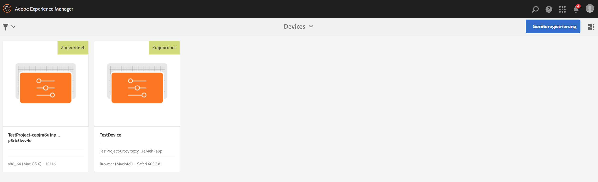
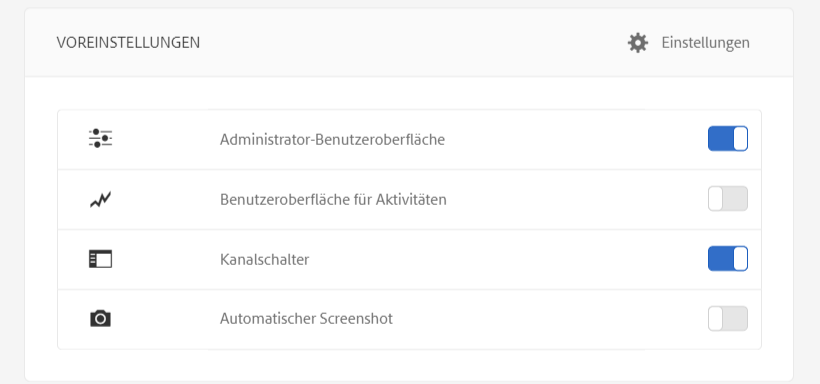

# Arbeiten mit dem AEM Screens-Player

Im AEM Screens-Player können Sie den Inhalt für einen Kanal und andere Einstellungen verwalten.

>[!NOTE]
>
>Presse ***Strg+Befehl+F*** damit Sie den Vollbildmodus für den OS X AEM Screens Player beenden können.

Nachdem Sie einer Anzeige einen Kanal zugewiesen haben, zeigt der AEM Screens-Player den Inhalt an. Sie können die Einstellungen für Ihren Player entweder über die Voreinstellungen für die Administrator-Benutzeroberfläche (über das Dashboard) oder über den Player selbst konfigurieren.

## Verwenden des Geräte-Dashboards {#using-the-device-dashboard}

Sie können die Voreinstellungen für Ihr Gerät im Geräte-Dashboard konfigurieren, auf das Sie über Ihre AEM-Autoreninstanz zugreifen können.

1. Navigieren Sie vom Projekt zum Geräte-Dashboard, z. B. ***Testprojekt*** > ***Geräte***.

   Wählen Sie in der Aktionsleiste die Optionen **Geräte** und **Geräte-Manager** aus.

   

1. Wählen Sie das Gerät aus, damit Sie das Geräte-Dashboard öffnen können.

   

1. Überprüfen Sie das Fenster **VOREINSTELLUNGEN**. Sie können über diese beiden Optionen die **Administrator-Benutzeroberfläche** und den **Kanalschalter** für den Player aktivieren bzw. deaktivieren.

   

### Die Administrator-Benutzeroberfläche {#the-admin-ui}

Durch die Aktivierung der **Administrator-Benutzeroberfläche** im Fenster „Voreinstellungen“ kann der Benutzer die Administratoreinstellungen vom Screens-Player aus öffnen. Wenn Sie diese Option im Geräte-Dashboard deaktivieren, kann der Benutzer die Administrator-Benutzeroberfläche nicht über den Player öffnen.

Um die Administrator-Benutzeroberfläche vom Screens-Player aus anzuzeigen, halten Sie die linke obere Ecke gedrückt, um das Menü &quot;Admin&quot;auf Ihrem Touch-optimierten AEM Screens-Player zu öffnen, oder verwenden Sie eine Maus. Informationen werden angezeigt, nachdem die Registrierung abgeschlossen und die Kanäle geladen wurden.

>[!NOTE]
>
>Außerdem können Sie die Betriebszeit der AEM Screens Player-App anzeigen, um den Status des App-Zustands zu überprüfen.

#### Zugriff auf die Optionen im Konfigurationsmenü {#configuration-options}

Wenn Sie die Option **Konfiguration** -Option aus dem Seitenmenü, wie in der folgenden Abbildung dargestellt:

Im Menü Konfiguration können Sie die folgenden Einstellungen ändern:

* Setzen Sie die **Firmware** oder **Voreinstellungen** zurück oder wählen Sie die Option **Auf Werkseinstellungen** zurücksetzen aus.

* Geben Sie die Anzahl der maximalen Protokolldateien an, die Sie für einen AEM Screens-Player in **Max. Anzahl der beizubehalt. Prot.dateien** die maximale Zahl der Protokolldateien fest, die für einen AEM Screens-Player bewahrt werden.

* Aktivieren oder deaktivieren Sie das **Admin-Menü**, den **Kanalschalter** und die **Aktivitäts-Benutzeroberfläche** für den Screens-Player.

  Wenn die **Aktivitäts-Benutzeroberfläche** im Menü **Konfiguration** aktiviert ist, zeigt der AEM Screens-Player die *Benachrichtigungen zur Player-Aktivität* oben rechts im Player an, wie in der folgenden Abbildung dargestellt.

  

>[!NOTE]
>
>Die **Firmware aktualisieren** -Option funktioniert nur mit Cordova, z. B. Android™-Playern.

>[!NOTE]
>
>In Produktionsbereitstellungen wird empfohlen, die **Administrator-Benutzeroberfläche** zu deaktivieren.

#### Zugriff auf die Menüoptionen im Inhalts-Cache {#content-cache-options}

Sie können den Cache für Kanäle und Anwendungen über die Administrator-Benutzeroberfläche im AEM Screens-Player löschen.

Wählen Sie die **Inhalts-Cache** über die Seitenleiste aus, damit Sie den Cache aktualisieren können.

### Der Kanalschalter {#the-channel-switcher}

Durch das Aktivieren der Option **Kanalschalter** im Fenster „Voreinstellungen“ kann der Benutzer die Kanalauswahl/-einstellungen vom Screens-Player aus öffnen.

Wenn Sie diese Option im Geräte-Dashboard deaktivieren, kann der Benutzer die Kanaleinstellungen nicht über den Screens-Player steuern.

Sie können die Einstellungen für Ihren Kanal von Ihrem Screens-Player aus wechseln und steuern.

Um den Kanalschalter vom Player aus anzuzeigen, halten Sie die linke untere Ecke gedrückt, um den Kanalschalter zu öffnen, der das Wechseln von Kanälen und anderen Funktionen ermöglicht.

>[!NOTE]
>
>Sie können auch vom Screens-Player aus das Menü „Admin“ und den Kanalschalter für den Player aktivieren oder deaktivieren.
>
>(Siehe *Ändern der Voreinstellungen im AEM Screens-Player* wie im Abschnitt weiter unten beschrieben).

### Verwalten von Voreinstellungen im AEM Screens-Player

Sie können die Einstellungen für die Administrator-Benutzeroberfläche und den Kanalschalter auch im Player selbst ändern.

So ändern Sie die Voreinstellungen von Ihrem Player:

1. Halten Sie die linke obere Ecke des Leerlaufkanals gedrückt, um das Admin-Bedienfeld zu öffnen.
1. Navigieren Sie im linken Aktionsmenü zu **Konfiguration**.
1. Aktivieren bzw. deaktivieren Sie die Option „Konfiguration“ für die **Administrator-Benutzeroberfläche** oder den **Kanalschalter**.

## Fehlerbehebung beim AEM Screens-Player

Im Folgenden finden Sie empfohlene Maßnahmen bei Problemen mit dem AEM Screens-Player (Hard- und Software):

| **Probleme** | **Empfehlungen** |
|---|---|
| Speicher des Players ist voll | Löschen Sie unnötige Dateien. |
| Player hat keine Verbindung zum Netzwerk mehr | Verwenden Sie das Cat-5/Cat-6-Kabel. Bei einer WLAN-Verbindung müssen Sie den Abstand zwischen Router und Player verringern. |
| AEM Screens-Player ist abgestürzt | Es wird empfohlen, eine Watchdog-App zu verwenden, die sicherstellt, dass der AEM Screens-Player stets richtig ausgeführt wird. |
| Einstellungen für AEM Screens-Player nicht mehr vorhanden | Überprüfen Sie die Verbindung zum AEM-Server. |
| AEM Screens-Player startet nach einem Neustart des Players/Systems nicht automatisch | Überprüfen Sie den Startordner oder das Initialisierungsverfahren des Betriebssystems. |
| AEM Screens-Player zeigt falschen/alten Inhalt an | Überprüfen Sie die Netzwerkverbindung. |

### Updates für den AEM Screens-Player

Für den AEM Screens-Player gibt es zwei Arten von Updates:

| **Methode** | **Details** | **über Remote** | **Automatisiert** | **Ohne Ausfallzeit** |
|---|---|---|---|---|
| Firmware-Update | Wird über den Remote-Befehl auf vorhandene installierte Player angewendet. Nach der Aktualisierung lädt der Player automatisch mit dem vorhandenen Inhalt neu. | Ja | Benutzerdefiniert | Fast – 1-3 Sekunden |
| Player-Shell-Aktualisierungen | Dabei handelt es sich um eine neue ausführbare Datei, die im Player bereitgestellt werden kann. Dies erfordert, dass Sie eine neue Binärdatei auf den Player kopieren, die aktuelle Version stoppen und die neue Version starten. Dies kann das erneute Herunterladen des Vorausladevorgangs der Pakete erfordern. | Ja (über Remote-Shell) | Benutzerdefiniert | Nein |

## Richtlinien zur Hardware-Auswahl für Player-Geräte {#hardware-selection-guidelines-for-player-device}

Der folgende Abschnitt enthält Richtlinien zur Hardware-Auswahl für ein Screens-Projekt:

* Beziehen Sie für PC-Player und Anzeige-Panels oder Projektoren stets Komponenten von ***Handels-*** oder ***Industrie***-Qualität.

* Arbeiten Sie immer mit Anbietern, die den Markt für Digital Signage bedienen.
* Berücksichtigen Sie stets Umgebungsfaktoren wie Umgebungstemperatur und relative Luftfeuchtigkeit.
* Überprüfen Sie stets Strombedarf und Stromkonditionierung.
* Prüfen Sie sorgfältig die für die Anwendung erforderlichen Leistungsanforderungen und E/A-Anschlüsse.

In der folgenden Tabelle sind die Hardware-Konfigurationen mit typischen Anwendungsbeispielen für ein AEM Screens-Projekt zusammengefasst:

<table>
 <tbody>
  <tr>
   <td>Player-Konfiguration</td>
   <td>Prozessor</td>
   <td>Arbeitsspeicher</td>
   <td>Speicher-SSD</td>
   <td>GPU</td>
   <td>Anzeige</td>
   <td>E/A</td>
   <td>Typische Anwendungsbeispiele</td>
  </tr>
  <tr>
   <td>Einfach</td>
   <td>Intel® Atom-Prozessor mit Dualcore, i3 oder Quad-Core-Prozessor der Einstiegsklasse</td>
   <td>
4 GB Arbeitsspeicher
 
2 MB Cache
 </td>
   <td>
*ChromeOS 32 GB
 
*Windows 128 GB
 </td>
   <td>OnBoard</td>
   <td>1920 x 1080</td>
   <td>DVI  Ethernet/Wireless  2xUSB</td>
   <td>
    <ul>
     <li>Standardschleife im Vollbildmodus  </li>
     <li>Tagesaufteilung</li>
    </ul> </td>
  </tr>
  <tr>
   <td>Standard</td>
   <td>Quadcore, Intel® Core™ i5 Prozessor</td>
   <td>
8 GB Arbeitsspeicher
 
4 MB Cache
 </td>
   <td>128 GB</td>
   <td>OnBoard</td>
   <td>3840 x 2160 (<code>4K</code>)</td>
   <td>DVI, HDMI  Ethernet/Wireless,  2x USB</td>
   <td>
    <ul>
     <li>Dynamischer Inhalt aus einer Quelle</li>
     <li>Einfach interaktiv</li>
     <li>1-3 Bereichs-Layouts</li>
    </ul> </td>
  </tr>
  <tr>
   <td>Erweitert</td>
   <td>Quadcore mit Hyperthreading, Intel® Core™ i7 Prozessor</td>
   <td>
16 GB Arbeitsspeicher
 
8 MB Cache
 </td>
   <td>256 GB</td>
   <td>Dedizierte Grafik-GPU</td>
   <td>3840 x 2160 (<code>4K</code>)</td>
   <td>DVI, HDMI  Ethernet/Wireless,  4xUSB</td>
   <td>
    <ul>
     <li>4 oder mehr Inhaltsbereiche, gleichzeitige Videowiedergabe</li>
     <li>Interaktiv auf mehreren Seiten</li>
     <li>Datenauslöser aus mehreren Quellen</li>
    </ul> </td>
  </tr>
 </tbody>
</table>
