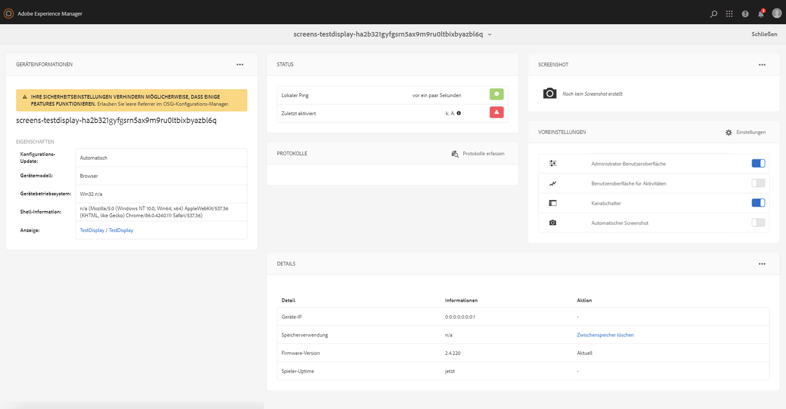

# Arbeiten mit dem AEM Screens-Player

Im AEM Screens-Player können Sie den Inhalt für einen Kanal und andere Einstellungen verwalten.

>[!NOTE]
>
>Drücken Sie ***Ctrl+Befehl+F***, um den Vollbildmodus für den AEM Screens-Player unter OS X zu beenden.

Nachdem Sie einen Kanal einer Anzeige zugewiesen haben, wird im AEM Screens-Player der Inhalt angezeigt. Sie können die Einstellungen für den Player über die Voreinstellungen für die Administrator-Benutzeroberfläche (im Dashboard) oder im Player selbst konfigurieren.

## Verwenden des Geräte-Dashboards {#using-the-device-dashboard}

Sie können die Voreinstellungen für Ihr Gerät im Geräte-Dashboard konfigurieren, auf das Sie über Ihre AEM-Autoreninstanz zugreifen können.

1. Navigieren Sie ausgehend von Ihrem Projekt zum Geräte-Dashboard, z. B. über ***Testprojekt*** > ***Geräte***.

   Klicken Sie in der Aktionsleiste auf **Geräte** und **Geräte-Manager**.

   

1. Klicken Sie auf das Gerät, um das Geräte-Dashboard zu öffnen.

   

1. Überprüfen Sie das Fenster **VOREINSTELLUNGEN**. Mit diesen beiden Optionen können Sie die **Administrator-Benutzeroberfläche** und den **Kanalschalter** für Ihren Player aktivieren oder deaktivieren.

   

### Die Administrator-Benutzeroberfläche {#the-admin-ui}

Durch die Aktivierung der **Admin-Benutzeroberfläche** im Fenster „Voreinstellungen“ lassen sich die Admin-Einstellungen vom Screens-Player aus öffnen. Wenn Sie diese Option im Geräte-Dashboard deaktivieren, können Benutzende die Administrator-Benutzeroberfläche außerdem nicht im Player öffnen.

Um die Administrator-Benutzeroberfläche vom Screens-Player aus zu öffnen, halten Sie die linke obere Ecke gedrückt, um das Menü „Admin“ auf Ihrem Touch-optimierten AEM Screens-Player zu öffnen, oder verwenden Sie eine Maus.  Nachdem die Registrierung abgeschlossen ist und die Kanäle geladen sind, werden Informationen angezeigt.

>[!NOTE]
>
>Sie können jetzt auch die Betriebszeit der App für den AEM Screens-Player anzeigen, um ihren Zustand zu überprüfen.

#### Zugriff auf die Optionen im Konfigurationsmenü {#configuration-options}

Sie können Ihre Konfigurationen aktualisieren, wenn Sie im Seitenmenü auf die Option **Konfiguration** klicken, wie in der Abbildung unten dargestellt:

Im Menü „Konfiguration“ können Sie die folgenden Einstellungen ändern:

* Setzen Sie die **Firmware** oder **Voreinstellungen** zurück oder wählen Sie die Option **Auf Werkseinstellungen zurücksetzen** aus.

* Legen Sie in **Max. Anzahl der beizubehalt. Prot.dateien** die maximale Zahl der Protokolldateien fest, die für einen AEM Screens-Player beibehalten werden sollen.

* Aktivieren oder deaktivieren Sie das **Admin-Menü**, den **Kanalschalter** und die **Aktivitäts-Benutzeroberfläche** für den Screens-Player.

  Wenn die **Aktivitäts-Benutzeroberfläche** im Menü **Konfiguration** aktiviert ist, zeigt der AEM Screens-Player die *Benachrichtigungen zur Player-Aktivität* oben rechts im Player an, wie in der folgenden Abbildung dargestellt.

  

>[!NOTE]
>
>Die Option **Firmware aktualisieren** funktioniert nur in Cordova, z. B. in Android™-Playern.

>[!NOTE]
>
>In Produktionsbereitstellungen wird empfohlen, die **Admin-Benutzeroberfläche** zu deaktivieren.

#### Zugriff auf die Menüoptionen im Inhalts-Cache {#content-cache-options}

Sie können den Cache für Kanäle und Anwendungen über die Administrator-Benutzeroberfläche im AEM Screens-Player löschen.

Klicken Sie in der Seitenleiste auf **Inhalts-Cache**, um den Cache zu aktualisieren.

### Der Kanalschalter {#the-channel-switcher}

Durch das Aktivieren der Option **Kanalschalter** im Fenster „Voreinstellungen“ können Benutzende die Kanalauswahleinstellungen vom Screens-Player aus öffnen.

Wenn Sie diese Option im Geräte-Dashboard deaktivieren, können Benutzende außerdem die Kanal-Voreinstellungen nicht vom Screens-Player aus steuern.

Sie können im Screens-Player die Einstellungen für Ihren Kanal wechseln und steuern.

Um den Kanalschalter vom Player aus aufzurufen, halten Sie die untere linke Ecke gedrückt, um den Kanalschalter zu öffnen. Dort können Sie Kanäle wechseln und auf sonstige Funktionen zugreifen.

>[!NOTE]
>
>Sie können auch vom Screens-Player aus das Menü „Admin“ und den Kanalschalter für den Player aktivieren oder deaktivieren.
>
>(Siehe *Ändern der Voreinstellungen im AEM Screens-Player* wie im Abschnitt weiter unten beschrieben).

### Verwalten von Voreinstellungen im AEM Screens-Player

Sie können die Einstellungen für die Administrator-Benutzeroberfläche und den Kanalschalter auch im Player selbst ändern.

So ändern Sie die Voreinstellungen von Ihrem Player:

1. Halten Sie die linke obere Ecke im inaktiven Kanal gedrückt, um das Admin-Bedienfeld zu öffnen.
1. Navigieren Sie im linken Aktionsmenü zu **Konfiguration**.
1. Aktivieren bzw. deaktivieren Sie die Option „Konfiguration“ für die **Administrator-Benutzeroberfläche** oder den **Kanalschalter**.

## Fehlerbehebung beim AEM Screens-Player

Im Folgenden finden Sie empfohlene Maßnahmen bei Problemen mit dem AEM Screens-Player (Hard- und Software):

| **Probleme** | **Empfehlungen** |
|---|---|
| Speicher des Players ist voll | Löschen Sie unnötige Dateien. |
| Player hat keine Verbindung zum Netzwerk mehr | Verwenden Sie das Cat-5- oder Cat-6-Kabel. Bei einer WLAN-Verbindung müssen Sie den Abstand zwischen Router und Player verringern. |
| AEM Screens-Player ist abgestürzt | Es wird empfohlen, eine Watchdog-App zu verwenden, die sicherstellt, dass der AEM Screens-Player stets richtig ausgeführt wird. |
| Einstellungen für AEM Screens-Player nicht mehr vorhanden | Überprüfen Sie die Verbindung zum AEM-Server. |
| AEM Screens-Player startet nach einem Neustart des Players oder Systems nicht automatisch | Überprüfen Sie den Startordner oder das Initialisierungsverfahren des Betriebssystems. |
| AEM Screens-Player zeigt falschen oder alten Inhalt an | Überprüfen Sie die Netzwerkverbindung. |

### Updates für den AEM Screens-Player

Für den AEM Screens-Player gibt es zwei Arten von Updates:

| **Methode** | **Details** | **Remote** | **Automatisiert** | **Ohne Ausfallzeit** |
|---|---|---|---|---|
| Firmware-Update | Wird per Remote-Befehl auf vorhandene, installierte Player angewendet. Nach der Aktualisierung wird der Player mit dem vorhandenen Inhalt automatisch neu geladen. | Ja | Benutzerdefiniert | Fast – 1-3 Sekunden |
| Player-Shell-Aktualisierungen | Eine neue ausführbare Datei, die auf dem Player bereitgestellt wird. Diese Funktion erfordert, dass Sie die neue Binärdatei per Fernzugriff auf den Player kopieren und die derzeit laufende Version anhalten und die neue Version starten. Möglicherweise müssen Sie die Pakete erneut herunterladen. | Ja (über Remote-Shell) | Benutzerdefiniert | Nein |

## Richtlinien zur Hardware-Auswahl für Player-Geräte {#hardware-selection-guidelines-for-player-device}

Der folgende Abschnitt enthält Richtlinien zur Hardware-Auswahl für ein Screens-Projekt:

* Beziehen Sie für PC-Player und Anzeige-Panels oder Projektoren stets Komponenten von ***Handels-*** oder ***Industrie***-Qualität.

* Arbeiten Sie immer mit Anbietern, die den Markt für Digital Signage bedienen.
* Berücksichtigen Sie stets Umgebungsfaktoren wie Umgebungstemperatur und relative Luftfeuchtigkeit.
* Überprüfen Sie stets Strombedarf und Stromkonditionierung.
* Prüfen Sie sorgfältig die für die Anwendung erforderlichen Leistungsanforderungen und E/A-Anschlüsse.

In der folgenden Tabelle sind die Hardware-Konfigurationen mit typischen Anwendungsbeispielen für ein AEM Screens-Projekt zusammengefasst:

<table>
 <tbody>
  <tr>
   <td>Player-Konfiguration</td>
   <td>Prozessor</td>
   <td>Arbeitsspeicher</td>
   <td>Speicher-SSD</td>
   <td>GPU</td>
   <td>Anzeige</td>
   <td>E/A</td>
   <td>Typische Anwendungsbeispiele</td>
  </tr>
  <tr>
   <td>Einfach</td>
   <td>Dual Core-, i3- oder Quad-Core Intel® Atom-Prozessor der Einstiegsklasse</td>
   <td>
4 GB Arbeitsspeicher
 
2 MB Cache
 </td>
   <td>
*Chrome OS 32 GB
 
•Windows 128 GB
 </td>
   <td>OnBoard</td>
   <td>1920 x 1080</td>
   <td>DVI  Ethernet/Wireless  2x USB</td>
   <td>
    <ul>
     <li>Standardschleife im Vollbildmodus  </li>
     <li>Tagesaufteilung</li>
    </ul> </td>
  </tr>
  <tr>
   <td>Standard</td>
   <td>Intel® Core™ i5-Prozessor (Quad-Core)</td>
   <td>
8 GB Arbeitsspeicher
 
4 MB Cache
 </td>
   <td>128 GB</td>
   <td>OnBoard</td>
   <td>3840 x 2160 (<code>4K</code>)</td>
   <td>DVI, HDMI  Ethernet/Wireless,  2x USB</td>
   <td>
    <ul>
     <li>Dynamischer Inhalt aus einer Quelle</li>
     <li>Einfach interaktiv</li>
     <li>1-3 Bereichs-Layouts</li>
    </ul> </td>
  </tr>
  <tr>
   <td>Erweitert</td>
   <td>Intel® Core™ i7-Prozessor, Quad-Core mit Hyperthreading</td>
   <td>
16 GB Arbeitsspeicher
 
8 MB Cache
 </td>
   <td>256 GB</td>
   <td>Dedizierte Grafik-GPU</td>
   <td>3840 x 2160 (<code>4K</code>)</td>
   <td>DVI, HDMI  Ethernet/Wireless,  4xUSB</td>
   <td>
    <ul>
     <li>4 oder mehr Inhaltsbereiche, gleichzeitige Videowiedergabe</li>
     <li>Interaktiv auf mehreren Seiten</li>
     <li>Datenauslöser aus mehreren Quellen</li>
    </ul> </td>
  </tr>
 </tbody>
</table>
